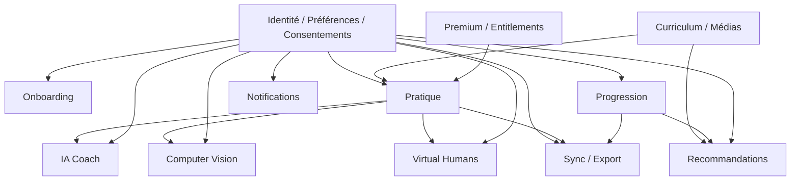
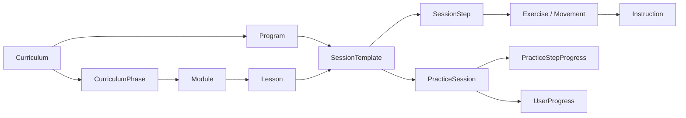
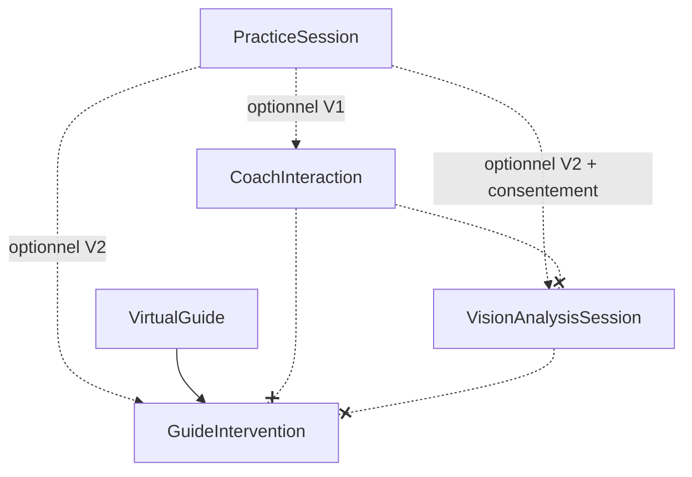
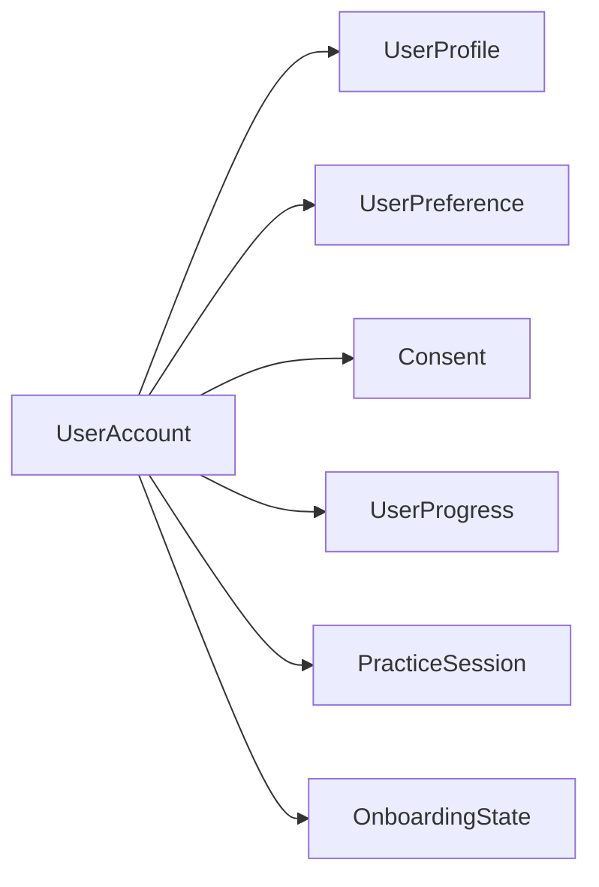

# 14 — Data Model

## 1. Statut

| Champ | Valeur |
| --- | --- |
| Nom du document | Data Model |
| Numéro | 14 |
| Fichier | `docs/14_DATA_MODEL.md` |
| Version | 1.0 |
| Statut | EN REVUE |
| Dernière mise à jour | 4 août 2026 |
| Auteur | Projet Tai-Chi-AI-Coach |
| Documents dépendants | `docs/00_MASTER_PLAN.md`, `docs/01_VISION.md`, `docs/02_PRODUCT_SCOPE.md`, `docs/03_PERSONAS.md`, `docs/04_USER_JOURNEYS.md`, `docs/05_FEATURES.md`, `docs/06_BUSINESS_MODEL.md`, `docs/07_CONTENT_STRATEGY.md`, `docs/08_TAI_CHI_CURRICULUM.md`, `docs/09_AI_COACH.md`, `docs/10_COMPUTER_VISION.md`, `docs/11_VIRTUAL_HUMANS.md`, `docs/12_UX_UI.md`, `docs/13_TECH_ARCHITECTURE.md` |
| Documents utilisant celui-ci | `docs/15_API_ARCHITECTURE.md`, `docs/16_AUTH_SECURITY.md`, `docs/17_PRIVACY_RGPD.md`, `docs/18_PWA_OFFLINE.md`, `docs/19_ANALYTICS.md` |
| Décisions concernées | D-088 à D-097 |
| Dernière revue | Non effectuée |
| Autorise le code | Non |

> **NOTE**
>
> Modèle conceptuel et logique uniquement. Aucun SQL exécutable, aucune migration, aucun contrat REST, aucune RLS détaillée.
> Aligné sur le catalogue `F-001`–`F-041` et les décisions D-001 à D-087.
> Document conforme à `docs/99_DOCUMENTATION_STANDARD.md`.

## 2. Objectifs

Ce document définit le modèle de données de référence de **Tai-Chi AI Coach** afin de :

- clarifier les domaines et entités métier ;
- séparer définition pédagogique et exécution utilisateur ;
- préparer Offline First, sync, export et suppression ;
- découpler IA, Computer Vision et Virtual Humans ;
- fonder `15`, `16`, `17`, `18` et l’implémentation post–Design Freeze.

Il ne fixe pas le schéma physique PostgreSQL ni les noms de tables définitifs.

## 3. Périmètre

### 3.1 Inclus

- domaines de données listés en section 5 ;
- entités conceptuelles, attributs principaux, relations, cardinalités ;
- règles d’intégrité, cycles de vie, versionnement ;
- portée locale / synchronisée / distante (conceptuelle) ;
- classification de sensibilité ;
- périmètre MVP / V1 / V2 / futur.

### 3.2 Exclus (documents suivants)

| Sujet | Document |
| --- | --- |
| SQL, index, migrations | Implémentation post–Design Freeze |
| Contrats REST | `docs/15_API_ARCHITECTURE.md` |
| Authentification technique | `docs/16_AUTH_SECURITY.md` |
| Délais juridiques RGPD | `docs/17_PRIVACY_RGPD.md` |
| Algorithmes cache / sync PWA | `docs/18_PWA_OFFLINE.md` |
| Analytics produit détaillé | `docs/19_ANALYTICS.md` |
| Prestataire de paiement / tarifs | `docs/06_BUSINESS_MODEL.md` (ouverts) |

## 4. Principes de modélisation

1. Séparation claire des domaines métier.
2. Pas de duplication injustifiée.
3. Relations explicites et cardinalités documentées.
4. Identifiants stables (UUID ou équivalent logique) pour toute entité synchronisable.
5. Traçabilité `created_at` / `updated_at` (et acteurs système lorsque pertinent).
6. Versionnement des contenus pédagogiques et des textes de consentement.
7. Compatibilité Offline First sur le cœur pédagogique.
8. Minimisation des données personnelles.
9. Export et suppression facilités (`F-030`, compte).
10. Découplage fournisseurs IA (D-068).
11. Découplage Computer Vision (D-069).
12. Autonomie Virtual Humans (D-070).
13. Compatibilité multi-langues et multi-programmes / guides futurs.
14. Aucune donnée médicale ni diagnostic implicite.
15. Progression personnelle uniquement — aucun classement (D-083).
16. Métadonnées médias séparées des fichiers physiques (D-architecture §12).

## 5. Vue générale des domaines

| # | Domaine | Responsabilité | Versions principales |
| --- | --- | --- | --- |
| D1 | Identité | Compte, profil | MVP local ; compte sync V1 (`F-039`) |
| D2 | Onboarding | État découverte (`F-033`) | MVP |
| D3 | Curriculum | Structure pédagogique (`08`) | Pré-MVP / MVP |
| D4 | Pratique | Exécution séances (`F-013`, `F-032`) | MVP |
| D5 | Progression | Avancement personnel (`F-010`) | MVP |
| D6 | Recommandations | Prochaine action Accueil | MVP déterministe ; V1+ IA optionnelle |
| D7 | IA Coach | Interactions (`F-019`, `F-020`) | V1 |
| D8 | Computer Vision | Analyses optionnelles (`F-021`, `F-022`) | V2 |
| D9 | Virtual Humans | Guides / Mei (`F-023`) | V2 |
| D10 | Préférences | Paramètres (`F-028`, `F-029`) | MVP |
| D11 | Notifications | Rappels opt-in (`F-017`) | V1 |
| D12 | Premium | Offres / entitlements (`F-025`, freemium) | V2 (MVP sans offre payante obligatoire) |
| D13 | Médias | Ressources pédagogiques (`F-006`, `F-007`) | MVP |
| D14 | Consentements | Preuves versionnées | MVP+ (caméra/IA V1–V2) |
| D15 | Analytics | Événements minimisés | V1+ (`19`) |
| D16 | Export / suppression | Demandes utilisateur | V1 (`F-030`) / sync |
| D17 | Sync | Métadonnées de synchronisation | V1 (`F-027`) |

Domaines optionnels non bloquants : D7, D8, D9, D12 enrichi.

## 6. Identité utilisateur

### 6.1 Responsabilité

Représenter l’utilisateur applicatif sans figer le mécanisme d’auth (`16`).

### 6.2 Entités

**UserAccount** — identité logique du compte.

| Attribut conceptuel | Description |
| --- | --- |
| `id` | Identifiant stable |
| `status` | `active` \| `suspended` \| `deletion_requested` \| `deleted_or_anonymized` |
| `created_at` / `updated_at` | Traçabilité |
| `deletion_requested_at` | Demande de suppression |

**UserProfile** — profil applicatif minimal.

| Attribut conceptuel | Description |
| --- | --- |
| `display_name` | Optionnel, non obligatoire |
| `locale` | Langue UI |
| `timezone` | Fuseau pour notifications / régularité |
| `created_at` / `updated_at` | Traçabilité |

Auth credentials, tokens, providers : hors périmètre (`16`).

## 7. Onboarding

**OnboardingState** (`F-033`)

| Attribut | Description |
| --- | --- |
| `user_id` | Référence utilisateur (locale puis compte) |
| `version` | Version du parcours d’onboarding |
| `status` | `not_started` \| `in_progress` \| `completed` \| `skipped` |
| `current_step` | Étape courante |
| `initial_level` | Niveau déclaré sobre |
| `practice_preferences` | Durée / rythme déclarés |
| `completed_at` | Horodatage |

**LearningGoal** — objectifs déclarés (0..n par utilisateur).

Règles :

- présentation Mei / caméra uniquement si modules V2 disponibles ;
- refus non bloquant ;
- consentements distincts (section 18).

## 8. Curriculum

Aligné sur `docs/08_TAI_CHI_CURRICULUM.md` (5 phases, structures leçon / séance).

| Entité | Rôle |
| --- | --- |
| **Curriculum** | Cursus global (style-agnostique au niveau modèle) |
| **CurriculumPhase** | Découverte → Initiation → Progression → Consolidation → Autonomie |
| **Program** | Programme (ex. quotidien `F-008`) pointant vers des séances |
| **Module** | Regroupement pédagogique optionnel dans une phase |
| **Lesson** | Unité « leçon » (structure Accueil→Fin) |
| **SessionTemplate** | Définition pédagogique d’une séance guidée (`F-013`) |
| **SessionStep** | Étape ordonnée d’une séance (préparation, pratique, retour…) |
| **Exercise** | Exercice (respiration `F-014`, relaxation `F-015`, pratique gestuelle…) |
| **Movement** | Mouvement / geste de bibliothèque (`F-004`) |
| **Instruction** | Consigne textuelle / structurée (`F-005`) |
| **LearningObjective** | Objectif pédagogique d’une leçon / séance |
| **Prerequisite** | Lien de prérequis entre contenus |

Attributs transverses contenus : `content_version`, `locale`, `difficulty`, `planned_duration`, `sort_order`, `publication_status` (`draft` \| `in_review` \| `validated` \| `published` \| `archived`), `style_key` (nullable tant que le style n’est pas figé).

Ne pas inventer le catalogue détaillé des mouvements : seules les structures sont figées.

## 9. Séances de pratique

Distinction obligatoire (D-088) :

| Concept | Entité | Nature |
| --- | --- | --- |
| Définition pédagogique | `SessionTemplate` (+ steps) | Contenu versionné |
| Exécution utilisateur | `PracticeSession` | Instance personnelle |

**PracticeSession**

| Attribut | Description |
| --- | --- |
| `id` | Stable |
| `user_id` | Propriétaire |
| `session_template_id` + `session_template_version` | Référence versionnée |
| `started_at` / `ended_at` | Horodatages |
| `planned_duration` / `actual_duration` | Durées |
| `status` | Voir cycle de vie §24 |
| `interrupted` | Booléen / motif sobre |
| `resume_step_id` | Point de reprise (`F-032`) |
| `connectivity_mode` | `online` \| `offline` |
| `launch_source` | Accueil, programme, bibliothèque, recommandation… |
| `user_reflection` | Bilan facultatif non médical |
| `entitlement_snapshot` | Droits applicables au démarrage (anti-interruption Premium) |

**PracticeStepProgress** — avancement par étape de la session (atteint, sauté, terminé).

## 10. Progression

**UserProgress** (`F-010`) — agrégat personnel, jamais comparatif.

| Attribut / agrégat | Description |
| --- | --- |
| Phase / module courant | Position dans le cursus |
| Séances commencées / terminées | Compteurs personnels |
| Mouvements / exercices découverts | Ensemble d’IDs |
| Acquis qualitatifs | Étapes validées sans score social |
| Régularité | Indicateurs bienveillants (pas de streak punitif) |
| Prochaine étape | Pointeur pédagogique |
| Reprise recommandée | Lien vers `PracticeSession` ou template |

**Favorite** (`F-011`, V1) — favoris personnels vers Movement / SessionTemplate / Exercise.

Interdit dans le modèle : leaderboard, rang, score social, comparaison inter-utilisateurs.

## 11. Recommandations

**Recommendation** — prochaine action Accueil explicable (D-094).

| Attribut | Description |
| --- | --- |
| `user_id` | Cible |
| `origin_type` | `deterministic_curriculum` \| `progress_rule` \| `preference_rule` \| `ai_suggestion` |
| `origin_rule_id` / `coach_interaction_id` | Traçabilité |
| `target_ref` | SessionTemplate, Movement, Lesson… |
| `reason_code` / `reason_text_key` | Explication affichable |
| `valid_from` / `valid_until` | Fenêtre de validité |
| `status` | `generated` \| `displayed` \| `accepted` \| `dismissed` \| `expired` |

MVP : origines déterministes (curriculum + progression + préférences).  
V1 : `ai_suggestion` possible via IA, jamais opaque ni compétitive.

## 12. IA Coach

Domaines V1 (`F-019`, `F-020`) — découplés des fournisseurs (D-095).

**CoachInteraction**

| Attribut | Description |
| --- | --- |
| `id` | Stable |
| `user_id` | |
| `context_refs` | Séance / exercice / progression (optionnels) |
| `provider_logical_id` | Identifiant abstrait d’adaptateur |
| `model_logical_id` | Modèle logique |
| `prompt_version` | Version de prompt |
| `status` | `created` \| `processing` \| `completed` \| `failed` |
| `error_code` | Sans détail sensible |
| `created_at` | |
| `retention_policy_key` | Clé de conservation (`17`) |

**CoachMessage** — messages user / assistant liés à une interaction ; conservation minimale ; pas de lien direct à une marque fournisseur.

## 13. Computer Vision

Domaine V2 indépendant (`F-021`, `F-022`) — D-091, D-092.

**VisionAnalysisSession**

| Attribut | Description |
| --- | --- |
| `id` | |
| `user_id` | |
| `practice_session_id` | Optionnel mais typique |
| `consent_id` | Obligatoire |
| `engine_version` | Version moteur logique |
| `device_capability_note` | Capacité déclarée (non biométrie) |
| `status` | Cycle §24 |
| `raw_media_stored` | Toujours `false` par défaut |

**VisionObservation** — observation technique (mouvement, indicateurs, `confidence`).

**VisionFeedback** — proposition pédagogique prudente dérivée, distincte de l’observation ; jamais décision autonome ni médicale.

Pas de stockage vidéo / image brute par défaut.

## 14. Virtual Humans

Domaine V2 optionnel (`F-023`) — D-096.

**VirtualGuide**

| Attribut | Description |
| --- | --- |
| `id` / `public_key` | Ex. `mei` |
| `display_name` | Identité publique |
| `version` | Version du guide |
| `locales` | Langues |
| `voice_profile_ref` | Voix logique |
| `appearance_ref` | Apparence / tenue logique |
| `active` | Actif ou non |
| `nature_disclosure_key` | Transparence nature virtuelle |
| `role_constraints` | Jamais maître / médecin / experte certifiée |

**GuideIntervention** — apparition ponctuelle (contexte séance/étape, intensité/visibilité, média associé, version guide).

Mei n’est jamais une dépendance obligatoire d’une `PracticeSession` ou du parcours.

## 15. Préférences

**UserPreference** — clés/valeurs typées.

Exemples de clés : `locale`, `voice`, `preferred_duration`, `pace`, `notifications_enabled`, accessibilité (`F-029`), `camera_enabled_default` (V2), `preferred_guide_id` (V2, nullable), `download_policy`, `privacy_*`, préférences de séance.

| Portée | Description |
| --- | --- |
| `default` | Valeur produit |
| `user_local` | Choix local |
| `user_synced` | Choix synchronisé (V1+) |

Préférence absente → défaut explicite (intégrité).

## 16. Notifications

V1 (`F-017`), opt-in, non commerciales en séance.

**NotificationPreference** — types autorisés, canaux, fenêtres horaires, opt-in.

**Notification** (instance)

| Attribut | Description |
| --- | --- |
| `type` | Rappel séance, encouragement, information |
| `channel` | Logique (push, in-app…) — infra hors scope |
| `scheduled_at` / `sent_at` | |
| `status` | `scheduled` \| `sent` \| `failed` \| `cancelled` |
| `user_action` | `opened` \| `dismissed` \| `none` |

## 17. Premium et droits

Freemium éthique (`06`, D-087) — pas de paywall en cours de séance.

**Offer** — offre logique (sans tarif figé).

**Subscription** — statut, période, source (abstraite).

**Entitlement** — droit fonctionnel (`capability_key`, validité, statut).

Règle : une `PracticeSession` démarrée conserve un `entitlement_snapshot` ; un changement d’entitlement ne doit pas interrompre la séance en cours.

MVP : le modèle fonctionne avec entitlements « gratuit socle » implicites, sans offre payante active obligatoire.

## 18. Contenus et médias

**MediaAsset**

| Attribut | Description |
| --- | --- |
| `id` / `version` | |
| `type` | vidéo, image, audio, autre |
| `locale` | |
| `duration` / `size_estimate` | |
| `logical_locator` | Emplacement logique (pas forcément URL figée) |
| `availability` | |
| `downloadable` | `F-026` V2 |
| `access_rights` | Lien éventuel à entitlement |

**ContentMediaLink** — association MediaAsset ↔ SessionTemplate / SessionStep / Exercise / Movement / Instruction / GuideIntervention.

Distinction : métadonnées métier ≠ fichier physique ≠ cache local.

## 19. Consentements et confidentialité

**Consent** — explicite, versionné, auditable (D-093).

| Attribut | Description |
| --- | --- |
| `user_id` | |
| `consent_type` | `camera` \| `computer_vision` \| `ai_coach` \| `analytics` \| `notifications` \| `personalization` \| `data_retention_extra` … |
| `policy_version` | Version du texte accepté |
| `decision` | `granted` \| `denied` \| `withdrawn` |
| `decided_at` | |
| `context` | Onboarding, paramètres, avant caméra… |
| `scope` | Portée |
| `proof_ref` | Preuve minimale |

Un consentement général ne couvre pas tous les usages.

## 20. Analytics et observabilité

Séparer strictement :

| Famille | Contenu | Notes |
| --- | --- | --- |
| Événements produit | Actions agrégées / pseudonymisées | `19` |
| Métriques techniques | Latence, erreurs modules | Monitoring `13` |
| Logs | Diagnostic | Sans PII / médias / conversations sensibles |
| Données métier | Sections 6–19 | Hors analytics brutes |

Interdits dans les événements : vidéo/image brute, texte conversationnel sensible, PII non nécessaire, information médicale.

Entité légère optionnelle : **AnalyticsEvent** (V1+, détail dans `19`).

## 21. Export et suppression

**DataExportRequest** (`F-030`, V1) — statut, plage, format logique, créé/terminé.

**AccountDeletionRequest** — statut (`requested` → `processing` → `completed` / `partial_anonymized`), horodatages.

Le modèle doit permettre export des données personnelles, suppression ou anonymisation des associés, conservation légale minimale (`17`), sans figer les délais.

## 22. Catalogue des entités

Légende portée : L = local possible · S = synchronisable · R = distant/catalogue · PII = données personnelles.

| Entité | Domaine | Responsabilité | PII | Portée | Version |
| --- | --- | --- | --- | --- | --- |
| UserAccount | Identité | Compte | Oui | L→S | MVP local / V1 compte |
| UserProfile | Identité | Profil applicatif | Oui | L→S | MVP / V1 |
| UserPreference | Préférences | Choix utilisateur | Oui (souvent) | L / S | MVP |
| Consent | Consentements | Décisions versionnées | Oui | L→S | MVP+ |
| OnboardingState | Onboarding | Avancement `F-033` | Oui | L→S | MVP |
| LearningGoal | Onboarding | Objectifs déclarés | Oui | L→S | MVP |
| Curriculum | Curriculum | Cursus | Non | R (+cache L) | Pré-MVP |
| CurriculumPhase | Curriculum | 5 phases | Non | R | Pré-MVP |
| Program | Curriculum | Programme (`F-008`) | Non | R | MVP |
| Module | Curriculum | Regroupement | Non | R | MVP |
| Lesson | Curriculum | Leçon | Non | R | MVP |
| SessionTemplate | Curriculum | Séance pédagogique | Non | R | MVP |
| SessionStep | Curriculum | Étape de séance | Non | R | MVP |
| Exercise | Curriculum | Exercice | Non | R | MVP |
| Movement | Curriculum | Mouvement `F-004` | Non | R | MVP |
| Instruction | Curriculum | Consigne | Non | R | MVP |
| LearningObjective | Curriculum | Objectif pédagogique | Non | R | MVP |
| Prerequisite | Curriculum | Prérequis | Non | R | MVP |
| MediaAsset | Médias | Métadonnées média | Non* | R (+L cache) | MVP |
| ContentMediaLink | Médias | Association contenu↔média | Non | R | MVP |
| PracticeSession | Pratique | Exécution séance | Oui | L→S | MVP |
| PracticeStepProgress | Pratique | Avancement étapes | Oui | L→S | MVP |
| UserProgress | Progression | Agrégat personnel | Oui | L→S | MVP |
| Favorite | Progression | Favoris | Oui | S | V1 |
| Recommendation | Recommandations | Prochaine action | Oui | L→S | MVP |
| CoachInteraction | IA | Interaction | Oui | S/R | V1 |
| CoachMessage | IA | Message | Oui sensible | S/R limité | V1 |
| VisionAnalysisSession | CV | Session d’analyse | Oui | S (méta) | V2 |
| VisionObservation | CV | Observation technique | Sensible contexte | S limité | V2 |
| VisionFeedback | CV | Feedback prudent | Oui | S limité | V2 |
| VirtualGuide | VH | Guide (Mei…) | Non | R | V2 |
| GuideIntervention | VH | Intervention | Non** | R / lié session | V2 |
| NotificationPreference | Notifications | Opt-in | Oui | S | V1 |
| Notification | Notifications | Instance | Oui | S/R | V1 |
| Offer | Premium | Offre logique | Non | R | V2 |
| Subscription | Premium | Abonnement | Oui | S/R | V2 |
| Entitlement | Premium | Droit fonctionnel | Oui | S | MVP socle / V2 payant |
| SyncMeta | Sync | État sync entité | Technique | L/S | V1 |
| DataExportRequest | Export | Demande export | Oui | S/R | V1 |
| AccountDeletionRequest | Suppression | Demande suppression | Oui | S/R | V1 |
| AnalyticsEvent | Analytics | Événement minimisé | Pseudo | R | V1+ |

\* médias peuvent être personnels uniquement s’ils sont générés par l’utilisateur (hors défaut produit).  
\*\* l’intervention peut être liée à une session utilisateur (contexte PII via la session).

**Total : 40 entités conceptuelles** (fusion possible à l’implémentation sans changer les responsabilités).

## 23. Relations et cardinalités

| Relation | Cardinalité | Obligatoire | Suppression (concept) |
| --- | --- | --- | --- |
| UserAccount — UserProfile | 1—1 | Oui (si compte) | Cascade logique profil |
| UserAccount — UserPreference | 1—0..n | Non | Cascade |
| UserAccount — Consent | 1—0..n | Non | Conserver preuve minimale puis anonymiser selon `17` |
| UserAccount — OnboardingState | 1—0..1 | Non | Cascade |
| OnboardingState — LearningGoal | 1—0..n | Non | Cascade |
| Curriculum — CurriculumPhase | 1—1..n | Oui | Restreindre si publié |
| CurriculumPhase — Module | 1—0..n | Non | |
| Module — Lesson | 1—0..n | Non | |
| Lesson — LearningObjective | 1—0..n | Non | |
| Program — SessionTemplate | n—n | Non | Délier |
| SessionTemplate — SessionStep | 1—1..n | Oui | Cascade template |
| SessionStep — Exercise / Movement | n—0..n | Non | |
| Movement — Instruction | 1—0..n | Non | |
| Content — Prerequisite — Content | n—n | Non | |
| SessionTemplate — MediaAsset | n—n via link | Non | |
| User — PracticeSession | 1—0..n | Non | Anonymiser / supprimer |
| PracticeSession — SessionTemplate@version | n—1 | Oui | Interdit orphelin ; conserver snapshot version |
| PracticeSession — PracticeStepProgress | 1—0..n | Non | Cascade |
| User — UserProgress | 1—0..1 | Non | Cascade / rebuild |
| User — Recommendation | 1—0..n | Non | Cascade |
| Recommendation — target contenu | n—0..1 | Non | Invalider si contenu retiré |
| User — CoachInteraction | 1—0..n | Non | Selon retention |
| CoachInteraction — CoachMessage | 1—1..n | Oui si messages | Cascade |
| PracticeSession — VisionAnalysisSession | 1—0..n | Non | Cascade / purge |
| VisionAnalysisSession — Consent | n—1 | Oui | Interdit sans consentement |
| VisionAnalysisSession — VisionObservation | 1—0..n | Non | Cascade |
| VisionObservation — VisionFeedback | 1—0..n | Non | Cascade |
| VisionObservation — Movement | n—0..1 | Non | |
| VirtualGuide — GuideIntervention | 1—0..n | Non | |
| GuideIntervention — PracticeSession / Step | n—0..1 | Non | |
| User — NotificationPreference | 1—0..n | Non | Cascade |
| User — Notification | 1—0..n | Non | Cascade |
| User — Subscription | 1—0..n | Non | Historique minimal |
| Subscription — Entitlement | 1—0..n | Non | |
| User — Entitlement | 1—0..n | Non | |
| User — DataExportRequest / AccountDeletionRequest | 1—0..n | Non | Audit |

## 24. Règles d’intégrité

1. Une `PracticeSession` référence un `SessionTemplate` publié (ou snapshot) valide à la version utilisée.
2. `UserProgress` ne peut pas pointer hors structure du cursus publié.
3. `VisionAnalysisSession` exige un `Consent` `granted` non retiré pour `camera` / `computer_vision`.
4. Toute observation CV conserve un `confidence` ; absence de confiance ⇒ pas de feedback affirmatif.
5. `GuideIntervention` référence `VirtualGuide.version`.
6. Tout contenu publié possède `content_version` + `publication_status = published`.
7. Préférence absente ⇒ défaut produit explicite.
8. Toute entité synchronisable possède `id` stable + métadonnées de version/temps.
9. Suppression : pas de relations orphelines ; snapshots historiques de pratique conservent la compréhension pédagogique.
10. Toute `Recommendation` expose `origin_type` + raison.
11. Changement d’`Entitlement` n’interrompt pas une `PracticeSession` déjà `started` / `interrupted`.
12. Aucun champ ni agrégat ne constitue un diagnostic médical.
13. `raw_media_stored` CV = faux par défaut ; vrai uniquement si décision future explicite (`17`).
14. Interdiction de structures de classement / score social.
15. Coach métier ne stocke pas d’identifiant fournisseur commercial brut — uniquement IDs logiques d’adaptateur.

## 25. Cycle de vie

| Objet | États |
| --- | --- |
| Compte | créé → actif → suspendu? → suppression demandée → supprimé / anonymisé |
| Contenu pédagogique | brouillon → en revue → validé → publié → remplacé → archivé |
| PracticeSession | préparée → commencée → interrompue → reprise → terminée \| abandonnée |
| Recommendation | générée → affichée → acceptée \| ignorée \| expirée |
| CoachInteraction | créée → en traitement → terminée \| échouée → conservée / purgée |
| VisionAnalysisSession | consentement OK → initialisée → en cours → terminée \| échouée → conservation limitée |
| Notification | planifiée → envoyée → (ouverte \| ignorée) \| échouée |
| SyncMeta | locale → en attente → synchronisée → conflit? → résolue |
| Consent | granted / denied → withdrawn éventuel (nouvel enregistrement versionné) |

## 26. Versionnement

| Élément | Versionné | Effet historique |
| --- | --- | --- |
| Curriculum / Phase / Program / Module / Lesson | Oui | Séances passées gardent snapshot |
| SessionTemplate / SessionStep | Oui | `PracticeSession` fige la version |
| Exercise / Movement / Instruction | Oui | Bibliothèque évolutive sans réécriture du passé |
| MediaAsset | Oui | Lien versionné |
| Prompt IA / modèle logique | Oui | Sur `CoachInteraction` |
| Moteur CV | Oui | Sur `VisionAnalysisSession` |
| VirtualGuide | Oui | Sur interventions |
| Texte de consentement | Oui | `policy_version` |
| Onboarding | Oui | `OnboardingState.version` |

Interdit : modifier rétroactivement le contenu « vécu » d’une séance terminée.

## 27. Données locales, synchronisées et distantes

| Domaine | Local possible | Synchronisé | Distant uniquement | Source de vérité | Remarque |
| --- | --- | --- | --- | --- | --- |
| Profil | Oui (MVP) | V1+ | — | Client puis serveur compte | Auth dans `16` |
| Préférences | Oui | V1+ (selon clé) | Défauts produit | Client / serveur | Mixte |
| Curriculum | Cache | Métadonnées versions | Catalogue maître | Serveur contenu | |
| Séances téléchargées | Oui (V2 `F-026`) | Liste | Fichiers objet | Serveur médias | Détail `18` |
| PracticeSession | Oui | V1+ | — | Client d’abord si offline | Conflits `18` |
| Progression | Oui | V1+ | — | Merge prudent | Non compétitif |
| Recommandations | Oui (recalculable) | Optionnel | Règles distantes / IA | Recalcul possible | |
| Conversations IA | Cache limité | Selon policy | Traitement | Serveur + retention `17` | V1 |
| Analyses CV | Méta locales | Méta limitées | Traitement éventuel | Consentement + policy | Pas de brut par défaut |
| Médias | Cache | — | Stockage objet | Distant | |
| Consentements | Oui | Oui | — | Serveur dès compte | Audit |
| Notifications | Préférences locales | Oui | Envoi | Serveur d’envoi | Infra ouverte |
| Droits Premium | Cache entitlements | Oui | Billing abstrait | Serveur | Snapshot séance |
| Export / suppression | — | Demandes | Traitement | Serveur | |

Champs conceptuels sync : `id`, `version`/`updated_at`, `origin`, `sync_status`, `deleted_at` (soft delete éventuel).

## 28. Classification et sensibilité

| Niveau | Exemples |
| --- | --- |
| Publiques | Présentation Tai Chi publiée, guides publics |
| Internes | Règles de recommandation, prompts versionnés |
| Personnelles | Compte, profil, historique de pratique, préférences |
| Sensibles au contexte | Conversations IA, observations CV, bilans libres |
| Techniques | SyncMeta, versions moteurs, codes d’erreur |
| Temporaires | Cache média, états UI, tokens (hors modèle `16`) |

Points d’attention : caméra (pas de brut par défaut), observations corporelles (non médicales), IA, accessibilité, consentements, historique.

Ne pas qualifier automatiquement ces données de « données de santé » au sens médical si aucune finalité médicale n’existe (`17` arbitrera le cadre légal).

## 29. Diagrammes conceptuels

### 29.1 Vue globale des domaines

### 29.2 Curriculum et pratique

### 29.3 IA, CV et Virtual Humans

Aucune dépendance obligatoire entre IA, CV et VH.

### 29.4 Données utilisateur

## 30. Périmètre MVP / V1 / V2 / futur

### 30.1 MVP (et Pré-MVP contenu)

Indispensable : UserProfile/préférences locales, OnboardingState, Curriculum (phases Découverte/Initiation + début Progression), SessionTemplate/Steps, Movement/Exercise/Instruction/Media, PracticeSession + reprise, UserProgress, Recommendation déterministe, Consent (prudence / base), Entitlement socle gratuit.

Sans : Coach*, Vision*, VirtualGuide*, Notification*, Subscription payante, Sync multi-appareils complète, Favorite.

### 30.2 V1

+ UserAccount sync, Favorite, recherche (index logique hors SQL ici), CoachInteraction/Message, Notification*, SyncMeta, DataExportRequest, AnalyticsEvent minimisé, Recommendation `ai_suggestion` possible, F-018/F-024 comme agrégats de progression non compétitifs.

### 30.3 V2

+ Vision*, VirtualGuide/Mei/GuideIntervention, téléchargements médias enrichis, Offer/Subscription/Entitlement Premium, programmes adaptés (`F-035`) comme Program spécialisés, personnalisation avancée (`F-034`) via préférences / recommandations.

### 30.4 Futur (non obligatoire)

Autres guides, langues, programmes, appareils, modèles locaux éventuels, multi-disciplines (`F-036`/`F-037`) — extensions de Curriculum/Media/Guide sans refonte du cœur.

## 31. Limites

- Style Tai Chi et catalogue mouvements non figés → structures vides de contenu détaillé.
- Auth, RLS, SQL, sync algorithmique, conservation juridique : ouverts.
- Recommandations IA : origine prévue, scoring non figé.
- Billing : abstrait.
- Pas de données médicales ; observations CV ≠ diagnostic.

## 32. Décisions figées par ce document

| ID | Décision |
| --- | --- |
| D-088 | Séparation stricte définition pédagogique (`SessionTemplate`) / exécution (`PracticeSession`) |
| D-089 | Versionnement des contenus pédagogiques et conservation par snapshot sur l’historique |
| D-090 | Identifiants stables obligatoires pour toute entité synchronisable |
| D-091 | Pas de stockage vidéo/image brute CV par défaut |
| D-092 | Séparation Observation CV / Feedback pédagogique |
| D-093 | Consentements explicites, typés et versionnés |
| D-094 | Recommandations toujours explicables (`origin_type` + raison) |
| D-095 | Données IA liées à des IDs logiques d’adaptateur, jamais à un fournisseur imposé |
| D-096 | Guides / Mei non obligatoires dans le modèle de parcours |
| D-097 | Progression strictement personnelle — aucune structure compétitive dans le modèle |

## 33. Décisions ouvertes

| Sujet | Document responsable |
| --- | --- |
| Stratégie exacte d’authentification | `16_AUTH_SECURITY.md` |
| Schéma physique PostgreSQL / index | Implémentation + éventuellement `15` |
| Fournisseur de stockage objet | `21_DEPLOYMENT.md` / implémentation |
| Politique détaillée de conservation IA | `17_PRIVACY_RGPD.md` |
| Durée de conservation des observations CV | `17_PRIVACY_RGPD.md` |
| Cache et synchronisation détaillés | `18_PWA_OFFLINE.md` |
| Modèle exact / scoring des recommandations | `15` + règles produit ; IA dans `09` |
| Structure finale des offres Premium / tarifs | `06_BUSINESS_MODEL.md` |
| Données fines des futurs guides | `11_VIRTUAL_HUMANS.md` |
| Politique analytics détaillée | `19_ANALYTICS.md` |
| Règles RGPD et délais juridiques | `17_PRIVACY_RGPD.md` |
| Contrats REST | `15_API_ARCHITECTURE.md` |

## 34. Critères de validation

1. Document relu et accepté explicitement.
2. Domaines couverts sans inventer de fonctionnalités hors catalogue.
3. Séparation pédagogique / pratique explicite.
4. Alignement versions MVP / V1 / V2.
5. CV / IA / VH découplés et optionnels.
6. Aucun classement ni donnée médicale.
7. Décisions D-088 à D-097 tracées dans `DECISIONS.md`.
8. Aucun SQL / code / runtime produit.

Statut actuel : **EN REVUE**.

## 35. Conclusion

Le modèle de données de Tai-Chi AI Coach sépare clairement contenus versionnés et pratique personnelle, minimise les données sensibles, refuse la compétition et le médical, et laisse IA, vision et guides comme modules optionnels branchés sur la séance — jamais comme piliers obligatoires du MVP.

Prochaine étape documentaire : `docs/15_API_ARCHITECTURE.md`.

## 36. Références

- `docs/00_MASTER_PLAN.md` … `docs/13_TECH_ARCHITECTURE.md`
- `docs/98_DEVELOPMENT_DOCUMENTATION_STANDARD.md`
- `docs/99_DOCUMENTATION_STANDARD.md`
- `DECISIONS.md`
- `CHANGELOG.md`

---

## Pied de document

| Champ | Valeur |
| --- | --- |
| Version | 1.0 |
| Statut | EN REVUE |
| Prochain document | `docs/15_API_ARCHITECTURE.md` |
| Fin officielle | Oui |

*Fin officielle du document.*
