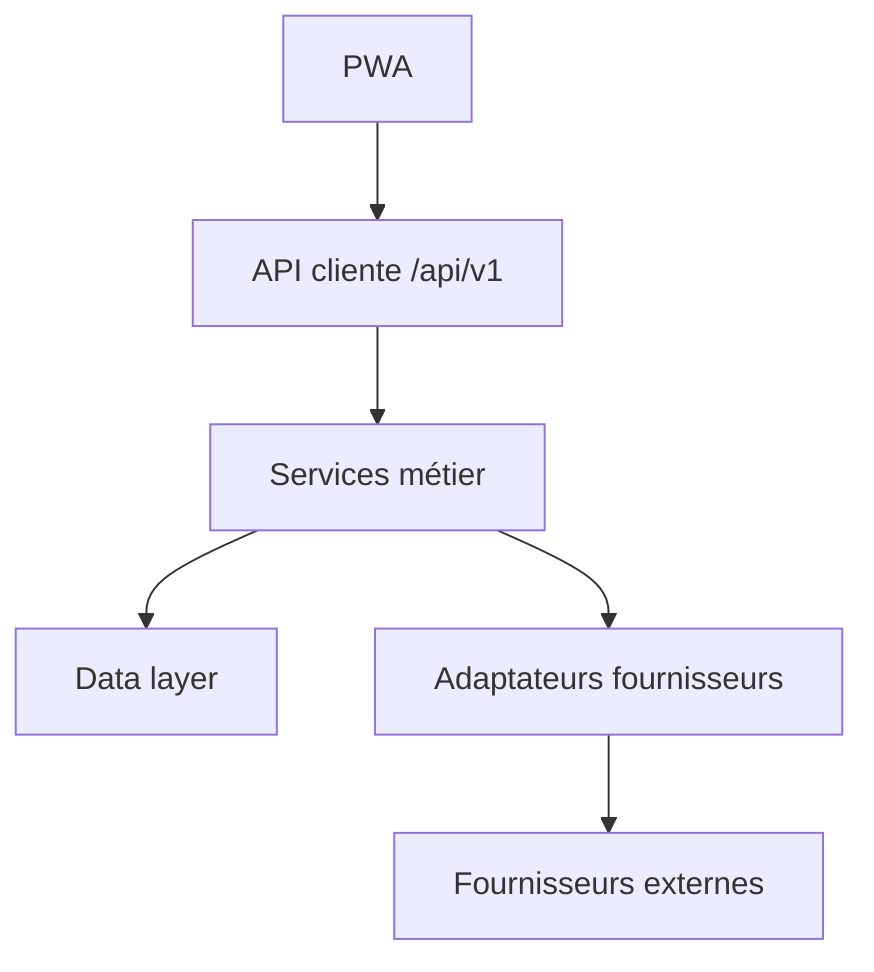
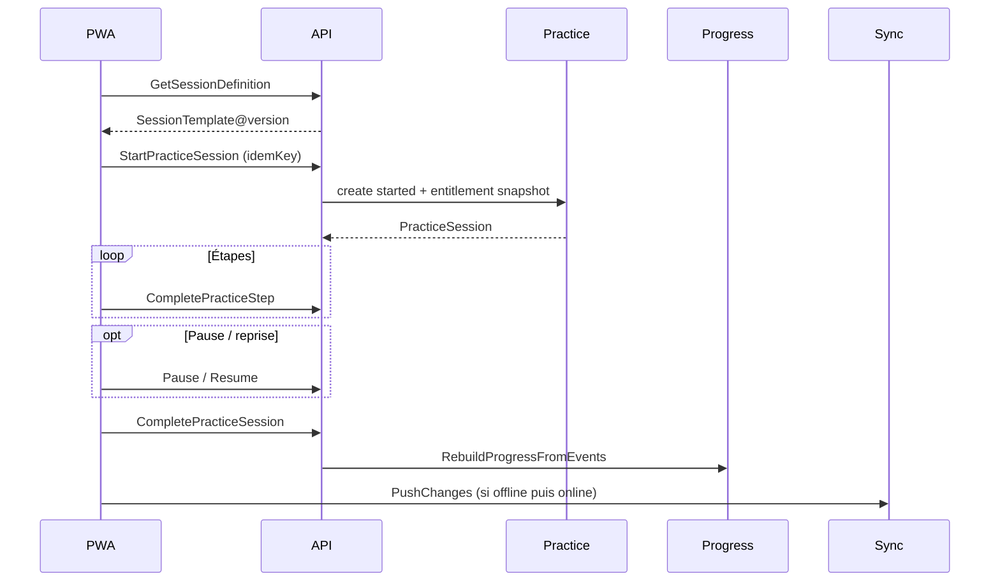
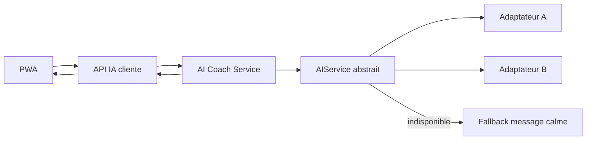
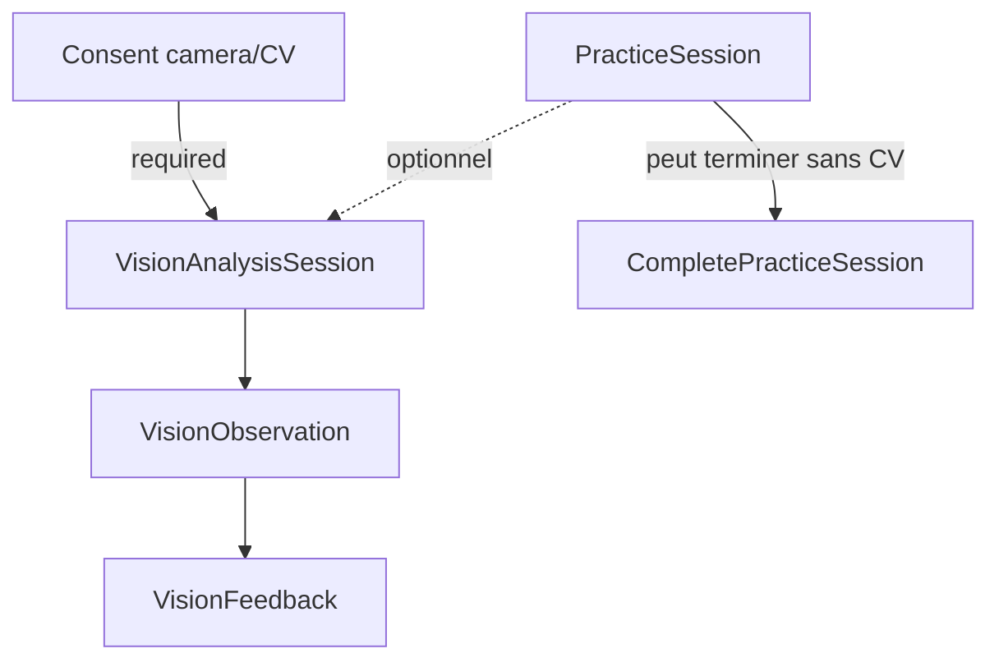
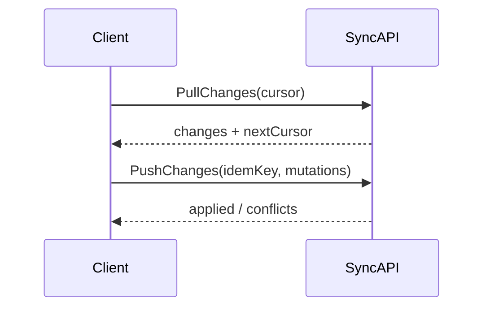

# 15 — API Architecture

## 1. Statut

| Champ | Valeur |
| --- | --- |
| Nom du document | API Architecture |
| Numéro | 15 |
| Fichier | `docs/15_API_ARCHITECTURE.md` |
| Version | 1.0 |
| Statut | EN REVUE |
| Dernière mise à jour | 4 août 2026 |
| Auteur | Projet Tai-Chi-AI-Coach |
| Documents dépendants | `docs/00_MASTER_PLAN.md`, `docs/01_VISION.md`, `docs/02_PRODUCT_SCOPE.md`, `docs/03_PERSONAS.md`, `docs/04_USER_JOURNEYS.md`, `docs/05_FEATURES.md`, `docs/06_BUSINESS_MODEL.md`, `docs/07_CONTENT_STRATEGY.md`, `docs/08_TAI_CHI_CURRICULUM.md`, `docs/09_AI_COACH.md`, `docs/10_COMPUTER_VISION.md`, `docs/11_VIRTUAL_HUMANS.md`, `docs/12_UX_UI.md`, `docs/13_TECH_ARCHITECTURE.md`, `docs/14_DATA_MODEL.md` |
| Documents utilisant celui-ci | `docs/16_AUTH_SECURITY.md`, `docs/17_PRIVACY_RGPD.md`, `docs/18_PWA_OFFLINE.md`, `docs/19_ANALYTICS.md`, `docs/20_TEST_STRATEGY.md`, `docs/21_DEPLOYMENT.md` |
| Décisions concernées | D-098 à D-110 |
| Dernière revue | Non effectuée |
| Autorise le code | Non |

> **NOTE**
>
> Contrats d’échange conceptuels uniquement. Aucun code, contrôleur, OpenAPI complet, secret ni fournisseur imposé.
> Terminologie alignée sur `docs/14_DATA_MODEL.md`. Style REST validé par `docs/13_TECH_ARCHITECTURE.md` (D-074).
> Document conforme à `docs/99_DOCUMENTATION_STANDARD.md`.

## 2. Objectifs

Définir l’architecture API de **Tai-Chi AI Coach** pour :

- stabiliser les échanges PWA ↔ backend ;
- exposer les domaines de `14` sous forme de ressources et opérations métier ;
- séparer API cliente, internes et fournisseurs ;
- anticiper Offline First, jobs asynchrones et Privacy by Design ;
- fonder `16`, `17`, `18`, `19`, `20` et l’implémentation post–Design Freeze.

## 3. Périmètre

### 3.1 Inclus

Principes, typologies, conventions, familles de ressources, opérations métier, erreurs, pagination, idempotence, concurrence conceptuelle, async, cache HTTP conceptuel, matrices version / fournisseurs.

### 3.2 Exclus

| Sujet | Document |
| --- | --- |
| JWT / sessions / OAuth / RLS | `16_AUTH_SECURITY.md` |
| Délais juridiques, DPIA | `17_PRIVACY_RGPD.md` |
| Algorithmes cache/sync PWA | `18_PWA_OFFLINE.md` |
| Événements analytics détaillés | `19_ANALYTICS.md` |
| Stratégie de tests | `20_TEST_STRATEGY.md` |
| Hébergement / CI | `21_DEPLOYMENT.md` |
| Code, OpenAPI exhaustif, SQL | Post–Design Freeze |

## 4. Sources et dépendances

Sources structurantes : Scope (`F-xxx`), UX (`12`), Tech (`13`), Data Model (`14`), Curriculum (`08`), AI (`09`), CV (`10`), VH (`11`), Business (`06`).

Aucune fonctionnalité hors catalogue.

## 5. Principes API

1. API First (D-074, D-098).
2. REST comme style principal.
3. Ressources centrées domaines métier (`14`).
4. Séparation lectures / commandes lorsque les transitions d’état l’exigent.
5. Contrats stables et versionnés.
6. Faible couplage entre modules.
7. Validation stricte des entrées (client non fiable).
8. Réponses prévisibles.
9. Erreurs structurées, codes stables, messages UX calmes.
10. Idempotence pour opérations sensibles.
11. Pagination obligatoire sur collections potentiellement longues.
12. Compatibilité Offline First des contrats.
13. Aucune exposition directe de la base.
14. Aucune dépendance API métier → format fournisseur IA/CV.
15. Aucun média lourd dans les payloads JSON.
16. Minimisation des données personnelles.
17. Observabilité sans fuite sensible.
18. Aucune logique médicale / diagnostic.
19. Aucune compétition entre utilisateurs.
20. Entitlements validés côté serveur ; pas d’auto-attribution client.

## 6. Typologie des API

### 6.1 API cliente

Consommée par la PWA : profil, préférences, onboarding, curriculum (lecture), pratique, progression (lecture), recommandations, IA, consentements, notifications, Premium (lecture droits), médias (métadonnées + accès contrôlé), sync, export/suppression.

### 6.2 API internes

Entre services backend (Curriculum, Progression, Recommendation, AI Coach, CV, VH, Notifications, Analytics, Sync, Entitlements). **Non exposées** automatiquement au client.

### 6.3 API fournisseurs

Adaptateurs uniquement : IA, CV éventuel, voix, médias/stockage objet, notifications, paiement futur, analytics. Le métier ne connaît que des contrats logiques.

### 6.4 API administratives futures

Publication curriculum, versionnement contenus, médias, activation guides, supervision, support. Séparées des API utilisateur. Hors MVP.

## 7. Conventions générales

| Convention | Règle |
| --- | --- |
| Préfixe | `/api/v1` (majeure dans l’URL) |
| Ressources | Noms pluriels, kebab ou snake cohérent à figer à l’implémentation |
| Corps | JSON UTF-8 |
| Dates | ISO 8601 (UTC recommandé en transit) |
| IDs | Identifiants stables (`14` D-090) |
| Langues | Tags BCP 47 (`fr`, `en`…) |
| Enums | Fermés documentés |
| Champs optionnels | Explicitement optionnels |
| `null` vs absent vs `""` | `null` = valeur vide connue ; absent = non fourni ; `""` évité sauf texte volontairement vide |
| Corrélation | `requestId` / `correlationId` dans `meta` |
| Version ressource | Champ `resourceVersion` ou ETag conceptuel |
| Relations | IDs (+ liens optionnels futurs) |
| Fuseau | Préférence profil ; horodatages API en UTC |

Exemples conceptuels (non exhaustifs) :

```text
GET    /api/v1/me/profile
PATCH  /api/v1/me/preferences
GET    /api/v1/curriculum/session-templates/{id}
POST   /api/v1/practice-sessions
POST   /api/v1/practice-sessions/{id}/commands/pause
POST   /api/v1/sync/changes
```

Éviter les verbes ambigus type `/doSomething` hors sous-ressources `commands/` explicites pour transitions d’état.

## 8. Versionnement

| Type | Mécanisme |
| --- | --- |
| Version API | Majeure `/api/v1` ; ajouts non cassants dans la majeure |
| Version ressource | `resourceVersion` / ETag ; conflits → 409 / 412 |
| Contenu pédagogique | `contentVersion` sur templates (D-089) |
| Traitement IA | `promptVersion` + `modelLogicalId` |
| Moteur CV | `engineVersion` |
| Guide virtuel | `guideVersion` |
| Contrat fournisseur | Version d’adaptateur interne, opaque au client |

Compatibilité ascendante privilégiée. Dépréciation progressive avec coexistence conceptuelle d’une majeure précédente (durée à figer en `21` / release). PWA anciennes : réponses tolérantes aux champs inconnus côté client ; serveur rejette les champs inconnus non autorisés selon contexte.

## 9. Authentification et autorisation conceptuelles

Sans figer le mécanisme (`16`) :

| Classe | Exemples |
| --- | --- |
| Public | Présentation publique limitée, health conceptuel, offres publiques |
| Authentifié | Profil, pratique, progression, sync |
| Propriétaire uniquement | Données de l’utilisateur courant |
| Admin futur | Publication contenus |

Principes : moindre privilège ; entitlements serveur ; isolation inter-utilisateurs ; contexte utilisateur transmis aux services internes.

MVP local : certaines opérations fonctionnent sans compte distant ; dès `F-039` / sync V1, l’identité authentifiée devient requise pour les ressources synchronisées.

## 10. Familles de ressources

### 10.1 Profil utilisateur

| | |
| --- | --- |
| Objectif | Lire / mettre à jour profil applicatif |
| Ressources | `UserProfile`, statut compte (vue limitée) |
| Opérations | Get, Patch (langue, fuseau, accessibilité affichage) |
| Accès | Authentifié / propriétaire (ou profil local MVP) |
| Idempotence | Patch avec version |
| Pagination | Non |
| Version produit | MVP local ; V1 compte |
| Règles | Pas de secrets auth ; pas de données d’un tiers |

### 10.2 Préférences

| | |
| --- | --- |
| Objectif | Gérer préférences typées |
| Ressources | `UserPreference` |
| Opérations | Get all/by key, Patch partiel |
| Accès | Propriétaire |
| Idempotence | Oui (clé + version) |
| Version | MVP |
| Règles | Clés dans catalogue fermé extensible ; défauts serveur ; portée local vs synced ; notifications, caméra V2, IA V1, guide V2, voix, téléchargement, confidentialité |

### 10.3 Onboarding

| | |
| --- | --- |
| Objectif | État `F-033` |
| Ressources | `OnboardingState`, `LearningGoal` |
| Opérations | Get, CompleteStep, SkipOptional, Finalize |
| Accès | Utilisateur courant |
| Idempotence | CompleteStep / Finalize |
| Version | MVP |
| Règles | Refus caméra/Mei V2 non bloquant ; version d’onboarding tracée |

### 10.4 Curriculum

| | |
| --- | --- |
| Objectif | Lecture contenus publiés |
| Ressources | Curriculum, Phases, Programs, Modules, Lessons, SessionTemplates, Steps, Exercises, Movements, Instructions, Media metadata |
| Opérations | List / Get uniquement côté utilisateur |
| Accès | Public authentifié ou catalogue publié |
| Pagination | Listes mouvements / séances |
| Filtres | locale, difficulty, duration, objective, offlineAvailability, contentVersion |
| Version | Pré-MVP / MVP |
| Règles | **Aucune écriture curriculum via API cliente** |

### 10.5 Séances de pratique

| | |
| --- | --- |
| Objectif | Cycle `PracticeSession` |
| Ressources | `PracticeSession`, `PracticeStepProgress` |
| Opérations | Create/Start, Pause, Resume, CompleteStep, Complete, Abandon, Get, List history, optional reflection |
| Accès | Propriétaire |
| Idempotence | Create offline, Resume, Complete, sync replay |
| Pagination | Historique |
| Version | MVP |
| Règles | Transitions selon `14` ; snapshot template version ; entitlement snapshot au start |

### 10.6 Progression

| | |
| --- | --- |
| Objectif | Lecture `UserProgress` / favoris V1 |
| Ressources | `UserProgress`, `Favorite` (V1) |
| Opérations | Get progress, List history views, Get next step, Favorites CRUD V1 |
| Accès | Propriétaire |
| Version | MVP / Favoris V1 |
| Règles | **Pas de PATCH arbitraire de progression** ; mises à jour via services après événements de pratique ; aucun classement |

### 10.7 Recommandations

| | |
| --- | --- |
| Objectif | Accueil explicable (D-094) |
| Ressources | `Recommendation` |
| Opérations | List, Get active, Accept, Dismiss, Snooze |
| Accès | Propriétaire |
| Version | MVP déterministe ; V1 `ai_suggestion` |
| Règles | Toujours `originType` + raison ; pas de ranking compétitif |

### 10.8 IA Coach

| | |
| --- | --- |
| Objectif | `F-019` / `F-020` |
| Ressources | `CoachInteraction`, `CoachMessage`, job éventuel |
| Opérations | OpenInteraction, SendMessage, GetStatus, GetHistory (policy), Cancel |
| Accès | Propriétaire + consentement IA + entitlement |
| Async | Oui si réponse longue (202 + job) |
| Version | V1 |
| Règles | Pas de nom fournisseur obligatoire, pas de prompt système, pas de clé ; `providerLogicalId` / `modelLogicalId` / `promptVersion` ; offline → erreur claire retryable ; quotas |

### 10.9 Computer Vision

| | |
| --- | --- |
| Objectif | Analyses optionnelles V2 |
| Ressources | `VisionAnalysisSession`, Observations, Feedback |
| Opérations | CheckConsent, Start, Status, Stop, GetResults, Delete |
| Accès | Propriétaire + consentements caméra/CV |
| Version | V2 |
| Règles | Non bloquant pour pratique ; pas de vidéo brute par défaut ; confiance obligatoire ; protocole média non figé |

### 10.10 Virtual Humans

| | |
| --- | --- |
| Objectif | Guides optionnels V2 |
| Ressources | `VirtualGuide`, interventions compatibles, préférences |
| Opérations | ListGuides, GetGuide, ListCompatibleInterventions |
| Accès | Lecture catalogue ; préférence guide = préférences user |
| Version | V2 |
| Règles | Mei non obligatoire ; nature virtuelle exposée ; pas de rôle médical |

### 10.11 Consentements

| | |
| --- | --- |
| Objectif | Ressources dédiées typées |
| Ressources | `Consent` |
| Opérations | ListRequired, Get, Grant, Deny, Withdraw |
| Accès | Propriétaire |
| Idempotence | Grant/Deny/Withdraw |
| Version | MVP+ |
| Règles | Pas de booléen unique global ; retrait immédiat pour nouveaux traitements |

### 10.12 Notifications

| | |
| --- | --- |
| Objectif | `F-017` V1 |
| Ressources | `NotificationPreference`, `Notification` |
| Opérations | Get/Patch prefs, List, MarkRead, Cancel scheduled (si applicable) |
| Accès | Propriétaire |
| Pagination | Liste |
| Version | V1 |
| Règles | Opt-in ; non commercial en séance ; canaux abstraits (in-app / push / email éventuel) |

### 10.13 Premium et entitlements

| | |
| --- | --- |
| Objectif | Freemium éthique |
| Ressources | `Offer` (lecture), `Entitlement` (lecture), statut subscription vue limitée |
| Opérations | ListOffers, GetEntitlements, CheckCapability |
| Accès | Offres publiques ; entitlements propriétaire |
| Version | Socle MVP ; payant V2 |
| Règles | **Client ne crée pas d’entitlement** ; pas d’API paiement détaillée ici ; pas d’interruption de séance commencée |

### 10.14 Médias et téléchargements

| | |
| --- | --- |
| Objectif | Métadonnées + accès contrôlé |
| Ressources | `MediaAsset` |
| Opérations | GetMetadata, RequestAccessUrl, MarkDownloaded (client), DeleteLocal (client-side) |
| Accès | Selon droits / entitlement |
| Version | MVP métadonnées ; V2 download enrichi `F-026` |
| Règles | Pas de base64 dans JSON ordinaire ; pas de chemin stockage interne ; URL temporaire éventuelle |

### 10.15 Synchronisation

| | |
| --- | --- |
| Objectif | Échanges rejouables V1 `F-027` |
| Ressources | Batch changes, cursor, conflicts |
| Opérations | PullChanges, PushChanges, Ack |
| Accès | Authentifié |
| Idempotence | Obligatoire (`Idempotency-Key`) |
| Version | V1 |
| Règles | Champs : clientId, localVersion, serverVersion, updatedAt, syncStatus, tombstones ; détail algo → `18` |

### 10.16 Export et suppression

| | |
| --- | --- |
| Objectif | `F-030` + droit à l’oubli |
| Ressources | `DataExportRequest`, `AccountDeletionRequest`, jobs |
| Opérations | RequestExport, GetExportStatus, DownloadExport, RequestDeletion, GetDeletionStatus, CancelDeletion? |
| Accès | Propriétaire |
| Idempotence | Oui |
| Async | Oui (202) |
| Version | V1 |
| Règles | Auditables ; délais → `17` |

## 11. Méthodes HTTP conceptuelles

| Méthode | Usage |
| --- | --- |
| `GET` | Lectures sûres, cacheables si catalogue |
| `POST` | Créations, commandes d’état, sync push, jobs |
| `PUT` | Remplacement complet d’une ressource mineure (rare) |
| `PATCH` | Mise à jour partielle (profil, préférences) |
| `DELETE` | Suppression logique, retrait, ou **demande** de suppression compte (pas forcément purge immédiate) |

Transitions métier (`pause`, `complete`) : `POST .../commands/{command}` plutôt que PATCH ambigu.

## 12. Contrats de requête et réponse

Enveloppe recommandée :

```json
{
  "data": {},
  "meta": {
    "requestId": "string",
    "timestamp": "2026-08-04T21:00:00Z",
    "apiVersion": "v1"
  }
}
```

Collections :

```json
{
  "data": [],
  "pagination": {
    "cursor": "string|null",
    "nextCursor": "string|null",
    "limit": 20,
    "hasMore": true
  },
  "meta": {}
}
```

| Situation | Signal |
| --- | --- |
| Succès avec corps | 200 + `data` |
| Création | 201 + ressource |
| Accepté async | 202 + `jobId` / status URL conceptuelle |
| Sans corps | 204 |
| Partiel (rare) | 200 avec `meta.partial` explicite |

## 13. Format des erreurs

```json
{
  "error": {
    "code": "PRACTICE_SESSION_INVALID_STATE",
    "message": "Cette séance ne peut pas être reprise dans son état actuel.",
    "field": null,
    "retryable": false,
    "recommendedAction": "start_new_or_choose_another"
  },
  "meta": {
    "requestId": "string"
  }
}
```

Familles de codes : `VALIDATION_*`, `AUTH_*`, `FORBIDDEN_*`, `NOT_FOUND_*`, `CONFLICT_*`, `QUOTA_*`, `CONSENT_*`, `INVALID_STATE_*`, `PROVIDER_UNAVAILABLE_*`, `SYNC_*`, `ASYNC_*`, `INTERNAL_*`.

Messages : calmes, orientés solution, non techniques (`12`).

## 14. Statuts HTTP

| Statut | Usage typique |
| --- | --- |
| 200 | Lecture / commande OK avec corps |
| 201 | Création |
| 202 | Job accepté (IA longue, export, CV, suppression) |
| 204 | OK sans corps |
| 400 | Requête mal formée |
| 401 | Non authentifié |
| 403 | Interdit / consentement / entitlement |
| 404 | Ressource absente (sans fuite inter-users) |
| 409 | Conflit d’état ou sync |
| 412 | Précondition version (ETag) échouée |
| 422 | Valide syntaxiquement, invalide métier |
| 429 | Rate limit / quota |
| 500 | Erreur interne |
| 502/503/504 | Dépendance / indisponibilité / timeout |

Consentement absent → 403 `CONSENT_*`. Quota IA → 429. Fournisseur down → 503 `PROVIDER_UNAVAILABLE_*` retryable.

## 15. Validation des entrées

- Schéma + règles métier.
- Limites de taille corps / texte.
- Enums fermés ; dates ISO.
- Rejet des champs inconnus sur écritures sensibles.
- Nettoyage / normalisation locale.
- Métadonnées médias validées ; pas de confiance client pour entitlements ni progression globale.

## 16. Pagination, filtrage et tri

| Mode | Usage |
| --- | --- |
| Curseur | Historique séances, notifications, conversations, sync pull |
| Offset/page | Acceptable pour petits catalogues admin/futurs ; déconseillé pour historiques longs |

Défaut conceptuel : `limit=20`, max `100`. Filtres documentés par ressource. Tri stable (ex. `startedAt desc`, `id`). Recherche curriculum V1 (`F-012`) : endpoint/filtre dédié, résultats bornés.

## 17. Idempotence

Opérations à clé (`Idempotency-Key` + scope utilisateur) :

- création / reprise session offline ;
- finalisation séance ;
- sync push ;
- grant/deny/withdraw consent ;
- export / deletion request ;
- envoi message IA coûteux ;
- futures transactions Premium.

Règles : même clé + même payload ⇒ même résultat ; même clé + payload différent ⇒ 409 ; durée de rétention des clés → ouverte (`16`/`18`).

## 18. Concurrence et conflits

Contrôle optimiste via `resourceVersion` / ETag.

Cas : progression multi-appareils, préférences, séances offline, consentements, suppression, contenu pédagogique mis à jour (client reclasse sur nouvelle `contentVersion`).

Réponses : 409 / 412 ; fusion automatique limitée (préférences non critiques) ou arbitrage utilisateur (`18`).

## 19. Traitements asynchrones

Jobs pour : IA longue, CV, export, suppression complète, téléchargements lourds, notifications batch.

États : `queued` \| `running` \| `completed` \| `failed` \| `cancelled` \| `expired`.

Contrat : `jobId`, status, result ref, error, expiresAt, cancel si supporté. Infra de file non figée.

## 20. Streaming et temps réel

| Besoin | Orientation |
| --- | --- |
| Statut job / CV | Polling simple (défaut) |
| Réponse IA progressive | SSE envisagé en V1+ si besoin UX ; sinon polling |
| Multi-appareil live | Non requis MVP ; sync pull suffit |
| WebSocket | Non introduit sans besoin prouvé |

Pas de temps réel généralisé.

## 21. Médias et fichiers

- Métadonnées JSON ; octets via URL signée temporaire ou téléchargement dédié.
- Formats / tailles max : à figer à l’implémentation contenu.
- CV : pas d’upload permanent par défaut ; traitements temporaires ou locaux ; protocole ouvert.
- Intégrité et expiration des URLs : obligatoires conceptuellement.

## 22. Rate limiting et quotas

| Zone | But |
| --- | --- |
| Public / auth | Protection technique |
| IA / CV | Quota fonctionnel + limites fournisseur |
| Export | Anti-abus |
| Admin futur | Protection |

Distinction : limite technique ≠ entitlement Premium ≠ pression artificielle. Une séance essentielle déjà commencée n’est pas coupée sans message clair.

## 23. Cache HTTP

| Cacheable (public/privé court) | Non cacheable publiquement |
| --- | --- |
| Curriculum publié, guides, offres, config publique, médias via CDN | Profil, progression, consentements, IA, CV, entitlements, sync |

ETag / Last-Modified / Cache-Control / revalidation selon ressource. Cache PWA → `18`.

## 24. Confidentialité et minimisation

Par famille : n’exposer que le nécessaire ; masquer ; pas de secrets ; pas de données tiers ; pas de prompts système ; pas de vidéo brute non nécessaire ; pas de conversations complètes dans logs ; pas d’invention médicale.

Détail juridique → `17`.

## 25. Observabilité API

`requestId`, `correlationId`, durée, code résultat, version API, service, statut fournisseur logique, retry.

Logs sans : messages IA complets, images/vidéos, tokens, PII, consentements détaillés en clair. Analytics → `19`.

## 26. Dépendances externes

| Domaine | Fournisseur abstrait | Contrat interne | Données transmises | Fallback | Version |
| --- | --- | --- | --- | --- | --- |
| IA | AI Provider Adapter | AIService | Prompt user minimisé + contexte pédagogique | Message indisponible / retry | V1 |
| Voix | TTS Adapter | VoiceService | Texte non sensible | Texte seul | V2 éventuel |
| Notifications | Push/Email Adapter | NotificationDispatcher | IDs + template keys | In-app seul | V1 |
| Stockage | Object Storage Adapter | MediaStorage | Objets médias catalogue | Cache local | MVP+ |
| Paiement | Billing Adapter | EntitlementSync | Refs abonnement | Mode gratuit | V2 |
| Analytics | Analytics Sink | EventSink | Événements pseudonymisés | No-op | V1+ |
| CV | Vision Adapter | VisionService | Frames/refs temporaires, jamais brut persisté par défaut | Continuer sans CV | V2 |

Aucun nouveau fournisseur nommé ici.

## 27. Catalogue conceptuel des opérations

| Opération | Domaine | Acteur | Entrée | Sortie | Idempotence | Sync | Version |
| --- | --- | --- | --- | --- | --- | --- | --- |
| GetCurrentUserProfile | Profil | User | — | Profile | — | Oui V1 | MVP/V1 |
| UpdateUserProfile | Profil | User | Patch + version | Profile | Oui | Oui | MVP/V1 |
| GetUserPreferences | Préférences | User | — | Prefs+defaults | — | Mixte | MVP |
| UpdateUserPreferences | Préférences | User | Patch clés validées | Prefs | Oui | Mixte | MVP |
| GetOnboardingState | Onboarding | User | — | State | — | Oui | MVP |
| CompleteOnboardingStep | Onboarding | User | stepId, payload | State | Oui | Oui | MVP |
| FinalizeOnboarding | Onboarding | User | — | State | Oui | Oui | MVP |
| ListCurriculumSessions | Curriculum | User | filtres | Templates[] | — | Cache | MVP |
| GetSessionDefinition | Curriculum | User | id+version? | Template+steps | — | Cache | MVP |
| ListMovements | Curriculum | User | filtres | Movements[] | — | Cache | MVP |
| StartPracticeSession | Pratique | User | templateId, source, idemKey | PracticeSession | Oui | Oui | MVP |
| PausePracticeSession | Pratique | User | sessionId | Session | Oui | Oui | MVP |
| ResumePracticeSession | Pratique | User | sessionId | Session | Oui | Oui | MVP |
| CompletePracticeStep | Pratique | User | sessionId, stepId | StepProgress | Oui | Oui | MVP |
| CompletePracticeSession | Pratique | User | sessionId, reflection? | Session | Oui | Oui | MVP |
| AbandonPracticeSession | Pratique | User | sessionId | Session | Oui | Oui | MVP |
| ListPracticeHistory | Pratique | User | cursor | Sessions[] | — | Oui | MVP |
| GetUserProgress | Progression | User | — | UserProgress | — | Oui | MVP |
| RebuildProgressFromEvents | Progression | Internal | userId | UserProgress | Oui | — | MVP |
| ListFavorites / MutateFavorite | Progression | User | target | Favorite | Oui | Oui | V1 |
| ListRecommendations | Reco | User | — | Recs+origins | — | Optionnel | MVP |
| RespondToRecommendation | Reco | User | id, action | Rec | Oui | Oui | MVP |
| OpenCoachInteraction | IA | User | context refs | Interaction | Oui | — | V1 |
| SendCoachMessage | IA | User | text, idemKey | Message/Job | Oui | — | V1 |
| GetCoachJobStatus | IA | User | jobId | Status | — | — | V1 |
| StartVisionAnalysis | CV | User | practiceSessionId, consent | VisionSession | Oui | Méta | V2 |
| StopVisionAnalysis | CV | User | visionSessionId | Session | Oui | — | V2 |
| GetVisionResults | CV | User | id | Obs+Feedback | — | — | V2 |
| ListVirtualGuides | VH | User | locale | Guides[] | — | Cache | V2 |
| GetGuideInterventionsForSession | VH | User | templateId | Interventions | — | Cache | V2 |
| ListRequiredConsents | Consent | User | — | Types+versions | — | Oui | MVP+ |
| UpdateConsent | Consent | User | type, decision, policyVersion | Consent | Oui | Oui | MVP+ |
| GetNotificationPreferences | Notif | User | — | Prefs | — | Oui | V1 |
| ListNotifications | Notif | User | cursor | Items[] | — | Oui | V1 |
| MarkNotificationRead | Notif | User | id | Item | Oui | Oui | V1 |
| GetEntitlements | Premium | User | — | Caps[] | — | Oui | MVP/V2 |
| CheckCapability | Premium | User/Internal | capabilityKey | allowed | — | — | MVP/V2 |
| GetMediaMetadata | Médias | User | id | Metadata | — | Cache | MVP |
| RequestMediaAccessUrl | Médias | User | id | Temp URL | — | — | MVP/V2 |
| SynchronizeClientChanges | Sync | User | cursor, changes, idemKey | Applied+conflicts | Oui | N/A | V1 |
| RequestDataExport | Export | User | scope | Job/Request | Oui | — | V1 |
| GetDataExportStatus | Export | User | id | Status+URL? | — | — | V1 |
| RequestAccountDeletion | Suppression | User | confirm | Request | Oui | — | V1 |

Erreurs principales récurrentes : `VALIDATION_*`, `INVALID_STATE_*`, `CONSENT_*`, `FORBIDDEN_*`, `CONFLICT_*`, `PROVIDER_UNAVAILABLE_*`, `QUOTA_*`.

**Total catalogue : 40 opérations conceptuelles** (extensible sans casser les principes).

## 28. Matrice des API par version

| Famille API | MVP | V1 | V2 | Futur | Auth requise | Offline concerné |
| --- | --- | --- | --- | --- | --- | --- |
| Profil | ● local | ● sync | ● | | Progressive | ● |
| Préférences | ● | ● | ● | | Progressive | ● |
| Onboarding | ● | ● | +options | | Progressive | ● |
| Curriculum | ● lecture | ● recherche | ● | Admin write | Lecture | Cache ● |
| Pratique | ● | ● | ● | | Progressive | ● fort |
| Progression | ● | +favoris/stats | ● | | Progressive | ● |
| Recommandations | ● déterministe | +IA | ● | | Progressive | Recalcul local |
| IA Coach | — | ● | ● | Streaming | Oui + consent | Dégradé |
| Computer Vision | — | — | ● | | Oui + consent | Local/temp |
| Virtual Humans | — | — | ● | Multi-guides | Lecture | Cache |
| Consentements | ● base | +IA | +caméra/CV | | Progressive | ● |
| Notifications | — | ● | ● | | Oui | Prefs ● |
| Premium | socle implicite | ● | offres | Billing | Lecture droits | Snapshot |
| Médias | ● méta | ● | download | Upload admin | Droits | Cache/DL |
| Synchronisation | — | ● | ● | | Oui | Cœur |
| Export / suppression | — | ● | ● | | Oui | Demandes online |
| Admin contenus | — | — | — | ● | Admin | — |

## 29. Diagrammes

### 29.1 Vue générale des échanges



### 29.2 Séance de pratique



### 29.3 IA Coach



### 29.4 Computer Vision V2



### 29.5 Synchronisation (aperçu)



## 30. Règles d’intégrité API

1. Isolation stricte des données par utilisateur.
2. `PracticeSession` → `SessionTemplate` publié / snapshot valide.
3. Session `completed` / `abandoned` : pas de réouverture arbitraire.
4. Progression uniquement via services métier / événements valides.
5. Recommandation toujours avec origine.
6. Vision : consentement actif obligatoire.
7. Consentement retiré ⇒ refus des nouveaux traitements concernés.
8. Interaction IA ⇒ versions logiques de traitement.
9. Guide actif + compatible locale/contenu pour interventions.
10. Entitlements validés serveur ; snapshot séance non révoqué en cours.
11. Suppression gère les ressources liées (ordre / jobs).
12. Ressource synchronisée ⇒ version.
13. Média privé ≠ URL permanente publique.
14. Pas d’endpoints de classement / score social.
15. Pas d’exposition de prompts système ni secrets.

## 31. Limites

- Liste d’URLs non exhaustive jusqu’au Design Freeze.
- Auth, RLS, quotas chiffrés, durée idempotency keys : ouverts.
- Protocole média CV et streaming IA : non figés.
- Billing / webhooks : hors scope.
- Admin API : identifiées seulement.

## 32. Décisions figées par ce document

| ID | Décision |
| --- | --- |
| D-098 | API REST versionnée (`/api/v1`) en style principal |
| D-099 | Séparation API cliente / interne / fournisseur (/admin futur) |
| D-100 | Contrats centrés sur les ressources métier de `14` |
| D-101 | Erreurs structurées à codes stables + messages UX |
| D-102 | Idempotence obligatoire pour opérations sensibles |
| D-103 | Contrôle optimiste pour données synchronisées |
| D-104 | Traitements lourds modélisés comme jobs asynchrones |
| D-105 | Médias lourds hors payloads JSON ordinaires |
| D-106 | Abstraction stricte des fournisseurs côté API |
| D-107 | Consentements exposés comme ressources dédiées typées |
| D-108 | Progression non modifiable arbitrairement par le client |
| D-109 | Contrats API compatibles Offline First (sync rejouable) |
| D-110 | API CV sans stockage/exposition de vidéo brute par défaut |

## 33. Décisions ouvertes

| Sujet | Document |
| --- | --- |
| Auth / tokens / sessions / RLS | `16_AUTH_SECURITY.md` |
| Conservation, bases légales, délais | `17_PRIVACY_RGPD.md` |
| Algo sync, cache PWA, durée clés idempotence fine | `18_PWA_OFFLINE.md` |
| Événements analytics | `19_ANALYTICS.md` |
| Tests contrats / contrats consumer-driven | `20_TEST_STRATEGY.md` |
| Framework backend, OpenAPI généré, dépréciation calendrier | `21_DEPLOYMENT.md` / implémentation |
| Polling vs SSE vs WebSocket définitif pour IA | UX + implémentation V1 |
| Protocole média CV | `10` + implémentation V2 |
| Quotas précis | `16` + produit |
| Fournisseurs notifications / stockage / paiement | Décisions futures + `21` / `06` |

## 34. Critères de validation

1. Entités importantes de `14` accessibles de façon cohérente.
2. Frontières cliente / interne / fournisseur respectées.
3. Aucune fonctionnalité inventée.
4. Offline First anticipé (sync, idempotence, versions).
5. IA découplée ; CV et VH optionnels non bloquants.
6. Consentements dédiés ; progression personnelle.
7. Erreurs compatibles UX calme.
8. Médias hors JSON lourd ; pas de vidéo brute par défaut.
9. Sécurité / RGPD / Offline détaillés reportés à `16`/`17`/`18`.
10. Décisions D-098–D-110 dans `DECISIONS.md`.

Statut actuel : **EN REVUE**.

## 35. Conclusion

Les API de Tai-Chi AI Coach sont REST versionnées, centrées métiers, séparées par typologie, prêtes pour Offline First et Privacy by Design, avec IA/CV/VH derrière des contrats abstraits et des jobs asynchrones lorsque nécessaire.

Prochaine étape : `docs/16_AUTH_SECURITY.md`.

## 36. Références

- `docs/12_UX_UI.md`, `docs/13_TECH_ARCHITECTURE.md`, `docs/14_DATA_MODEL.md`
- `docs/08`–`11`, `docs/02_PRODUCT_SCOPE.md`
- `docs/98_DEVELOPMENT_DOCUMENTATION_STANDARD.md`, `docs/99_DOCUMENTATION_STANDARD.md`
- `DECISIONS.md`, `CHANGELOG.md`

---

## Pied de document

| Champ | Valeur |
| --- | --- |
| Version | 1.0 |
| Statut | EN REVUE |
| Prochain document | `docs/16_AUTH_SECURITY.md` |
| Fin officielle | Oui |

*Fin officielle du document.*
