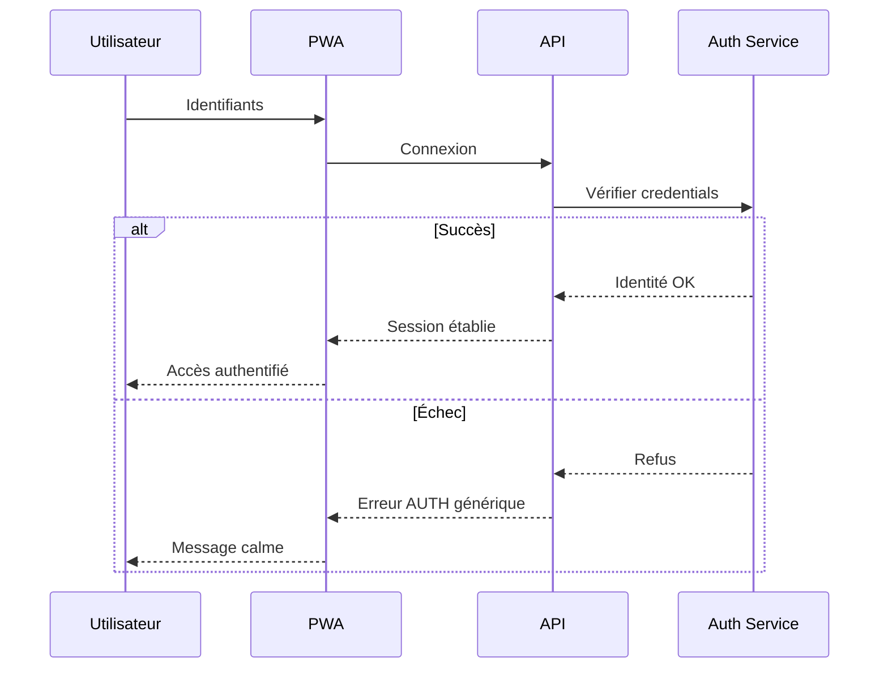
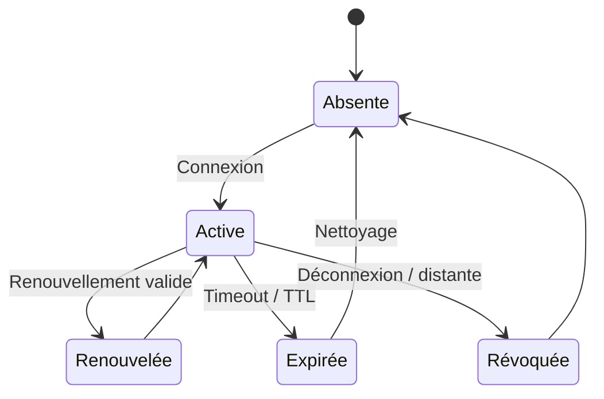
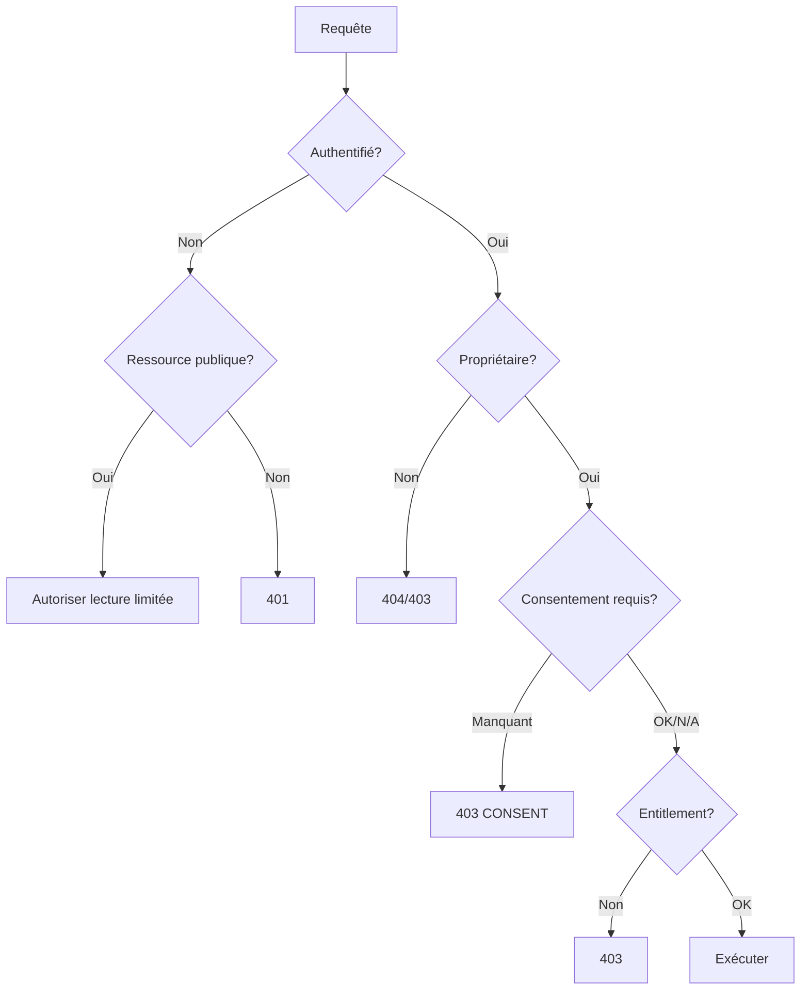
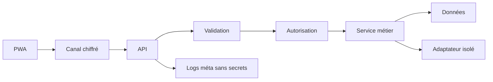
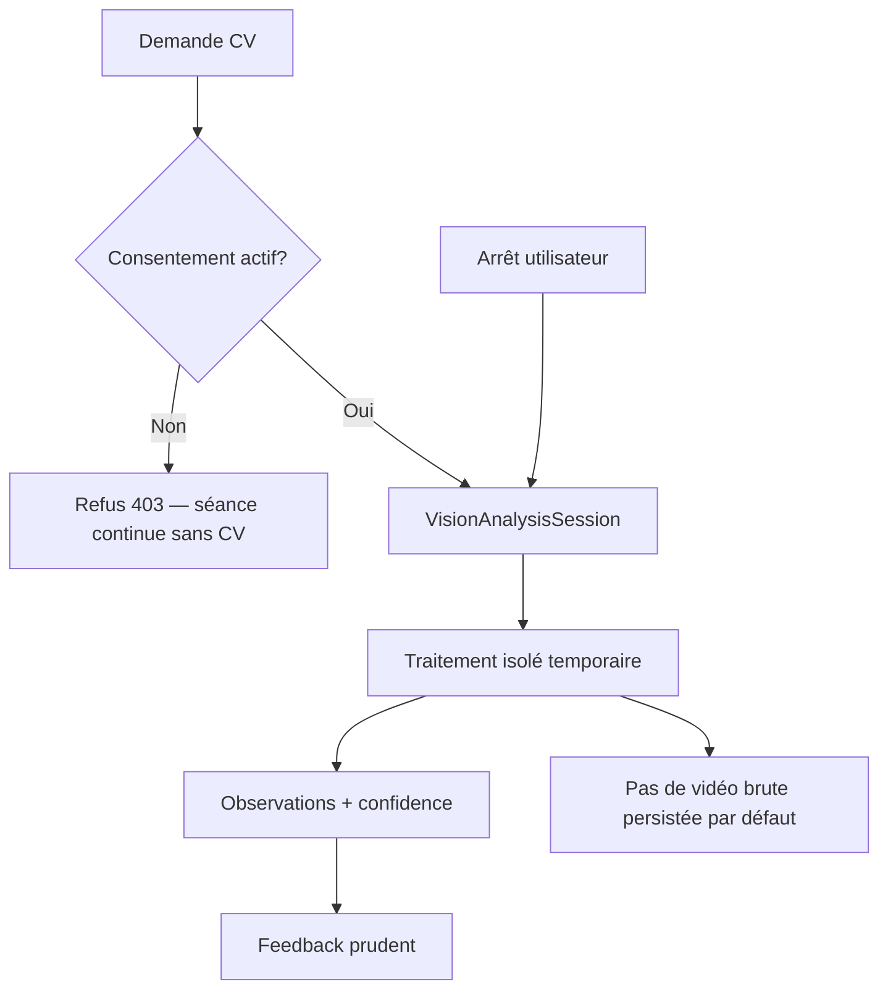

# 16 — Auth & Security

## 1. Statut

| Champ | Valeur |
| --- | --- |
| Nom du document | Auth & Security |
| Numéro | 16 |
| Fichier | `docs/16_AUTH_SECURITY.md` |
| Version | 1.0 |
| Statut | EN REVUE |
| Dernière mise à jour | 4 août 2026 |
| Auteur | Projet Tai-Chi-AI-Coach |
| Documents dépendants | `docs/00_MASTER_PLAN.md`, `docs/01_VISION.md`, `docs/02_PRODUCT_SCOPE.md`, `docs/03_PERSONAS.md`, `docs/04_USER_JOURNEYS.md`, `docs/05_FEATURES.md`, `docs/06_BUSINESS_MODEL.md`, `docs/08_TAI_CHI_CURRICULUM.md`, `docs/09_AI_COACH.md`, `docs/10_COMPUTER_VISION.md`, `docs/11_VIRTUAL_HUMANS.md`, `docs/12_UX_UI.md`, `docs/13_TECH_ARCHITECTURE.md`, `docs/14_DATA_MODEL.md`, `docs/15_API_ARCHITECTURE.md` |
| Documents utilisant celui-ci | `docs/17_PRIVACY_RGPD.md`, `docs/18_PWA_OFFLINE.md`, `docs/19_ANALYTICS.md`, `docs/20_TEST_STRATEGY.md`, `docs/21_DEPLOYMENT.md` |
| Décisions concernées | D-111 à D-120 |
| Dernière revue | Non effectuée |
| Autorise le code | Non |

> **NOTE**
>
> Architecture d’authentification et de sécurité conceptuelle. Aucun code, JWT/OAuth détaillé, SQL, middleware, secret ni fournisseur d’identité figé.
> Aligné sur `14_DATA_MODEL.md` et `15_API_ARCHITECTURE.md`.
> Document conforme à `docs/99_DOCUMENTATION_STANDARD.md`.

## 2. Objectifs

Définir pour **Tai-Chi AI Coach** :

- l’architecture d’authentification et d’autorisation ;
- la gestion des comptes et des sessions ;
- la sécurité des API, de la PWA et des données ;
- la protection des traitements IA, Computer Vision et Virtual Humans ;
- les garde-fous Offline First côté sécurité ;
- le standard UX obligatoire des champs mot de passe.

Les obligations juridiques détaillées restent dans `17_PRIVACY_RGPD.md`.

## 3. Périmètre

### 3.1 Inclus

Principes, comptes, auth, politiques mots de passe, sessions, autorisations, sécurité API/PWA/fichiers, protections modules, menaces, journalisation sécurité, classification des données.

### 3.2 Exclus

| Sujet | Document |
| --- | --- |
| Bases légales, délais, DPIA | `17_PRIVACY_RGPD.md` |
| Algo sync / cache détaillé | `18_PWA_OFFLINE.md` |
| Analytics produit | `19_ANALYTICS.md` |
| Hébergement, WAF, secrets runtime | `21_DEPLOYMENT.md` |
| Implémentation tokens / IdP | Post–Design Freeze |

## 4. Principes généraux

1. **Security by Design** — sécurité dès la conception (D-111).
2. **Privacy by Design** — minimisation et finalité (D-073).
3. **Least Privilege** — accès minimal nécessaire (D-112).
4. **Defense in Depth** — plusieurs couches (UI, API, données, modules).
5. **Zero Trust adapté** — ne jamais faire confiance au client ; vérifier identité, consentement et entitlement à chaque opération sensible.
6. **Secure Defaults** — options dangereuses (caméra, IA enrichie, analytics) désactivées ou opt-in.
7. Isolation inter-utilisateurs stricte.
8. Pas de diagnostic médical ; pas de compétition sociale.
9. Secrets jamais dans le client, les logs ou le dépôt.
10. Messages d’erreur calmes et non fuyants (`12`).

## 5. Comptes utilisateurs

Aligné sur `UserAccount` (`14`).

| État | Description |
| --- | --- |
| `active` | Compte utilisable |
| `suspended` | Accès bloqué (abus, sécurité, support) |
| `deletion_requested` | Suppression en cours / demandée |
| `deleted_or_anonymized` | Compte clos |

Cycle : création → activation (ex. vérification email si retenue) → actif → suspension éventuelle → demande de suppression → suppression ou anonymisation.

MVP : pratique possible en local sans compte distant.  
V1 (`F-039`) : compte pour sync, export, multi-appareils.

Règles :

- un utilisateur n’accède qu’à ses données ;
- la suppression déclenche un job auditable (`15`) ;
- l’anonymisation remplace la purge quand une conservation légale minimale l’exige (`17`).

## 6. Authentification

Fournisseur d’identité **non figé**.

Opérations conceptuelles :

| Opération | Objectif |
| --- | --- |
| Création de compte | Établir une identité |
| Vérification email | Confirmer l’adresse si le canal email est retenu |
| Connexion | Établir une session authentifiée |
| Déconnexion | Révoquer la session courante |
| Réinitialisation mot de passe | Flux sécurisé de récupération |
| Changement mot de passe | Rotation volontaire / forcée |
| Reconnexion | Renouvellement contrôlé de session |

Règles :

- authentification requise pour sync, IA, export, suppression, entitlements distants ;
- curriculum publié peut rester lisible selon politique produit ;
- échecs d’auth : messages génériques côté utilisateur (pas d’énumération abusive d’emails) ;
- limitation de tentatives (anti brute force / stuffing) ;
- déconnexion distante possible (révoquer sessions autres appareils).

## 7. Standard UX des mots de passe (obligatoire)

**D-113 — Password Visibility Standard.**

Tout champ mot de passe (création, connexion, réinitialisation, changement) doit intégrer :

| Exigence | Détail |
| --- | --- |
| Bouton œil | Afficher / masquer le secret |
| Clavier | Activable au clavier (focus, activation Entrée/Espace) |
| Accessibilité | Nom accessible explicite (ex. « Afficher le mot de passe » / « Masquer… ») |
| État | Annoncé aux technologies d’assistance |
| Valeur | Conservée lors du basculement visibility |
| Pas d’`alert` natif | Feedback via UI / modale projet |
| Cohérence | Même comportement sur tous les écrans concernés |

Ce standard s’applique à toute l’application et aux écrans futurs.

## 8. Politique des mots de passe

Sans imposer une techno de hash précise :

| Règle | Orientation |
| --- | --- |
| Longueur minimale | ≥ 12 caractères recommandée |
| Complexité | Encourager phrase de passe ; éviter règles cryptiques excessives qui poussent aux mauvais patterns |
| Bloclistes | Rejeter mots de passe trop courants / compromis connus (mécanisme à choisir à l’implémentation) |
| Réutilisation | Interdire la réutilisation des N derniers (N à figer à l’implémentation, ex. 3–5) |
| Changement | Possible à tout moment ; forcé après suspicion de compromission |
| Stockage | Jamais en clair ; dérivation / empreinte adaptée côté serveur uniquement |
| Transit | Toujours via canal chiffré |
| Affichage logs | Interdit |

OTP / passkeys / SSO : options futures possibles, non exigées ici.

## 9. Sessions

| Aspect | Règle conceptuelle |
| --- | --- |
| Ouverture | Après authentification réussie |
| Contenu | Identité, horodatages, appareil logique, niveau d’auth — **pas** de secrets longs en clair côté stockage client non protégé |
| Expiration | Durée limitée ; inactivity timeout adapté produit calme (valeur exacte ouverte) |
| Renouvellement | Rotation contrôlée ; éviter sessions immortelles |
| Fermeture | Déconnexion locale + révocation serveur |
| Multi-appareils | Autorisé V1+ ; liste / révocation distante |
| Vol de session | Binding prudent, détection anomalies basique, révocation |

Détail du mécanisme de jeton : ouvert (pas de JWT/OAuth figés ici).

## 10. Autorisations

### 10.1 Rôles conceptuels

| Rôle | Portée |
| --- | --- |
| Utilisateur | Ses propres ressources |
| Anonyme / local MVP | Données locales appareil uniquement |
| Service interne | Appels inter-modules non exposés client (`15`) |
| Administrateur futur | Contenus, support — séparé, moindre privilège, audit |

### 10.2 Règles

1. Isolation propriétaire stricte.
2. Entitlements validés **côté serveur** (D-108 / `15`).
3. Consentements typés vérifiés avant IA / CV / analytics / notifications push.
4. Admin ≠ accès libre aux conversations IA ou médias CV.
5. Aucune API de classement inter-utilisateurs.

## 11. Sécurité API

S’appuie sur `15_API_ARCHITECTURE.md` :

- contrôle d’accès par opération ;
- validation schéma + métier ;
- rate limiting / quotas ;
- erreurs structurées sans fuite ;
- idempotence des opérations sensibles ;
- contrôle optimiste des ressources sync ;
- pas d’exposition DB, prompts système, chemins stockage, secrets ;
- CORS / origines : politiques restrictives à l’implémentation (`21`).

Classes d’accès : public limité · authentifié · propriétaire · admin futur · interne.

## 12. Protection des données

| Mesure | Orientation |
| --- | --- |
| Chiffrement en transit | Obligatoire (TLS) |
| Chiffrement au repos | Obligatoire pour stores serveur contenant PII |
| Minimisation | Collecter uniquement le nécessaire |
| Séparation | Médias ≠ données métier ; CV ≠ pédagogie ; IA ≠ prompts système côté client |
| Export | `DataExportRequest` sécurisé, URL temporaire, expiration |
| Suppression | Job auditable ; cascade / anonymisation selon `14`/`17` |
| Sauvegardes | Accès restreint, rétention contrôlée (`17`/`21`) |

## 13. Protection IA

| Contrôle | Règle |
| --- | --- |
| Accès | Compte + consentement IA + entitlement |
| Quotas | Limites techniques et fonctionnelles (`15`) |
| Prompts système | Jamais exposés au client ni aux logs complets |
| Isolation fournisseurs | Adaptateurs uniquement (D-106, D-116) |
| Contenu | Garde-fous `09` ; refus contenus non autorisés |
| Journalisation | Métadonnées (jobId, latence, code) — pas le dialogue complet par défaut |
| Offline | Pas d’appel silencieux ; message clair retryable |
| Fuite | Pas de PII inutile vers le fournisseur |

## 14. Protection Computer Vision

| Contrôle | Règle |
| --- | --- |
| Consentement | Obligatoire, typé, versionné (D-115) |
| Activation | Volontaire ; désactivation / arrêt immédiat |
| Non-blocage | La séance peut se terminer sans CV |
| Stockage | Aucune vidéo/image brute par défaut (D-091, D-110) |
| Isolation | Traitements séparés ; pas de décision pédagogique autonome |
| Confiance | Feedback uniquement avec niveau de confiance |
| Médical | Interdit |
| Journalisation | Pas de frames dans les logs |

## 15. Protection Virtual Humans

| Contrôle | Règle |
| --- | --- |
| Accès | Catalogue lecture ; activation via préférence |
| Versions | Interventions liées à `guideVersion` |
| Médias | Accès contrôlé comme autres MediaAsset |
| Séparation | Guides indépendants ; Mei non obligatoire |
| Rôle | Jamais médecin / maître / experte certifiée |
| Transparence | Nature virtuelle exposée |

## 16. Offline First (sécurité)

Sans détailler la sync (`18`) :

| Thème | Règle |
| --- | --- |
| Accessibles offline | Cœur pédagogique en cache, reprise locale, préférences locales |
| Protégées | Secrets, tokens longue durée mal stockés, exports, entitlements serveur comme source de vérité |
| Stockage local | Minimiser PII ; pas de mots de passe en clair ; pas de vidéos CV |
| Reconnexion | Réauth si session expirée ; rejeu idempotent |
| Conflits | Versions ; pas d’écrasement silencieux de consentements ou suppressions |
| Appareil perdu | Révocation sessions distantes dès que compte V1 existe |

## 17. Sécurité PWA

| Aspect | Règle |
| --- | --- |
| Installation | Origine HTTPS de confiance |
| Stockage local | Cloisonner données sensibles ; durée de vie limitée |
| Cache | Ne pas mettre en cache public profil, progression, IA, CV, consentements |
| Mises à jour | Mécanisme de mise à jour progressive sans laisser d’anciens secrets |
| XSS | Sanitation, CSP conceptuelle, pas d’HTML non fiable |
| Données sensibles | Éviter IndexedDB pour secrets ; préférer stores adaptés et chiffrés si besoin |

Détail cache → `18`.

## 18. Sécurité des fichiers

| Règle | Détail |
| --- | --- |
| Médias catalogue | Métadonnées + URL temporaire / accès contrôlé |
| Validation | Type, taille max, intégrité |
| Upload futur admin | Scan / validation ; jamais confiance client |
| Téléchargements utilisateur | Droits + entitlement ; suppression locale côté client |
| CV | Pas d’upload permanent par défaut |

## 19. Journalisation sécurité

Événements à journaliser (métadonnées) :

- connexions réussies / échouées (agrégées / rate-limitées) ;
- réinitialisations mot de passe ;
- changements de mot de passe ;
- révocations de session ;
- changements de consentement (type + version, pas texte complet inutile) ;
- demandes export / suppression ;
- refus autorisation sensibles ;
- anomalies quota IA/CV.

Interdits dans les logs : mots de passe, tokens, messages IA complets, frames, secrets, PII non nécessaires.

Corrélation via `requestId` / `correlationId` (`15`). Conservation → `17`.

## 20. Gestion des erreurs

| Type | Côté utilisateur | Côté technique |
| --- | --- | --- |
| Auth échouée | Message calme générique | Code `AUTH_*`, retryable selon cas |
| Session expirée | Inviter à se reconnecter sans panique | 401 |
| Interdit | Expliquer sobrement (consentement, droit) | 403 `CONSENT_*` / `FORBIDDEN_*` |
| Compte suspendu | Contact support sobre | Pas de détail interne |

Conformité UX `12` : pas de jargon, pas de pop-up native bloquante.

## 21. Menaces couvertes

| Menace | Orientation de mitigation |
| --- | --- |
| Brute force | Rate limit, backoff, éventuel lockout temporaire |
| Credential stuffing | Mêmes limites + détection credentials connus compromis |
| XSS | Encodage, CSP, pas d’HTML brut utilisateur |
| CSRF | Protection adaptée au mécanisme de session retenu (`21`/implémentation) |
| Injections | Validation, requêtes paramétrées (implémentation) |
| Clickjacking | Headers d’encadrement |
| Replay | Idempotence + anti-rejeu sessions / nonces conceptuels |
| Vol de session | Expiration, révocation, stockage prudent |
| Accès non autorisé | AuthZ propriétaire + tests (`20`) |
| IDOR | IDs non devinables + contrôle propriétaire systématique |
| Fuite logs | Politique §19 |

Sans code détaillé.

## 22. Bonnes pratiques (référentiel)

Alignement conceptuel avec **OWASP ASVS** (niveau adapté produit) et sensibilités **OWASP Top 10** (injection, auth broken, XSS, etc.), sans transformer ce document en guide OWASP exhaustif.

## 23. Classification des données

| Niveau | Exemples | Protection |
| --- | --- | --- |
| Publiques | Présentation Tai Chi publiée | Cache OK |
| Privées | Profil, historique pratique, préférences | AuthZ + chiffrement |
| Sensibles au contexte | Conversations IA, observations CV, bilans | Consentement + rétention courte + logs minimaux |
| Temporaires | URL médias, jobs, frames CV non persistées | Expiration stricte |
| Secrets | Credentials, clés fournisseurs | Serveur uniquement, jamais client |

Ne pas qualifier automatiquement les données de « santé » au sens médical (`17`).

## 24. Diagrammes

### 24.1 Authentification

### 24.2 Session

### 24.3 Contrôle d'accès

### 24.4 Flux API sécurisé

### 24.5 Protection Computer Vision

## 25. Périmètre par version

| Capacité | MVP | V1 | V2 |
| --- | --- | --- | --- |
| Pratique locale sans compte distant | ● | ● | ● |
| Compte + sessions multi-appareils | — | ● | ● |
| Export / suppression compte | — | ● | ● |
| Protections IA | — | ● | ● |
| Protections CV / caméra | — | — | ● |
| Guides VH | — | — | ● |
| Standard œil mot de passe | ● dès qu’un MDP existe | ● | ● |

## 26. Limites

- IdP, protocoles de jetons, durées exactes de session : ouverts.
- RLS PostgreSQL détaillée : implémentation.
- Quotas chiffrés : ouverts.
- Modèle de menace formel exhaustif : pourra enrichir `20` / audits.

## 27. Décisions figées par ce document

| ID | Décision |
| --- | --- |
| D-111 | Security by Design appliqué à Tai-Chi AI Coach |
| D-112 | Least Privilege et isolation propriétaire stricts |
| D-113 | Password Visibility Standard (bouton œil accessible obligatoire) |
| D-114 | Sessions sécurisées (expiration, renouvellement, révocation, multi-appareils contrôlé) |
| D-115 | Consentement obligatoire avant tout traitement caméra / CV |
| D-116 | Isolation des traitements et secrets IA |
| D-117 | Isolation Computer Vision (volontaire, arrêt immédiat, pas de brut par défaut) |
| D-118 | Isolation Virtual Humans (optionnels, médias contrôlés, pas de rôle médical) |
| D-119 | Journalisation sécurisée sans secrets ni données sensibles en clair |
| D-120 | Données sensibles protégées (classification + chiffrement transit/repos) |

## 28. Décisions ouvertes

| Sujet | Document |
| --- | --- |
| Bases légales, délais, anonymisation fine | `17_PRIVACY_RGPD.md` |
| Stockage local détaillé, sync conflits | `18_PWA_OFFLINE.md` |
| Télémétrie sécurité vs analytics produit | `19_ANALYTICS.md` |
| IdP, WAF, secrets manager, durées exactes | `21_DEPLOYMENT.md` / implémentation |
| Tests sécurité / ASVS ciblé | `20_TEST_STRATEGY.md` |
| Passkeys / SSO / MFA | Futur produit |

## 29. Critères de validation

1. Principes Security / Privacy by Design explicites.
2. Comptes et sessions cycle de vie complets.
3. Standard œil mot de passe obligatoire documenté.
4. AuthZ propriétaire + entitlements serveur.
5. Protections IA / CV / VH alignées `09`–`11` et `14`–`15`.
6. Offline First sécurisé sans empiéter sur `18`.
7. Menaces principales couvertes conceptuellement.
8. Aucun secret / JWT / OAuth / code produit.
9. Décisions D-111–D-120 dans `DECISIONS.md`.

Statut actuel : **EN REVUE**.

## 30. Conclusion

L’authentification et la sécurité de Tai-Chi AI Coach reposent sur le moindre privilège, des sessions contrôlées, des consentements typés, l’isolation des modules IA/CV/VH, et un standard UX accessible pour les mots de passe — sans figer encore le fournisseur d’identité.

Prochaine étape : `docs/17_PRIVACY_RGPD.md`.

## 31. Références

- `docs/12_UX_UI.md`, `docs/13_TECH_ARCHITECTURE.md`, `docs/14_DATA_MODEL.md`, `docs/15_API_ARCHITECTURE.md`
- `docs/09_AI_COACH.md`, `docs/10_COMPUTER_VISION.md`, `docs/11_VIRTUAL_HUMANS.md`
- `docs/98_DEVELOPMENT_DOCUMENTATION_STANDARD.md`, `docs/99_DOCUMENTATION_STANDARD.md`
- `DECISIONS.md`, `CHANGELOG.md`

---

## Pied de document

| Champ | Valeur |
| --- | --- |
| Version | 1.0 |
| Statut | EN REVUE |
| Prochain document | `docs/17_PRIVACY_RGPD.md` |
| Fin officielle | Oui |

*Fin officielle du document.*
