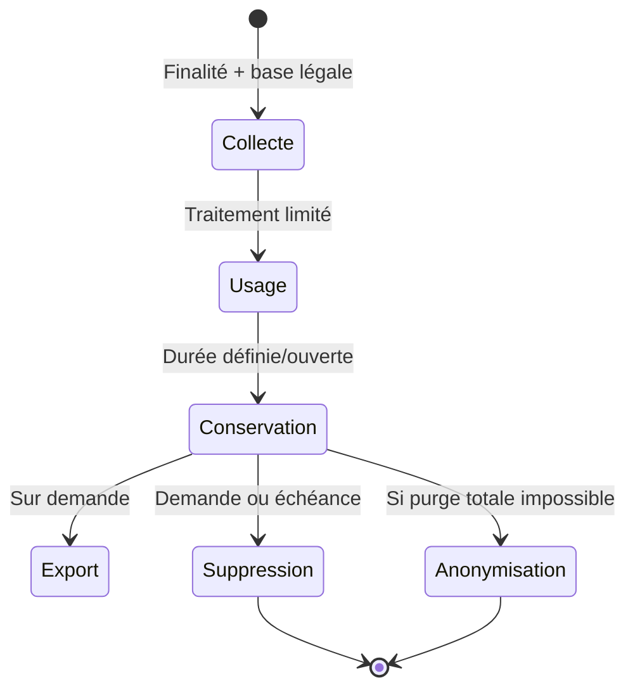
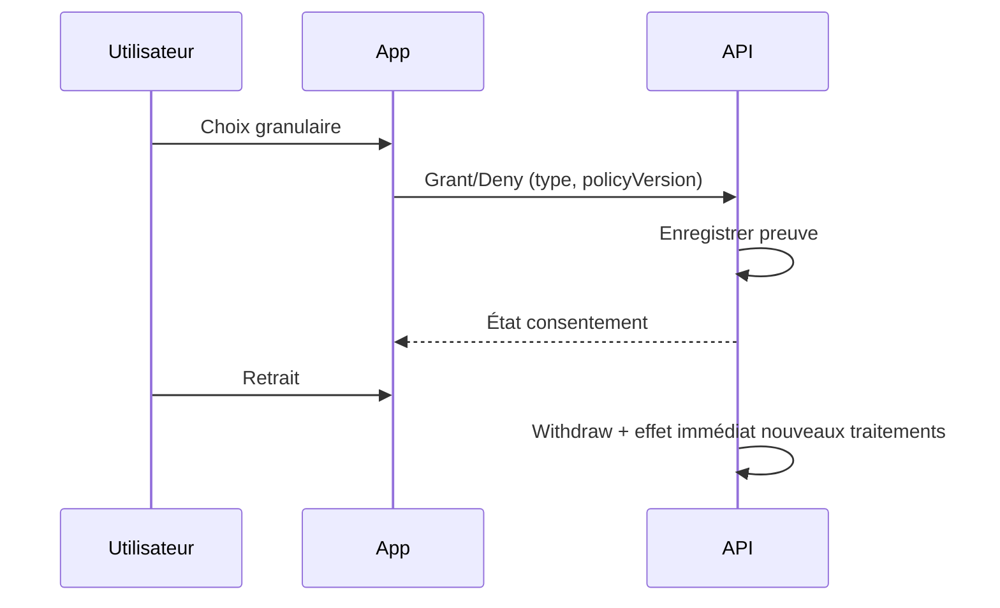
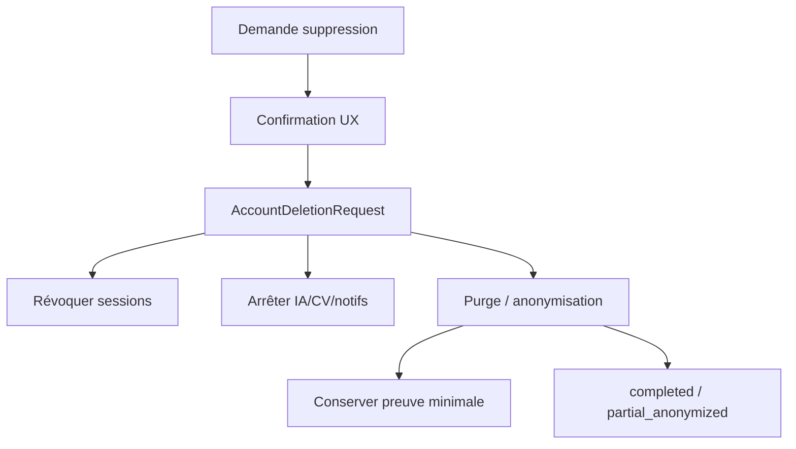
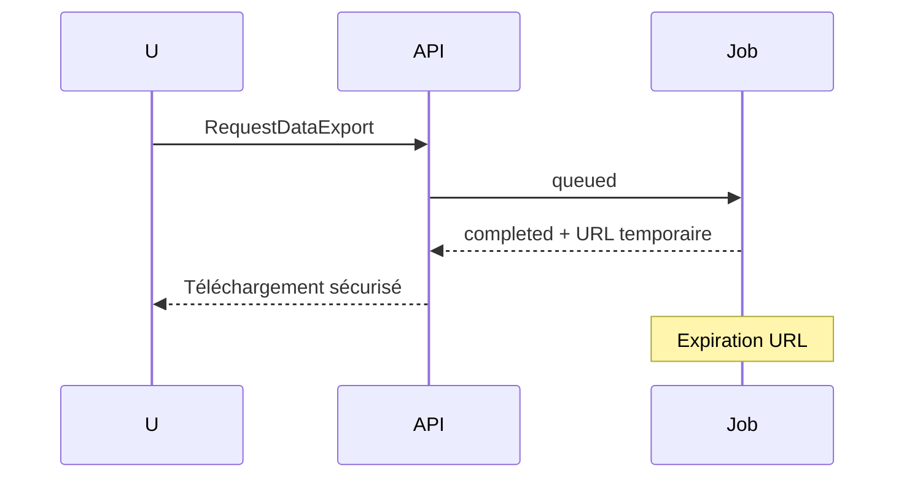
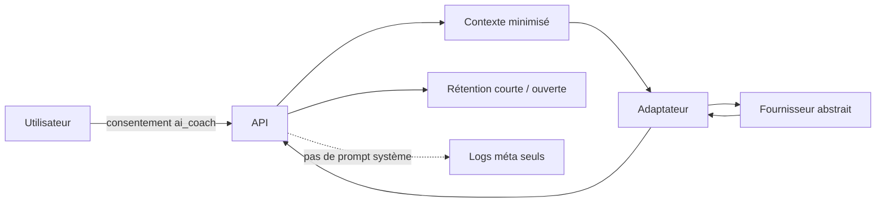

# 17 — Privacy & RGPD

## 1. Statut

| Champ | Valeur |
| --- | --- |
| Nom du document | Privacy & RGPD |
| Numéro | 17 |
| Fichier | `docs/17_PRIVACY_RGPD.md` |
| Version | 1.0 |
| Statut | EN REVUE |
| Dernière mise à jour | 4 août 2026 |
| Auteur | Projet Tai-Chi-AI-Coach |
| Documents dépendants | `docs/00_MASTER_PLAN.md`, `docs/01_VISION.md`, `docs/02_PRODUCT_SCOPE.md`, `docs/03_PERSONAS.md`, `docs/04_USER_JOURNEYS.md`, `docs/05_FEATURES.md`, `docs/06_BUSINESS_MODEL.md`, `docs/08_TAI_CHI_CURRICULUM.md`, `docs/09_AI_COACH.md`, `docs/10_COMPUTER_VISION.md`, `docs/11_VIRTUAL_HUMANS.md`, `docs/12_UX_UI.md`, `docs/13_TECH_ARCHITECTURE.md`, `docs/14_DATA_MODEL.md`, `docs/15_API_ARCHITECTURE.md`, `docs/16_AUTH_SECURITY.md` |
| Documents utilisant celui-ci | `docs/18_PWA_OFFLINE.md`, `docs/19_ANALYTICS.md`, `docs/20_TEST_STRATEGY.md`, `docs/21_DEPLOYMENT.md`, `docs/24_DEVELOPER_HANDOVER.md` |
| Décisions concernées | D-121 à D-131 |
| Dernière revue | Non effectuée |
| Autorise le code | Non |

> **NOTE**
>
> Document d’**architecture et de conception** de la protection des données. Ce n’est **pas** une politique de confidentialité publique, ni des CGU, ni des mentions légales destinées aux utilisateurs finaux.
> Aucune durée réglementaire inventée : les durées non arbitrées restent **ouvertes**.
> Les données de pratique / CV ne sont **pas** qualifiées automatiquement de données de santé.
> Document conforme à `docs/99_DOCUMENTATION_STANDARD.md`.

## 2. Objectifs

Définir pour **Tai-Chi AI Coach** :

- les traitements de données personnelles ;
- les principes RGPD et Privacy by Design / by Default ;
- les bases légales et consentements indépendants ;
- les droits utilisateurs (dont export et suppression) ;
- les règles de conservation, gouvernance et journalisation ;
- les obligations spécifiques IA, Computer Vision et Virtual Humans ;
- la gouvernance obligatoire des **nouvelles fonctionnalités** traitant des données personnelles.

## 3. Périmètre

### 3.1 Inclus

Registre conceptuel des traitements, classification des données, consentements, durées (orientations / ouvertes), droits, export/suppression, cookies & stockage local (principes), sous-traitants abstraits, transferts, violations, gouvernance.

### 3.2 Exclus

| Sujet | Destination |
| --- | --- |
| Texte public privacy / CGU / mentions | Communication juridique ultérieure |
| Détail cache / sync Offline | `18_PWA_OFFLINE.md` |
| Schéma analytics événementiel | `19_ANALYTICS.md` |
| Tests conformité | `20_TEST_STRATEGY.md` |
| Choix hébergeur / IdP / DPA signés | `21_DEPLOYMENT.md` |
| Code, SQL, config serveur, contrats fournisseurs | Hors scope |

## 4. Principes RGPD

| Principe | Application produit |
| --- | --- |
| Licéité | Base légale identifiée par traitement |
| Loyauté | Pas de finalités cachées ni dark patterns |
| Transparence | Information claire (UX calme `12`) ; textes publics séparés |
| Limitation des finalités | Chaque donnée sert une finalité documentée |
| Minimisation | Collecte stricte du nécessaire (D-127) |
| Exactitude | Rectification via profil / export / support |
| Limitation de conservation | Durées définies ou ouvertes explicitement |
| Intégrité & confidentialité | Aligné `16` (chiffrement, accès, logs) |
| Responsabilité (Accountability) | Registre, preuves de consentement, gouvernance D-131 |

## 5. Privacy by Design

| Couche | Traduction Privacy by Design |
| --- | --- |
| Architecture (`13`) | Modularité, Offline First, Privacy by Design technique (D-073) |
| UX (`12`) | Consentements explicites, caméra optionnelle, pas de pression |
| Data Model (`14`) | Consent typé, pas de vidéo brute par défaut, minimisation IA |
| API (`15`) | Isolation propriétaire, erreurs non fuyantes, médias hors JSON |
| Sécurité (`16`) | Least Privilege, sessions, journalisation sans secrets |

## 6. Privacy by Default

- Caméra / CV / notifications push / analytics non essentiels : **opt-in**, jamais activés implicitement.
- IA Coach : inaccessible sans compte + consentement + (si applicable) entitlement — pas d’appel silencieux.
- Paramètres protecteurs par défaut (accessibilité possible sans sur-collecte).
- Aucune collecte « au cas où ».
- Guides virtuels : non obligatoires ; pas de tracking biométrique.

## 7. Classification des données

| Catégorie | Exemples | Nature |
| --- | --- | --- |
| Identité | Compte, email de compte | Personnelle |
| Profil | Langue, fuseau, display name optionnel | Personnelle |
| Préférences | Durée, voix, accessibilité, guide préféré | Personnelle (souvent) |
| Progression / pratique | Sessions, acquis, régularité | Personnelle |
| Consentements | Type, version, décision, date | Personnelle + preuve |
| Interactions IA | Messages, contexte pédagogique | Personnelle / sensible au contexte |
| Analyses CV | Observations, confidence, feedback | Personnelle / sensible au contexte — **non médicale par finalité** |
| Notifications | Préférences, historique d’envoi | Personnelle |
| Premium | Entitlements, statut abonnement abstrait | Personnelle |
| Techniques | IDs appareils logiques, sync meta, logs méta | Techniques / parfois personnelles |
| Publiques catalogue | Curriculum publié, guides publics | Non personnelles |

**Interdit :** qualifier arbitrairement les données de posture ou de pratique comme « données de santé » au seul motif qu’elles concernent le corps. Toute requalification juridique éventuelle devra être arbitrée explicitement (juridique / DPIA) avant collecte élargie.

## 8. Registre conceptuel des traitements

| ID | Traitement | Finalité | Catégories | Base légale | Durée | Destinataires | Mesures |
| --- | --- | --- | --- | --- | --- | --- | --- |
| T-01 | Compte & authentification | Fournir l’identité et sécuriser l’accès | Identité, sessions | Contrat (V1+) / intérêt légitime sécurité | Compte actif + délai post-fermeture **ouvert** | Auth interne ; IdP futur | `16` |
| T-02 | Profil & préférences | Personnaliser l’expérience | Profil, prefs | Contrat / mesures précontractuelles MVP local | Tant que compte / appareil | Backend | Minimisation |
| T-03 | Onboarding | Activer le parcours (`F-033`) | Objectifs, niveau déclaré | Contrat / intérêt légitime produit | Jusqu’à complétion + conservation compte **ouverte** | Backend | Opt-out options V2 |
| T-04 | Curriculum & médias catalogue | Diffuser contenus pédagogiques | Non PII (+ logs d’accès éventuels) | Intérêt légitime / contrat | Selon publication contenu | CDN/stockage abstrait | Cache contrôlé |
| T-05 | Pratique & progression | Permettre séances, reprise, progression personnelle | Sessions, progress | Contrat / intérêt légitime usage local MVP | Compte / appareil ; **ouverte** post-suppression | Backend | Isolation user |
| T-06 | Recommandations | Proposer prochaine action explicable | Progress, prefs, évent. IA | Contrat ; consentement si IA | Court / recalculable | Backend ; adaptateur IA si V1 | Origine explicable |
| T-07 | IA Coach | Expliquer, encourager, adapter (`F-019`/`F-020`) | Messages, contexte | **Consentement** (+ contrat d’accès) | **Ouverte** (courte recommandée) | Adaptateur IA | Isolation, minimi. |
| T-08 | Notifications | Rappels bienveillants (`F-017`) | Prefs, tokens push | **Consentement** | Tant qu’opt-in | Prestataire notif abstrait | Opt-out |
| T-09 | Analytics produit | Améliorer le produit | Événements pseudonymisés | Intérêt légitime **ou** consentement selon granularité (`19`) | **Ouverte** | Sink analytics abstrait | Pas de brut CV/IA |
| T-10 | Computer Vision | Aide posture prudente V2 | Observations, méta session | **Consentement** spécifique | Temporaire / méta **ouverte** | Adaptateur CV éventuel | Pas de vidéo brute défaut |
| T-11 | Virtual Humans | Présentation guide optionnelle | Préférence guide, usage méta | Contrat / intérêt légitime (catalogue) ; consentement si tracking enrichi | Prefs avec compte | Stockage médias | Optionnel |
| T-12 | Premium / entitlements | Gérer droits freemium | Statut, caps | Contrat | Durée abonnement + **ouverte** légale facturation | Billing abstrait V2 | Snapshot séance |
| T-13 | Export | Portabilité / accès (`F-030`) | Archive personnelle | Obligation légale / contrat | Fichier temporaire **ouverte** (ex. jours) | Utilisateur | URL signée |
| T-14 | Suppression / anonymisation | Droit à l’effacement | Demande, preuves | Obligation légale / contrat | Preuve demande **ouverte** | Interne | Job audité |
| T-15 | Sécurité & journaux | Détecter abus, audits | Logs méta | Intérêt légitime / obligation légale | **Ouverte** | Ops internes | Sans secrets/PII inutiles |
| T-16 | Support futur | Assistance utilisateur | Données nécessaires au ticket | Contrat / intérêt légitime | **Ouverte** | Support habilité | Accès restreint |

## 9. Bases légales

| Base | Usages typiques |
| --- | --- |
| Exécution du contrat | Compte, pratique sync, progression, entitlements, export lié au service |
| Consentement | Notifications, IA Coach, caméra/CV, analytics non essentiels, personalisation invasive |
| Intérêt légitime | Sécurité, prévention fraude, amélioration technique mesurée, catalogue |
| Obligation légale | Conservation minimale preuves, réponses autorités (si applicable) |

Ne pas exiger de consentement lorsque le contrat ou l’intérêt légitime suffit **et** que le test de balancing est favorable. Ne jamais utiliser un consentement « fourre-tout ».

## 10. Consentements indépendants

Aligné `Consent` (`14`) et D-123.

| Type | Indépendant | Version produit |
| --- | --- | --- |
| `notifications` | Oui | V1 |
| `ai_coach` | Oui | V1 |
| `camera` | Oui | V2 |
| `computer_vision` | Oui (distinct de la seule permission OS) | V2 |
| `analytics` | Oui si non strictement nécessaire | V1+ |
| `personalization` | Oui si au-delà du service de base | V1/V2 |

Règles :

- collecte granulaire, information claire, action affirmative ;
- retrait aussi simple que l’octroi ; effet immédiat sur **nouveaux** traitements ;
- journalisation : type, version texte, décision, date, contexte, preuve minimale ;
- un refus caméra/Mei/IA **ne bloque pas** le cœur pédagogique.

## 11. IA Coach

| Règle | Détail |
| --- | --- |
| Données transmises | Message utilisateur + contexte pédagogique minimal nécessaire |
| Minimisation | Pas d’historique excessif ; pas de PII hors besoin |
| Fournisseurs | Via adaptateur uniquement ; pas de prompt système exposé |
| Conservation | Courte recommandée ; durée exacte **ouverte** |
| Anonymisation | Envisagée pour analyses agrégées (`19`) |
| Logs | Métadonnées job, pas dialogue complet par défaut |
| Offline | Pas d’envoi silencieux |

## 12. Computer Vision

| Règle | Détail |
| --- | --- |
| Activation | Volontaire uniquement |
| Consentement | Spécifique `camera` / `computer_vision` |
| Vidéo brute | **Non conservée par défaut** (D-124) |
| Traitement | Temporaire / local ou éphémère |
| Suppression | À l’arrêt, fin de session, retrait consentement, demande effacement |
| Finalité | Aide prudente — **jamais diagnostic médical** |
| Séance | Toujours terminable sans CV |

## 13. Virtual Humans

- Rôle : guide optionnel de présentation (Mei envisagée).
- Données : préférence d’activation, langue, version guide ; pas de collecte biométrique.
- Pas de données supplémentaires obligatoires pour pratiquer.
- Respect immédiat des préférences et de la transparence sur la nature virtuelle.

## 14. Durées de conservation

| Donnée | Durée | Justification |
| --- | --- | --- |
| Compte actif | Tant que le compte existe | Service |
| Profil / préférences | Tant que le compte / appareil local | Service |
| PracticeSession / UserProgress | Tant que compte ; post-suppression **ouverte** | Continuité pédagogique / effacement |
| Consentements (preuve) | Tant que nécessaire à la preuve + **ouverte** légale | Accountability |
| Conversations IA | **Ouverte** — orientation : courte | Minimisation |
| Observations CV | **Ouverte** — orientation : méta courte ; brut = non stocké défaut | Minimisation |
| Notifications (historique) | **Ouverte** — orientation : courte | Utilité limitée |
| Entitlements / billing méta | **Ouverte** (contraintes comptables futures) | Contrat / légal |
| Export package | **Ouverte** — orientation : quelques jours | Sécurité URL |
| Logs sécurité | **Ouverte** | Intérêt légitime / légal |
| Cache local PWA | Selon `18` | Performance / offline |

Les durées marquées **ouvertes** doivent être tranchées avant Design Freeze ou au plus tard avant mise en production du traitement concerné.

## 15. Droits des utilisateurs

| Droit | Traduction produit |
| --- | --- |
| Accès | Consultation profil / historique + export |
| Rectification | Mise à jour profil / préférences |
| Effacement | `AccountDeletionRequest` + purge/anonymisation |
| Limitation | Restriction traitements non essentiels (consent withdraw) |
| Opposition | Opt-out analytics / notifs / intérêts légitimes contestables |
| Portabilité | Export structuré (`F-030`) |

Exercice : via l’application (V1+) et/ou canal support documenté ultérieurement. Réponses dans les délais légaux (délais opérationnels exacts **ouverts** / juridique).

## 16. Export

| Aspect | Règle |
| --- | --- |
| Déclenchement | Demande utilisateur authentifiée |
| Contenu | Données personnelles du demandeur (périmètre documenté) |
| Format | Structuré machine-readable (ex. JSON/ZIP logique) — format exact ouvert |
| Disponibilité | Job async (`15`) ; notification quand prêt |
| Sécurité | Authentification, URL temporaire, expiration |
| Traçabilité | `DataExportRequest` audité |

## 17. Suppression

| Mode | Usage |
| --- | --- |
| Suppression logique | Tombstones sync, soft-delete temporaire |
| Suppression physique | Purge stores après délais / job |
| Anonymisation | Lorsque conservation statistique/légale empêche purge totale |
| Demande utilisateur | `AccountDeletionRequest` ; confirmation UX (modale, pas `alert`) |

Effets : révocation sessions ; arrêt IA/CV/notifs ; invalidation exports ; conservation preuve minimale de la demande.

## 18. Cookies et stockage local

| Mécanisme | Usage prévu | Règle |
| --- | --- | --- |
| Cookies / stockage technique | Session, préférences sécurité, charge | Nécessaires au service — informer |
| LocalStorage / équivalent | Prefs locales MVP | Minimiser PII |
| IndexedDB | Données offline pratique | Pas de secrets ; pas de vidéo CV |
| Cache Storage | Curriculum / médias | Pas de données sensibles en cache public |

Détail stratégies Offline → `18`. Pas de traceurs marketing non consentis.

## 19. Sous-traitants (conceptuel)

| Domaine | Rôle abstrait | Données typiques | Garanties attendues |
| --- | --- | --- | --- |
| Hébergement / DB | Hosting | PII service | DPA, sécurité |
| Stockage objet | Media storage | Médias catalogue (± exports) | Accès restreint |
| IA | AI processor | Textes / contexte minimisé | Instructions, pas de réentraînement non autorisé |
| CV | Vision processor | Flux temporaire | Non-conservation brut |
| Notifications | Push/email | Tokens, template keys | Opt-out honoré |
| Analytics | Analytics sink | Événements pseudonymisés | Minimisation |
| Billing | Payment processor | Refs abonnement | PCI/scopes adaptés |

Aucun fournisseur nommé ici.

## 20. Transferts internationaux

- Principe : localiser préférentiellement dans l’UE/EEE lorsque possible.
- Si sous-traitant hors UE : garanties appropriées (clauses types, décisions d’adéquation, mesures supplémentaires) — à documenter lors du choix (`21`).
- Évaluation transfert avant activation du traitement concerné.
- Aucun fournisseur sélectionné dans ce document.

## 21. Violations de données

Cycle conceptuel :

1. Détection (monitoring, alerte, signalement).
2. Journalisation incident (méta).
3. Analyse (nature, volume, risques personnes).
4. Contention / correction technique.
5. Notification responsable → autorités / personnes **si** seuils légaux atteints (procédure opérationnelle à figer avant prod).
6. Retour d’expérience et mise à jour mesures.

Délais légaux exacts : cadre juridique opérationnel **ouvert** (playbook prod).

## 22. Gouvernance

| Rôle | Responsabilité |
| --- | --- |
| Responsable du traitement | Entité éditrice du produit (à nommer juridiquement avant prod) |
| Sous-traitants | Selon matrice §19 |
| Équipe produit / tech | Tenue du registre, Privacy by Design, D-131 |
| Support | Exercice des droits selon procédure |
| Documentation | `17` + registre vivant + preuves consentements |

## 23. Journalisation RGPD

Journaliser (méta) : consentements, exports, suppressions, accès admin futurs, incidents.

Ne pas journaliser : contenus IA complets, frames, mots de passe, tokens, données disproportionnées.

## 24. Gouvernance des nouvelles fonctionnalités (obligatoire)

**D-131.**

Toute nouvelle fonctionnalité impliquant un traitement de données personnelles ne peut être considérée comme validée que si sa documentation précise **au minimum** :

1. la finalité du traitement ;
2. la ou les catégories de données concernées ;
3. la base légale applicable ;
4. le caractère obligatoire ou facultatif des données ;
5. les destinataires des données ;
6. la durée de conservation ;
7. les conditions de suppression ou d’anonymisation ;
8. les mesures de sécurité associées ;
9. les impacts éventuels sur les consentements existants ;
10. les impacts éventuels sur le registre des traitements.

Cette analyse est réalisée **avant toute implémentation**.

Une fonctionnalité qui ne respecte pas cette exigence **ne peut pas être intégrée** au produit.

Cette règle s’applique à toutes les évolutions futures, y compris V1, V2 et ultérieures.

## 25. Diagrammes

### 25.1 Cycle de vie d'une donnée

### 25.2 Consentement

### 25.3 Suppression

### 25.4 Export

### 25.5 Traitements IA

## 26. Décisions figées par ce document

| ID | Décision |
| --- | --- |
| D-121 | Privacy by Design comme exigence documentaire et produit |
| D-122 | Privacy by Default (opt-in pour traitements non essentiels) |
| D-123 | Consentements indépendants, versionnés et révocables |
| D-124 | Pas de conservation de vidéo/image brute CV par défaut |
| D-125 | Export utilisateur structuré et sécurisé (`F-030`) |
| D-126 | Suppression maîtrisée (logique, physique, anonymisation) |
| D-127 | Minimisation systématique des données personnelles |
| D-128 | Registre conceptuel des traitements obligatoire et tenu à jour |
| D-129 | Gouvernance des données (responsable, sous-traitants, accountability) |
| D-130 | Journalisation RGPD minimale et non intrusive |
| D-131 | Toute nouvelle fonctionnalité traitant des PII doit documenter finalité, base légale, conservation, etc. avant implémentation |

## 27. Décisions ouvertes

| Sujet | Document / acteur |
| --- | --- |
| Durées de conservation définitives | Juridique + ce doc avant prod |
| Choix fournisseurs & DPA | `21_DEPLOYMENT.md` |
| Stratégie analytics & base légale fine | `19_ANALYTICS.md` |
| Cache / IndexedDB détail | `18_PWA_OFFLINE.md` |
| Playbook violation (délais ops) | `21` + juridique |
| Qualité éventuelle « données de santé » | DPIA / juridique si changement de finalité |
| Textes privacy / CGU publics | Communication juridique |
| Tests de conformité | `20_TEST_STRATEGY.md` |

## 28. Critères de validation

1. Principes RGPD et Privacy by Design/Default couverts.
2. Registre conceptuel des traitements présent.
3. Consentements indépendants alignés `14`/`16`.
4. IA / CV / VH traités sans médicalisation.
5. Droits, export, suppression décrits.
6. Durées inventées absentes ; ouvertes signalées.
7. Gouvernance des nouvelles fonctionnalités (D-131) explicite.
8. Pas de politique publique ni code.
9. Décisions D-121–D-131 dans `DECISIONS.md`.

Statut actuel : **EN REVUE**.

## 29. Conclusion

Tai-Chi AI Coach traite les données personnelles selon la minimisation, des consentements granulaires, un registre de traitements et une suppression/export maîtrisés. L’IA et la vision restent optionnels, non médicaux, sans conservation de médias bruts par défaut. Toute évolution future traitant des PII doit d’abord documenter finalité, base légale et conservation (D-131).

Prochaine étape : `docs/18_PWA_OFFLINE.md`.

## 30. Références

- `docs/14_DATA_MODEL.md`, `docs/15_API_ARCHITECTURE.md`, `docs/16_AUTH_SECURITY.md`
- `docs/09_AI_COACH.md`, `docs/10_COMPUTER_VISION.md`, `docs/11_VIRTUAL_HUMANS.md`, `docs/12_UX_UI.md`
- `docs/98_DEVELOPMENT_DOCUMENTATION_STANDARD.md`, `docs/99_DOCUMENTATION_STANDARD.md`
- `DECISIONS.md`, `CHANGELOG.md`

---

## Pied de document

| Champ | Valeur |
| --- | --- |
| Version | 1.0 |
| Statut | EN REVUE |
| Prochain document | `docs/18_PWA_OFFLINE.md` |
| Fin officielle | Oui |

*Fin officielle du document.*
