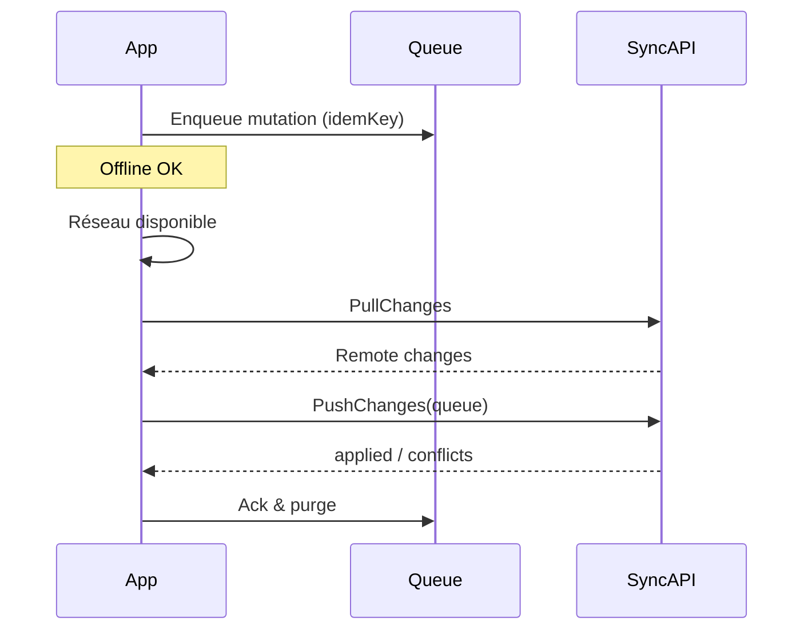
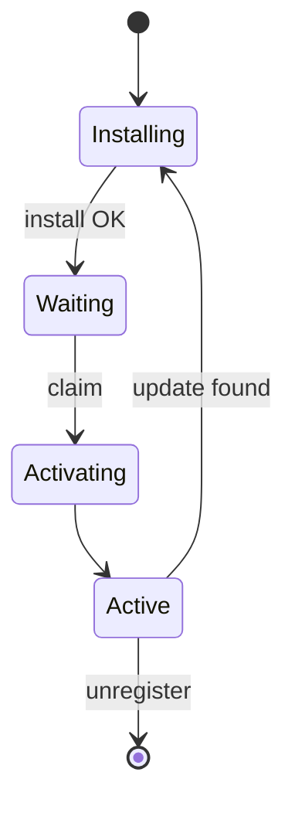
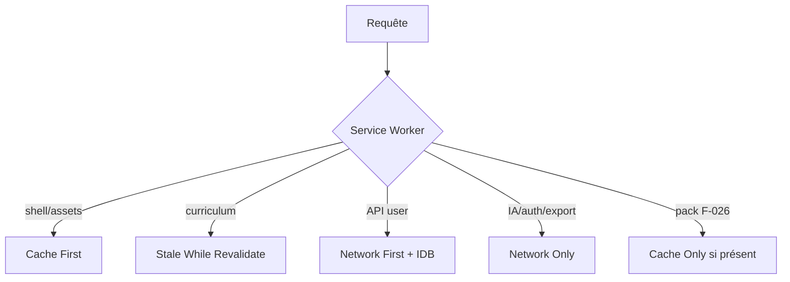
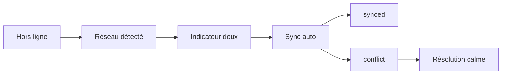
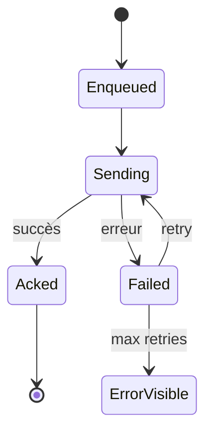

# 18 — PWA & Offline

## 1. Statut

| Champ | Valeur |
| --- | --- |
| Nom du document | PWA & Offline |
| Numéro | 18 |
| Fichier | `docs/18_PWA_OFFLINE.md` |
| Version | 1.1 |
| Statut | EN REVUE |
| Dernière mise à jour | 4 août 2026 |
| Auteur | Projet Tai-Chi-AI-Coach |
| Documents dépendants | `docs/00_MASTER_PLAN.md`, `docs/01_VISION.md`, `docs/02_PRODUCT_SCOPE.md`, `docs/03_PERSONAS.md`, `docs/04_USER_JOURNEYS.md`, `docs/05_FEATURES.md`, `docs/06_BUSINESS_MODEL.md`, `docs/08_TAI_CHI_CURRICULUM.md`, `docs/09_AI_COACH.md`, `docs/10_COMPUTER_VISION.md`, `docs/11_VIRTUAL_HUMANS.md`, `docs/12_UX_UI.md`, `docs/13_TECH_ARCHITECTURE.md`, `docs/14_DATA_MODEL.md`, `docs/15_API_ARCHITECTURE.md`, `docs/16_AUTH_SECURITY.md`, `docs/17_PRIVACY_RGPD.md` |
| Documents utilisant celui-ci | `docs/19_ANALYTICS.md`, `docs/20_TEST_STRATEGY.md`, `docs/21_DEPLOYMENT.md`, `docs/24_DEVELOPER_HANDOVER.md` |
| Décisions concernées | D-132 à D-142 |
| Dernière revue | Non effectuée |
| Autorise le code | Non |

> **NOTE**
>
> Architecture Offline First / PWA conceptuelle. Aucun Service Worker, IndexedDB schéma, SQL ni code.
> Aligné D-071, D-109, `F-026` (V2), `F-027` (V1), cœur pédagogique MVP local.
> `F-041` (hors ligne partiel minimal backlog) n’est **pas** exigé ici.
> Document conforme à `docs/99_DOCUMENTATION_STANDARD.md`.

## 2. Objectifs

Définir pour **Tai-Chi AI Coach** :

- la philosophie Offline First ;
- l’architecture PWA (cache, Service Worker, stockage) ;
- la synchronisation, les conflits et la file d’attente ;
- les téléchargements enrichis et les quotas ;
- les comportements IA / CV / VH hors ligne ;
- l’UX offline calme ;
- la gouvernance Offline des nouvelles fonctionnalités.

## 3. Périmètre

### 3.1 Inclus

Matrices online/offline, stratégies de cache, IndexedDB conceptuel, sync, conflits, nettoyage, performance, sécurité et RGPD locales.

### 3.2 Exclus

| Sujet | Document |
| --- | --- |
| Implémentation SW / Workbox | Post–Design Freeze |
| Analytics offline détaillé | `19_ANALYTICS.md` |
| Tests offline | `20_TEST_STRATEGY.md` |
| CDN / hosting PWA | `21_DEPLOYMENT.md` |
| Moteur CV local inventé | Non prévu — ouvert si un jour décidé |

## 4. Philosophie Offline First

Objectifs :

1. L’essentiel de la **pratique** reste possible sans réseau.
2. Continuité : pause, reprise (`F-032`), progression locale.
3. Reprise transparente à la reconnexion (sans panique UX).
4. **Aucune perte** de données utilisateur de pratique dues à une coupure.
5. Les enrichissements cloud (IA, sync multi-appareils, downloads riches) restent optionnels selon version.

## 5. Principes généraux

| Principe | Signification |
| --- | --- |
| Local First (D-133) | Écrire d’abord en local pour la pratique |
| Sync Later (D-134) | Différer l’envoi serveur dès que le réseau revient |
| Source of Truth | Catalogue contenu = serveur ; pratique offline = client jusqu’à ack ; entitlements = serveur |
| Versionnement | `resourceVersion` / `contentVersion` (`14`, `15`) |
| Idempotence | Toute mutation offline rejouable (`15` D-102) |
| Résilience réseau | Timeouts, retries bornés, mode dégradé explicite |

## 6. Matrice des données hors ligne

| Donnée | Toujours (cœur) | Après téléchargement | Online only | Version |
| --- | --- | --- | --- | --- |
| Shell PWA / navigation | ● | | | MVP |
| Préférences locales | ● | | | MVP |
| Onboarding en cours (local) | ● | | | MVP |
| Curriculum / séances déjà mises en cache (essentiel) | ●* | | | MVP |
| Médias essentiels déjà cachés | ●* | | | MVP |
| PracticeSession + reprise | ● | | | MVP |
| Progression locale | ● | | | MVP |
| Historique local | ● | | | MVP |
| Recommandations déterministes | ● (recalcul local) | | | MVP |
| Packs séances / médias riches | | ● (`F-026`) | | V2 |
| Guides VH / assets lourds | | ● si pack | sinon limité | V2 |
| Sync multi-appareils | | | ● push/pull | V1 |
| IA Coach | | | ● | V1 |
| Export / suppression compte | | | ● | V1 |
| Màj compte / auth distante | | | ● | V1 |
| Notifications push distantes | | | ● | V1 |
| Entitlements serveur (source) | cache lecture | | ● vérité | MVP+/V2 |
| Computer Vision cloud | | | ● | V2 |
| Analytics envoi | file locale | | ● flush | V1+ |

\* « Toujours » après première visite / précharge raisonnable du pack essentiel — pas magie sans jamais avoir ouvert l’app en ligne une fois (sauf install avec assets embarqués, stratégie ouverte).

## 7. Données et services online-only — repli

| Capacité | Repli hors ligne |
| --- | --- |
| IA Coach | Message calme : indisponible ; **séance non bloquée** (D-139) |
| Sync | File d’attente ; indicateur « en attente » |
| Notifications push | Pas d’envoi ; rappels locaux optionnels si prévus plus tard |
| Export / suppression | Expliquer besoin réseau ; conserver intention locale si pertinent |
| Compte (création, reset MDP) | Reporter ; pratique locale MVP possible |
| CV cloud | Continuer séance sans analyse |
| Recommandation IA | Basculer déterministe curriculum/progression |

## 8. Architecture PWA

Composants conceptuels :

- **App shell** installable ;
- **Service Worker** : cache HTTP, mise à jour, interception réseau ;
- **IndexedDB** : données métier locales ;
- **Cache Storage** : assets statiques / médias ;
- **File d’attente** : mutations offline ;
- **Sync engine** (V1+) : pull/push (`15`).

## 9. Service Worker

| Phase | Rôle |
| --- | --- |
| Installation | Précharger shell + assets critiques |
| Activation | Prise de contrôle, nettoyage anciens caches versionnés |
| Fetch | Appliquer stratégies §10 |
| Mise à jour | Nouvelle version SW → activation contrôlée (pas de surprise en pleine séance) |
| Suppression | Désinstallation / clear site data |

Pas d’implémentation JS ici. Mise à jour : préférer bascule après fin de séance ou au prochain lancement calme.

## 10. Stratégies de cache

| Ressource | Stratégie | Motif |
| --- | --- | --- |
| App shell / JS/CSS versionnés | Cache First + revalidate version | Démarrage rapide |
| Curriculum JSON publié | Stale While Revalidate | Fraîcheur + offline |
| Médias pédagogiques essentiels | Cache First après 1er fetch | Pratique |
| Médias packs `F-026` | Cache Only une fois téléchargés | Offline riche |
| API profil / progression / sync | Network First + file locale | Fraîcheur sync |
| IA / export / auth sensible | Network Only | Pas de cache sensible |
| Guides VH métadonnées | Stale While Revalidate | Catalogue |
| Entitlements | Network First ; cache court lecture | Source serveur |

(D-135 — cache intelligent par type de ressource.)

## 11. IndexedDB (conceptuel)

Objectifs : persister pratique, progression, prefs, file sync, métadonnées téléchargements, consentements locaux en attente de sync.

Domaines stockés (logiques) : alignés `14` — PracticeSession, UserProgress, UserPreference, OnboardingState, Recommendation locale, SyncMeta, queue ops, index packs médias.

Limites : quotas navigateur ; pas de secrets longs ; pas de vidéo CV brute.

Sécurité : origine HTTPS ; isolation par origine ; clear à la suppression compte / demande utilisateur (`16`, `17`).

Schéma physique : non figé.

## 12. Stockage local

| Contenu | Store typique | Sync |
| --- | --- | --- |
| Préférences | IDB / local | V1+ selon clé |
| Progression / séances | IDB | V1+ |
| Séances téléchargées | Cache + index IDB | Liste méta V2 |
| État UI éphémère | Mémoire / session | Non |
| Queue offline | IDB | Flush V1+ |
| Consentements | IDB → serveur | Dès compte |

Respect RGPD : minimisation, pas de traceurs marketing offline, purge sur effacement.

## 13. Téléchargement des séances (`F-026`, V2)

| Opération | Règle |
| --- | --- |
| Télécharger | Pack SessionTemplate + médias liés + `contentVersion` |
| Lister | Packs locaux, tailles, fraîcheur |
| Mettre à jour | Si `contentVersion` serveur > local ; ne pas casser séance en cours |
| Invalider | Contenu archivé / entitlement retiré (après fin séance) |
| Supprimer | Manuel utilisateur ou nettoyage auto (§20) |

MVP/V1 : s’appuient sur cache opportuniste du cœur, pas sur packs riches complets.

## 14. Synchronisation (`F-027`, V1)

| Mode | Description |
| --- | --- |
| Auto à la reconnexion | Pull puis push file (ordre stable) |
| Périodique en avant-plan | Borné, non agressif batterie |
| Manuel | Action « Synchroniser » dans Profil / indicateur |
| Reprise | Rejouer ops idempotentes jusqu’à ack |

Contrats : `SynchronizeClientChanges` (`15`) — cursor, versions, tombstones.

## 15. Résolution des conflits (D-138)

| Cas | Orientation |
| --- | --- |
| PracticeSession même id | Fusion d’étapes si compatible ; sinon conserver les deux chronologies / last-write prudente sur champs non critiques |
| Progression agrégée | Recalcul serveur depuis événements fiables (priorité événements) |
| Préférences | Last-write-wins par clé + `updatedAt` ; ou merge clé à clé |
| Consentements | **Jamais** écraser un retrait par un grant plus ancien ; max protection |
| Suppression vs update | Suppression / deletion_requested gagne |
| Contenu pédagogique | Serveur = vérité ; client reclasse sur nouvelle version |

Intervention utilisateur : uniquement si ambiguïté visible (ex. deux reprises incompatibles) — UX calme, modale, pas d’`alert`.

## 16. File d'attente Offline

Cycle : enqueue (create) → pending → sending → acked → delete ; ou failed → retry borné → error visible.

Chaque op : `idempotencyKey`, `clientOpId`, payload, `resourceVersion` attendue, timestamp.

Échec définitif : message rassurant + conservation locale des données de pratique.

## 17. IA Coach hors ligne

- Pas d’appel réseau silencieux.
- Message : « L’accompagnement IA sera disponible lorsque la connexion reviendra. »
- Historique local éventuel en lecture seule selon policy.
- **Ne bloque jamais** démarrage / reprise / fin de séance (D-139).

## 18. Computer Vision hors ligne

- Pas de moteur CV local inventé dans ce document.
- Sans réseau : si un traitement cloud est requis → indisponible ; séance continue.
- Si un futur moteur on-device est décidé : nouvelle analyse Offline + D-131/D-142 obligatoires.
- Aucune persistance de vidéo brute.

## 19. Virtual Humans hors ligne

- Métadonnées / assets **déjà téléchargés** : utilisables.
- Assets non présents : repli vidéo pédagogique classique (`F-006`) / absence de guide.
- Mei jamais obligatoire pour pratiquer.

## 20. Notifications

| Type | Offline |
| --- | --- |
| In-app locales | Possibles (rappels locaux futurs) |
| Push distantes | Requièrent réseau + opt-in ; pas d’envoi offline |
| Préférences | Lisibles/modifiables localement ; sync plus tard |

## 21. États de synchronisation

| État | Signification UX |
| --- | --- |
| `synced` | À jour |
| `pending` | Modifications en attente |
| `syncing` | Synchronisation en cours |
| `conflict` | Conflit à résoudre / en résolution |
| `offline` | Pas de réseau |
| `error` | Échec temporaire ou à traiter |
| `resume` | Reprise après coupure |

## 22. UX Offline

Cohérent `12` :

- indicateur discret (pas d’alarme) ;
- messages calmes, orientés solution ;
- séance : priorité pratique > sync ;
- reconnexion : toast/bandeau doux « Synchronisation… » puis disparition ;
- une action principale par écran conservée ;
- états vides / erreur / offline prévus (§20 de `12`).

## 23. Nettoyage (D-140)

| Cible | Déclencheur |
| --- | --- |
| Caches SW versionnés | Activation nouvelle version |
| Médias LRU non épinglés | Quota / inactivité |
| Packs obsolètes | Version archivée / purge manuelle |
| Queue acked | Après succès |
| Données temporaires jobs | Expiration |
| Données compte | Suppresssion / logout selon policy |

Ne jamais purger une `PracticeSession` non synchronisée sans garantie de conservation.

## 24. Quotas (D-141)

| Aspect | Orientation |
| --- | --- |
| Limites | Quotas navigateur + budget produit **ouverts** (Mo packs) |
| Alerte | Avant téléchargement volumineux ; si stockage insuffisant |
| Plein | Empêcher nouveau pack ; préserver données pratique ; proposer nettoyage |
| Priorité conservation | Sessions non sync > packs médias > caches dérivés |

Chiffres exacts : ouverts (`21` / mesures terrain).

## 25. Performance

Objectifs (`13`) : démarrage rapide shell, faible mémoire, animations discrètes, batterie (pas de sync agressive background), réseau (batch sync, médias adaptés).

Calculs lourds isolés ; pas de re-download inutile (ETag / versions).

## 26. Sécurité locale

S’appuie sur `16` :

- HTTPS / install de confiance ;
- pas de mots de passe / tokens longue durée en clair dans IDB ;
- sessions : expiration et révocation à la reconnexion si besoin ;
- suppression locale sur demande effacement ;
- IndexedDB non considéré comme coffre-fort absolu (menace appareil).

## 27. RGPD locale

S’appuie sur `17` :

- données locales = personnelles si liées à l’utilisateur ;
- consentements respectés offline (pas d’IA/CV sans grant) ;
- export/suppression nécessitent online pour finaliser côté serveur ; intention locale possible ;
- minimisation du cache sensible ;
- pas de flush analytics contraire au consentement.

## 28. Diagrammes

### 28.1 Synchronisation

### 28.2 Service Worker

### 28.3 Cache

### 28.4 Reprise réseau

### 28.5 File d'attente Offline

## 29. Périmètre par version

| Capacité | MVP | V1 | V2 |
| --- | --- | --- | --- |
| Shell + cache essentiel + pratique locale | ● | ● | ● |
| File d’attente locale | ● (si sync future) / locale pure | ● | ● |
| Sync multi-appareils `F-027` | — | ● | ● |
| Packs téléchargement riche `F-026` | — | — | ● |
| IA dégradée non bloquante | — | ● | ● |
| VH offline si assets présents | — | — | ● |

## 30. Classification Offline des fonctionnalités

Afin de garantir la cohérence Offline First sur toute la durée de vie du projet, chaque fonctionnalité (existante à documenter, ou nouvelle) doit être classée dans **une seule** des catégories suivantes.

### 30.1 Offline

La fonctionnalité est entièrement utilisable sans connexion Internet.

Caractéristiques :

- aucune dépendance réseau pendant l’usage ;
- données disponibles localement ;
- aucune synchronisation nécessaire **pendant** l’utilisation.

Exemples typiques (orientation) : reprise de séance locale, lecture d’un pack déjà téléchargé, préférences purement locales.

### 30.2 Hybrid

La fonctionnalité fonctionne localement puis synchronise ses données lorsque le réseau redevient disponible.

La documentation devra préciser :

- quelles données sont locales ;
- quelles données sont synchronisées ;
- la stratégie de reprise ;
- la stratégie de résolution des conflits ;
- les impacts sur le stockage local.

Exemples typiques (orientation) : `PracticeSession` + progression (`F-027`), file d’attente offline.

### 30.3 Online

La fonctionnalité nécessite une connexion Internet pour son usage nominal.

La documentation devra préciser :

- la raison de cette dépendance ;
- le comportement attendu en cas de perte de connexion ;
- les messages utilisateur affichés (ton calme, `12`) ;
- les solutions de repli éventuelles (sans bloquer une séance pédagogique essentielle — D-139).

Exemples typiques (orientation) : IA Coach, export/suppression compte, push distantes, CV cloud.

> **NOTE**
>
> Une fonctionnalité **Online** reste acceptable si le repli est explicite et non bloquant pour le cœur pédagogique. Elle ne doit pas introduire une dépendance réseau « silencieuse » sur un parcours Offline ou Hybrid.

## 31. Gouvernance Offline (obligatoire)

**D-142.**

Toute nouvelle fonctionnalité devra documenter explicitement avant validation :

1. sa **classification** (`Offline` / `Hybrid` / `Online`) ;
2. son comportement en cas de perte réseau ;
3. les données locales concernées ;
4. les données synchronisées ;
5. la stratégie de cache ;
6. les impacts sur la sécurité ;
7. les impacts sur le RGPD (lien D-131 si PII) ;
8. les impacts sur les quotas de stockage ;
9. pour `Hybrid` : reprise + résolution des conflits ;
10. pour `Online` : justification + messages UX + repli.

Une fonctionnalité ne respectant pas cette règle **ne pourra pas être considérée comme validée**.

## 32. Décisions figées par ce document

| ID | Décision |
| --- | --- |
| D-132 | Offline First comme stratégie produit/PWA de référence |
| D-133 | Local First pour les écritures de pratique |
| D-134 | Sync Later dès que le réseau le permet |
| D-135 | Cache intelligent selon le type de ressource |
| D-136 | IndexedDB comme store métier local conceptuel |
| D-137 | Synchronisation différée / rejouable (V1+) |
| D-138 | Résolution des conflits versionnée et protectrice des consentements |
| D-139 | IA (et enrichissements cloud) non bloquants pour la séance |
| D-140 | Nettoyage automatique des caches/médias non critiques |
| D-141 | Gestion explicite des quotas de stockage |
| D-142 | Classification Offline / Hybrid / Online + gouvernance documentaire obligatoire |

## 33. Décisions ouvertes

| Sujet | Document |
| --- | --- |
| Tailles caches / budgets Mo | Mesures + `21` |
| Compression médias | Contenu + `21` |
| Background sync navigateur | Implémentation |
| Rappels locaux exacts | Produit + `19`/`12` |
| Moteur CV on-device | Décision future explicite |
| Catalogue F-xxx entièrement tagué Offline/Hybrid/Online | Enrichissement Features / handover |
| Tests offline multi-navigateurs | `20_TEST_STRATEGY.md` |
| Événements analytics offline | `19_ANALYTICS.md` |

## 34. Critères de validation

1. Matrice online/offline alignée scope versions.
2. Aucune perte de pratique à la coupure.
3. Sync/conflits/idempotence cohérents avec `14`/`15`.
4. IA/CV non bloquants ; VH optionnels.
5. UX calme conforme `12`.
6. Sécurité `16` et RGPD `17` respectés.
7. Classification Offline / Hybrid / Online + gouvernance D-142 explicites.
8. Aucun code SW/IDB.
9. Décisions D-132–D-142 dans `DECISIONS.md`.

Statut actuel : **EN REVUE**.

## 35. Conclusion

Tai-Chi AI Coach adopte Offline First sur le cœur pédagogique : écriture locale, synchronisation différée, cache intelligent, conflits maîtrisés, enrichissements cloud non bloquants. Toute évolution future doit déclarer sa classe Offline / Hybrid / Online avant validation.

Prochaine étape : `docs/19_ANALYTICS.md`.

## 36. Références

- `docs/12_UX_UI.md` … `docs/17_PRIVACY_RGPD.md`
- `docs/02_PRODUCT_SCOPE.md` (`F-026`, `F-027`)
- `docs/98_DEVELOPMENT_DOCUMENTATION_STANDARD.md`, `docs/99_DOCUMENTATION_STANDARD.md`
- `DECISIONS.md`, `CHANGELOG.md`

---

## Pied de document

| Champ | Valeur |
| --- | --- |
| Version | 1.1 |
| Statut | EN REVUE |
| Prochain document | `docs/19_ANALYTICS.md` |
| Fin officielle | Oui |

*Fin officielle du document.*
