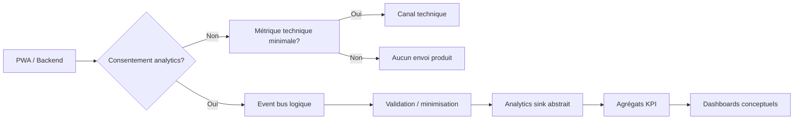
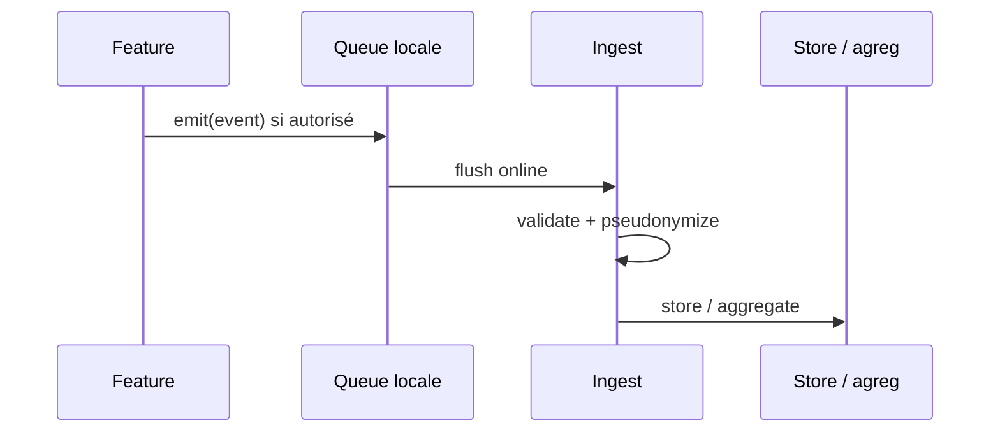
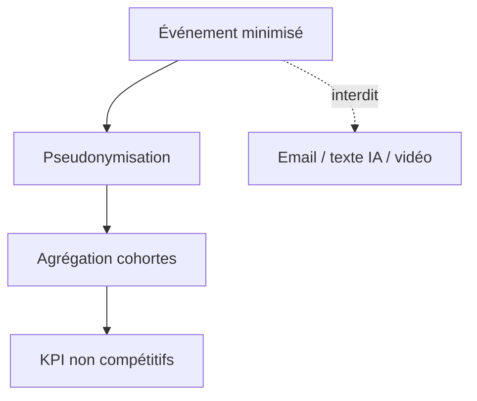
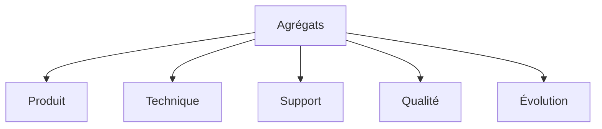
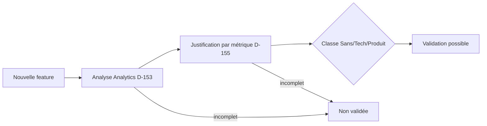

# 19 — Analytics

## 1. Statut

| Champ | Valeur |
| --- | --- |
| Nom du document | Analytics |
| Numéro | 19 |
| Fichier | `docs/19_ANALYTICS.md` |
| Version | 1.2 |
| Statut | EN REVUE |
| Dernière mise à jour | 5 août 2026 — sync post–Design Freeze (Analytics Produit = V1) |
| Auteur | Projet Tai-Chi-AI-Coach |
| Documents dépendants | `docs/00_MASTER_PLAN.md`, `docs/01_VISION.md`, `docs/02_PRODUCT_SCOPE.md`, `docs/03_PERSONAS.md`, `docs/04_USER_JOURNEYS.md`, `docs/05_FEATURES.md`, `docs/06_BUSINESS_MODEL.md`, `docs/08_TAI_CHI_CURRICULUM.md`, `docs/09_AI_COACH.md`, `docs/10_COMPUTER_VISION.md`, `docs/11_VIRTUAL_HUMANS.md`, `docs/12_UX_UI.md`, `docs/13_TECH_ARCHITECTURE.md`, `docs/14_DATA_MODEL.md`, `docs/15_API_ARCHITECTURE.md`, `docs/16_AUTH_SECURITY.md`, `docs/17_PRIVACY_RGPD.md`, `docs/18_PWA_OFFLINE.md` |
| Documents utilisant celui-ci | `docs/20_TEST_STRATEGY.md`, `docs/21_DEPLOYMENT.md`, `docs/22_ROADMAP.md`, `docs/24_DEVELOPER_HANDOVER.md` |
| Décisions concernées | D-143 à D-155 |
| Dernière revue | Non effectuée |
| Autorise le code | Non |

> **NOTE**
>
> Architecture Analytics de conception uniquement. Aucun SDK, fournisseur, dashboard réel ni code.
> Aligné Privacy by Default (`17`), Offline First (`18`), non-compétition (`12`, D-083 / D-097).
> Les Analytics produit non essentiels sont **opt-in** (`consent_type = analytics`) et appartiennent à **V1** (`14`, `15`, `17`, `18`).
> Le **MVP** ne conserve que les métriques techniques minimales, les erreurs critiques et la supervision indispensable.
> Document conforme à `docs/99_DOCUMENTATION_STANDARD.md`.

## 2. Objectifs

Définir pour **Tai-Chi AI Coach** :

- pourquoi et quoi mesurer ;
- la taxonomie des événements ;
- les KPI produit et techniques (non compétitifs) ;
- les interdits de collecte ;
- les tableaux de bord conceptuels ;
- la gouvernance Analytics et des nouvelles fonctionnalités.

## 3. Périmètre

### 3.1 Inclus

Philosophie, principes, catégories, événements, KPI, consentement, rétention (orientations / ouvertes), anonymisation, qualité, gouvernance, classifications.

### 3.2 Exclus

| Sujet | Destination |
| --- | --- |
| Fournisseur / SDK / alerting infra | `21_DEPLOYMENT.md` |
| Tests de pipelines analytics | `20_TEST_STRATEGY.md` |
| Politique publique cookies | Communication juridique |
| Code, dashboards réels | Post–Design Freeze |

## 4. Philosophie Analytics

Les Analytics servent uniquement à :

1. améliorer le produit ;
2. améliorer l’expérience utilisateur ;
3. améliorer les performances et la fiabilité ;
4. comprendre les usages agrégés.

Ils ne servent **jamais** à :

- profiler abusivement ;
- classer ou comparer les utilisateurs entre eux ;
- médicaliser ou diagnostiquer ;
- alimenter de la publicité comportementale ;
- reconstituer le contenu sensible (IA, CV).

## 5. Principes

| Principe | Application |
| --- | --- |
| Privacy by Design | Collecte conçue minimale dès le départ |
| Data Minimization | Propriétés strictement nécessaires (D-146) |
| Consentement | Opt-in pour Analytics produit non essentiels (D-144) |
| Pseudonymisation | Identifiants techniques non nominatifs (D-145) |
| Transparence | Finalités compréhensibles |
| Proportionnalité | Pas de télémétrie « au cas où » |
| Séparation | Produit ≠ Technique ≠ Sécurité (D-150) |
| Non-compétition | KPI agrégés uniquement (D-149) |

## 6. Catégories de données Analytics

| Catégorie | Contenu | Consentement typique |
| --- | --- | --- |
| Événements fonctionnels | Ouverture, séances, progression… | Analytics produit (opt-in) |
| Métriques produit | Agrégats d’usage | Opt-in / agrégats |
| Métriques techniques | Perf, stabilité, sync | Intérêt légitime strict ou opt-in selon granularité |
| Erreurs | Codes, module, retryable | Technique (minimisé) |
| Performances | Timings, tailles cache | Technique |
| Synchronisation | États, conflits (méta) | Technique / produit selon détail |
| Sécurité | Auth failures agrégés, anomalies | Intérêt légitime sécurité — **hors** sink marketing |

Les journaux de sécurité (`16`) restent distincts du sink Analytics produit.

## 7. Données interdites

**Ne jamais collecter** dans Analytics :

- vidéo / image / audio bruts ;
- frames CV ;
- contenu complet des conversations IA ;
- prompts système ;
- mots de passe, tokens, secrets, clés API ;
- données d’un autre utilisateur ;
- coordonnées GPS précises non nécessaires ;
- « données médicales » ou champs de diagnostic ;
- scores / rangs compétitifs ;
- texte libre de bilan utilisateur (sauf agrégat anonymisé futur explicitement décidé) ;
- chemins de stockage internes ;
- PII directe (email, nom) dans le payload événementiel.

## 8. Taxonomie des événements

Préfixe conceptuel : `domain.action` + `eventClass`.

| Classe | Domaine |
| --- | --- |
| `USER` | Compte, profil, prefs (méta) |
| `SESSION` | Cycle app / navigation |
| `PRACTICE` | Séances, étapes, reprise |
| `PROGRESS` | Progression, acquis |
| `RECO` | Recommandations |
| `AI` | Coach (méta seulement) |
| `CV` | Vision (méta seulement) |
| `VH` | Guides virtuels (méta) |
| `MEDIA` | Téléchargements packs |
| `OFFLINE` | Sync, conflits, queue |
| `PERFORMANCE` | Timings, mémoire |
| `SYSTEM` | Install PWA, update SW |
| `ERROR` | Erreurs classées |
| `SECURITY` | Signaux sécu agrégés (canal séparé possible) |

Chaque événement : `eventId`, `eventClass`, `name`, `timestamp`, `appVersion`, `apiVersion?`, `pseudoUserId?` / `deviceInstallId`, `sessionId` technique, `props` minimales, `consentScope`.

## 9. Événements fonctionnels (catalogue conceptuel)

**Règle de version (alignée `14` / `15` / `17` / `18`) :**

- **Analytics Produit** (événements fonctionnels : onboarding, pratique, progression, recommandations, préférences produit, etc.) → **V1** (consentement `analytics`, entité / flush / EventSink V1+).
- **MVP** → uniquement métriques **techniques** minimales, **erreurs critiques** et **supervision** indispensable (pas de catalogue produit).

| Événement | Classe | Props autorisées (ex.) | Version |
| --- | --- | --- | --- |
| `app.opened` | SESSION | cold/warm start | MVP (technique / supervision) |
| `onboarding.step_completed` | USER | stepId, onboardingVersion | V1 |
| `onboarding.completed` / `skipped` | USER | — | V1 |
| `practice.started` | PRACTICE | templateId, contentVersion, launchSource, offline | V1 |
| `practice.step_completed` | PRACTICE | stepType (enum) | V1 |
| `practice.paused` / `resumed` | PRACTICE | — | V1 |
| `practice.completed` | PRACTICE | planned/actual duration buckets | V1 |
| `practice.abandoned` | PRACTICE | reasonCode enum limité | V1 |
| `progress.updated` | PROGRESS | phaseKey | V1 |
| `recommendation.shown` / `accepted` / `dismissed` | RECO | originType | V1 |
| `preferences.updated` | USER | keys touchées (noms), pas valeurs sensibles | V1 |
| `media.pack_downloaded` / `deleted` | MEDIA | packId, sizeBucket | V2 |
| `sync.pull` / `push` / `conflict` / `error` | OFFLINE | counts, conflictType | V1 |
| `pwa.installed` / `updated` | SYSTEM | — | MVP (technique / supervision) |
| `offline.mode_entered` / `network_restored` | OFFLINE | — | MVP (technique / supervision) |

Pas d’identifiants nominatifs dans `props`.

## 10. IA Coach (méta uniquement)

Autorisé : `ai.interaction_opened`, `ai.message_sent` (compteur), `ai.job_completed` / `failed`, latence bucketisée, `errorCode`, `providerLogicalId` (abstrait), `promptVersion` (id), quota hit.

**Interdit :** texte user/assistant, prompts système, contexte pédagogique verbatim.

## 11. Computer Vision (méta uniquement)

Autorisé : `cv.session_started` / `stopped`, `cv.completed` / `failed`, durée bucketisée, `engineVersion`, `confidenceBand` (ex. low/med/high) **sans** posture détaillée, consentement présent (bool).

**Interdit :** vidéo, images, keypoints bruts, « diagnostic », scores médicaux.

## 12. Virtual Humans

Autorisé : `vh.guide_enabled` / `disabled`, `guideKey`, `guideVersion`, `locale`, fréquence d’apparition (compteurs).

**Interdit :** contenu privé utilisateur, enregistrements vocaux user.

## 13. Performance

Indicateurs : TTI/démarrage shell, temps chargement séance, erreurs JS agrégées, estimation mémoire (si dispo), durée sync, hit-rate cache (agrégat), type réseau grossier (wifi/cell/offline) sans fingerprint excessif.

## 14. PWA

`pwa.installed`, `pwa.update_ready` / `applied`, `sw.activate`, entrée/sortie offline, échecs cache (codes).

## 15. Offline

Compteurs : sync success/fail, conflits par type, retries queue, ops abandoned, taille queue bucketisée — **sans** payload des mutations.

## 16. Erreurs

| Famille | Exemples |
| --- | --- |
| Fonctionnelles | `INVALID_STATE`, abandon |
| Techniques | 5xx, timeout |
| Réseau | offline, 503 provider |
| IA | quota, provider_unavailable |
| CV | consent missing, engine fail |
| Sécurité | auth_fail agrégé (pas d’email) |

Props : `error.code`, `retryable`, `module` — message utilisateur non requis dans analytics.

## 17. KPI Produit (non compétitifs)

KPI **Produit** → **V1+** (pas de tableau de bord produit au MVP). Agrégats uniquement (D-149) :

- rétention J1 / J7 / J30 (cohortes anonymisées) ;
- fréquence de pratique (distributions) ;
- taux de complétion / abandon de séances ;
- progression moyenne par phase (agrégat) ;
- adoption onboarding ;
- taux d’acceptation des recommandations ;
- usage packs offline (V2) ;
- opt-in analytics / notifs / IA (taux).

**Interdit :** leaderboards, ranking users, scores sociaux.

## 18. KPI Techniques

Disponibilité API, p95 latences par famille, taux erreur, succès sync, efficacité cache, volume événements, consommation quota IA/CV (agrégats), taux échec jobs export.

## 19. Tableaux de bord conceptuels

| Dashboard | Contenu |
| --- | --- |
| Produit | Rétention, pratique, complétion, features |
| Technique | Latences, erreurs, sync, cache |
| Support | Pics d’erreurs, abandons, consent withdraw |
| Qualité | Doublons, événements invalides, couverture |
| Évolution | Tendances versions app, adoption V1/V2 modules |

Aucun dashboard réel ici.

## 20. Consentement Analytics

| Règle | Détail |
| --- | --- |
| Type | `analytics` indépendant (`17`, D-144) |
| Défaut | Refus / non collecté pour produit non essentiel |
| Retrait | Immédiat pour **nouveaux** événements produit |
| Technique minimale | Peut subsister si strictement nécessaire stabilité — documenter et minimiser ; sinon tout sous consentement |
| Journalisation | Preuve Consent (`14`) |
| Offline | File locale d’événements **uniquement si** consentement accordé ; sinon ne pas bufferiser le produit |

## 21. Rétention

| Famille | Durée | Statut |
| --- | --- | --- |
| Événements bruts produit | Courte puis agrégation | **Ouverte** |
| Agrégats KPI | Plus longue | **Ouverte** |
| Erreurs techniques | **Ouverte** | |
| Méta IA/CV | Courte | **Ouverte** |
| Security signals | Selon `16`/`17` | **Ouverte** |

Durées définitives avant production du traitement.

## 22. Export

| Exportable (droit accès / portabilité) | Non exportable tel quel |
| --- | --- |
| Préférences consentement analytics | Clés internes pseudoUserId seules |
| Historique pratique métier (`14`) | Payloads analytics bruts d’infra |
| — | Agrégats multi-utilisateurs |

Les événements analytics bruts ne constituent pas le véhicule principal de portabilité ; le métier (`F-030`) prime.

## 23. Anonymisation

| Niveau | Usage |
| --- | --- |
| Pseudonymisation | `pseudoUserId` rotatif / hash salé côté serveur |
| Agrégation | KPI cohortes |
| Anonymisation | Jeux statistiques sans réidentification raisonnable |

Pas de ré-identification volontaire.

## 24. Qualité des données

Validation schéma événement ; rejet props inconnues ; dédup par `eventId` / idempotency ; horodatage cohérent ; monitoring taux drop ; documentation des breaking changes de schéma événements.

## 25. Gouvernance Analytics

| Rôle | Responsabilité |
| --- | --- |
| Owner produit | KPI & finalités |
| Owner tech | Pipeline, qualité, perf |
| Privacy | Alignement `17`, consentement |
| Revue | Périodique (fréquence **ouverte**) |
| Documentation | Catalogue événements vivant post–Design Freeze (runtime futur) |

## 26. Gouvernance des nouvelles fonctionnalités

**D-153.**

Toute nouvelle fonctionnalité doit documenter avant validation :

1. événements créés (ou « aucun ») ;
2. KPI impactés ;
3. données collectées (props) ;
4. consentement requis ;
5. base légale si applicable ;
6. durée de conservation (ou « ouverte + responsable ») ;
7. classification d’événements (taxonomie §8) ;
8. impacts Offline (`18` / D-142) ;
9. impacts RGPD (`17` / D-131) ;
10. classe Analytics de la fonctionnalité (§27).

Sans cette analyse : **non validable**.

## 26 bis. Justification des Analytics

**D-155.**

Toute nouvelle métrique ou tout nouvel événement Analytics devra obligatoirement documenter :

- son objectif ;
- le KPI auquel il contribue ;
- la catégorie de données concernée ;
- la nécessité de sa collecte ;
- la possibilité d’une collecte moins intrusive ;
- le consentement requis, le cas échéant ;
- la durée de conservation ;
- les impacts RGPD.

Aucune nouvelle métrique ne pourra être validée sans cette justification.

Cette règle s’applique à toutes les évolutions futures du produit (V1, V2 et suivantes).

Elle complète D-153 (niveau fonctionnalité) en imposant une justification **par métrique / événement**.

## 27. Classification Analytics des fonctionnalités

Chaque fonctionnalité est classée :

### 27.1 Sans Analytics

Aucun événement collecté.

### 27.2 Analytics Techniques

Uniquement performance, erreurs, stabilité (minimisé).

### 27.3 Analytics Produit

Événements fonctionnels pseudonymisés sous consentement le cas échéant. **Version produit : V1** (pas au MVP).

La classe doit figurer dans la doc de la fonctionnalité (lien D-142 Offline + D-153).

## 28. Diagrammes

### 28.1 Flux Analytics

### 28.2 Pipeline événement

### 28.3 Anonymisation

### 28.4 Tableaux de bord

### 28.5 Gouvernance

## 29. Décisions figées par ce document

| ID | Décision |
| --- | --- |
| D-143 | Analytics éthiques au service de l’amélioration produit uniquement |
| D-144 | Consentement Analytics indépendant (opt-in produit non essentiel) |
| D-145 | Pseudonymisation des identifiants analytics |
| D-146 | Événements et propriétés minimisés |
| D-147 | Aucun contenu de conversation IA complet dans Analytics |
| D-148 | Aucune vidéo/image CV dans Analytics |
| D-149 | KPI non compétitifs (pas de comparaison entre utilisateurs) |
| D-150 | Séparation Analytics Technique / Produit / Sécurité |
| D-151 | Gouvernance Analytics (owners, revue, catalogue) |
| D-152 | Qualité des données événementielles (validation, dédup) |
| D-153 | Gouvernance Analytics obligatoire pour toute nouvelle fonctionnalité |
| D-154 | Classification Analytics des fonctionnalités : Sans / Techniques / Produit |
| D-155 | Justification obligatoire de chaque nouvelle métrique / événement |

## 30. Décisions ouvertes

| Sujet | Document |
| --- | --- |
| Fournisseur / SDK | `21_DEPLOYMENT.md` |
| Dashboards et alerting réels | `21` + ops |
| Durées de rétention définitives | `17` + juridique |
| Frontière exacte « technique minimale » sans consentement | DPIA / juridique |
| Sampling / budgets volume | Implémentation |
| Tests pipeline | `20_TEST_STRATEGY.md` |
| Tagging Analytics de tout le catalogue F-xxx | Handover / Features |

## 31. Critères de validation

1. Philosophie non abusive et non compétitive.
2. Interdits de collecte explicites.
3. Taxonomie et catalogue cœur définis.
4. IA/CV/VH limités aux métadonnées.
5. Consentement aligné `17`.
6. Gouvernances D-153 / D-154 / D-155 explicites.
7. Cohérence Offline `18` (pas de buffer produit sans consentement).
8. Aucun SDK/fournisseur/code.
9. Décisions D-143–D-155 dans `DECISIONS.md`.

Statut actuel : **EN REVUE**.

## 32. Conclusion

Les Analytics de Tai-Chi AI Coach mesurent l’usage et la santé technique avec minimisation, consentement et pseudonymisation — jamais le contenu sensible ni la compétition entre pratiquants. Toute feature future doit déclarer sa classe Analytics ; toute nouvelle métrique doit être justifiée (D-155) avant validation.

Prochaine étape : `docs/20_TEST_STRATEGY.md`.

## 33. Références

- `docs/14_DATA_MODEL.md` … `docs/18_PWA_OFFLINE.md`
- `docs/02_PRODUCT_SCOPE.md`, `docs/12_UX_UI.md`
- `docs/98_DEVELOPMENT_DOCUMENTATION_STANDARD.md`, `docs/99_DOCUMENTATION_STANDARD.md`
- `DECISIONS.md`, `CHANGELOG.md`

---

## Pied de document

| Champ | Valeur |
| --- | --- |
| Version | 1.2 |
| Statut | EN REVUE |
| Prochain document | `docs/20_TEST_STRATEGY.md` |
| Fin officielle | Oui |

*Fin officielle du document.*
