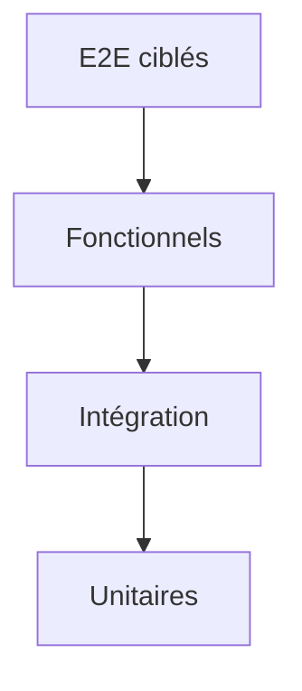
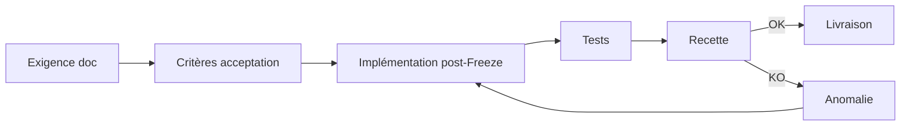
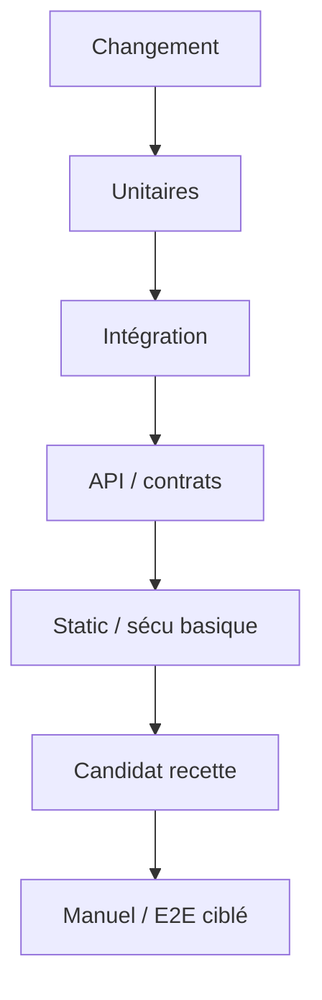
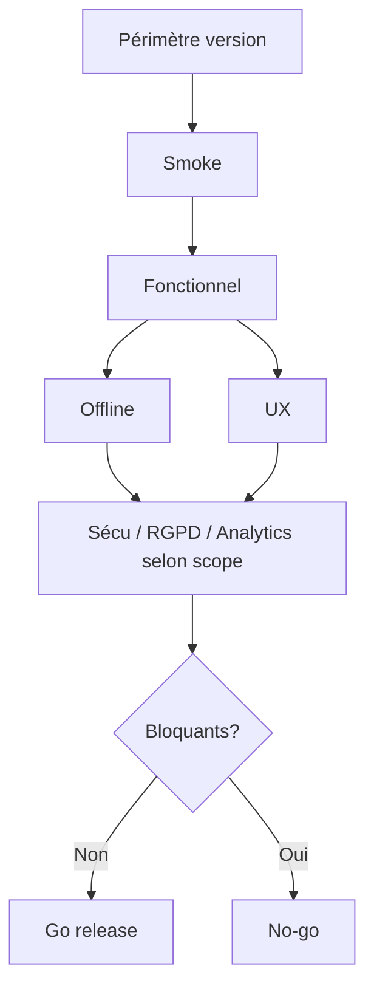
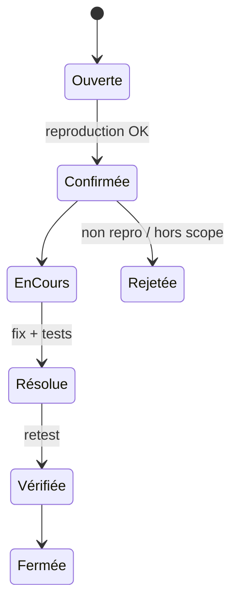

# 20 — Test Strategy

## 1. Statut

| Champ | Valeur |
| --- | --- |
| Nom du document | Test Strategy |
| Numéro | 20 |
| Fichier | `docs/20_TEST_STRATEGY.md` |
| Version | 1.0 |
| Statut | EN REVUE |
| Dernière mise à jour | 5 août 2026 |
| Auteur | Projet Tai-Chi-AI-Coach |
| Documents dépendants | `docs/00_MASTER_PLAN.md`, `docs/01_VISION.md`, `docs/02_PRODUCT_SCOPE.md`, `docs/03_PERSONAS.md`, `docs/04_USER_JOURNEYS.md`, `docs/05_FEATURES.md`, `docs/06_BUSINESS_MODEL.md`, `docs/08_TAI_CHI_CURRICULUM.md`, `docs/09_AI_COACH.md`, `docs/10_COMPUTER_VISION.md`, `docs/11_VIRTUAL_HUMANS.md`, `docs/12_UX_UI.md`, `docs/13_TECH_ARCHITECTURE.md`, `docs/14_DATA_MODEL.md`, `docs/15_API_ARCHITECTURE.md`, `docs/16_AUTH_SECURITY.md`, `docs/17_PRIVACY_RGPD.md`, `docs/18_PWA_OFFLINE.md`, `docs/19_ANALYTICS.md` |
| Documents utilisant celui-ci | `docs/21_DEPLOYMENT.md`, `docs/22_ROADMAP.md`, `docs/23_RELEASE_PLAN.md`, `docs/24_DEVELOPER_HANDOVER.md`, `docs/25_DESIGN_FREEZE.md` |
| Décisions concernées | D-156 à D-168 |
| Dernière revue | Non effectuée |
| Autorise le code | Non |

> **NOTE**
>
> Stratégie de validation de conception. Aucun code de test, script CI, ni rapport d’exécution.
> Alignée JavaChrist Development Framework : tests avant validation de livraison ; runtime après implémentation.
> Document conforme à `docs/99_DOCUMENTATION_STANDARD.md`.

## 2. Objectifs

Définir pour **Tai-Chi AI Coach** :

- les niveaux de tests et responsabilités ;
- les campagnes de recette et seuils qualité ;
- les tests obligatoires (UX œil MDP, Offline, sécu, RGPD, Analytics…) ;
- les critères d’acceptation MVP / V1 / V2 ;
- la gouvernance des tests pour toute nouvelle fonctionnalité.

## 3. Périmètre

### 3.1 Inclus

Philosophie qualité, pyramide, domaines de test, jeux de données, anomalies, critères d’acceptation, gouvernances.

### 3.2 Exclus

| Sujet | Destination |
| --- | --- |
| Outils CI/CD, runners | `21_DEPLOYMENT.md` |
| Calendrier releases | `22` / `23` |
| Cas de test runtime détaillés | `docs/runtime/` post–Design Freeze |
| Code / scripts / GitHub Actions | Interdit ici |

## 4. Philosophie qualité

1. **Qualité dès la conception** (D-156) — exigences testables dans les docs.
2. **Validation continue** (D-157) — chaque incrément prouve ce qu’il affirme.
3. **Automatisation pertinente** — unitaires/intégration/API en priorité ; E2E ciblés.
4. **Reproductibilité** — préconditions, données, environnement documentés.
5. **Traçabilité** — exigence ↔ test ↔ anomalie ↔ décision.
6. **Calme produit** — les tests UX vérifient l’absence de stress / compétition / alertes natives.
7. **Aucune livraison sans recette** (D-165) pour le périmètre concerné.

## 5. Pyramide des tests

| Niveau | Objectif | Exemples |
| --- | --- | --- |
| Unitaire | Règles métier pures, validateurs, mappers | Transitions `PracticeSession`, prefs defaults |
| Intégration | Modules + stores + adaptateurs mockés | Sync queue ↔ API contract mocks |
| Fonctionnel | Cas d’usage métier | Onboarding → première séance |
| E2E | Parcours critiques navigateur/PWA | Reprise offline → sync |
| Exploratoire | Découverte de risques UX/edge | Personas P-001 / P-005 |

Volumes relatifs : beaucoup d’unitaires, moins d’E2E (coût / flakiness).

## 6. Responsabilités

| Rôle | Responsabilité |
| --- | --- |
| Conception | Critères d’acceptation dans Features / docs |
| Développement | Tests unitaires/intégration + preuves |
| Qualité / Recette | Campagnes fonctionnelles, UX, non-régression |
| Sécurité / Privacy | Campagnes `16` / `17` |
| Produit | Priorisation risques, acceptation métier |

## 7. Tests fonctionnels

Couverture obligatoire du cœur (D-158) selon version :

| Domaine | Points de contrôle |
| --- | --- |
| Onboarding `F-033` | Étapes, skip options V2, non-blocage refus Mei/caméra |
| Curriculum | Lecture phases/séances, versions publiées |
| Séances `F-013` | Start/pause/resume/complete/abandon, structure |
| Progression `F-010` | Agrégats personnels, pas de classement |
| Recommandations | Origine explicable, accept/dismiss |
| Préférences `F-028` | Patch partiel, défauts |
| Premium | Pas d’interruption de séance ; entitlements serveur |
| Bibliothèque / favoris | Selon version |
| Reprise `F-032` | Après interruption / offline |

## 8. Tests UX

Référentiel `12` + D-113 :

| Thème | Vérifications |
| --- | --- |
| Parcours | Une action principale ; ≤ 3 niveaux nav |
| Accessibilité | Voir §16 |
| Responsive | Mobile first, tablette, desktop |
| Lisibilité | Contraste, tailles |
| Animations | Discrètes ; `prefers-reduced-motion` |
| États | Loading / empty / error / offline / success |
| **Bouton œil MDP** | Présent sur **tous** les champs password ; toggle show/hide ; clavier ; lecteurs d’écran (noms accessibles) ; **valeur conservée** au basculement ; pas d’`alert` natif |
| Premium | Aucun écran intrusif en séance |
| Ton | Messages calmes, non techniques |

## 9. Tests IA Coach (V1+)

| Zone | Attendu |
| --- | --- |
| Disponibilité | Succès / dégradation |
| Latence | Budgets **ouverts** à figer ; timeouts gérés |
| Erreurs | Codes `PROVIDER_*`, messages UX |
| Offline | Non bloquant pour la séance (D-139) |
| Limites | Pas de diagnostic médical ; garde-fous `09` |
| AuthZ | Consentement + entitlement |

## 10. Tests Computer Vision (V2)

| Zone | Attendu |
| --- | --- |
| Activation | Volontaire uniquement |
| Consentement | Grant obligatoire ; withdraw immédiat |
| Arrêt | Immédiat, séance continue |
| Stockage | Aucune vidéo/image brute persistée par défaut |
| Erreurs / confiance | Pas de feedback affirmatif sans confidence |
| Non-médical | Aucun libellé de diagnostic |

## 11. Tests Virtual Humans (V2)

Activation/désactivation ; locale ; médias pack ; absence de guide n’empêche pas la pratique ; transparence nature virtuelle ; pas de rôle médecin/maître.

## 12. Tests Offline First (D-159)

| Scénario | Attendu |
| --- | --- |
| Perte réseau en séance | Continuité locale ; pas de perte |
| Reprise | `F-032` + états sync |
| Sync V1 | Pull/push idempotent |
| Conflits | Règles `18` ; consent withdraw prioritaire |
| Packs `F-026` | Download / invalidate / delete |
| Cache / SW | Stratégies par type de ressource |
| IndexedDB | Persistance pratique ; pas de secrets en clair |
| Quotas | Alerte ; priorité données pratique |
| Classification | Feature Offline/Hybrid/Online respectée (D-142) |

## 13. Tests API

Référentiel `15` :

- contrats succès/erreur structurés ;
- validation entrées / champs inconnus ;
- idempotence (même clé / payload différent → 409) ;
- pagination curseur bornée ;
- concurrence optimiste 409/412 ;
- isolation propriétaire (anti-IDOR) ;
- jobs 202 + statuts ;
- pas de secrets / prompts système / médias base64.

## 14. Tests sécurité (D-161)

Référentiel `16` :

- auth (création, login, reset, logout, révocation) ;
- sessions (expiration, multi-appareils) ;
- AuthZ propriétaire / entitlements serveur ;
- rate limit auth ;
- XSS/CSRF/clickjacking (orientations) ;
- pas d’énumération abusive d’identités ;
- logs sans secrets.

## 15. Tests RGPD (D-162)

Référentiel `17` :

- consentements indépendants grant/deny/withdraw ;
- export `F-030` (async, URL temporaire) ;
- suppression / anonymisation ;
- pas d’activation implicite caméra/IA/analytics ;
- registre traitements impacté (revue doc) ;
- D-131 respecté pour nouvelles features PII.

## 16. Tests Analytics (D-163)

Référentiel `19` :

- pas d’événements produit sans consentement ;
- props minimales ; absence données interdites (IA texte, vidéo CV, MDP) ;
- pseudonymisation ;
- événements attendus du catalogue cœur ;
- justification D-155 pour toute nouvelle métrique ;
- classe Sans / Tech / Produit (D-154).

## 17. Performance

Objectifs conceptuels (seuils chiffrés **ouverts** avant prod) :

| Indicateur | Intention |
| --- | --- |
| Démarrage shell | Rapide perçu |
| Chargement séance | Fluide |
| Mémoire | Stable en séance longue |
| Batterie | Pas de sync agressive |
| Réseau | Batch sync ; médias adaptés |

Mesures en labo + appareils représentatifs personas.

## 18. Compatibilité

| Cible | Attendu |
| --- | --- |
| Mobile | Prioritaire (D-084) |
| Tablette / desktop | Parcours cœur |
| Navigateurs | Principaux evergreen (liste exacte **ouverte** → `21`) |
| PWA install | Install / update / offline |

## 19. Accessibilité (D-160)

Validations WCAG (niveau cible **ouvert**, intention AA) :

- navigation clavier complète ;
- contraste ;
- focus visible ;
- lecteurs d’écran (labels, états œil MDP) ;
- zoom / taille texte ;
- cibles tactiles.

Personas sensibles : P-001, P-005.

## 20. Jeux de données

| Jeu | Usage |
| --- | --- |
| Minimal | Smoke MVP |
| Réaliste | Personas / parcours |
| Volumineux | Perf listes, sync, packs |
| Limites | Conflits, quotas plein, session abandonnée, consent withdraw mid-flow |
| Multilingue | i18n basique |

Pas de données personnelles réelles de production dans les jeux de test.

## 21. Critères d'acceptation par version (D-164)

### 21.1 MVP

- Parcours découverte → prudence → séance → reprise sans perte locale.
- Offline cœur OK ; pas d’IA/CV/VH obligatoires.
- UX calme ; accessibilité de base ; œil MDP si auth locale/compte précoce.
- Aucun classement ; pas d’alerte native.
- Recette fonctionnelle + offline + UX passées (D-165).

### 21.2 V1

- Compte, sync `F-027`, IA non bloquante, notifications opt-in, export/suppression.
- API idempotence + AuthZ ; RGPD consentements ; Analytics opt-in vérifiés.
- Critères MVP toujours verts (non-régression).

### 21.3 V2

- CV volontaire + pas de brut ; VH optionnels ; packs `F-026` ; Premium non intrusif.
- Non-régression MVP/V1.

### 21.4 Avant Design Freeze (conception)

- Docs `00`–`25` cohérents ; décisions listées ; stratégie de test (`20`) définie ; pas de code applicatif.

### 21.5 Avant mise en production

- Recette du périmètre version ; sécu/RGPD/offline/analytics selon features livrées ; anomalies bloquantes fermées ; runtime docs à jour post-implémentation (`98`).

## 22. Gestion des anomalies

| Champ | Valeurs |
| --- | --- |
| Sévérité | S1 bloquant · S2 majeur · S3 mineur · S4 cosmétique |
| Priorité | P1–P4 produit |
| Classification | Fonctionnel, UX, perf, sécu, RGPD, offline, analytics, contenu |
| Reproduction | Steps + données + env + version |
| Correction | Fix + test de non-régression + re-validation |

S1/S2 empêche livraison du périmètre concerné.

## 23. Campagnes de recette

| Campagne | Quand |
| --- | --- |
| Smoke | Chaque build candidat |
| Fonctionnelle version | Avant release MVP/V1/V2 |
| Offline | À chaque changement sync/cache/pratique |
| Sécu / RGPD | Avant prod + après changements auth/consent |
| Accessibilité | Avant prod + changements UI majeurs |
| Non-régression | Après correctifs S1/S2 |
| Exploratoire personas | Avant freeze UX majeur |

## 24. Diagrammes

### 24.1 Pyramide des tests

### 24.2 Cycle de validation

### 24.3 Pipeline qualité (conceptuel)

### 24.4 Stratégie de recette

### 24.5 Workflow anomalie

## 25. Décisions figées par ce document

| ID | Décision |
| --- | --- |
| D-156 | Qualité dès la conception |
| D-157 | Validation continue des incréments |
| D-158 | Couverture fonctionnelle obligatoire du cœur versionné |
| D-159 | Offline First testé systématiquement sur le périmètre concerné |
| D-160 | Accessibilité validée (dont Password Visibility Standard) |
| D-161 | Sécurité validée avant livraison des capacités auth/API sensibles |
| D-162 | RGPD validé (consentements, export, suppression) |
| D-163 | Analytics vérifiés (consentement, interdits, minimisation) |
| D-164 | Critères d’acceptation unifiés MVP / V1 / V2 |
| D-165 | Aucune livraison sans recette du périmètre concerné |
| D-166 | Gouvernance des tests obligatoire pour toute nouvelle fonctionnalité |
| D-167 | Classification des tests : obligatoires / recommandés / optionnels |
| D-168 | Justification obligatoire des campagnes de test |

## 26. Gouvernance des nouveaux tests

**D-166.**

Toute nouvelle fonctionnalité doit documenter avant validation / implémentation :

1. tests unitaires attendus ;
2. tests fonctionnels ;
3. tests UX ;
4. tests Offline éventuels (lien D-142) ;
5. tests sécurité ;
6. tests RGPD (lien D-131) ;
7. tests Analytics (lien D-153 / D-155) ;
8. critères d’acceptation ;
9. classification §27.

Sans stratégie de test documentée : **fonctionnalité non validable**.

## 27. Classification des tests

Chaque exigence de test liée à une fonctionnalité est classée :

### 27.1 Tests obligatoires

Validation indispensable (ex. reprise séance, isolation propriétaire, consentement CV, œil MDP).

### 27.2 Tests recommandés

Fortement conseillés (ex. perf exploratoire, i18n étendu).

### 27.3 Tests optionnels

Selon contexte (ex. navigateur rare, device très ancien).

Classification documentée **avant** implémentation (D-167).

## 28. Justification des tests

**D-168.**

Toute nouvelle campagne de test précise :

- son objectif ;
- les exigences couvertes ;
- les risques maîtrisés ;
- les documents de référence ;
- les critères de réussite.

Aucun test conservé sans utilité clairement identifiée.

## 29. Décisions ouvertes

| Sujet | Document |
| --- | --- |
| Outils automatisation / CI | `21_DEPLOYMENT.md` |
| Navigateurs matrix exacte | `21` |
| Seuils perf chiffrés | Mesures + release |
| Niveau WCAG formel (A/AA) | Produit + a11y audit |
| Plateformes device farm | `21` / `22` |
| Charge / chaos sync | Roadmap tech |

## 30. Critères de validation du document

1. Pyramide et domaines alignés `12`–`19`.
2. Œil MDP, Offline, Sécu, RGPD, Analytics couverts.
3. Critères MVP/V1/V2 et pre-Freeze / pre-prod.
4. Gouvernances D-166–D-168 explicites.
5. Aucun code/CI.
6. Décisions D-156–D-168 dans `DECISIONS.md`.

Statut actuel : **EN REVUE**.

## 31. Conclusion

La stratégie de test de Tai-Chi AI Coach impose une validation continue du cœur pédagogique, de l’Offline First, de l’accessibilité (dont le bouton œil), de la sécurité, du RGPD et des Analytics — sans jamais livrer sans recette du périmètre. Toute feature future doit arriver avec sa stratégie de tests classée et justifiée.

Prochaine étape : `docs/21_DEPLOYMENT.md`.

## 32. Références

- `docs/12_UX_UI.md` … `docs/19_ANALYTICS.md`
- `docs/00_MASTER_PLAN.md`, `docs/98_DEVELOPMENT_DOCUMENTATION_STANDARD.md`, `docs/99_DOCUMENTATION_STANDARD.md`
- `DECISIONS.md`, `CHANGELOG.md`

---

## Pied de document

| Champ | Valeur |
| --- | --- |
| Version | 1.0 |
| Statut | EN REVUE |
| Prochain document | `docs/21_DEPLOYMENT.md` |
| Fin officielle | Oui |

*Fin officielle du document.*
