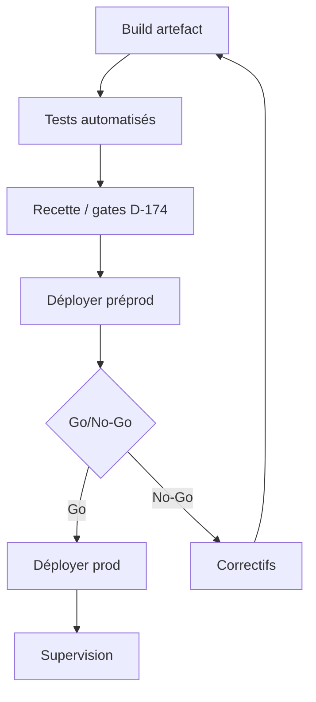
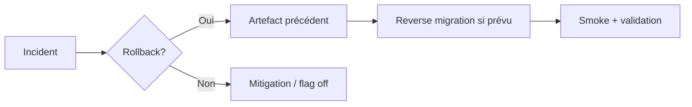
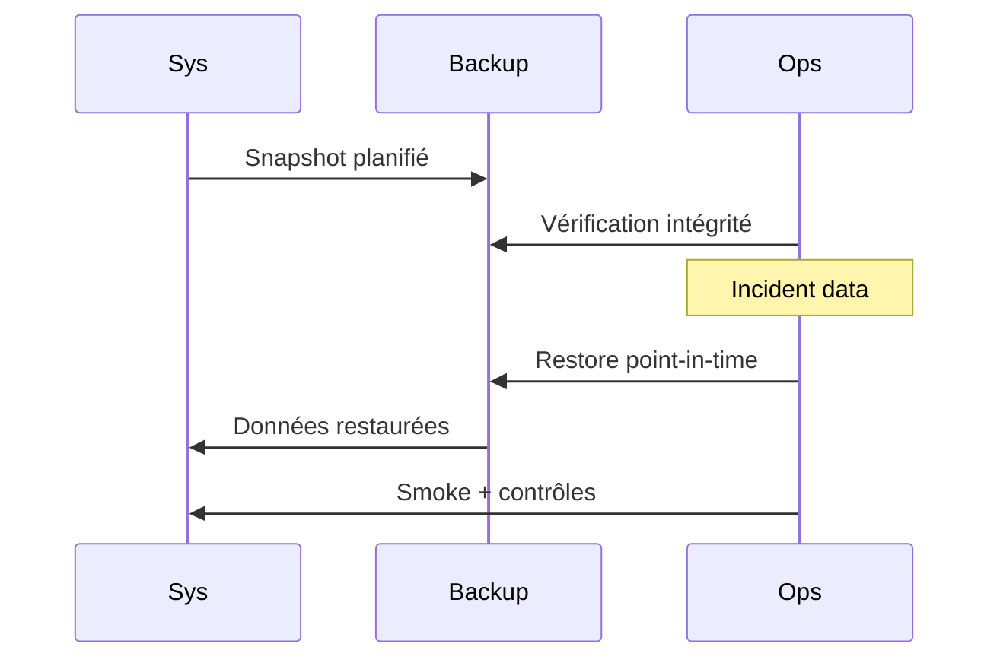
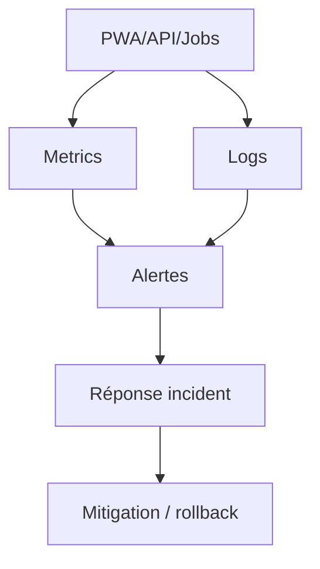

# 21 — Deployment

## 1. Statut

| Champ | Valeur |
| --- | --- |
| Nom du document | Deployment |
| Numéro | 21 |
| Fichier | `docs/21_DEPLOYMENT.md` |
| Version | 1.0 |
| Statut | EN REVUE |
| Dernière mise à jour | 5 août 2026 |
| Auteur | Projet Tai-Chi-AI-Coach |
| Documents dépendants | `docs/00_MASTER_PLAN.md`, `docs/01_VISION.md`, `docs/02_PRODUCT_SCOPE.md`, `docs/03_PERSONAS.md`, `docs/04_USER_JOURNEYS.md`, `docs/05_FEATURES.md`, `docs/06_BUSINESS_MODEL.md`, `docs/08_TAI_CHI_CURRICULUM.md`, `docs/09_AI_COACH.md`, `docs/10_COMPUTER_VISION.md`, `docs/11_VIRTUAL_HUMANS.md`, `docs/12_UX_UI.md`, `docs/13_TECH_ARCHITECTURE.md`, `docs/14_DATA_MODEL.md`, `docs/15_API_ARCHITECTURE.md`, `docs/16_AUTH_SECURITY.md`, `docs/17_PRIVACY_RGPD.md`, `docs/18_PWA_OFFLINE.md`, `docs/19_ANALYTICS.md`, `docs/20_TEST_STRATEGY.md` |
| Documents utilisant celui-ci | `docs/22_ROADMAP.md`, `docs/23_RELEASE_PLAN.md`, `docs/24_DEVELOPER_HANDOVER.md`, `docs/25_DESIGN_FREEZE.md` |
| Décisions concernées | D-169 à D-181 |
| Dernière revue | Non effectuée |
| Autorise le code | Non |

> **NOTE**
>
> Architecture de déploiement conceptuelle. Aucun script, Dockerfile, Kubernetes, GitHub Actions, Terraform, secret réel ni commande système.
> Fournisseurs d’hébergement / CI / monitoring **non figés**.
> Document conforme à `docs/99_DOCUMENTATION_STANDARD.md`.

## 2. Objectifs

Définir pour **Tai-Chi AI Coach** :

- l’architecture des environnements ;
- la stratégie de déploiement et de publication PWA ;
- secrets, config, sauvegardes, rollback ;
- supervision et continuité de service ;
- la gouvernance des mises en production.

## 3. Périmètre

### 3.1 Inclus

Environnements, config, secrets (principes), PWA/backend/DB/stockage conceptuels, backups, DR, monitoring, incidents, validation pre-prod, classifications.

### 3.2 Exclus

| Sujet | Destination |
| --- | --- |
| Calendrier produit / releases | `22_ROADMAP.md`, `23_RELEASE_PLAN.md` |
| Choix hébergeur / outils CI | Ouvert + runtime post–Freeze |
| Runbooks opératoires détaillés | Ops post–prod |
| Code / IaC / pipelines | Interdit ici |

## 4. Philosophie de déploiement

1. **Fiabilité** — privilégier la stabilité du cœur pédagogique.
2. **Simplicité** — moins de pièces mobiles tant que possible.
3. **Automatisation pertinente** — reproductible, pas de magie manuelle opaque.
4. **Reproductibilité** — même artefact, configs par env (D-176).
5. **Traçabilité** — qui déploie quoi, quand, pourquoi (D-181).
6. **Continuité de service** — dégradations contrôlées (IA, sync) plutôt que panne globale (D-177).
7. **Offline First** — une panne réseau/serveur ne doit pas effacer la pratique locale (`18`).

## 5. Environnements (D-169)

| Env | Objectif | Données | Accès | Restrictions |
| --- | --- | --- | --- | --- |
| **Développement** | Travail local | Fictives / minimales | Dev | Pas de PII réelle ; secrets dev distincts |
| **Test** | CI + recette auto/manuelle | Jeux `20` | CI + QA | Isolation ; reset fréquent |
| **Préproduction** | Validation release | Anonymisées / synthétiques réalistes | Équipe restreinte | Miroir prod sans secrets prod |
| **Production** | Usagers réels | Données réelles | Moindre privilège ops | Changements justifiés (D-181) |

Chaque env : configuration propre, secrets propres, URLs propres, flags de features contrôlés.

## 6. Configuration (D-170)

| Type | Exemples conceptuels |
| --- | --- |
| Variables d’environnement | URLs API, niveaux de log, flags version |
| Paramètres applicatifs | Limites pagination, budgets jobs |
| Contenu | Versions curriculum publiées (store contenu) |

Règles :

- **aucune** valeur sensible en dur dans le dépôt ;
- validation au démarrage (fail-fast si config invalide) ;
- séparation stricte par environnement ;
- inventaire des clés de config documenté (runtime futur).

## 7. Secrets (D-171)

| Aspect | Règle |
| --- | --- |
| Stockage | Coffre à secrets / mécanisme plateforme — jamais git |
| Accès | Least privilege ; audit des accès |
| Rotation | Planifiée + après suspicion de fuite |
| Portée | Un secret ≠ multi-env |
| Documentation | Noms / finalités uniquement — **jamais** la valeur |

Couvre : clés IdP, clés fournisseurs IA/notif, credentials DB, signing media URLs, webhooks futurs.

## 8. Publication PWA (D-178)

| Étape | Règle |
| --- | --- |
| Build | Artefact versionné (app + assets) |
| Publication | Origine HTTPS de confiance |
| Versionnement | Version app visible ; caches SW versionnés (`18`) |
| Activation | Progressive / au prochain lancement calme — éviter swap agressif en pleine séance |
| Utilisateur | Message discret de mise à jour ; continuité offline des données locales |
| Compatibilité | API backend rétrocompatible dans la majeure (`15`) |

## 9. Déploiement Backend

| Aspect | Orientation |
| --- | --- |
| Publication | Artefact immuable + config env |
| Disponibilité | Déploiement sans downtime préféré (stratégie ouverte) |
| Versions API | `/api/v1` ; coexistence contrôlée si majeure |
| Migrations | Avant ou avec app selon compatibilité expand/contract |
| Health | Checks readiness/liveness conceptuels |

Infra concrète non figée.

## 10. Base de données

| Aspect | Orientation |
| --- | --- |
| Moteur | PostgreSQL cible (`13`) |
| Migrations | Versionnées, revue, applicables/rollbackables conceptuellement |
| Compatibilité | Expand/contract : colonnes additives d’abord |
| Sauvegardes | Voir §12 |
| Restauration | Testée périodiquement (fréquence **ouverte**) |

Aucun SQL ici.

## 11. Stockage objet

Médias catalogue, exports temporaires, éventuels packs `F-026` :

- buckets/préfixes par env ;
- accès signés / privés (`15`) ;
- sauvegarde / réplication selon criticité ;
- fournisseur **non nommé**.

## 12. Sauvegardes (D-172)

| Élément | Fréquence (orientation) | Intégrité | Restauration |
| --- | --- | --- | --- |
| PostgreSQL | Régulière + avant migrations majeures | Checksums / vérif | Exercices de restore |
| Stockage objet | Selon criticité | Inventaire | Restore sélectif |
| Secrets config | Export chiffré ops (hors git) | Accès restreint | Procédure ops |
| Logs | Rétention `17` | — | Non = backup métier |

Fréquences exactes **ouvertes** avant prod. Vérification périodique obligatoire conceptuellement.

## 13. Reprise après incident

| Incident | Orientation |
| --- | --- |
| Panne serveur API | Failover / redéploiement ; PWA offline cœur |
| Panne réseau usager | Mode offline `18` |
| Corruption données | Restore backup + analyse |
| Fuite secret | Rotation + revue accès (`16`/`17`) |
| Fournisseur IA down | Dégradation (séance continue) |

Reprise utilisateur : messages calmes ; pas de perte de pratique locale non sync.

## 14. Rollback (D-173)

| Condition | Exemples |
| --- | --- |
| Déclencheurs | Erreurs critiques, régression sécu/RGPD, sync cassée, data loss |
| Procédure | Redeploy artefact précédent + reverse migration si prévu |
| Validation | Smoke + checks sécu/données |
| Limite | Si migration destructive non reversible → restore backup (classer **Critique**) |

Tout déploiement majeur/critique documente son plan de rollback (D-181).

## 15. Monitoring (D-175)

| Domaine | Signaux |
| --- | --- |
| Disponibilité | Health API, erreur rate |
| Performances | Latences p95 familles API |
| Sync | Échecs push/pull, conflits anormaux |
| Jobs | Export, suppression, IA |
| Dépendances | Statut adaptateurs (logique) |
| PWA | (agrégats) erreurs client si consentement tech |

Plateforme de monitoring **non choisie**. Alerting : seuils ouverts.

## 16. Journalisation

Alignée `16` / `17` / `19` :

- logs structurés + `requestId` ;
- rotation / archivage ;
- pas de secrets, MDP, tokens, vidéos, dialogues IA complets ;
- accès restreint ; rétention **ouverte**.

## 17. Disponibilité

Objectifs conceptuels (pas de SLA contractuel figé) :

- cœur pédagogique et lecture curriculum : haute priorité ;
- IA / CV / push : dégradables ;
- sync : rattrapage après incident ;
- maintenance planifiée : fenêtre communiquée, impact minimal.

## 18. PWA et versions (lien `18`)

- Mises à jour SW non disruptives en séance ;
- invalidation caches versionnés ;
- incompatibilité API : bloquer features online avec message calme ; offline local préservé ;
- reprise après update : rehydratation IDB intacte.

## 19. Dépendances externes

| Domaine | Contrat abstrait | Fallback | Remplacement |
| --- | --- | --- | --- |
| IA | AI Adapter | Message indisponible | Swap adaptateur |
| Notifications | Push/Email Adapter | In-app seul | Swap |
| Stockage objet | Media Storage | Cache local existant | Swap |
| Analytics | Sink | No-op si down | Swap |
| Paiement futur | Billing Adapter | Mode gratuit / entitlements figés | Swap |
| IdP / Auth | Auth provider | — | Choix ouvert `16` |
| CV | Vision Adapter | Séance sans CV | Swap / off |

## 20. Validation avant déploiement (D-174)

Prérequis (périmètre concerné) — alignés `20` :

1. tests / recette OK (D-165) ;
2. anomalies S1/S2 fermées ;
3. sécurité (si impact) ;
4. RGPD (si impact traitements) ;
5. Analytics (si nouveaux events — D-155) ;
6. Offline (si impact sync/cache — D-142) ;
7. config/secrets prêts par env ;
8. plan rollback documenté (majeure/critique) ;
9. justification déploiement (D-181).

## 21. Déploiement progressif

Stratégies possibles (non exclusives) :

| Stratégie | Usage |
| --- | --- |
| Complet | Petites corrections mineures |
| Progressif / canary conceptuel | Majeures |
| Feature flags | Activation contrôlée modules V1/V2 |
| Arrêt / freeze deploy | Incident en cours |
| Rollback | Voir §14 |

Technologie de progressive delivery **non imposée**.

## 22. Gestion des incidents

1. Détection (monitoring / signalement).  
2. Qualification (sévérité, impact users/data).  
3. Priorisation.  
4. Mitigation / résolution.  
5. Communication interne (et usagers si besoin — ton calme).  
6. Clôture + post-mortem léger + actions.

Lien violations données → playbook `17`.

## 23. Diagrammes

### 23.1 Environnements

### 23.2 Pipeline de déploiement (conceptuel)

### 23.3 Rollback

### 23.4 Sauvegarde / restauration

### 23.5 Supervision

## 24. Décisions figées par ce document

| ID | Décision |
| --- | --- |
| D-169 | Séparation stricte des environnements Dev / Test / Préprod / Prod |
| D-170 | Configuration externalisée par environnement |
| D-171 | Gestion sécurisée des secrets (stockage, accès, rotation) |
| D-172 | Sauvegardes obligatoires avec vérification de restauration |
| D-173 | Rollback documenté pour les déploiements à risque |
| D-174 | Validation qualité / sécu / RGPD / Offline / Analytics avant production |
| D-175 | Supervision permanente des services critiques |
| D-176 | Déploiement reproductible par artefacts versionnés |
| D-177 | Continuité de service avec dégradation contrôlée |
| D-178 | Publication PWA maîtrisée (versionnement, activation non disruptive) |
| D-179 | Gouvernance documentaire obligatoire des nouveaux déploiements |
| D-180 | Classification des changements : Mineure / Majeure / Critique |
| D-181 | Justification documentée de chaque mise en production |

## 25. Gouvernance des nouveaux déploiements

**D-179.**

Toute évolution future destinée à être déployée documente :

1. environnements concernés ;
2. dépendances ;
3. impacts sauvegardes ;
4. impacts sécurité ;
5. impacts RGPD ;
6. impacts Offline ;
7. impacts Analytics ;
8. stratégie de rollback ;
9. critères de validation ;
10. classification §26.

Aucun déploiement n’est considéré comme prêt sans cette analyse.

## 26. Classification des changements

**D-180.**

| Classe | Définition | Exigences |
| --- | --- | --- |
| **Mineure** | Correction / amélioration sans impact structurel | Smoke + justification légère |
| **Majeure** | Évolution notable | Recette complète du périmètre + plan rollback |
| **Critique** | Impact sécu, données, auth, sync ou confidentialité | Gates D-174 complets + rollback/restore + revue privacy/sécu |

Classe documentée **avant** validation du déploiement.

## 27. Justification des déploiements

**D-181.**

Chaque mise en production documente :

- objectif ;
- documents / composants impactés ;
- risques identifiés ;
- mesures de réduction ;
- critères de succès ;
- critères de rollback.

Sans justification : **déploiement non validable**.

## 28. Décisions ouvertes

| Sujet | Document / acteur |
| --- | --- |
| Hébergement / région / CDN | Choix futur + DPA `17` |
| CI/CD concret | Implémentation |
| Outils monitoring / backup | Ops |
| Fournisseur stockage objet | Ouvert |
| Fréquences backup / RPO-RTO | Avant prod |
| Feature flag system | Implémentation |
| Calendrier releases | `22` / `23` |

## 29. Critères de validation du document

1. Environnements et secrets clairement séparés.
2. PWA / backend / data / stockage couverts sans IaC.
3. Backup, rollback, monitoring, incidents définis.
4. Gates pre-prod alignés `20`.
5. Gouvernances D-179–D-181 explicites.
6. Aucun secret/script/cloud config.
7. Décisions D-169–D-181 dans `DECISIONS.md`.

Statut actuel : **EN REVUE**.

## 30. Conclusion

Le déploiement de Tai-Chi AI Coach repose sur des environnements strictement séparés, des secrets maîtrisés, des artefacts reproductibles, une publication PWA non disruptive, des sauvegardes vérifiées et un rollback documenté — avec dégradation contrôlée plutôt que panne globale du cœur pédagogique.

Prochaine étape : `docs/22_ROADMAP.md`.

## 31. Références

- `docs/13_TECH_ARCHITECTURE.md` … `docs/20_TEST_STRATEGY.md`
- `docs/98_DEVELOPMENT_DOCUMENTATION_STANDARD.md`, `docs/99_DOCUMENTATION_STANDARD.md`
- `DECISIONS.md`, `CHANGELOG.md`

---

## Pied de document

| Champ | Valeur |
| --- | --- |
| Version | 1.0 |
| Statut | EN REVUE |
| Prochain document | `docs/22_ROADMAP.md` |
| Fin officielle | Oui |

*Fin officielle du document.*
