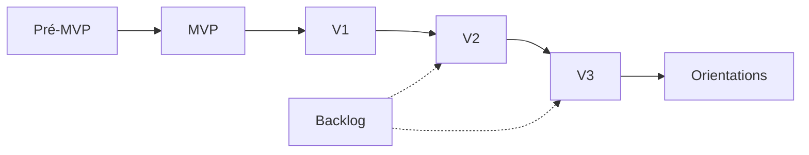
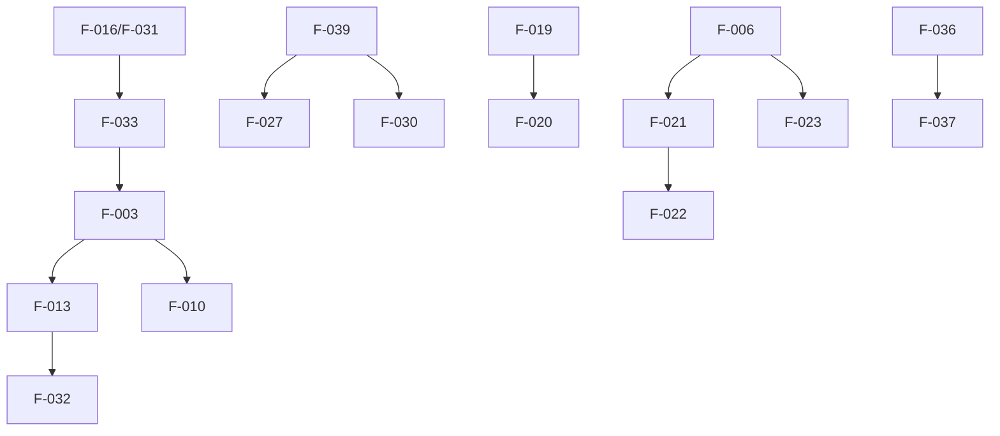
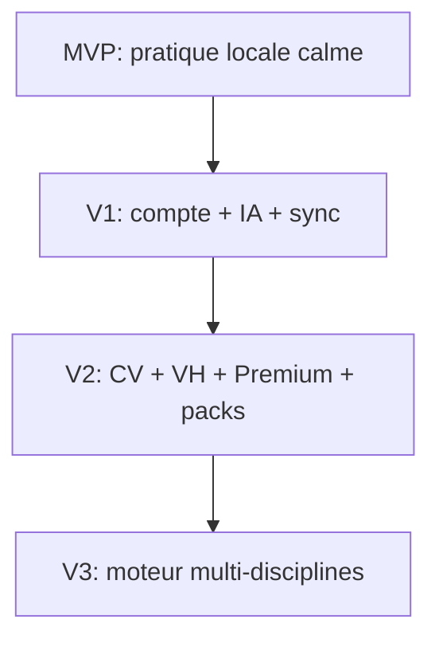
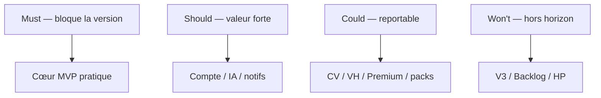

# 22 — Roadmap

## 1. Statut

| Champ | Valeur |
| --- | --- |
| Nom du document | Roadmap |
| Numéro | 22 |
| Fichier | `docs/22_ROADMAP.md` |
| Version | 1.0 |
| Statut | EN REVUE |
| Dernière mise à jour | 5 août 2026 |
| Auteur | Projet Tai-Chi-AI-Coach |
| Documents dépendants | `docs/00_MASTER_PLAN.md`, `docs/01_VISION.md`, `docs/02_PRODUCT_SCOPE.md`, `docs/03_PERSONAS.md`, `docs/04_USER_JOURNEYS.md`, `docs/05_FEATURES.md`, `docs/06_BUSINESS_MODEL.md`, `docs/08_TAI_CHI_CURRICULUM.md`, `docs/09_AI_COACH.md`, `docs/10_COMPUTER_VISION.md`, `docs/11_VIRTUAL_HUMANS.md`, `docs/12_UX_UI.md`, `docs/13_TECH_ARCHITECTURE.md`, `docs/14_DATA_MODEL.md`, `docs/15_API_ARCHITECTURE.md`, `docs/16_AUTH_SECURITY.md`, `docs/17_PRIVACY_RGPD.md`, `docs/18_PWA_OFFLINE.md`, `docs/19_ANALYTICS.md`, `docs/20_TEST_STRATEGY.md`, `docs/21_DEPLOYMENT.md` |
| Documents utilisant celui-ci | `docs/23_RELEASE_PLAN.md`, `docs/24_DEVELOPER_HANDOVER.md`, `docs/25_DESIGN_FREEZE.md` |
| Décisions concernées | D-182 à D-192 |
| Dernière revue | Non effectuée |
| Autorise le code | Non |

> **NOTE**
>
> Feuille de route **stratégique**, non calendaire. Aucune date, sprint, charge ni planning d’équipe.
> Source de vérité des versions / `F-xxx` : `docs/02_PRODUCT_SCOPE.md`.
> Document conforme à `docs/99_DOCUMENTATION_STANDARD.md`.

## 2. Objectifs

Définir :

- la vision long terme et les principes de planification ;
- le contenu des versions Pré-MVP → V3 et le backlog ;
- priorités, dépendances, jalons qualité et critères de passage ;
- la gouvernance d’affectation des nouvelles fonctionnalités.

## 3. Vision long terme

Tai-Chi AI Coach devient un compagnon d’apprentissage du Tai Chi (puis éventuellement d’autres pratiques douces) :

- accessible, calme, progressif, non médical, non compétitif ;
- Offline First sur le cœur pédagogique ;
- enrichi progressivement par IA (V1), vision et guides virtuels optionnels (V2) ;
- extensible vers un moteur de coaching multi-disciplines (V3) **sans** sacrifier la simplicité du débutant.

La réussite se mesure à la régularité bienveillante et à la compréhension, pas à l’intensité technique.

## 4. Principes de planification

| Principe | Application |
| --- | --- |
| Incrémental (D-182) | Chaque version apporte de la valeur testable |
| Priorisation métier (D-184) | Personas cœur P-001 / P-002 / P-003 d’abord |
| Réduction des risques | Caméra / VH / Premium après preuves MVP/V1 |
| Valeur utilisateur | Pratique réelle > spectacle tech |
| Stabilité architecture | Respect `13`–`21` et gouvernances croisées |
| Roadmap évolutive (D-189) | Révisable via décisions + changelog, pas en silence |

## 5. Correspondance priorités

Référentiel Scope `P0`–`P3` + MoSCoW roadmap :

| Scope | MoSCoW | Sens |
| --- | --- | --- |
| P0 | Must Have | Bloquant pour la version |
| P1 | Should Have | Fortement attendu |
| P2 | Could Have | Utile / reportable dans la version |
| P3 / Backlog | Won't Have (cette version) | Hors version courante ou exploratoire |

## 6. Pré-MVP

### 6.1 Objectifs

Rendre tout test utilisateur ultérieur responsable et lisible.

### 6.2 Fonctionnalités

| ID | Nom | Priorité |
| --- | --- | --- |
| F-016 | Conseils de sécurité | Must |
| F-031 | Avertissements avant pratique | Must |

Conditions associées : contenus minimaux validés, formulation non médicale, parcours débutant compréhensible.

### 6.3 Critères de fin

Gates Pré-MVP → MVP de `02` §17.

## 7. MVP

### 7.1 Objectifs

Tester intérêt, régularité, compréhension, simplicité — expérience courte et calme.

### 7.2 Fonctionnalités retenues

| ID | Nom | MoSCoW | Justification courte |
| --- | --- | --- | --- |
| F-001 | Présentation du Tai Chi | Must | Cadre & confiance |
| F-003 | Parcours débutant | Must | Progression réelle |
| F-004 | Bibliothèque des mouvements | Must | Révision |
| F-005 | Explication détaillée | Must | Pédagogie |
| F-006 | Vidéo pédagogique | Must | Démonstration |
| F-008 | Programme quotidien | Must | Régularité |
| F-010 | Progression | Must | Sentiment d’avancée (non compétitif) |
| F-013 | Séances guidées | Must | Pratique |
| F-016 / F-031 | Prudence | Must | Héritage Pré-MVP |
| F-028 | Paramètres | Must | Maîtrise |
| F-029 | Accessibilité | Must | Personas sensibles |
| F-032 | Reprise de séance | Must | Anti-abandon Offline |
| F-033 | Première découverte | Must | Activation |
| F-002 | Découverte des styles | Should | Orientation |
| F-007 | Images de référence | Should | Aide visuelle |
| F-009 | Historique | Should | Continuité |
| F-014 | Respiration | Should | Calme |
| F-015 | Relaxation | Should | Clôture |

### 7.3 Limites MVP

Pas d’IA conversationnelle, caméra, VH, Premium riche, sync multi-appareils, téléchargement hors ligne riche.

Architecture : Offline First local ; PWA ; pas de runtime tant que Design Freeze non signé.

### 7.4 Critères de validation MVP

- Must livrés et recettés (`20`) ;
- parcours P-001/P-002/P-003 praticables ;
- aucune dérive médicale / compétitive ;
- gates MVP → V1 de `02` observés (mesure d’intérêt **méthode ouverte**).

## 8. Version 1

### 8.1 Objectif

Enrichir accompagnement et continuité après validation MVP.

### 8.2 Fonctionnalités

| ID | Nom | MoSCoW | Dépendances clés |
| --- | --- | --- | --- |
| F-039 | Compte utilisateur | Should | — |
| F-019 | Assistant IA | Should | F-003, F-005, F-016 + consentement |
| F-020 | Q/R | Should | F-019 |
| F-017 | Notifications | Should | F-008, F-028 + opt-in |
| F-011 | Favoris | Should | F-004 |
| F-012 | Recherche | Could | F-004 |
| F-018 | Objectifs personnels | Could | F-010 |
| F-024 | Statistiques | Could | F-009, F-010 — non compétitives |
| F-027 | Sync multi-appareils | Could | F-039, F-009, F-010 |
| F-030 | Export | Could | F-039 |

### 8.3 Améliorations transverses

Auth (`16`), sync Offline Hybrid (`18`), Analytics opt-in (`19`), export/suppression RGPD (`17`).

### 8.4 Critères de fin V1

Must/Should stabilisés avec garde-fous IA ; pas d’introduction caméra ; gates V1 → V2 prêts à évaluer.

## 9. Version 2

### 9.1 Objectif

Fonctions importantes non indispensables au démarrage, sous réserve de preuves MVP/V1 et readiness privacy.

### 9.2 Fonctionnalités

| ID | Nom | MoSCoW | Notes |
| --- | --- | --- | --- |
| F-021 | Analyse caméra | Could→Should si engagée | Consentement ; Online/Hybrid contrôlé |
| F-022 | Corrections posture | Could | Dépend F-021 ; jamais médicale |
| F-023 | Professeurs virtuels / Mei | Could | Optionnel, non bloquant |
| F-025 | Contenus Premium | Could | Freemium éthique ; non intrusif |
| F-026 | Téléchargement hors ligne | Could | Packs riches |
| F-034 | Personnalisation avancée | Could | Dépend parcours/IA/progress |
| F-035 | Programmes adaptés | Could | Dépend F-003, F-013 |

### 9.3 Critères de fin V2

CV/VH optionnels validés sécu/RGPD/tests ; Premium sans payer le cœur ; Offline packs stables.

## 10. Versions futures (V3+)

| ID | Orientation | MoSCoW long terme |
| --- | --- | --- |
| F-036 | Moteur de coaching réutilisable | Won't (avant V3) |
| F-037 | Plusieurs disciplines douces | Won't (avant V3) |

Autres orientations possibles (non engagées) : nouvelles langues, nouveaux guides, nouveaux programmes, nouveaux appareils, IA locale éventuelle — chacune soumise aux gouvernances D-131 / D-142 / D-153 / D-166 / D-179 / D-191.

## 11. Backlog stratégique (D-186)

| ID | Nom | Statut |
| --- | --- | --- |
| F-038 | Méditation guidée élargie | Backlog |
| F-040 | Partenariats écoles / professeurs | Backlog |
| F-041 | Mode hors ligne partiel minimal | Backlog |

Post–Design Freeze : nouvelles idées → backlog ou V2/V3 via décision documentée.

## 12. Fonctionnalités reportées / hors MVP (D-190)

Volontairement hors MVP (déjà en V1/V2/V3/Backlog/HP) :

- IA `F-019`/`F-020` → V1 ;
- Sync `F-027`, compte `F-039` → V1 ;
- Caméra / corrections / VH / Premium / packs → V2 ;
- Multi-disciplines → V3 ;
- HP-001…HP-014 → hors périmètre durable.

Tout déplacement de Must (P0) exige mise à jour Scope + Décisions + Changelog.

## 13. Dépendances (D-185)

Voir matrice `02` §15. Chaînes critiques :

```text
Pré-MVP (F-016, F-031)
  → MVP (F-033 → F-003 → F-013 → F-032 / F-010)
    → V1 (F-039 → F-027 / F-030 ; F-019 → F-020)
      → V2 (F-021 → F-022 ; F-023 ; F-026 ; F-025)
        → V3 (F-036 → F-037)
```

Dépendances transverses : privacy readiness avant CV ; sync avant multi-appareils ; contenus avant packs.

## 14. Priorisation (synthèse MoSCoW par horizon)

| Horizon | Must | Should | Could | Won't (cet horizon) |
| --- | --- | --- | --- | --- |
| Pré-MVP | F-016, F-031 | — | — | Tout le reste |
| MVP | Cœur pédagogique listé §7 | F-002,007,009,014,015 | — | IA, CV, VH, sync, Premium |
| V1 | — (cœur MVP déjà Must) | Compte, IA, notifs, favoris | Recherche, objectifs, stats, sync, export | CV, VH |
| V2 | — | Selon engagement produit | CV, VH, Premium, packs, F-034/035 | F-036/037 |
| V3 | — | — | F-036/037 si arbitrés | Hors périmètre HP |

## 15. Critères de passage entre versions (D-188)

Reprendre et opérationnaliser `02` §17 + `20`/`21` :

| Transition | Conditions clés |
| --- | --- |
| Pré-MVP → MVP | Prudence + contenus + parcours prêts |
| MVP → V1 | Signaux d’intérêt/compréhension/régularité ; pas de dérive ; priorités V1 sans caméra |
| V1 → V2 | IA stabilisée ; privacy caméra ready ; justification VH/packs/Premium |
| V2 → V3 | Cœur Tai Chi stable ; multi-disciplines sans complexité ; archi séparable ; arbitrage éco/pédagogique |

Jalons qualité (D-187) : recette version (`20`), gates deploy (`21`), docs impactées à jour.

## 16. Risques

| Type | Risque | Mitigation roadmap |
| --- | --- | --- |
| Produit | Sur-scope tech précoce | MVP léger (D-183) |
| Technique | Sync/CV/IA fragiles | Versions étagées ; Offline First |
| UX | Complexité / stress | Principes `12` ; pas de compétition |
| Réglementaire | Caméra / IA / analytics | `17` ; consentements ; D-131 |
| Économique | Premium trop tôt | Freemium éthique V2 |

Détail risques projet : `RISKS.md` / Master Plan (à enrichir hors ce doc si besoin).

## 17. Indicateurs de réussite par version

| Version | Indicateurs (agrégés, non compétitifs) |
| --- | --- |
| MVP | Activation, complétion 1ʳᵉ séance, reprise, compréhension qualitative |
| V1 | Opt-in notifs/IA, sync success, rétention douce, export utilisé |
| V2 | Opt-in caméra, usage VH optionnel, packs téléchargés, conversion Premium éthique |
| V3 | Réutilisation moteur / 2ᵉ discipline sans baisse de clarté débutant |

Méthodes de mesure précises : ouvertes (`19`).

## 18. Diagrammes

### 18.1 Roadmap globale



### 18.2 Dépendances critiques



### 18.3 Évolution des versions



### 18.4 Jalons qualité


### 18.5 Priorisation MoSCoW



> **NOTE**
>
> Diagramme de synthèse. La priorité officielle reste les tables `F-xxx` / MoSCoW et `docs/02_PRODUCT_SCOPE.md`.

## 19. Décisions figées par ce document

| ID | Décision |
| --- | --- |
| D-182 | Roadmap incrémentale Pré-MVP → MVP → V1 → V2 → V3 |
| D-183 | MVP minimal centré pratique / prudence / reprise |
| D-184 | Priorisation par valeur utilisateur (MoSCoW aligné P0–P3) |
| D-185 | Dépendances fonctionnelles explicites (réf. Scope) |
| D-186 | Backlog stratégique documenté (F-038, F-040, F-041) |
| D-187 | Jalons qualité (recette + gates) avant changement de version |
| D-188 | Validation formelle avant passage de version |
| D-189 | Roadmap évolutive uniquement via décisions tracées |
| D-190 | Fonctionnalités reportées / hors version explicitement documentées |
| D-191 | Gouvernance de planification des nouvelles fonctionnalités |
| D-192 | Classification obligatoire MVP / V1 / V2 / V3 / Backlog (+ justification) |

## 20. Gouvernance des nouvelles fonctionnalités

**D-191 / D-192.**

Toute nouvelle fonctionnalité doit documenter **avant** planification :

1. version cible (MVP, V1, V2, V3 ou Backlog) — **aucune sans affectation** ;
2. priorité MoSCoW (Must / Should / Could / Won't) ;
3. justification de la priorité ;
4. documents impactés ;
5. dépendances ;
6. critères d’acceptation ;
7. critères de fin de développement ;
8. impacts sur : UX, Architecture, Data Model, API, Sécurité, RGPD, Offline First, Analytics, Tests, Déploiement ;
9. classifications Offline (`18`) et Analytics (`19`) le cas échéant.

Sans cette analyse : **non planifiable**.

## 21. Classification des évolutions

Chaque évolution ∈ { Pré-MVP, MVP, V1, V2, V3, Backlog, Hors périmètre }.

Hors périmètre reste interdit sauf décision bloquante contraire.

## 22. Justification des évolutions

Chaque évolution documente : problème résolu, valeur utilisateur, risques, bénéfices attendus, critères de succès.

## 23. Décisions ouvertes

| Sujet | Document |
| --- | --- |
| Ordre de release fin / cut lines | `23_RELEASE_PLAN.md` |
| Packs de livraison techniques | `24_DEVELOPER_HANDOVER.md` |
| Gel des décisions | `25_DESIGN_FREEZE.md` |
| Méthode exacte de mesure d’intérêt MVP | Produit + `19` |
| Engagement réel sur items Could V1/V2 | Arbitrages post-MVP |

## 24. Critères de validation du document

1. Alignement strict catalogue `02`.
2. Pas de dates ni charges.
3. MoSCoW + dépendances + gates explicites.
4. Hors périmètre et reports documentés.
5. Gouvernance D-191/D-192.
6. Décisions D-182–D-192 dans `DECISIONS.md`.

Statut actuel : **EN REVUE**.

## 25. Conclusion

La roadmap de Tai-Chi AI Coach progresse par preuves : un MVP de pratique calme, une V1 d’accompagnement et de continuité, une V2 d’enrichissements optionnels (CV, Mei, Premium, packs), une V3 d’extension disciplinaire — sans jamais normaliser la compétition ni le médical.

Prochaine étape : `docs/23_RELEASE_PLAN.md`.

## 26. Références

- `docs/02_PRODUCT_SCOPE.md`, `docs/05_FEATURES.md`, `docs/00_MASTER_PLAN.md`
- `docs/12` … `docs/21`
- `docs/98_DEVELOPMENT_DOCUMENTATION_STANDARD.md`, `docs/99_DOCUMENTATION_STANDARD.md`
- `DECISIONS.md`, `CHANGELOG.md`

---

## Pied de document

| Champ | Valeur |
| --- | --- |
| Version | 1.0 |
| Statut | EN REVUE |
| Prochain document | `docs/23_RELEASE_PLAN.md` |
| Fin officielle | Oui |

*Fin officielle du document.*
