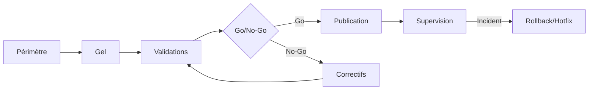
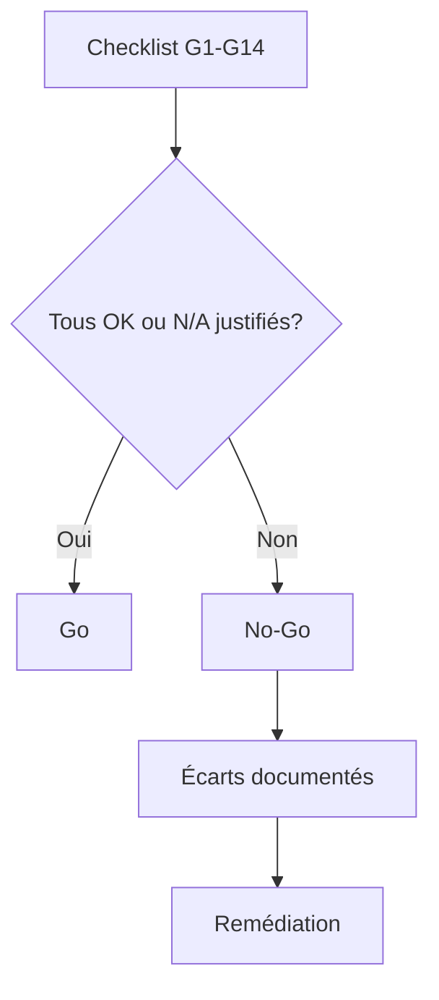
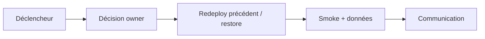
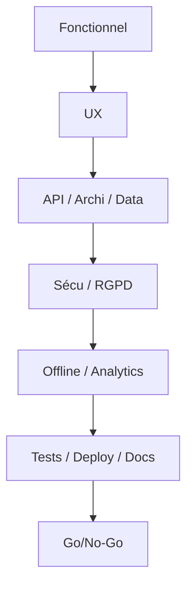
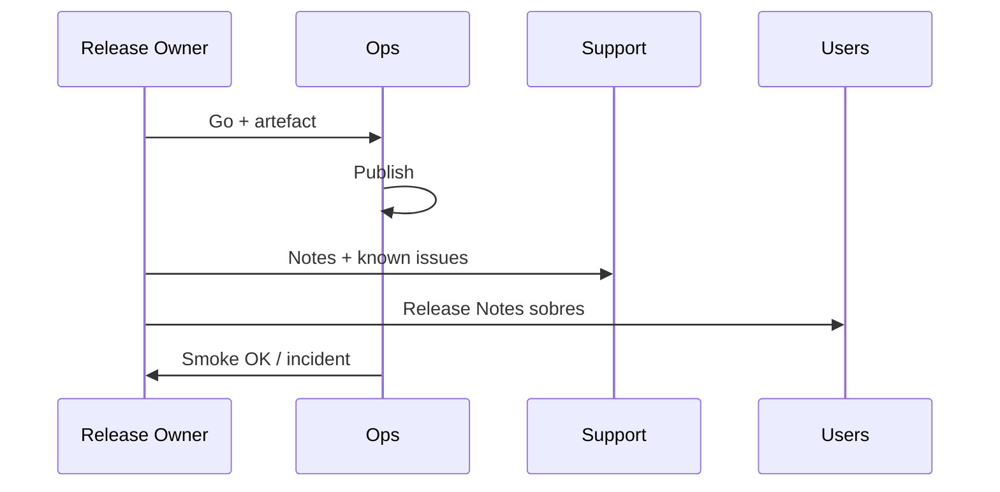

# 23 — Release Plan

## 1. Statut

| Champ | Valeur |
| --- | --- |
| Nom du document | Release Plan |
| Numéro | 23 |
| Fichier | `docs/23_RELEASE_PLAN.md` |
| Version | 1.0 |
| Statut | EN REVUE |
| Dernière mise à jour | 5 août 2026 |
| Auteur | Projet Tai-Chi-AI-Coach |
| Documents dépendants | `docs/00_MASTER_PLAN.md`, `docs/01_VISION.md`, `docs/02_PRODUCT_SCOPE.md`, `docs/03_PERSONAS.md`, `docs/04_USER_JOURNEYS.md`, `docs/05_FEATURES.md`, `docs/06_BUSINESS_MODEL.md`, `docs/08_TAI_CHI_CURRICULUM.md`, `docs/09_AI_COACH.md`, `docs/10_COMPUTER_VISION.md`, `docs/11_VIRTUAL_HUMANS.md`, `docs/12_UX_UI.md`, `docs/13_TECH_ARCHITECTURE.md`, `docs/14_DATA_MODEL.md`, `docs/15_API_ARCHITECTURE.md`, `docs/16_AUTH_SECURITY.md`, `docs/17_PRIVACY_RGPD.md`, `docs/18_PWA_OFFLINE.md`, `docs/19_ANALYTICS.md`, `docs/20_TEST_STRATEGY.md`, `docs/21_DEPLOYMENT.md`, `docs/22_ROADMAP.md` |
| Documents utilisant celui-ci | `docs/24_DEVELOPER_HANDOVER.md`, `docs/25_DESIGN_FREEZE.md` |
| Décisions concernées | D-193 à D-202 |
| Dernière revue | Non effectuée |
| Autorise le code | Non |

> **NOTE**
>
> Stratégie de publication et gouvernance des releases. Aucun calendrier, pipeline CI, script ni commande.
> Complète `20` (recette), `21` (déploiement) et `22` (roadmap produit).
> Document conforme à `docs/99_DOCUMENTATION_STANDARD.md`.

## 2. Objectifs

Définir pour **Tai-Chi AI Coach** :

- les types de release et le versionnement ;
- la préparation et les critères Go / No-Go ;
- les Release Notes, la publication et le rollback ;
- la gouvernance documentaire de toute mise en production.

## 3. Périmètre

### 3.1 Inclus

Philosophie, types Hotfix/Patch/Minor/Major, checklists, notes, communication, incidents liés aux releases, compatibilité.

### 3.2 Exclus

| Sujet | Destination |
| --- | --- |
| Dates / sprints | Interdit / `22` stratégique seulement |
| CI/CD concret, scripts | `21` ouvert + implémentation |
| Handover développeur | `24_DEVELOPER_HANDOVER.md` |
| Gel conception | `25_DESIGN_FREEZE.md` |
| Runtime | Post–Design Freeze |

## 4. Philosophie des releases

1. **Qualité avant rapidité.**
2. **Stabilité avant nouveauté** — surtout sur le cœur pédagogique Offline.
3. **Publication reproductible** (artefacts + config — D-200 / D-176).
4. **Traçabilité complète** — objectif, contenu, gates, notes, rollback.
5. **Continuité utilisateur** — pas de surprise en pleine séance ; ton calme (`12`).
6. **Une validation manquante = No-Go** (D-195).

## 5. Types de versions (D-193)

| Type | Objectif | Impact typique | Validation minimale |
| --- | --- | --- | --- |
| **Hotfix** | Corriger un incident critique en production | Ciblé, urgent | Smoke + gates sécu/données si touchés + Go/No-Go accéléré mais **complet** sur critères impactés |
| **Patch** | Corrections / durcissements sans nouvelle capacité majeure | Faible | Recette ciblée + non-régression cœur + checklist §8 sur impacts |
| **Minor** | Améliorations / features dans une même ligne produit (ex. enrichissement V1) | Moyen | Recette périmètre + gates §8 complets |
| **Major** | Changement de version produit (MVP→V1, V1→V2…) ou rupture contrôlée | Fort | Recette version (`22`) + tous gates §8 + plan rollback + communication |

Correspondance indicative avec `21` D-180 : Hotfix/Patch ≈ Mineure (sauf sécu) ; Minor ≈ Majeure ; Major / sécu-data ≈ Critique.

## 6. Versionnement (D-194)

Règles conceptuelles (schéma numérique exact ouvert, ex. SemVer-like) :

| Élément | Règle |
| --- | --- |
| Identifiant release | Unique, monotone, tracé dans Release Notes + changelog produit |
| API | Majeure URL `/api/v1` ; compatibilité ascendante dans la majeure (D-199) |
| PWA | Version app + caches SW versionnés (`18`) |
| Contenus pédagogiques | `contentVersion` indépendante (`14`) |
| Historique | Conservé ; pas de réécriture opaque des notes publiées |

## 7. Préparation d'une release

| Étape | Contenu |
| --- | --- |
| Périmètre | Liste `F-xxx` / correctifs inclus ; classe Hotfix/Patch/Minor/Major |
| Gel | Arrêt d’intégration hors correctifs de release |
| Vérifications | Tests (`20`) + gates deploy (`21`) |
| Documentation | Docs impactées, runtime si déjà en phase code, Release Notes draft |
| Justification | §18 |
| Préprod | Déploiement + smoke |
| Comité Go/No-Go | Décision tracée |

## 8. Critères Go / No-Go obligatoires (D-195)

Aucune version n’est publiable tant que **chaque** critère applicable n’est pas explicitement validé et documenté.

**Une seule validation manquante ⇒ No-Go.**

| # | Critère | Référentiel | Applicable si |
| --- | --- | --- | --- |
| G1 | Validation fonctionnelle | `05`, `20`, Scope version | Toujours (périmètre) |
| G2 | Validation UX | `12`, œil MDP D-113 | UI touchée / toujours Minor+ |
| G3 | Validation Architecture | `13` | Changement structurel |
| G4 | Validation Data Model | `14` | Schéma / entités |
| G5 | Validation API | `15` | Contrats / compat |
| G6 | Validation Sécurité | `16` | Auth, sessions, secrets, API sensibles |
| G7 | Validation RGPD | `17` | Traitements, consentements, export/suppression |
| G8 | Validation Offline First | `18`, D-142 | Sync, cache, pratique, PWA |
| G9 | Validation Analytics | `19`, D-155 | Nouveaux events / consentement |
| G10 | Validation Tests | `20`, D-165 | Toujours |
| G11 | Validation Déploiement | `21`, D-174 | Toujours |
| G12 | Validation Documentation | Docs + Release Notes (D-198) | Toujours |
| G13 | Plan de rollback | `21` D-173, §11 | Minor+ / Critique / Hotfix data-sécu |
| G14 | Anomalies S1/S2 | `20` | Toujours fermées |

Pour un Hotfix ultra-ciblé : les critères non impactés sont marqués **N/A justifié** (pas « oublié ») ; les critères impactés restent obligatoires.

## 9. Validation qualité

| Élément | Règle |
| --- | --- |
| Recette | Campagne adaptée au type (`20`) |
| Anomalies | S1/S2 = No-Go ; S3 acceptés seulement avec plan |
| Refus | Échec gate, régression cœur pédagogique, fuite sécu/RGPD, sync cassée, UX stressante / alertes natives |
| Preuves | Liens/références aux résultats (sans imposer d’outil) |

## 10. Release Notes (D-197)

Structure minimale :

1. Identifiant & type de release  
2. Date de publication (lorsque réelle — hors conception)  
3. Objectif  
4. Nouveautés / améliorations (`F-xxx` si pertinent)  
5. Corrections  
6. Changements breaking / migrations utilisateur  
7. Impacts privacy / consentements si besoin  
8. Problèmes connus  
9. Rollback / support  

Canal : documentation produit + support ; ton calme, non marketing agressif. Historique conservé.

## 11. Publication (D-200)

| Phase | Actions conceptuelles |
| --- | --- |
| Préparation | Artefact validé, secrets/config prod, notes finales, Go |
| Publication | Déploiement backend + PWA selon `21` ; activation non disruptive |
| Vérification | Smoke prod, monitoring, sync/IA dégradables OK |
| Confirmation | Clôture Go ; communication ; archivage preuves |

## 12. Rollback (D-196)

Aligné `21` §14 :

| Aspect | Règle |
| --- | --- |
| Déclenchement | S1 prod, perte données, sécu/RGPD, sync critique, impossibilité de pratiquer le cœur |
| Responsabilités | Owner release décide ; ops exécute ; privacy/sécu consultés si besoin |
| Vérifications | Smoke + intégrité données + sessions ; message usager calme si pertinent |
| Documentation | Motif, horodatage, version avant/après |

## 13. Compatibilité (D-199)

| Domaine | Règle |
| --- | --- |
| Données | Migrations expand/contract ; pas de perte pratique locale |
| API | Compat ascendante dans majeure ; dépréciation annoncée |
| PWA | Ancienne app tolérée le temps d’une fenêtre **ouverte** ; cœur offline préservé |
| Contenus | Snapshots `contentVersion` sur séances passées |
| Entitlements | Snapshot séance non interrompu (D-087) |

## 14. Communication

| Destinataire | Contenu |
| --- | --- |
| Utilisateurs | Notes sobres ; opt-in features expliquées |
| Support | Impacts, FAQ, problèmes connus |
| Interne | Go/No-Go, risques, monitoring accru |
| Documentation | Mise à jour docs + changelog |

Pas de pression commerciale pendant la pratique.

## 15. Gestion des incidents (post-release)

1. Détection (monitoring / signalement).  
2. Analyse (sévérité, périmètre release).  
3. Correction (Hotfix ou rollback).  
4. Communication.  
5. Clôture + rétrospective légère + MAJ risques.

Lien violations → `17` ; sécu → `16`.

## 16. Diagrammes

### 16.1 Cycle d'une release

### 16.2 Processus Go / No-Go

### 16.3 Rollback

### 16.4 Validation

### 16.5 Communication

## 17. Décisions figées par ce document

| ID | Décision |
| --- | --- |
| D-193 | Types de releases : Hotfix, Patch, Minor, Major |
| D-194 | Versionnement maîtrisé et traçable |
| D-195 | Go / No-Go obligatoire ; une validation manquante = No-Go |
| D-196 | Rollback de release documenté et déclenchable |
| D-197 | Release Notes obligatoires |
| D-198 | Validation documentaire obligatoire avant publication |
| D-199 | Compatibilité ascendante privilégiée (API, données, PWA) |
| D-200 | Publication reproductible par artefacts validés |
| D-201 | Gouvernance documentaire complète de chaque release |
| D-202 | Classification et justification obligatoires de chaque publication |

## 18. Gouvernance des releases

**D-201.**

Toute nouvelle release documente obligatoirement :

- objectif ;
- fonctionnalités / correctifs inclus ;
- risques ;
- impacts techniques, UX, sécurité, RGPD, Offline, Analytics, déploiement ;
- stratégie de rollback ;
- Release Notes.

Sans cette documentation : **non publiable**.

## 19. Classification des releases

**D-202.**

Chaque publication est classée Hotfix / Patch / Minor / Major avec **justification** écrite.

## 20. Justification des publications

Chaque publication documente : besoin, bénéfices, risques, impacts, critères de succès, critères de rollback.

## 21. Matrice type ↔ gates (synthèse)

| Type | Gates complets | N/A justifiés possibles | Rollback plan | Notes |
| --- | --- | --- | --- | --- |
| Hotfix | Sur impacts | Oui hors impacts | Oui si data/sécu | Communication rapide |
| Patch | Périmètre + cœur | Limités | Recommandé | |
| Minor | Tous G1–G14 | Rare | Oui | |
| Major | Tous + gates version `22` | Non | Oui | Communication élargie |

## 22. Décisions ouvertes

| Sujet | Document |
| --- | --- |
| Schéma numérique exact (SemVer…) | Implémentation / `24` |
| Fenêtre de coexistence PWA anciennes | Ops + `21` |
| Outil de stockage des preuves Go/No-Go | `24` / ops |
| Calendrier réel des publications | Hors conception |
| Design Freeze contenu gelé | `25_DESIGN_FREEZE.md` |

## 23. Critères de validation du document

1. Types + versionnement définis.
2. Checklist Go/No-Go exhaustive et contraignante.
3. Alignement `20`/`21`/`22`.
4. Release Notes + rollback + compatibilité.
5. Gouvernances D-201/D-202.
6. Aucun calendrier/script.
7. Décisions D-193–D-202 dans `DECISIONS.md`.

Statut actuel : **EN REVUE**.

## 24. Conclusion

Les releases de Tai-Chi AI Coach sont classées, justifiées, validées par une checklist Go/No-Go sans exception silencieuse, publiées de façon reproductible, et toujours accompagnées de notes et d’un rollback pensé — la stabilité du cœur pédagogique prime sur la vitesse.

Prochaine étape : `docs/24_DEVELOPER_HANDOVER.md`.

## 25. Références

- `docs/20_TEST_STRATEGY.md`, `docs/21_DEPLOYMENT.md`, `docs/22_ROADMAP.md`
- `docs/12` … `docs/19`
- `docs/98_DEVELOPMENT_DOCUMENTATION_STANDARD.md`, `docs/99_DOCUMENTATION_STANDARD.md`
- `DECISIONS.md`, `CHANGELOG.md`

---

## Pied de document

| Champ | Valeur |
| --- | --- |
| Version | 1.0 |
| Statut | EN REVUE |
| Prochain document | `docs/24_DEVELOPER_HANDOVER.md` |
| Fin officielle | Oui |

*Fin officielle du document.*
