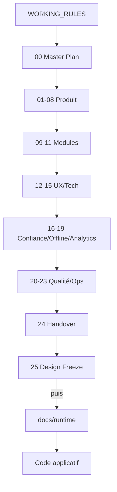
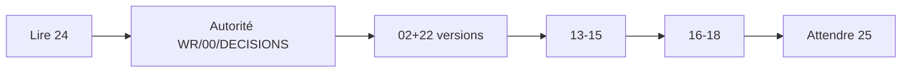
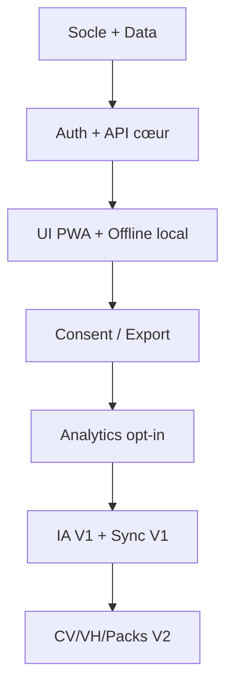
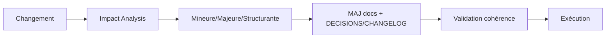
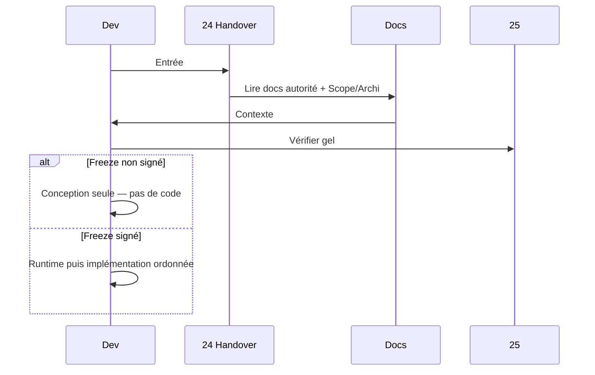

# 24 — Developer Handover

## 1. Statut

| Champ | Valeur |
| --- | --- |
| Nom du document | Developer Handover |
| Numéro | 24 |
| Fichier | `docs/24_DEVELOPER_HANDOVER.md` |
| Version | 1.0 |
| Statut | EN REVUE |
| Dernière mise à jour | 7 août 2026 — section diagnostic PWA / lien `26` |
| Auteur | Projet Tai-Chi-AI-Coach |
| Documents dépendants | `docs/00_MASTER_PLAN.md` … `docs/23_RELEASE_PLAN.md`, `docs/98_DEVELOPMENT_DOCUMENTATION_STANDARD.md`, `docs/99_DOCUMENTATION_STANDARD.md`, `DECISIONS.md`, `CHANGELOG.md`, `WORKING_RULES.md` |
| Documents utilisant celui-ci | `docs/25_DESIGN_FREEZE.md`, reprise d’équipe / IA |
| Décisions concernées | D-203 à D-222 |
| Dernière revue | 5 août 2026 — sync post–Design Freeze |
| Autorise le code | Après création de `docs/runtime/` (20 registres) |

> **NOTE**
>
> **Developer Handover Pack** : point d’entrée pour reprendre le projet. Ne remplace aucun document de conception — il les référence.
> Aucun code, ticket, backlog opérationnel, runtime ni guide utilisateur final.
> Document conforme à `docs/99_DOCUMENTATION_STANDARD.md`.

## 2. Objectifs

Permettre à un développeur, une équipe ou une IA de comprendre immédiatement :

- le produit et sa vision ;
- l’architecture documentaire et technique ;
- les règles, conventions et décisions ;
- l’ordre d’implémentation après Design Freeze ;
- les limites et arbitrages ouverts.

## 3. Présentation du projet

| Élément | Synthèse |
| --- | --- |
| Produit | Tai-Chi AI Coach — compagnon d’apprentissage du Tai Chi |
| Objectif | Pratique régulière, accessible, progressive, rassurante |
| Public cœur | Personas P-001, P-002, P-003 (`03`) |
| Philosophie | Calme, simplicité, bienveillance ; **non médical** ; **non compétitif** |
| Forme | PWA Offline First sur le cœur pédagogique |
| Enrichissements | IA V1 ; caméra/CV + Mei/VH + Premium/packs V2 ; multi-disciplines V3 |

Vision détaillée : `01_VISION.md`.

## 4. État du projet

### 4.1 Terminé (conception)

Documentation de conception `00` → `25` rédigée. `docs/25_DESIGN_FREEZE.md` est **VALIDÉ**. Le Design Freeze est **déclaré** (D-213 à D-222).

Décisions structurantes tracées jusqu’à **D-222**.

Revue croisée `12` ↔ `13` clôturée. Baseline figée selon `25` (y compris docs encore EN REVUE / EN RÉDACTION — D-214).

### 4.2 Prochaines étapes (post–Design Freeze)

| Livrable | État |
| --- | --- |
| `25_DESIGN_FREEZE.md` | **VALIDÉ** — Design Freeze déclaré |
| Harmonisation administrative des statuts EN REVUE | Optionnelle (fond déjà gelé) |
| `docs/runtime/` | **Prochaine étape officielle** — créer les 20 registres (`98`, D-022 / D-215) |
| Code applicatif MVP | **Uniquement après** création des registres Runtime |

### 4.3 Design Freeze

**Atteint.** `docs/25_DESIGN_FREEZE.md` est VALIDÉ. La phase de conception est close.

La prochaine étape est la création de `docs/runtime/` (20 registres). Le développement du MVP commence uniquement après cette création.

Après Freeze : idées nouvelles → backlog V2/V3 sauf réouverture bloquante documentée (`WORKING_RULES`, `22`).

## 5. Architecture documentaire

### 5.1 Cartographie

| Zone | Documents |
| --- | --- |
| Gouvernance projet | `00`, `WORKING_RULES`, `DECISIONS`, `CHANGELOG`, `RISKS`, `BACKLOG` |
| Produit | `01`–`08` |
| Modules avancés | `09`–`11` |
| Expérience & tech | `12`–`15` |
| Confiance | `16`–`17` |
| Offline & mesure | `18`–`19` |
| Qualité & ops | `20`–`23` |
| Transfert & gel | `24`–`25` |
| Standards | `98`, `99` |
| Runtime (futur) | `docs/runtime/*` post–Freeze |

### 5.2 Autorité (priorité en cas de conflit)

1. `WORKING_RULES.md`  
2. `00_MASTER_PLAN.md`  
3. `DECISIONS.md`  
4. Document métier concerné (Scope, Archi, etc.)  
5. Hypothèses / vision préexistante hors docs officiels  

`99` = norme de forme documentaire.  
`98` = norme documentation de développement / runtime.

## 6. Architecture fonctionnelle (résumé)

- **Parcours** : onboarding `F-033` → prudence → séances `F-013` → reprise `F-032` → progression `F-010`.
- **Navigation UX** : Accueil, Séances, Progression, Bibliothèque, Profil (`12`).
- **Modules** : Curriculum, Pratique, Progression, Prefs, Premium, AI Coach, CV, Virtual Humans, Sync, Analytics.
- **Versions** : voir `02` / `22` — MVP sans IA/CV/VH ; V1 compte+IA+sync ; V2 CV+Mei+packs+Premium.

Catalogue : `05_FEATURES.md` + IDs `F-xxx` / `HP-xxx`.

## 7. Architecture technique (résumé)

| Couche | Choix / principe |
| --- | --- |
| Frontend | Next.js, React, TypeScript, Tailwind, PWA (`13`) |
| Backend | API REST stateless, services découplés |
| Data | PostgreSQL + stockage objet ; modèle `14` |
| API | `/api/v1`, erreurs structurées, idempotence (`15`) |
| Auth | Conceptuel `16` — IdP non figé |
| Offline | Local First / Sync Later ; Offline/Hybrid/Online (`18`) |
| IA | Adaptateurs ; pas de fournisseur imposé (`09`, `15`) |
| CV | Optionnel V2 ; pas de vidéo brute par défaut (`10`, `17`) |
| VH | Mei optionnelle ; non bloquante (`11`) |

## 8. Organisation du développement

### 8.1 Avant toute ligne de code

1. Design Freeze signé (`25`) — **fait**.  
2. Runtime initialisé selon `98` / D-022 / D-215 — **prochaine étape**.  
3. Impact Analysis (§13 / §20).  
4. Ticket / analyse selon JavaChrist Development Framework.

### 8.2 Ordre d’implémentation recommandé (D-209)

Ordre logique **après Freeze** (adaptable mais pas inversé sans justification) :

1. Socle projet / config / environnements (`21`)  
2. Data & migrations alignées `14`  
3. Auth & sessions (`16`)  
4. API cœur (`15`) — curriculum lecture, pratique, progression, prefs  
5. UI PWA cœur + accessibilité + œil MDP (`12`, D-113)  
6. Offline local + file sync (MVP local → V1 sync) (`18`)  
7. Consentements / export / suppression (`17`)  
8. Analytics opt-in méta (`19`)  
9. IA Coach V1 (adaptateur)  
10. Notifications V1  
11. CV V2 + VH V2 + packs Premium selon roadmap  
12. Durcissement perf, monitoring, release (`20`, `21`, `23`)

MVP d’abord : ne pas construire CV/VH « parce que intéressant ».

## 9. Règles de développement

1. Documentation avant code.  
2. Respect strict de `DECISIONS.md` (D-208).  
3. Pas de raccourci architectural ni feature inventée.  
4. Pas de modification implicite multi-docs.  
5. `CHANGELOG` + décisions pour tout changement structurant.  
6. Gouvernances croisées : PII (D-131), Offline (D-142), Analytics (D-153/155), Tests (D-166), Deploy (D-179), Roadmap (D-191), Release (D-201).  
7. Pas d’`alert`/`confirm` natifs ; modales projet.  
8. Pas de gamification compétitive ni promesse médicale.  
9. Client non fiable ; entitlements et progression côté services.
10. **PWA / version exécutée** — ne jamais conclure à une régression fonctionnelle avant d’avoir vérifié que la PWA exécute bien la dernière version disponible (`docs/26_PWA_APP_UPDATE.md`).

## 9A. Diagnostic PWA / Service Worker (obligatoire)

Référence complète : [`docs/26_PWA_APP_UPDATE.md`](26_PWA_APP_UPDATE.md).

Avant tout diagnostic fonctionnel suspect « ça ne marche plus » / « je ne vois pas mon code » :

1. Vérifier si un Service Worker contrôle la page.
2. Vérifier `waiting` / `installing`.
3. Déclencher `registration.update()`.
4. Appliquer la mise à jour (modale **Mettre à jour**).
5. Attendre `controllerchange`.
6. Reload unique prévu.
7. Confirmer l’**Identifiant de build** (Profil) vs build attendu.
8. Seulement ensuite investiguer un bug applicatif.

Secure Context uniquement (`https`, `localhost` / `127.0.0.1`) — **pas** sur `http://192.168.x.x`.
Offline/cache métier = MVP-017 (non ouvert) ; le SW actuel est un **socle update** uniquement.

## 10. Documents de référence (rôles)

| Doc | Rôle |
| --- | --- |
| `00` | Carte & règles de phase conception |
| `01`–`02` | Vision & périmètre / versions |
| `03`–`05` | Personas, journeys, fiches F-xxx |
| `06`–`08` | Business, contenu, cursus |
| `09`–`11` | IA, CV, VH |
| `12`–`15` | UX, tech, data, API |
| `16`–`17` | Auth/sécu, RGPD |
| `18`–`19` | Offline (conception), Analytics |
| `20`–`23` | Tests, deploy, roadmap, releases |
| `24` | Ce handover |
| `25` | Gel avant code |
| `26` | **PWA App Update** — socle SW / diagnostic version |
| `98`/`99` | Standards doc dev / forme |
| `DECISIONS` / `CHANGELOG` | Traçabilité |

## 11. Décisions majeures (familles)

Ne pas recopier `DECISIONS.md`. Familles :

| Famille | Exemples d’IDs |
| --- | --- |
| Vision & scope | D-006…, D-014… |
| UX & produit calme | D-078…D-087, D-113 |
| Architecture & API | D-066…D-077, D-088…D-110 |
| Sécu & privacy | D-111…D-131 |
| Offline & analytics | D-132…D-155 |
| Qualité & ops | D-156…D-181 |
| Roadmap & releases | D-182…D-202 |
| Handover | D-203… (ce doc) |

Toute remise en cause exige problème bloquant documenté.

## 12. Conventions

| Sujet | Convention |
| --- | --- |
| Langue docs | Français |
| Features | `F-xxx` / `HP-xxx` stables |
| Décisions | `D-xxx` monotones |
| Personas | `P-xxx` / `AP-xxx` |
| Statuts doc | EN RÉDACTION / EN REVUE / VALIDÉ / … (`99`) |
| Versions produit | Pré-MVP, MVP, V1, V2, V3, Backlog |
| Offline class | Offline / Hybrid / Online |
| Analytics class | Sans / Techniques / Produit |
| Release class | Hotfix / Patch / Minor / Major |

## 13. Impact Analysis obligatoire (D-205 / D-210)

**Avant toute modification** (doc ou code post-Freeze) :

| Champ | Contenu |
| --- | --- |
| Besoin | Pourquoi |
| Documents à modifier | Liste |
| Décisions impactées | IDs |
| Modules / `F-xxx` | Liste |
| Risques | Produit, tech, privacy… |
| Dépendances | Amont/aval |
| Validations nécessaires | Tests, Go/No-Go, privacy… |
| Classification | Mineure / Majeure / Structurante (§21) |

Sans analyse : **modification non autorisée**.

## 14. Gouvernance des modifications (D-206 / D-211)

Toute évolution documente les impacts sur : UX, Architecture, Data, API, Sécurité, RGPD, Offline, Analytics, Tests, Déploiement, Roadmap — et met à jour **tous** les documents concernés de façon cohérente.

Validation seulement après cohérence documentaire.

## 15. Classification des modifications

| Classe | Sens |
| --- | --- |
| **Mineure** | Impact documentaire limité |
| **Majeure** | Plusieurs documents ou modules |
| **Structurante** | Architecture, décisions ou vision |

Classe documentée avant travail (D-212).

## 16. Gouvernance documentaire

| Activité | Règle |
| --- | --- |
| Mise à jour | Auteur + changelog |
| Revue | Statut EN REVUE → VALIDÉ explicite |
| Standards | Conformité `99` (et `98` pour runtime) |
| Conflits | Hiérarchie §5.2 |

## 17. Critères qualité (rappel)

Avant livraison d’un incrément post-Freeze : tests (`20`), sécu (`16`), RGPD (`17`), Offline (`18`), Analytics (`19`), deploy/release (`21`/`23`), documentation à jour — **aucune livraison sans recette** (D-165).

## 18. Points de vigilance

| Sujet | Vigilance |
| --- | --- |
| Caméra / CV | Consentement ; pas de brut ; non médical |
| IA | Adaptateur ; pas de prompt système exposé ; non bloquant offline |
| Mei / VH | Optionnels ; transparence virtuelle |
| Premium | Jamais d’interruption de séance |
| Sync | Idempotence ; conflits ; consent withdraw prioritaire |
| Analytics | Opt-in ; pas de contenu IA/CV |
| Scope creep | Respect MVP ; backlog post-Freeze |
| Secrets | Jamais en git |
| Runtime | Seulement après Freeze |

Arbitrages reportés : IdP, hébergeur, SDK analytics, SemVer exact, durées légales fines, seuils perf — voir docs ouverts + `25`.

## 19. Diagrammes

### 19.1 Architecture documentaire

### 19.2 Dépendances de reprise

### 19.3 Ordre d'implémentation

### 19.4 Gouvernance

### 19.5 Flux de reprise projet

## 20. Décisions figées par ce document

| ID | Décision |
| --- | --- |
| D-203 | Developer Handover obligatoire comme point d’entrée de reprise |
| D-204 | Documentation de conception comme source de vérité avant/pendant le code |
| D-205 | Analyse d’impact obligatoire avant toute modification |
| D-206 | Cohérence documentaire multi-docs obligatoire |
| D-207 | Reprise guidée via ce pack (ordre de lecture et d’implémentation) |
| D-208 | Respect strict des décisions tracées |
| D-209 | Ordre d’implémentation de référence post–Design Freeze |
| D-210 | Validation documentaire / impact avant modification |
| D-211 | Gouvernance des modifications transverses (liste d’impacts) |
| D-212 | Classification Mineure / Majeure / Structurante des modifications |

## 21. Décisions ouvertes

Uniquement les sujets déjà reportés dans `docs/25_DESIGN_FREEZE.md` (points ouverts volontaires).

Ne pas ouvrir de nouveaux sujets ici.

## 22. Critères de validation du document

1. Point d’entrée clair sans dupliquer les docs métier.  
2. État projet aligné sur le Design Freeze déclaré ; MVP uniquement après Runtime.  
3. Hiérarchie d’autorité et familles de décisions.  
4. Ordre d’implémentation et gouvernances d’impact.  
5. Décisions D-203–D-222 dans `DECISIONS.md`.  
6. Aucun code / runtime / tickets dans ce document.

Statut actuel : **EN REVUE**.

## 23. Conclusion

Ce handover permet de reprendre Tai-Chi AI Coach sans perte de contexte : lire l’autorité documentaire, respecter les décisions (jusqu’à D-222), constater le Design Freeze déclaré, créer `docs/runtime/`, puis implémenter dans l’ordre MVP → enrichissements — toujours avec Impact Analysis et cohérence multi-docs.

Prochaine étape : création de `docs/runtime/` (20 registres), puis développement MVP.

## 24. Références

- Ensemble `docs/00` … `docs/25`
- `docs/98_DEVELOPMENT_DOCUMENTATION_STANDARD.md`, `docs/99_DOCUMENTATION_STANDARD.md`
- `WORKING_RULES.md`, `DECISIONS.md`, `CHANGELOG.md`

---

## Pied de document

| Champ | Valeur |
| --- | --- |
| Version | 1.0 |
| Statut | EN REVUE |
| Prochain document | `docs/runtime/` (20 registres) |
| Fin officielle | Oui |

*Fin officielle du document.*
