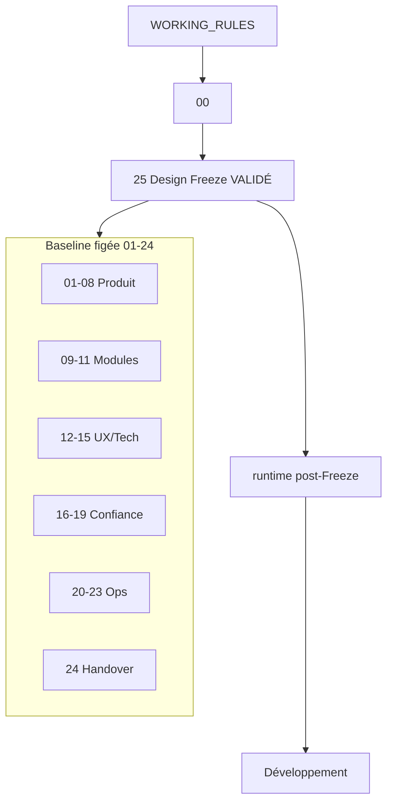
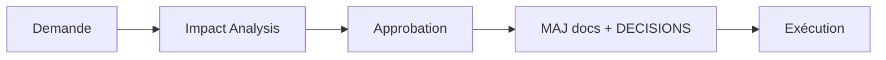
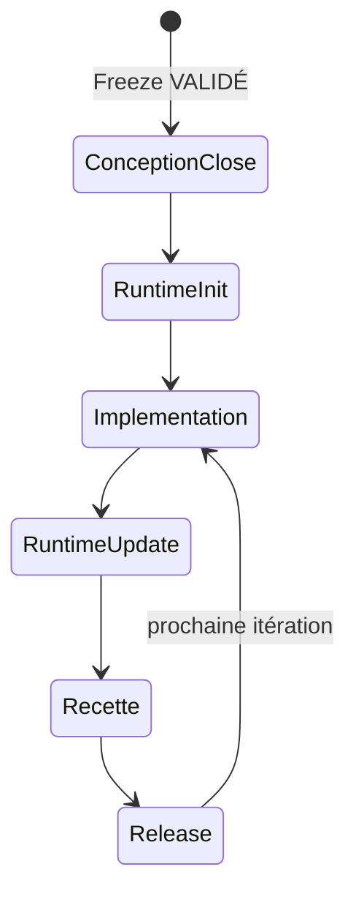
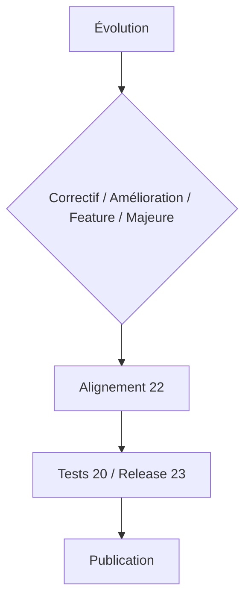
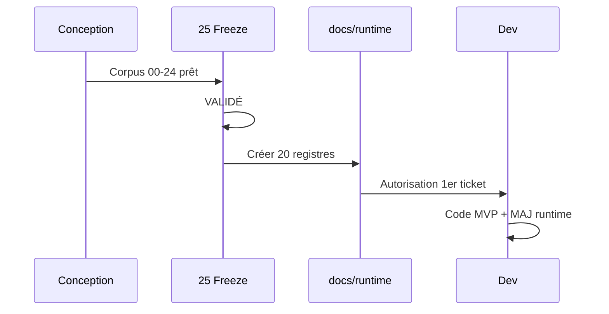

# 25 — Design Freeze

## 1. Statut

| Champ | Valeur |
| --- | --- |
| Nom du document | Design Freeze |
| Numéro | 25 |
| Fichier | `docs/25_DESIGN_FREEZE.md` |
| Version | 1.0 |
| Statut | VALIDÉ |
| Dernière mise à jour | 5 août 2026 |
| Auteur | Projet Tai-Chi-AI-Coach |
| Documents dépendants | `docs/00_MASTER_PLAN.md` … `docs/24_DEVELOPER_HANDOVER.md`, `docs/98_DEVELOPMENT_DOCUMENTATION_STANDARD.md`, `docs/99_DOCUMENTATION_STANDARD.md`, `DECISIONS.md`, `CHANGELOG.md` |
| Documents utilisant celui-ci | `docs/runtime/` (création post-Freeze), développement applicatif, releases |
| Décisions concernées | D-213 à D-222 |
| Dernière revue | 5 août 2026 |
| Autorise le code | Oui — **après** initialisation de `docs/runtime/` (D-022 / Master Plan §32) |

> **DÉCISION**
>
> Le Design Freeze de Tai-Chi AI Coach est **déclaré** à la date du présent document.
> La phase de conception est close. Le corpus `00`–`24` (+ standards `98`/`99`) constitue la **baseline figée**.
> Le présent document a le statut **VALIDÉ**.

## 2. Définition du Design Freeze

Le Design Freeze est l’acte officiel qui :

1. met fin à la phase de conception produit/architecture ;
2. fige le périmètre et les décisions structurantes documentés ;
3. autorise la séquence d’ouverture du développement définie par le Master Plan ;
4. impose qu’aucune nouvelle idée n’entre silencieusement dans le périmètre gelé.

### 2.1 Ce qui est figé

- Vision, scope, personas, journeys, features (`F-xxx` / `HP-xxx`) et découpage Pré-MVP → V3 ;
- Cursus, IA/CV/VH (rôles et limites) ;
- UX, architecture technique, data model, API ;
- Auth/sécurité, RGPD, Offline First, Analytics (principes) ;
- Stratégies tests, déploiement, roadmap, releases, handover ;
- Décisions `D-001` … `D-222` (et suivantes uniquement via processus post-Freeze) ;
- Standards documentaires `98` / `99` comme référentiels de forme et de runtime.

### 2.2 Ce qui n’est pas figé (volontairement ouvert)

Sujets **déjà** reportés à l’implémentation / ops / versions futures — **aucun nouveau sujet** :

- choix IdP / mécanisme exact de session ;
- hébergeur, CI/CD, outils monitoring/backup ;
- fournisseur IA / notif / stockage objet / analytics SDK ;
- SemVer exact, fenêtres de coexistence PWA ;
- durées de conservation juridiques définitives ;
- seuils de performance chiffrés ;
- moteur CV on-device éventuel ;
- contenus mouvement-par-mouvement et style Tai Chi exact ;
- prix Premium ;
- mesure quantitative exacte de l’intérêt MVP.

### 2.3 Ce qui pourra évoluer après développement

- Correctifs et améliorations via Impact Analysis + classification ;
- Nouvelles fonctionnalités via Roadmap (Backlog / V1+), jamais en silence ;
- Registres runtime (`docs/runtime/`) remplis **après** implémentation (`98`) ;
- Releases Hotfix/Patch/Minor/Major (`23`).

## 3. Documents figés (baseline)

Par le présent Freeze, les versions ci-dessous constituent la baseline officielle. Les en-têtes individuels encore « EN REVUE » / « EN RÉDACTION » sont **acceptés comme gelés** à ces versions ; une harmonisation administrative des statuts vers VALIDÉ peut suivre sans changer le fond.

| Document | Rôle | Version | Statut à la Freeze |
| --- | --- | --- | --- |
| `00_MASTER_PLAN.md` | Carte de conception | 1.1 | VALIDÉ |
| `01_VISION.md` | Vision | 1.1 | VALIDÉ |
| `02_PRODUCT_SCOPE.md` | Périmètre & catalogue | 1.1 | VALIDÉ |
| `03_PERSONAS.md` | Personas | 1.0 | EN REVUE → gelé |
| `04_USER_JOURNEYS.md` | Parcours | 1.0 | EN REVUE → gelé |
| `05_FEATURES.md` | Fiches fonctionnelles | 1.0 | EN REVUE → gelé |
| `06_BUSINESS_MODEL.md` | Modèle économique | 1.0 | EN REVUE → gelé |
| `07_CONTENT_STRATEGY.md` | Stratégie de contenu | 1.0 | EN REVUE → gelé |
| `08_TAI_CHI_CURRICULUM.md` | Cursus | 1.0 | EN REVUE → gelé |
| `09_AI_COACH.md` | Coach IA | 1.0 | EN REVUE → gelé |
| `10_COMPUTER_VISION.md` | Vision | 1.0 | EN REVUE → gelé |
| `11_VIRTUAL_HUMANS.md` | Guides virtuels | 1.0 | EN REVUE → gelé |
| `12_UX_UI.md` | UX/UI | 1.0 | EN REVUE → gelé |
| `13_TECH_ARCHITECTURE.md` | Architecture tech | 1.0 | EN REVUE → gelé |
| `14_DATA_MODEL.md` | Modèle de données | 1.0 | EN REVUE → gelé |
| `15_API_ARCHITECTURE.md` | API | 1.0 | EN REVUE → gelé |
| `16_AUTH_SECURITY.md` | Auth & sécurité | 1.0 | EN REVUE → gelé |
| `17_PRIVACY_RGPD.md` | Privacy & RGPD | 1.0 | EN REVUE → gelé |
| `18_PWA_OFFLINE.md` | PWA & Offline | 1.1 | EN REVUE → gelé |
| `19_ANALYTICS.md` | Analytics | 1.1 | EN REVUE → gelé |
| `20_TEST_STRATEGY.md` | Tests | 1.0 | EN REVUE → gelé |
| `21_DEPLOYMENT.md` | Déploiement | 1.0 | EN REVUE → gelé |
| `22_ROADMAP.md` | Roadmap | 1.0 | EN REVUE → gelé |
| `23_RELEASE_PLAN.md` | Releases | 1.0 | EN REVUE → gelé |
| `24_DEVELOPER_HANDOVER.md` | Handover | 1.0 | EN REVUE → gelé |
| `25_DESIGN_FREEZE.md` | Le présent gel | 1.0 | **VALIDÉ** |
| `98_…STANDARD.md` | Doc de développement | 1.0 | EN RÉDACTION → référentiel actif |
| `99_…STANDARD.md` | Standard documentaire | 1.0 | EN RÉDACTION → référentiel actif |
| `DECISIONS.md` | Décisions | vivant | Gel des D-001…D-222 ; ajouts post-Freeze tracés |
| `CHANGELOG.md` | Historique | vivant | Continu |

## 4. État du projet au Freeze

| Domaine | État |
| --- | --- |
| Conception | **Terminée** (corpus `00`–`25`) |
| Architecture | Spécifiée et gelée (`13`–`15`, `18`) |
| Modèles data/API | Spécifiés et gelés |
| Roadmap / releases | Spécifiées et gelées |
| Handover | Exploitable (`24`) |
| Runtime | **Non créé** — prochaine étape avant code |
| Code applicatif | **Absent** — autorisé seulement après runtime |

## 5. Conditions d'entrée en développement

Conformément au Master Plan §32 et D-215 :

| # | Condition | État au Freeze |
| --- | --- | --- |
| 1 | Documents `00`–`25` rédigés | OK |
| 2 | Décisions structurantes tracées | OK (jusqu’à D-222) |
| 3 | MVP figé / V2–V3 séparés | OK |
| 4 | Architecture, data, RGPD, tests définis | OK |
| 5 | Design Freeze validé | **OK — présent document** |
| 6 | Handover exploitable | OK |
| 7 | `98` / `99` reconnus | OK |
| 8 | `docs/runtime/` (20 registres) créé | **À faire avant le 1er code** |
| 9 | Cycle Ticket→…→Validation adopté | À appliquer dès le 1er ticket |

**Séquence autorisée :**

```text
Design Freeze (fait)
  → Créer docs/runtime/ (20 registres vides/minimaux selon 98)
    → Premier ticket d’implémentation MVP
      → Code + tests + MAJ runtime
```

Aucune ligne de code applicatif avant l’étape runtime.

## 6. Règles de modification post-Freeze

Toute modification (doc ou produit) exige :

1. Impact Analysis (`24`, D-205 / D-216) ;
2. documents et décisions impactés listés ;
3. classification Correctif / Amélioration / Nouvelle fonctionnalité / Évolution majeure ;
4. approbation avant exécution ;
5. MAJ cohérente multi-docs + `DECISIONS` / `CHANGELOG` si structurant.

## 7. Gestion des évolutions

| Type | Circuit |
| --- | --- |
| Correctif | Impact léger ; tests ciblés ; Patch/Hotfix (`23`) |
| Amélioration | Impact Analysis ; recette périmètre |
| Nouvelle fonctionnalité | Gouvernance Roadmap D-191 + Offline/Analytics/Tests/RGPD |
| Évolution majeure | Revue décisions ; éventuelle réouverture contrôlée Master Plan §34 |

Respect strict de `22_ROADMAP.md` (D-219).

## 8. Gestion des versions

| Plan | Règle |
| --- | --- |
| Documentaire | Baseline §3 ; bump de version doc si amendement post-Freeze |
| Produit | Pré-MVP → MVP → V1 → V2 → V3 (`02`/`22`) |
| Compatibilité | Ascendante privilégiée (`23` D-199) |

## 9. Gouvernance documentaire

| Élément | Règle |
| --- | --- |
| Source de vérité | Documentation gelée + `DECISIONS.md` (D-217) |
| Responsabilités | Auteur Impact Analysis ; validation cohérence ; owner release |
| Revue | Toute évolution structurante revue avant merge conceptuel/code |
| Runtime | `98` — documentation d’implémentation après code |

## 10. Critères qualité — readiness développement

Les domaines suivants sont jugés **suffisamment spécifiés** pour démarrer l’implémentation du MVP (puis V1+) :

| Domaine | Doc | Ready |
| --- | --- | --- |
| UX | `12` | Oui |
| Architecture | `13` | Oui |
| Data | `14` | Oui |
| API | `15` | Oui |
| Sécurité | `16` | Oui |
| RGPD | `17` | Oui |
| Offline | `18` | Oui |
| Analytics | `19` | Oui |
| Tests | `20` | Oui |
| Déploiement | `21` | Oui |

Les points ouverts §11 ne bloquent pas le démarrage du MVP s’ils restent hors chemin critique immédiat.

## 11. Points restant ouverts

Uniquement les sujets déjà reportés (pas de nouveaux) :

- IdP / sessions concrètes ;
- Hébergement, CI/CD, monitoring, backups outils ;
- Fournisseurs IA, notif, objet, analytics ;
- Durées légales de conservation définitives ;
- Budgets perf / quotas Mo exacts ;
- Style Tai Chi & catalogue mouvements détaillé ;
- Pricing Premium ;
- CV on-device éventuel ;
- SemVer / coexistence PWA fine ;
- Contenu runtime (à créer vide puis remplir).

## 12. Diagrammes

### 12.1 Architecture documentaire finale



### 12.2 Gouvernance documentaire



### 12.3 Cycle de vie après Design Freeze



### 12.4 Gestion des évolutions



### 12.5 Passage Conception → Développement



## 13. Décisions figées par ce document

| ID | Décision |
| --- | --- |
| D-213 | Design Freeze officiel déclaré |
| D-214 | Documentation de conception figée (baseline §3) |
| D-215 | Développement autorisé selon séquence Master Plan (runtime puis code) |
| D-216 | Analyse d’impact obligatoire pour toute évolution post-Freeze |
| D-217 | Documentation (+ DECISIONS) = source de vérité |
| D-218 | Toute évolution post-Freeze documentée (CHANGELOG/DECISIONS si structurant) |
| D-219 | Respect obligatoire de la Roadmap pour les nouvelles capacités |
| D-220 | Validation documentaire avant modification post-Freeze |
| D-221 | Classification des évolutions : Correctif / Amélioration / Nouvelle fonctionnalité / Évolution majeure |
| D-222 | Gouvernance post-Freeze (impacts transverses obligatoires) |

## 14. Gouvernance après Design Freeze

**D-222.**

Toute évolution documente : besoin ; documents/décisions impactés ; impacts UX, Architecture, Data, API, Sécurité, RGPD, Offline, Analytics, Tests, Déploiement, Roadmap, Release Plan.

Sans cette analyse : **non intégrable**.

## 15. Classification des évolutions

| Classe | Circuit |
| --- | --- |
| Correctif | Impact ciblé + tests |
| Amélioration | Impact Analysis + recette |
| Nouvelle fonctionnalité | Roadmap + gouvernances croisées |
| Évolution majeure | Revue décisions + gates renforcés |

## 16. Justification des évolutions

Chaque évolution : objectif, valeur, risques, impacts, bénéfices, critères d’acceptation.

## 17. Validation finale

> La phase de conception de Tai-Chi AI Coach est officiellement terminée.

> Le Design Freeze est déclaré.

> Le développement peut désormais commencer conformément à la documentation validée, en respectant la séquence obligatoire : initialisation de `docs/runtime/` puis implémentation du MVP selon `24` et `22`.

## 18. Critères de validation du présent document

1. Freeze défini (figé / non figé / évolutif).  
2. Baseline documentaire listée.  
3. Séquence runtime → code explicite.  
4. Gouvernance post-Freeze et classifications.  
5. Décisions D-213–D-222 tracées.  
6. Statut **VALIDÉ**.  
7. Aucun code ni runtime produit par ce livrable.

Statut actuel : **VALIDÉ**.

## 19. Conclusion

Tai-Chi AI Coach quitte la conception. La baseline `00`–`24` est gelée. Les évolutions futures passeront par Impact Analysis, Roadmap et releases gouvernées. Prochaine action opérationnelle : créer `docs/runtime/` (20 registres), puis ouvrir le premier ticket d’implémentation MVP.

## 20. Références

- `docs/00_MASTER_PLAN.md` §§29–34  
- `docs/24_DEVELOPER_HANDOVER.md`  
- `docs/98_DEVELOPMENT_DOCUMENTATION_STANDARD.md`  
- `DECISIONS.md`, `CHANGELOG.md`

---

## Pied de document

| Champ | Valeur |
| --- | --- |
| Version | 1.0 |
| Statut | VALIDÉ |
| Prochain document | Initialisation `docs/runtime/` (hors conception) |
| Fin officielle | Oui |

*Fin officielle du document.*

---

**Design Freeze — signature documentaire**

| Champ | Valeur |
| --- | --- |
| Déclaré le | 5 août 2026 |
| Document | `docs/25_DESIGN_FREEZE.md` v1.0 |
| Statut | VALIDÉ |
| Décision | D-213 |
