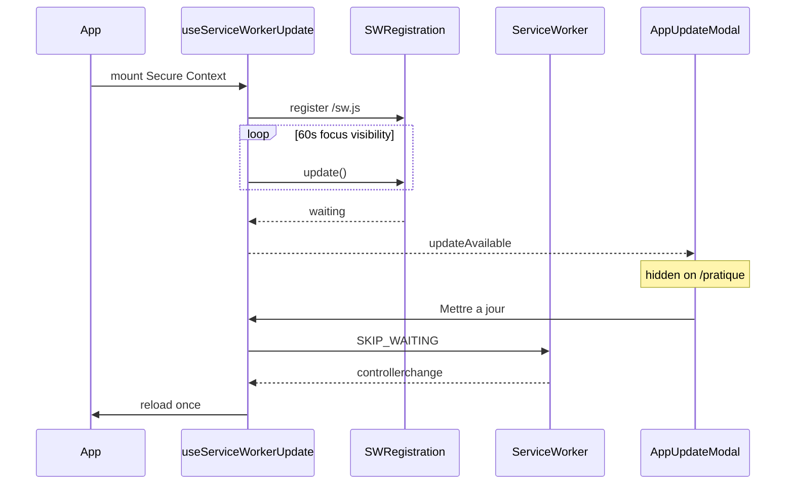

# 26 — PWA App Update (standard socle)

## 1. Statut

| Champ | Valeur |
| --- | --- |
| Nom du document | PWA App Update |
| Numéro | 26 |
| Fichier | `docs/26_PWA_APP_UPDATE.md` |
| Version | 1.0 |
| Statut | ACTIF |
| Dernière mise à jour | 7 août 2026 — commit `79b0a4e` |
| Auteur | Projet Tai-Chi-AI-Coach |
| Documents dépendants | `docs/18_PWA_OFFLINE.md`, `docs/21_DEPLOYMENT.md` (D-178), `docs/24_DEVELOPER_HANDOVER.md`, `docs/98_DEVELOPMENT_DOCUMENTATION_STANDARD.md` |
| Documents utilisant celui-ci | Développement frontend PWA, diagnostic, futures apps réutilisant ce socle |
| Décisions concernées | D-178 (activation non disruptive) |
| Autorise le code | Oui (ce document décrit le socle déjà implémenté dans `web/`) |

> **Standard réutilisable**
>
> Ce document définit le **socle App Update Flow** basé Service Worker.
> Il s’applique à Tai-Chi AI Coach et peut servir de référence pour d’autres apps du même cadre.
>
> Il ne remplace pas `docs/18_PWA_OFFLINE.md` (stratégie Offline First).
> Le cache métier / offline complet reste **MVP-017** (non ouvert ici).

## 2. Objectif

Garantir qu’une nouvelle version applicative réellement buildée / déployée :

1. produit un Service Worker **détectable** (octets différents) ;
2. place le nouveau SW en `waiting` ;
3. propose une **modale** à l’utilisateur (sans reload automatique) ;
4. applique `SKIP_WAITING` sur action « Mettre à jour » ;
5. attend `controllerchange` ;
6. recharge **une seule fois**.

Règle produit : la pratique utilisateur (`/pratique/*`) est prioritaire — pas d’interruption de séance (D-178).

## 3. Architecture implémentée

| Pièce | Emplacement | Responsabilité |
| --- | --- | --- |
| Build id automatique | `web/scripts/with-app-build-id.mjs` + `web/next.config.ts` | `NEXT_PUBLIC_APP_BUILD_ID` = `gitSha-timestamp` (une fois / process) |
| Lecture build id | `web/src/lib/pwa/build-id.ts` | Exposition client + Profil |
| Source SW | `web/src/lib/pwa/sw-source.ts` | Corps minimal + id injecté |
| Endpoint SW | `web/src/app/sw.js/route.ts` | Sert `/sw.js` (JS, no-cache, `Service-Worker-Allowed: /`) |
| Registration | `web/src/lib/pwa/register-service-worker.ts` | Secure Context uniquement |
| Hook | `web/src/hooks/use-service-worker-update.ts` | Détection / poll / focus / visibility / apply / reload unique |
| Modale | `web/src/components/pwa/app-update-modal.tsx` | UI pure (`AppDialog`) |
| Gate | `web/src/components/pwa/app-update-gate.tsx` | Différé `/pratique` + reproposition |
| Montage | `web/src/components/layout/app-shell.tsx` | Branche globale |

### 3.1 Flux

### 3.2 Service Worker minimal (hors MVP-017)

Le SW gère uniquement :

- message `SKIP_WAITING` → `self.skipWaiting()` ;
- `activate` → `self.clients.claim()` ;
- **pas** de `skipWaiting` automatique à l’`install` ;
- **pas** de precache, fetch offline, fallback, IndexedDB.

## 4. Identifiant de build automatique

### 4.1 Mécanisme retenu

**Pas** d’incrément manuel (`v1`, `v2`, …).

1. `npm run build` / `npm run dev` passent par `web/scripts/with-app-build-id.mjs`, qui fixe **une fois** `NEXT_PUBLIC_APP_BUILD_ID=${gitSha}-${Date.now()}` pour tout le process.
2. `next.config.ts` réutilise cette valeur (`generateBuildId` + `env`) ; fallback `globalThis` si Next est lancé sans le wrapper.
3. La route `/sw.js` (`force-static`) injecte littéralement `const APP_BUILD_ID = "<id>"` dans le corps du script servi.

Conséquence : toute nouvelle build produit des **octets SW différents** → le navigateur traite `/sw.js` comme une nouvelle version → `registration.update()` peut placer un worker en `waiting`.

Ce n’est **pas** suffisant que React connaisse le Build ID : la détection repose sur le **byte-diff du script Service Worker**.

### 4.2 Contextes

| Contexte | Build id | Update SW détectable ? |
| --- | --- | --- |
| `next build` + `next start` (prod locale) | Unique par process de build | **Oui** — scénario de validation nominal |
| Déploiement production (CI `next build`) | Unique par artefact | **Oui** — scénario utilisateur |
| `next dev` | Figé au démarrage du serveur dev | HMR React **≠** nouvelle version SW ; redémarrer `next dev` pour nouvel id. Pour valider le flux bout-en-bout : préférer `build` + `start`. |

L’identifiant affiché dans **Profil → Identifiant de build** doit correspondre au `APP_BUILD_ID` du SW actif après reload.

## 5. Usage en production

1. Déploiement d’un nouvel artefact (nouveau `APP_BUILD_ID`).
2. Client existant : poll 60 s / focus / `visibilitychange` → `registration.update()`.
3. Nouveau SW en `waiting` → `updateAvailable`.
4. Hors `/pratique/*` → modale « Mise à jour disponible » / bouton **Mettre à jour**.
5. Action → `postMessage({ type: "SKIP_WAITING" })`.
6. `controllerchange` → `location.reload()` **une seule fois**.
7. Pendant `/pratique/*` : détection continue, **pas** de modale ; reproposition à la sortie.

Fermeture Escape / bouton fermer : la mise à jour reste disponible et peut être reproposée (focus / visibility / intervalle / sortie de pratique).

## 6. Secure Context — où le SW fonctionne vraiment

Le code n’enregistre le SW que si `window.isSecureContext` **et** `navigator.serviceWorker`.

| Contexte | SW possible ? |
| --- | --- |
| `https://…` | Oui |
| `http://localhost` / `http://127.0.0.1` | Oui (exception navigateur) |
| PWA installée depuis origine sécurisée | Oui |
| `http://192.168.x.x` (LAN HTTP) | **Non** |
| HTTP non-localhost | **Non** |

Ne jamais documenter ni conclure qu’un SW « tourne » sur un contexte non sécurisé.

## 7. Usage développement / diagnostic

### 7.1 Règle absolue

> **Ne jamais conclure à une régression fonctionnelle avant d’avoir vérifié que la PWA exécute bien la dernière version disponible.**

Cette règle est aussi reprise dans `docs/24_DEVELOPER_HANDOVER.md` et `docs/98_DEVELOPMENT_DOCUMENTATION_STANDARD.md`.

### 7.2 Pourquoi le décalage arrive

Service Worker + (futurs) caches peuvent faire exécuter une version **différente** du code présent dans le dépôt / du dernier build.

### 7.3 Avant de diagnostiquer une régression PWA

Procédure obligatoire (forme courte) :

1. Vérifier le **Build ID** (Profil → Identifiant de build) vs build attendu.
2. Vérifier le Service Worker **actif** / **waiting** (DevTools → Application → Service Workers).
3. Appliquer l’update si disponible (modale **Mettre à jour**, ou `registration.update()` puis apply).
4. Confirmer le **nouveau Build ID** après reload.
5. **Seulement ensuite** analyser la fonctionnalité suspecte.

Détail opérationnel :

1. Vérifier si un Service Worker **contrôle** la page.
2. Vérifier s’il existe une version `waiting` / `installing`.
3. Déclencher `registration.update()` (ou attendre poll / focus / visibility).
4. Appliquer la mise à jour via la modale **Mettre à jour**.
5. Attendre `controllerchange` puis le reload unique.
6. Confirmer que l’**Identifiant de build** (Profil) correspond au build courant attendu **et** au `APP_BUILD_ID` du SW (`/sw.js`).
7. **Seulement ensuite** investiguer un éventuel bug applicatif.

### 7.4 Unregister / vider caches (diagnostic exceptionnel)

Chrome / Edge (DevTools → Application) :

1. Service Workers → **Unregister** ;
2. Storage → Clear site data (ou Cache Storage) si nécessaire ;
3. Recharger ;
4. Laisser l’app ré-enregistrer `/sw.js` normalement.

Safari (macOS / iOS) : Réglages / Develop → Service Workers / données site ; sur iOS PWA, parfois supprimer l’icône écran d’accueil puis réinstaller.

Après diagnostic : recharger sur origine sécurisée pour rétablir le comportement PWA normal (registration automatique).

### 7.5 Pièges navigateur pertinents

| Navigateur | Piège |
| --- | --- |
| Chrome / Edge | Onglet en arrière-plan : updates parfois retardées ; utiliser focus / visibility / poll 60 s. |
| Chrome / Edge | « Update on reload » en DevTools accélère les tests mais n’est **pas** le comportement utilisateur. |
| Safari | PWA iOS : cycle de vie SW plus strict ; tester aussi en standalone. |
| Tous | LAN `http://IP` : pas de Secure Context → pas de SW → pas de modale update. |
| `next dev` | HMR ne change pas le SW ; ne pas diagnostiquer l’update flow uniquement via HMR. |

## 8. Frontière MVP-017

| Inclus maintenant (socle) | Réservé MVP-017 |
| --- | --- |
| SW minimal + registration | Precaching cœur |
| Détection waiting + modale | Stratégie cache offline |
| SKIP_WAITING / claim / reload | Fallback offline |
| Build id automatique | IndexedDB sync / file d’attente |

**Ne pas ouvrir MVP-017** pour cette capacité seule.

## 9. Accessibilité modale

Réutilise `AppDialog` / Radix :

- rôle `dialog`, `aria-modal` ;
- titre accessible ;
- focus initial sur **Mettre à jour** ;
- focus trap ;
- Escape / fermer = report (dismiss) ;
- restauration du focus à la fermeture ;
- **jamais** `alert()` / `confirm()` natifs.

## 10. Références code

- Hook : `web/src/hooks/use-service-worker-update.ts`
- Prompt helpers : `web/src/lib/pwa/update-prompt.ts`
- Runtime offline : `docs/runtime/07_OFFLINE_STATUS.md`
- Conception offline (gelée) : `docs/18_PWA_OFFLINE.md`
- Publication : `docs/21_DEPLOYMENT.md` §8 (D-178)

---

## Pied de document

| Champ | Valeur |
| --- | --- |
| Version | 1.0 |
| Statut | ACTIF |
| Fin officielle | Oui |

*Fin officielle du document.*
