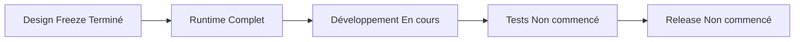
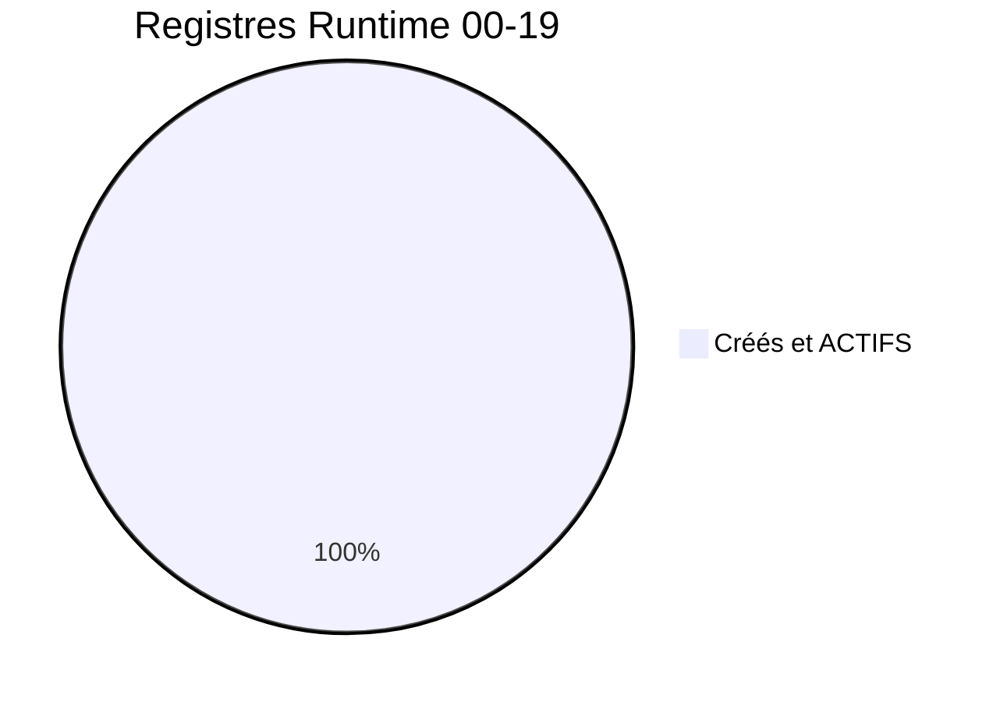
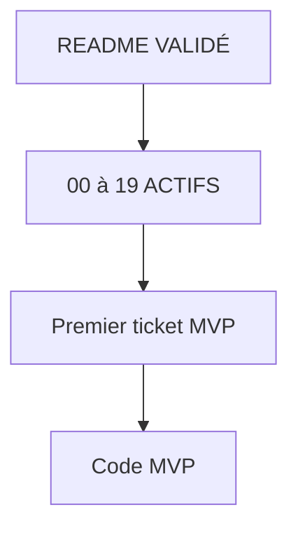
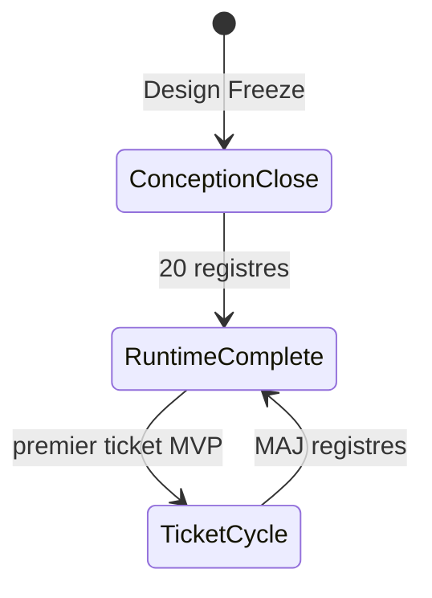
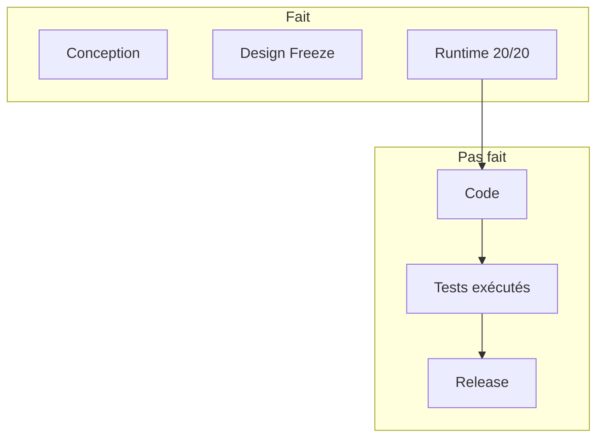

# 00 — Project Status

## 1. Statut du registre

| Champ | Valeur |
| --- | --- |
| Nom du registre | Project Status |
| Fichier | `docs/runtime/00_PROJECT_STATUS.md` |
| Version du registre | 1.0 |
| Statut | **ACTIF** |
| Dernière mise à jour | 5 août 2026 — MVP-004 |
| Responsable documentaire | Projet Tai-Chi-AI-Coach |
| Type | Runtime Register — tableau de bord officiel |

> Ce registre décrit uniquement l’**état réel** du projet.  
> Aucune intention, estimation ni spéculation.

## 2. Identité du projet

| Champ | Valeur réelle |
| --- | --- |
| Nom | Tai-Chi AI Coach |
| Dossier | `Tai-Chi-AI-Coach` |
| Version produit livrée | Aucune (aucune release publiée) |
| Phase | Développement MVP — fondation assets / PWA icons (MVP-004) |
| Statut global | Conception close ; Runtime 20/20 ; shell + DS + curriculum + assets/manifeste ; **F-013** en développement ; **aucune** `F-xxx` terminée ; PWA/Offline **non** implémentés |
| Dernière mise à jour globale | 5 août 2026 |
| Responsable documentaire | Projet Tai-Chi-AI-Coach |

## 3. État général

| Domaine | État | Constat |
| --- | --- | --- |
| Design Freeze | **Terminé** | `docs/25_DESIGN_FREEZE.md` VALIDÉ ; D-213…D-222 |
| Runtime | **Terminé** (infrastructure) | `README` VALIDÉ ; **20/20** registres `00`–`19` **ACTIFS** |
| Développement | **En cours** | Socle `web/` + DS + curriculum + fondation assets/manifeste (MVP-004) |
| Tests | **En cours** | Vitest : 15 tests OK (curriculum + assets/AppBrand/manifeste) ; pas de campagne produit complète |
| Release | **Non commencé** | 0 Release (`19`) ; déploiement absent (`10`) |

## 4. Vue d’ensemble Runtime

| Indicateur | Valeur |
| --- | --- |
| Nombre officiel de Runtime Registers | **20** (`00` … `19`) + `README.md` |
| Registres créés | **20** (`00` … `19`) + guide `README.md` |
| Registres restants à créer | **0** |
| Maturité Runtime | Infrastructure complète — initialisée avec succès |

## 5. Documentation

| Domaine | État réel |
| --- | --- |
| Documentation de conception (`00`–`25`) | Baseline figée (Design Freeze déclaré) |
| Documentation Runtime | Complète : `README` + `00`…`19` tous créés / ACTIFS (ou VALIDÉ pour README) |
| Cohérence conception ↔ runtime | Sync post-Freeze documentaire effectuée ; runtime applicatif partiel (shell, DS, curriculum, assets) |
| Dernier audit | Audit global Design Freeze (5 août 2026) + sync documentaire associée |

## 6. Développement

| Indicateur | Valeur réelle |
| --- | --- |
| Tickets ouverts | 0 |
| Tickets terminés | 4 (MVP-001 … MVP-004) |
| Tickets bloqués | 0 |
| Modules applicatifs commencés | App Shell + DS + curriculum local + fondation assets (`web/`) |

Prérequis Runtime (D-022 / D-215) : **satisfait**.

## 7. MVP — synthèse réelle

| Catégorie | État |
| --- | --- |
| Fonctionnalités terminées | **Aucune** |
| Fonctionnalités en cours | **1** (`F-013` — fondation catalogue / fiche, sans démarrage guidé) |
| Fonctionnalités restantes | **40** non commencées (`02_FEATURE_STATUS`) ; dont 18 MVP+Pré-MVP encore non commencées |

Aucune fonctionnalité `F-xxx` n’est marquée Validé / Livré. Détail : `02_FEATURE_STATUS.md`.

## 8. Décisions Runtime

| Indicateur | Valeur |
| --- | --- |
| Décisions Runtime (`14`) | **0** |
| Détail | `14_DECISIONS_RUNTIME.md` ACTIF — aucune entrée |

Les décisions de conception (`DECISIONS.md`, D-001…D-222) ne sont pas des décisions Runtime.

## 9. Risques, limitations et changements Runtime

| Indicateur | Valeur |
| --- | --- |
| Risques Runtime ouverts (`15`) | **0** `RR-xxx` |
| Limitations Runtime (`16`) | **0** `KL-xxx` |
| Changements Runtime (`17`) | **4** `CH-001`…`CH-004` (MVP-001…MVP-004) |
| Métriques Runtime (`18`) | **0** `MT-xxx` |
| Releases publiées (`19`) | **0** `REL-xxx` |

Constats de pilotage (hors `15` tant que non ticketés) : écart nomenclature `98` vs `runtime/README` (documentaire).

## 10. Blocages

Aucun blocage connu.

*(Le blocage « Runtime incomplet » est **levé** : 20/20 registres créés.)*

## 11. Dette technique

| Synthèse | Valeur |
| --- | --- |
| Dette technique applicative constatée | **Aucune** (`12_TECH_DEBT` — 0 TD-xxx) |
| Bugs ouverts | **0** (`13_BUGS`) |
| Dette documentaire runtime | Écart nomenclature `98` vs `runtime/README` (non bloquant) |

Détail : `12_TECH_DEBT.md`.

## 12. Qualité — synthèse

| Domaine | État réel |
| --- | --- |
| Architecture | Spécifiée ; registre `01` ; Frontend **en cours** (shell + DS + curriculum + assets) ; Offline/PWA non implémentés |
| Sécurité | Spécifiée ; registre `05` ACTIF ; **non implémentée** (0 contrôle runtime) |
| RGPD | Spécifié ; registre `06` ACTIF ; **non implémenté** (0 traitement / consentement runtime) |
| Offline | Spécifié ; registre `07` ACTIF ; **non implémenté** (0 SW / cache / sync) |
| Analytics | Spécifié ; registre `08` ACTIF ; **non implémenté** (0 événement / KPI) |
| Documentation | Conception gelée ; Runtime infrastructure complète |

## 13. Runtime Registers — table récapitulative

| Registre | Rôle | Statut | Dernière mise à jour |
| --- | --- | --- | --- |
| `README.md` | Guide Runtime | VALIDÉ | 5 août 2026 |
| `00_PROJECT_STATUS.md` | Tableau de bord | **ACTIF** | 5 août 2026 — MVP-004 |
| `01_ARCHITECTURE_STATUS.md` | Architecture réelle | **ACTIF** | 5 août 2026 — MVP-004 |
| `02_FEATURE_STATUS.md` | Features réelles | **ACTIF** | 5 août 2026 — MVP-004 |
| `03_DATA_STATUS.md` | Data réelle | **ACTIF** | 5 août 2026 — MVP-003 |
| `04_API_STATUS.md` | API réelle | **ACTIF** | 5 août 2026 |
| `05_SECURITY_STATUS.md` | Sécurité réelle | **ACTIF** | 5 août 2026 |
| `06_PRIVACY_STATUS.md` | RGPD réel | **ACTIF** | 5 août 2026 |
| `07_OFFLINE_STATUS.md` | Offline réel | **ACTIF** | 5 août 2026 — MVP-004 |
| `08_ANALYTICS_STATUS.md` | Analytics réel | **ACTIF** | 5 août 2026 |
| `09_TEST_STATUS.md` | Tests réels | **ACTIF** | 5 août 2026 — MVP-004 |
| `10_DEPLOYMENT_STATUS.md` | Déploiement réel | **ACTIF** | 5 août 2026 |
| `11_BACKLOG.md` | Backlog runtime ticketé | **ACTIF** | 5 août 2026 |
| `12_TECH_DEBT.md` | Dette technique | **ACTIF** | 5 août 2026 |
| `13_BUGS.md` | Bugs connus | **ACTIF** | 5 août 2026 |
| `14_DECISIONS_RUNTIME.md` | Décisions d’exécution | **ACTIF** | 5 août 2026 |
| `15_RISKS.md` | Risques runtime | **ACTIF** | 5 août 2026 |
| `16_KNOWN_LIMITATIONS.md` | Limites acceptées | **ACTIF** | 5 août 2026 |
| `17_CHANGE_HISTORY.md` | Historique changements | **ACTIF** | 5 août 2026 — CH-004 |
| `18_METRICS.md` | Métriques mesurées | **ACTIF** | 5 août 2026 |
| `19_RELEASE_HISTORY.md` | Releases publiées | **ACTIF** | 5 août 2026 |

## 14. Jalons atteints (faits)

| Jalon | Date | Preuve |
| --- | --- | --- |
| Conception `00`–`25` | 5 août 2026 | Corpus présent ; Freeze VALIDÉ |
| Design Freeze déclaré | 5 août 2026 | `docs/25_DESIGN_FREEZE.md` |
| Sync post-audit (C1/C2/C3/M4) | 5 août 2026 | `CHANGELOG.md` |
| Ouverture `docs/runtime/` | 5 août 2026 | `docs/runtime/README.md` |
| Tableau de bord Runtime | 5 août 2026 | Présent registre |
| Registre Architecture Status | 5 août 2026 | `01_ARCHITECTURE_STATUS.md` ACTIF |
| Registre Feature Status | 5 août 2026 | `02_FEATURE_STATUS.md` ACTIF — 41 F-xxx non commencés |
| Registre Data Status | 5 août 2026 | `03_DATA_STATUS.md` ACTIF — domaines data non commencés |
| Registre API Status | 5 août 2026 | `04_API_STATUS.md` ACTIF — 0 endpoint |
| Registre Security Status | 5 août 2026 | `05_SECURITY_STATUS.md` ACTIF — 0 contrôle auth/sécu |
| Registre Privacy Status | 5 août 2026 | `06_PRIVACY_STATUS.md` ACTIF — 0 implémentation RGPD |
| Registre Offline Status | 5 août 2026 | `07_OFFLINE_STATUS.md` ACTIF — 0 implémentation Offline |
| Registre Analytics Status | 5 août 2026 | `08_ANALYTICS_STATUS.md` ACTIF — 0 événement |
| Registre Test Status | 5 août 2026 | `09_TEST_STATUS.md` ACTIF — 0 campagne / 0 % couverture |
| Registre Deployment Status | 5 août 2026 | `10_DEPLOYMENT_STATUS.md` ACTIF — 0 environnement |
| Registre Backlog Runtime | 5 août 2026 | `11_BACKLOG.md` ACTIF — vide |
| Registre Tech Debt | 5 août 2026 | `12_TECH_DEBT.md` ACTIF — 0 TD |
| Registre Bugs | 5 août 2026 | `13_BUGS.md` ACTIF — 0 BUG |
| Registre Decisions Runtime | 5 août 2026 | `14_DECISIONS_RUNTIME.md` ACTIF — 0 RD |
| Registre Risks | 5 août 2026 | `15_RISKS.md` ACTIF — 0 RR |
| Registre Known Limitations | 5 août 2026 | `16_KNOWN_LIMITATIONS.md` ACTIF — 0 KL |
| Registre Change History | 5 août 2026 | `17_CHANGE_HISTORY.md` ACTIF — 0 CH |
| Registre Metrics | 5 août 2026 | `18_METRICS.md` ACTIF — 0 MT |
| Registre Release History | 5 août 2026 | `19_RELEASE_HISTORY.md` ACTIF — 0 REL |
| Infrastructure Runtime complète | 5 août 2026 | 20/20 registres ACTIFS + README |

## 15. Prochaines étapes (réelles, non estimées)

1. Ouvrir le prochain ticket MVP (pratique guidée / démarrage séance, ou dépôt des assets finaux par le PO).  
2. Appliquer Impact Analysis + cycle Ticket → Dev → Tests → Validation → MAJ Runtime → Commit.  
3. Tenir à jour les registres concernés à chaque ticket.  

## 16. Historique du registre

| Date | Événement |
| --- | --- |
| 5 août 2026 | Création initiale du registre — état réel post–Design Freeze, Runtime en initialisation, aucun code. |
| 5 août 2026 | Sync : registre `01_ARCHITECTURE_STATUS.md` créé (ACTIF) ; compteurs Runtime mis à jour. |
| 5 août 2026 | Sync batch : `02_FEATURE_STATUS.md` + `03_DATA_STATUS.md` ACTIFS ; 4 registres créés ; prochaine = `04_API_STATUS`. |
| 5 août 2026 | Sync batch : `04_API_STATUS.md` + `05_SECURITY_STATUS.md` ACTIFS ; 6 registres créés ; 0 API / 0 sécu runtime ; prochaine = `06_PRIVACY_STATUS`. |
| 5 août 2026 | Sync batch : `06_PRIVACY_STATUS.md` + `07_OFFLINE_STATUS.md` ACTIFS ; 8 registres créés ; 0 RGPD / 0 Offline runtime ; prochaine = `08_ANALYTICS_STATUS`. |
| 5 août 2026 | Sync batch : `08_ANALYTICS_STATUS.md` + `09_TEST_STATUS.md` ACTIFS ; 10 registres créés ; 0 Analytics / 0 test ; prochaine = `10_DEPLOYMENT_STATUS`. |
| 5 août 2026 | Sync batch : `10_DEPLOYMENT_STATUS.md` + `11_BACKLOG.md` ACTIFS ; 12 registres créés ; 0 déploiement / backlog vide ; prochaine = `12_TECH_DEBT`. |
| 5 août 2026 | Sync batch : `12_TECH_DEBT.md` + `13_BUGS.md` ACTIFS ; 14 registres créés ; 0 dette / 0 bug ; prochaine = `14_DECISIONS_RUNTIME`. |
| 5 août 2026 | Sync batch : `14_DECISIONS_RUNTIME.md` + `15_RISKS.md` ACTIFS ; 16 registres créés ; 0 RD / 0 RR ; prochaine = `16_KNOWN_LIMITATIONS`. |
| 5 août 2026 | Sync batch : `16_KNOWN_LIMITATIONS.md` + `17_CHANGE_HISTORY.md` ACTIFS ; 18 registres créés ; 0 KL / 0 CH ; prochaine = `18_METRICS`. |
| 5 août 2026 | **Sync finale** : `18_METRICS.md` + `19_RELEASE_HISTORY.md` ACTIFS ; **20/20** registres ; infrastructure Runtime complète ; prochain = premier ticket MVP. |
| 5 août 2026 | **MVP-001** : App Shell livré (`web/`) ; CH-001 ; Frontend en cours ; 0 F-xxx terminée. |
| 5 août 2026 | **MVP-002** : Design System & UI Foundation livré ; CH-002 ; Frontend en cours ; 0 F-xxx terminée. |
| 5 août 2026 | **MVP-003** : curriculum local + bibliothèque / fiches séances ; CH-003 ; F-013 En développement (fondation) ; tests Vitest reader OK. |
| 5 août 2026 | **MVP-004** : fondation assets + manifeste PWA + AppBrand ; CH-004 ; Offline/SW non implémentés ; Mei non rendue. |

## 17. Diagrammes

### 17.1 État global

### 17.2 Progression Runtime

### 17.3 Dépendances Runtime

### 17.4 Cycle de vie

### 17.5 Avancement

## 18. Gouvernance

Le registre `00_PROJECT_STATUS.md` est le **tableau de bord officiel** du projet et la **référence de pilotage**.

Toute information de synthèse présente dans un autre Runtime Register et impactant l’état global doit être **répercutée ici** lors de sa mise à jour.

## 19. Règles de mise à jour

Mettre à jour ce registre :

- après chaque ticket terminé ;  
- après chaque jalon majeur ;  
- après chaque Release ;  
- après toute modification impactant l’état global ;  
- après création ou activation d’un autre Runtime Register (mettre à jour §4 et §13).

Jamais anticiper un avancement non réalisé.

## 20. Références

- `docs/runtime/README.md`  
- `docs/25_DESIGN_FREEZE.md`  
- `docs/24_DEVELOPER_HANDOVER.md`  
- `CHANGELOG.md`  

---

## Pied de document

| Champ | Valeur |
| --- | --- |
| Version | 1.0 |
| Statut | ACTIF |
| Prochain jalon | Prochain ticket MVP (après App Shell) |
| Fin officielle | Oui |

*Fin officielle du document.*
