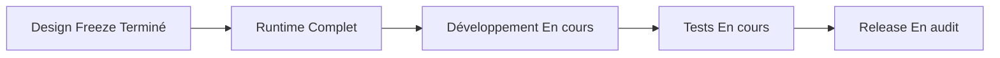
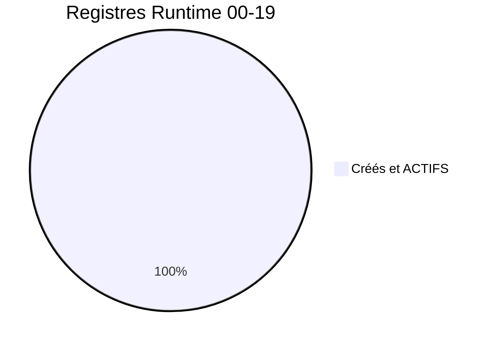
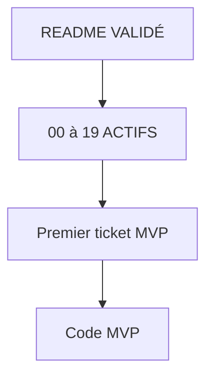
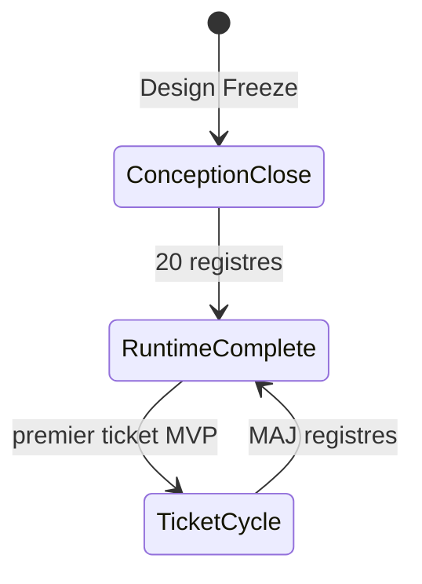
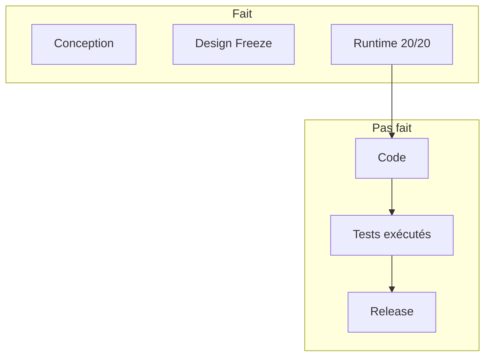

# 00 — Project Status

## 1. Statut du registre

| Champ | Valeur |
| --- | --- |
| Nom du registre | Project Status |
| Fichier | `docs/runtime/00_PROJECT_STATUS.md` |
| Version du registre | 1.0 |
| Statut | **ACTIF** |
| Dernière mise à jour | 9 août 2026 — MVP-018 fix round ; READY FOR GATE 9/10 ; 0 bug ouvert |
| Responsable documentaire | Projet Tai-Chi-AI-Coach |
| Type | Runtime Register — tableau de bord officiel |

> Ce registre décrit uniquement l’**état réel** du projet.
> Aucune intention, estimation ni spéculation.

## 2. Identité du projet

| Champ | Valeur réelle |
| --- | --- |
| Nom | Tai-Chi AI Coach |
| Dossier | `Tai-Chi-AI-Coach` |
| Version produit livrée | Aucune (aucune release publiée) |
| Phase | Développement MVP — MVP-018 **READY FOR GATE 9/10** ; Offline/PWA Livré ; MVP-012 MEDIA BLOCKED |
| Statut global | **MVP-018** ouvert — GATES 1→8 **PASS** ; BUG-001/002/003 **résolus** ; **RELEASE PUBLICATION BLOCKED** (GATE 9+10) ; MVP-012 MEDIA BLOCKED ; F-006 En test ; Vitest 191/191 |
| Dernière mise à jour globale | 9 août 2026 |
| Responsable documentaire | Projet Tai-Chi-AI-Coach |

## 3. État général

| Domaine | État | Constat |
| --- | --- | --- |
| Design Freeze | **Terminé** | `docs/25_DESIGN_FREEZE.md` VALIDÉ ; D-213…D-222 |
| Runtime | **Terminé** (infrastructure) | `README` VALIDÉ ; **20/20** registres `00`–`19` **ACTIFS** |
| Développement | **En cours** | **MVP-018 READY FOR GATE 9/10** ; **MVP-012** MEDIA BLOCKED ; TD-001 fermée |
| Tests | **En cours** | Vitest **191/191** ; GATES 1→8 PASS post-fix |
| Release | **BLOCKED (publication)** | GATE 9 + GATE 10 BLOCKED ; 0 P0/P1 ; 0 Release |

## 4. Vue d’ensemble Runtime

| Indicateur | Valeur |
| --- | --- |
| Nombre officiel de Runtime Registers | **20** (`00` … `19`) + `README.md` |
| Registres créés | **20** (`00` … `19`) + guide `README.md` |
| Registres restants à créer | **0** |
| Maturité Runtime | Infrastructure complète — initialisée avec succès |

## 5. Documentation

| Domaine | État réel |
| --- | --- |
| Documentation de conception (`00`–`25`) | Baseline figée (Design Freeze déclaré) |
| Documentation Runtime | Complète : `README` + `00`…`19` tous créés / ACTIFS (ou VALIDÉ pour README) |
| Cohérence conception ↔ runtime | Sync post-Freeze documentaire effectuée ; runtime applicatif partiel (+ progression + préférences + onboarding localStorage) |
| Dernier audit | Audit global Design Freeze (5 août 2026) + sync documentaire associée |

## 6. Développement

| Indicateur | Valeur réelle |
| --- | --- |
| Tickets ouverts | **2** (**MVP-012** MEDIA BLOCKED ; **MVP-018** READY FOR GATE 9/10) |
| Tickets terminés | **18** (MVP-001 … MVP-008, MVP-008A, MVP-008B, MVP-009, MVP-010, MVP-011, MVP-013, MVP-014, MVP-015, MVP-016, MVP-017) |
| Tickets bloqués | 0 (MVP-012 = MEDIA BLOCKED, pas un bug applicatif) |
| Modules applicatifs commencés | App Shell + DS 12A + curriculum + assets + Hero + pratique + prudence + découverte + parcours débutant + progression + prefs + onboarding + **SW Offline/PWA** (`web/`) |

Prérequis Runtime (D-022 / D-215) : **satisfait**.

## 7. MVP — synthèse réelle

| Catégorie | État |
| --- | --- |
| Fonctionnalités terminées | **18** (`F-001`, `F-002`, `F-003`, `F-004`, `F-005`, `F-007`, `F-008`, `F-009`, `F-010`, `F-013`, `F-014`, `F-015`, `F-016`, `F-028`, `F-029`, `F-031`, `F-032`, `F-033` — Livré) |
| Fonctionnalités en cours | **1** (`F-006`) |
| Fonctionnalités restantes | **22** non commencées (`02_FEATURE_STATUS`) |

Détail : `02_FEATURE_STATUS.md`.

## 8. Décisions Runtime

| Indicateur | Valeur |
| --- | --- |
| Décisions Runtime (`14`) | **1** (`RD-001` — PO-R1→R7) |
| Détail | `14_DECISIONS_RUNTIME.md` ACTIF — RD-001 Appliquée |

Les décisions de conception (`DECISIONS.md`, D-001…D-222) ne sont pas des décisions Runtime.

## 9. Risques, limitations et changements Runtime

| Indicateur | Valeur |
| --- | --- |
| Risques Runtime ouverts (`15`) | **0** `RR-xxx` |
| Limitations Runtime (`16`) | **0** `KL-xxx` |
| Changements Runtime (`17`) | **21** `CH-001`…`CH-021` |
| Métriques Runtime (`18`) | **0** `MT-xxx` |
| Releases publiées (`19`) | **0** `REL-xxx` |

Constats de pilotage (hors `15` tant que non ticketés) : écart nomenclature `98` vs `runtime/README` (documentaire).

## 10. Blocages

| Blocage | Nature | Impact |
| --- | --- | --- |
| MVP-012 / F-006 | MEDIA BLOCKED / REFERENCE MOTION BLOCKED (0 MP4) | GATE 10 **BLOCKED** |
| iPhone/Safari | Non testé | GATE 9 **BLOCKED** |
| Release publication | GATE 9 + GATE 10 | **RELEASE PUBLICATION BLOCKED** |

*(Le blocage « Runtime incomplet » est **levé** : 20/20 registres créés.)*

## 11. Dette technique

| Synthèse | Valeur |
| --- | --- |
| Dette technique applicative constatée | **0** (`12_TECH_DEBT` — TD-001 fermée MVP-016) |
| Bugs ouverts | **0** (`13_BUGS` — BUG-001/002/003 résolus) |
| Dette documentaire runtime | Écart nomenclature `98` vs `runtime/README` (non bloquant) |

Détail : `12_TECH_DEBT.md`.

## 12. Qualité — synthèse

| Domaine | État réel |
| --- | --- |
| Architecture | Spécifiée ; registre `01` ; Frontend **en cours** ; SW **update + cache cœur** (MVP-017 Fermé / Offline Livré) ; sync non commencée |
| Sécurité | Spécifiée ; registre `05` ACTIF ; **non implémentée** (0 contrôle runtime) |
| RGPD | Spécifié ; registre `06` ACTIF ; **non implémenté** (0 traitement / consentement runtime) |
| Offline | Spécifié ; registre `07` ACTIF ; cache cœur **Livré** (MVP-017) ; sync **non** commencée ; iPhone/Safari manuel → MVP-018 |
| Analytics | Spécifié ; registre `08` ACTIF ; **non implémenté** (0 événement / KPI) |
| Documentation | Conception gelée ; Runtime infrastructure complète |

## 13. Runtime Registers — table récapitulative

| Registre | Rôle | Statut | Dernière mise à jour |
| --- | --- | --- | --- |
| `README.md` | Guide Runtime | VALIDÉ | 5 août 2026 |
| `00_PROJECT_STATUS.md` | Tableau de bord | **ACTIF** | 6 août 2026 — MVP-008A |
| `01_ARCHITECTURE_STATUS.md` | Architecture réelle | **ACTIF** | 6 août 2026 — MVP-008A |
| `02_FEATURE_STATUS.md` | Features réelles | **ACTIF** | 6 août 2026 — MVP-008A |
| `03_DATA_STATUS.md` | Data réelle | **ACTIF** | 5 août 2026 — MVP-008 |
| `04_API_STATUS.md` | API réelle | **ACTIF** | 5 août 2026 |
| `05_SECURITY_STATUS.md` | Sécurité réelle | **ACTIF** | 5 août 2026 |
| `06_PRIVACY_STATUS.md` | RGPD réel | **ACTIF** | 5 août 2026 |
| `07_OFFLINE_STATUS.md` | Offline réel | **ACTIF** | 7 août 2026 — CH-014 SW update |
| `08_ANALYTICS_STATUS.md` | Analytics réel | **ACTIF** | 5 août 2026 |
| `09_TEST_STATUS.md` | Tests réels | **ACTIF** | 6 août 2026 — MVP-008A |
| `10_DEPLOYMENT_STATUS.md` | Déploiement réel | **ACTIF** | 5 août 2026 |
| `11_BACKLOG.md` | Backlog runtime ticketé | **ACTIF** | 5 août 2026 |
| `12_TECH_DEBT.md` | Dette technique | **ACTIF** | 5 août 2026 |
| `13_BUGS.md` | Bugs connus | **ACTIF** | 5 août 2026 |
| `14_DECISIONS_RUNTIME.md` | Décisions d’exécution | **ACTIF** | 5 août 2026 |
| `15_RISKS.md` | Risques runtime | **ACTIF** | 5 août 2026 |
| `16_KNOWN_LIMITATIONS.md` | Limites acceptées | **ACTIF** | 5 août 2026 |
| `17_CHANGE_HISTORY.md` | Historique changements | **ACTIF** | 6 août 2026 — CH-009 |
| `18_METRICS.md` | Métriques mesurées | **ACTIF** | 5 août 2026 |
| `19_RELEASE_HISTORY.md` | Releases publiées | **ACTIF** | 5 août 2026 |

## 14. Jalons atteints (faits)

| Jalon | Date | Preuve |
| --- | --- | --- |
| Conception `00`–`25` | 5 août 2026 | Corpus présent ; Freeze VALIDÉ |
| Design Freeze déclaré | 5 août 2026 | `docs/25_DESIGN_FREEZE.md` |
| Sync post-audit (C1/C2/C3/M4) | 5 août 2026 | `CHANGELOG.md` |
| Ouverture `docs/runtime/` | 5 août 2026 | `docs/runtime/README.md` |
| Tableau de bord Runtime | 5 août 2026 | Présent registre |
| Registre Architecture Status | 5 août 2026 | `01_ARCHITECTURE_STATUS.md` ACTIF |
| Registre Feature Status | 5 août 2026 | `02_FEATURE_STATUS.md` ACTIF — 41 F-xxx non commencés |
| Registre Data Status | 5 août 2026 | `03_DATA_STATUS.md` ACTIF — domaines data non commencés |
| Registre API Status | 5 août 2026 | `04_API_STATUS.md` ACTIF — 0 endpoint |
| Registre Security Status | 5 août 2026 | `05_SECURITY_STATUS.md` ACTIF — 0 contrôle auth/sécu |
| Registre Privacy Status | 5 août 2026 | `06_PRIVACY_STATUS.md` ACTIF — 0 implémentation RGPD |
| Registre Offline Status | 5 août 2026 | `07_OFFLINE_STATUS.md` ACTIF — 0 implémentation Offline |
| Registre Analytics Status | 5 août 2026 | `08_ANALYTICS_STATUS.md` ACTIF — 0 événement |
| Registre Test Status | 5 août 2026 | `09_TEST_STATUS.md` ACTIF — 0 campagne / 0 % couverture |
| Registre Deployment Status | 5 août 2026 | `10_DEPLOYMENT_STATUS.md` ACTIF — 0 environnement |
| Registre Backlog Runtime | 5 août 2026 | `11_BACKLOG.md` ACTIF — vide |
| Registre Tech Debt | 5 août 2026 | `12_TECH_DEBT.md` ACTIF — 0 TD |
| Registre Bugs | 5 août 2026 | `13_BUGS.md` ACTIF — 0 BUG |
| Registre Decisions Runtime | 5 août 2026 | `14_DECISIONS_RUNTIME.md` ACTIF — 0 RD |
| Registre Risks | 5 août 2026 | `15_RISKS.md` ACTIF — 0 RR |
| Registre Known Limitations | 5 août 2026 | `16_KNOWN_LIMITATIONS.md` ACTIF — 0 KL |
| Registre Change History | 5 août 2026 | `17_CHANGE_HISTORY.md` ACTIF — 0 CH |
| Registre Metrics | 5 août 2026 | `18_METRICS.md` ACTIF — 0 MT |
| Registre Release History | 5 août 2026 | `19_RELEASE_HISTORY.md` ACTIF — 0 REL |
| Infrastructure Runtime complète | 5 août 2026 | 20/20 registres ACTIFS + README |

## 15. Prochaines étapes (réelles, non estimées)

1. Déployer staging HTTPS (PO-R6) → **GATE 9** iPhone réel (PO-R5).
2. **GATE 10** via MVP-012 (3 MP4 validés) — MEDIA BLOCKED inchangé tant que non satisfait.
3. Go seulement si GATES 1→10 PASS + 0 P0/P1 (PO-R7).

## 16. Historique du registre

| Date | Événement |
| --- | --- |
| 5 août 2026 | Création initiale du registre — état réel post–Design Freeze, Runtime en initialisation, aucun code. |
| 5 août 2026 | Sync : registre `01_ARCHITECTURE_STATUS.md` créé (ACTIF) ; compteurs Runtime mis à jour. |
| 5 août 2026 | Sync batch : `02_FEATURE_STATUS.md` + `03_DATA_STATUS.md` ACTIFS ; 4 registres créés ; prochaine = `04_API_STATUS`. |
| 5 août 2026 | Sync batch : `04_API_STATUS.md` + `05_SECURITY_STATUS.md` ACTIFS ; 6 registres créés ; 0 API / 0 sécu runtime ; prochaine = `06_PRIVACY_STATUS`. |
| 5 août 2026 | Sync batch : `06_PRIVACY_STATUS.md` + `07_OFFLINE_STATUS.md` ACTIFS ; 8 registres créés ; 0 RGPD / 0 Offline runtime ; prochaine = `08_ANALYTICS_STATUS`. |
| 5 août 2026 | Sync batch : `08_ANALYTICS_STATUS.md` + `09_TEST_STATUS.md` ACTIFS ; 10 registres créés ; 0 Analytics / 0 test ; prochaine = `10_DEPLOYMENT_STATUS`. |
| 5 août 2026 | Sync batch : `10_DEPLOYMENT_STATUS.md` + `11_BACKLOG.md` ACTIFS ; 12 registres créés ; 0 déploiement / backlog vide ; prochaine = `12_TECH_DEBT`. |
| 5 août 2026 | Sync batch : `12_TECH_DEBT.md` + `13_BUGS.md` ACTIFS ; 14 registres créés ; 0 dette / 0 bug ; prochaine = `14_DECISIONS_RUNTIME`. |
| 5 août 2026 | Sync batch : `14_DECISIONS_RUNTIME.md` + `15_RISKS.md` ACTIFS ; 16 registres créés ; 0 RD / 0 RR ; prochaine = `16_KNOWN_LIMITATIONS`. |
| 5 août 2026 | Sync batch : `16_KNOWN_LIMITATIONS.md` + `17_CHANGE_HISTORY.md` ACTIFS ; 18 registres créés ; 0 KL / 0 CH ; prochaine = `18_METRICS`. |
| 5 août 2026 | **Sync finale** : `18_METRICS.md` + `19_RELEASE_HISTORY.md` ACTIFS ; **20/20** registres ; infrastructure Runtime complète ; prochain = premier ticket MVP. |
| 5 août 2026 | **MVP-001** : App Shell livré (`web/`) ; CH-001 ; Frontend en cours ; 0 F-xxx terminée. |
| 5 août 2026 | **MVP-002** : Design System & UI Foundation livré ; CH-002 ; Frontend en cours ; 0 F-xxx terminée. |
| 5 août 2026 | **MVP-003** : curriculum local + bibliothèque / fiches séances ; CH-003 ; F-013 En développement (fondation) ; tests Vitest reader OK. |
| 5 août 2026 | **MVP-004** : fondation assets + manifeste PWA + AppBrand ; CH-004 ; Offline/SW non implémentés ; Mei non rendue. |
| 5 août 2026 | **MVP-005** : parcours pratique local (démarrage, étapes, pause/reprise, bilan) ; CH-005 ; F-013 En test ; F-032 En développement. |
| 5 août 2026 | **MVP-006** : progression / historique localStorage ; CH-006 ; F-009 / F-010 En développement. |
| 5 août 2026 | **MVP-007** : préférences utilisateur locales + page `/profil` ; CH-007 ; F-028 / F-029 En développement. |
| 5 août 2026 | **MVP-008** : onboarding local `/onboarding` ; CH-008 ; F-033 En développement ; Offline (localStorage). |
| 6 août 2026 | **MVP-008A** : refonte UI Experience Design System (12A) ; CH-009 ; aucune `F-xxx` nouvelle ; présentation seule. |
| 6 août 2026 | **MVP-008B Sprint 3** : 15 Hero Light ; CH-010 ; Dark manquant. |
| 7 août 2026 | **MVP-008B Sprint Dark** : 5 Masters Dark + 15 exports Dark ; CH-011. |
| 7 août 2026 | **MVP-008B fermé** (`50bf954`) ; roadmap tickets **MVP-009→018** officialisée ; MVP-009 À développer. |
| 7 août 2026 | **MVP-009** code : F-016 / F-031 En test ; CH-012 ; commit / clôture Git en attente PO. |
| 7 août 2026 | **MVP-009 fermé** (validation PO) ; F-016 / F-031 → **Livré** ; CH-012 clôturé ; prochain = ouverture MVP-010. |
| 7 août 2026 | **MVP-010 ouvert** (cadrage F-001 + F-002) ; fichier ticket créé ; aucune implémentation. |
| 7 août 2026 | **MVP-010** code : `/decouverte` ; F-001 / F-002 En test ; CH-013 ; commit PO en attente. |
| 7 août 2026 | **MVP-010 fermé** (validation PO) ; F-001 / F-002 → **Livré** ; CH-013 clôturé ; prochain = ouverture MVP-011. |
| 7 août 2026 | **CH-014** — socle PWA App Update (`docs/26`) ; SW minimal + modale ; Offline cache / MVP-017 non ouverts. |
| 7 août 2026 | **MVP-011 ouvert** (cadrage F-005 + F-004 + F-007) ; inventaire : 0 mouvement / 0 image F-007 ; aucun développement. |
| 8 août 2026 | **MVP-011** F-007 livrés (3 WebP 768×1280) ; gate **READY FOR CODE** ; aucun code démarré. |
| 8 août 2026 | **MVP-011** code livré — `/bibliotheque/mouvements` ; F-004/F-005/F-007 En test ; CH-015 ; attente PO. |
| 8 août 2026 | **MVP-011 fermé** (validation PO) ; F-004/F-005/F-007 → **Livré** ; CH-015 ; MVP-012 non ouvert. |
| 8 août 2026 | **MVP-012 ouvert** (cadrage F-006 + enrichissement F-013) ; CODE READY / MEDIA REFERENCE MOTION BLOCKED ; aucun développement. |
| 8 août 2026 | **MVP-012** code livré — infra F-006 + mapping F-013 ; F-006 En test ; **0** MP4 ; MEDIA BLOCKED / attente média ; ticket non fermé. |
| 8 août 2026 | **CH-016** — correctif UX F-031 (`a35c6fb`) ; MVP-009 reste fermé. |
| 8 août 2026 | **MVP-013 ouvert** (cadrage F-003) ; CODE READY ; corpus 3 séances + MV-001…003 ; MVP-012 reste MEDIA BLOCKED ; aucun code. |
| 8 août 2026 | **MVP-013** code livré — `/parcours/debutant` ; F-003 En test ; attente PO ; MVP-012 MEDIA BLOCKED ; MVP-014/015 non ouverts. |
| 8 août 2026 | **MVP-013 fermé** (validation PO) ; F-003 → **Livré** ; CH-017 ; MVP-012 reste MEDIA BLOCKED ; MVP-014 non ouvert. |
| 8 août 2026 | **MVP-014 ouvert** (cadrage F-008 + F-014 + F-015) ; aucun code ; F-008/F-015 READY ; F-014 CONTENT BLOCKED (dédié) ; MVP-012 MEDIA BLOCKED ; MVP-015 non ouvert. |
| 8 août 2026 | **MVP-014** code partiel — F-008/F-015 En test ; F-014 CONTENT BLOCKED ; ticket non fermé ; MVP-012 MEDIA BLOCKED ; MVP-015 non ouvert. |
| 9 août 2026 | **MVP-014** F-014 — corpus `08` §28.1 Respiration calme ; `/respiration` ; CONTENT BLOCKED levé ; F-008/F-014/F-015 En test ; ticket non fermé ; MVP-015 non ouvert. |
| 9 août 2026 | **MVP-014 fermé** (validation PO) ; F-008/F-014/F-015 → **Livré** ; CH-018 ; TD-001 notée ; MVP-012 MEDIA BLOCKED ; MVP-015 non ouvert. |
| 9 août 2026 | **MVP-015 ouvert** (cadrage F-009 + F-010 + F-032 + finalisation F-013) ; gate DESIGN DECISION REQUIRED ; aucun code ; MVP-012 MEDIA BLOCKED ; MVP-016 non ouvert. |
| 9 août 2026 | **MVP-015 Livré (code)** ; PO-A…G validées ; READY FOR CODE ; F-009/F-010/F-032/F-013 En test ; attente PO ; MVP-012 MEDIA BLOCKED ; MVP-016 non ouvert. |
| 9 août 2026 | **MVP-015 fermé** (validation PO) ; F-009/F-010/F-032/F-013 → **Livré** ; CH-019 ; correctifs QA F-031 + server snapshot ; MVP-012 MEDIA BLOCKED ; MVP-016 non ouvert. |
| 9 août 2026 | **MVP-016 ouvert** (cadrage F-033 + F-028 + F-029) ; gate DESIGN DECISION REQUIRED ; aucun code ; MVP-012 MEDIA BLOCKED ; MVP-017 non ouvert. |
| 9 août 2026 | **MVP-016 Livré (code)** ; PO-A…F validées ; F-033/F-028/F-029 En test ; TD-001 fermée ; attente PO ; MVP-012 MEDIA BLOCKED ; MVP-017 non ouvert. |
| 9 août 2026 | **MVP-016 fermé** (validation PO) ; F-033/F-028/F-029 → **Livré** ; CH-020 ; correctif QA `.z-dropdown` ; MVP-012 MEDIA BLOCKED ; MVP-017 non ouvert. |
| 9 août 2026 | **MVP-017 ouvert** (cadrage Offline/PWA cache cœur) ; gate DESIGN DECISION REQUIRED (PO-A…D) ; aucun code ; MVP-012 MEDIA BLOCKED ; MVP-018 non ouvert. |
| 9 août 2026 | **MVP-017 Livré (code)** ; PO-A…D validées ; SW cache cœur + `/hors-ligne` ; budget ≈ 3,4 Mo ; Offline En test ; attente PO ; MVP-012 MEDIA BLOCKED ; MVP-018 non ouvert. |
| 9 août 2026 | **MVP-017 fermé** (validation PO) ; Offline/PWA → **Livré** ; CH-021 ; precache ≈ 4,16 Mo / 79 entrées ; iPhone/Safari → MVP-018 ; MVP-012 MEDIA BLOCKED ; MVP-018 non ouvert. |
| 9 août 2026 | **MVP-018 ouvert** (AUDIT + PLAN DE RECETTE) ; ticket `MVP-018_RELEASE_READINESS.md` ; aucun code ; gates 1→10 cadrés ; F-006 décision PO ; MVP-012 MEDIA BLOCKED **conservé**. |
| 9 août 2026 | **MVP-018** — PO-R1→R7 / **RD-001** ; gate **READY FOR FINAL QA** ; **RELEASE PUBLICATION BLOCKED** (GATE 9 + GATE 10) ; campagne 1→10 procédurée ; GATES 1→8 READY ; aucun code. |
| 9 août 2026 | **MVP-018 campagne GATES 1→8** ; PASS 1/2/4/5/7 ; FAIL 3/6/8 ; BUG-001/002/003 ; décision **BLOCKED BY P0/P1** ; aucun fix. |
| 9 août 2026 | **MVP-018 fix round** BUG-001/002/003 résolus ; GATES 1→8 PASS ; **READY FOR GATE 9/10** ; Vitest 191/191 ; commit `34549c4`. |

## 17. Diagrammes

### 17.1 État global

### 17.2 Progression Runtime

### 17.3 Dépendances Runtime

### 17.4 Cycle de vie

### 17.5 Avancement

## 18. Gouvernance

Le registre `00_PROJECT_STATUS.md` est le **tableau de bord officiel** du projet et la **référence de pilotage**.

Toute information de synthèse présente dans un autre Runtime Register et impactant l’état global doit être **répercutée ici** lors de sa mise à jour.

## 19. Règles de mise à jour

Mettre à jour ce registre :

- après chaque ticket terminé ;
- après chaque jalon majeur ;
- après chaque Release ;
- après toute modification impactant l’état global ;
- après création ou activation d’un autre Runtime Register (mettre à jour §4 et §13).

Jamais anticiper un avancement non réalisé.

## 20. Références

- `docs/runtime/README.md`
- `docs/25_DESIGN_FREEZE.md`
- `docs/24_DEVELOPER_HANDOVER.md`
- `CHANGELOG.md`

---

## Pied de document

| Champ | Valeur |
| --- | --- |
| Version | 1.0 |
| Statut | ACTIF |
| Prochain jalon | GATE 9 iPhone/HTTPS ; GATE 10 via MVP-012 |
| Fin officielle | Oui |

*Fin officielle du document.*
