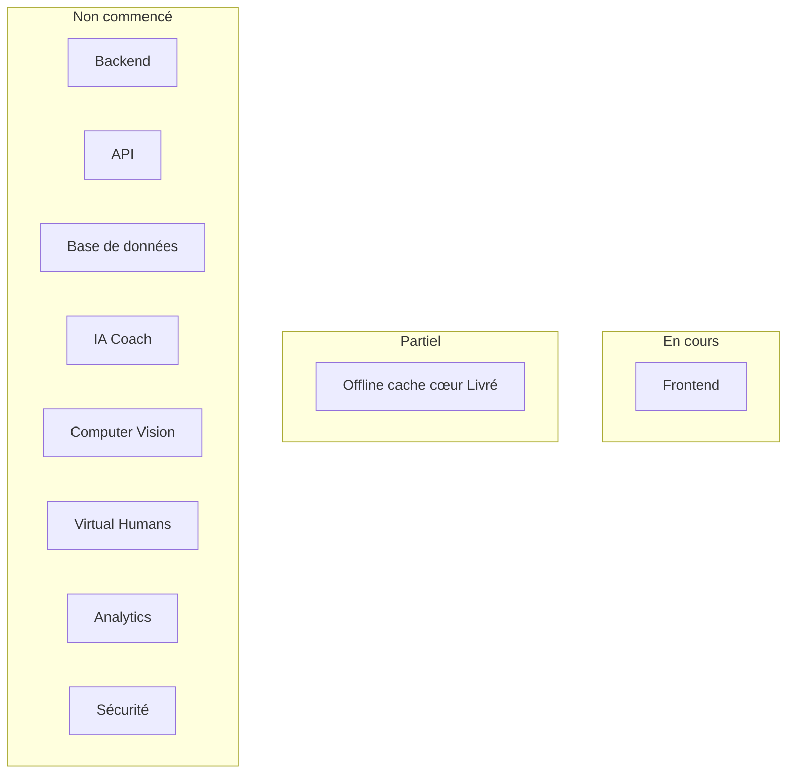
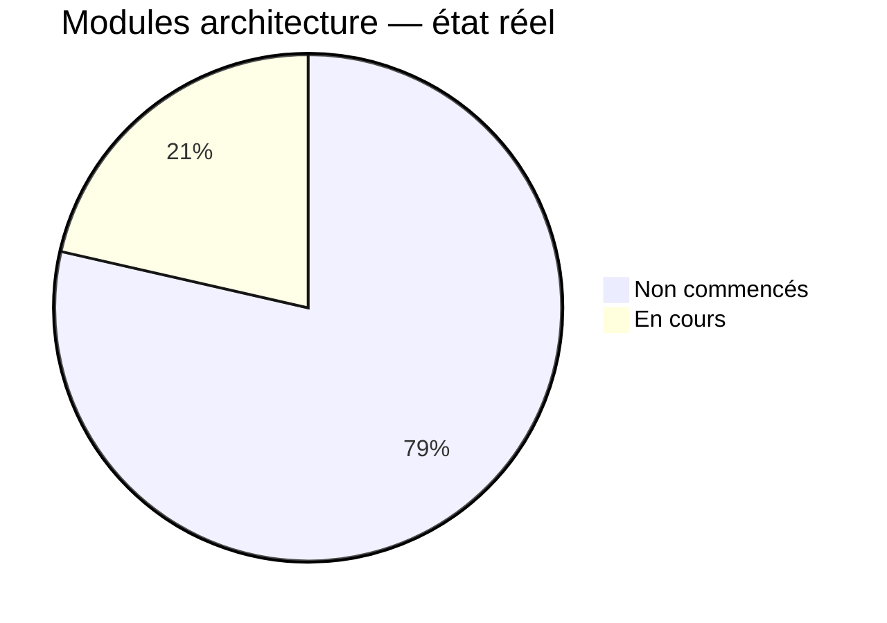
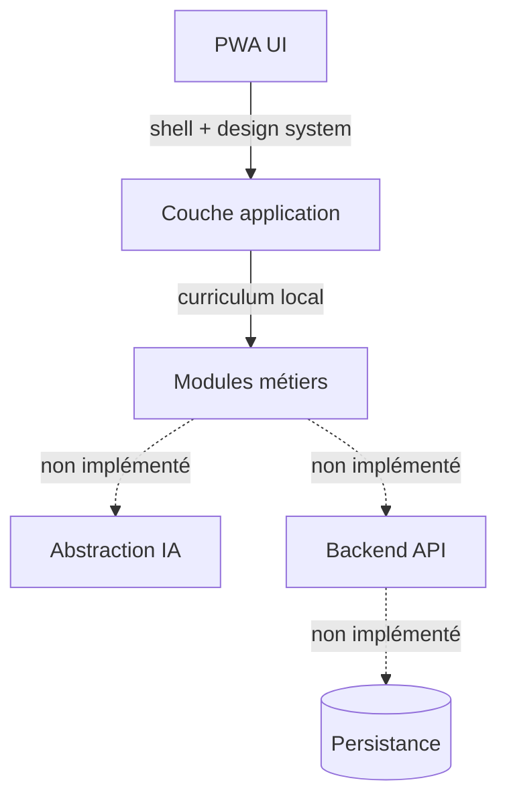
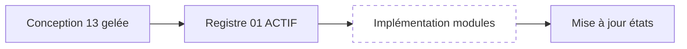
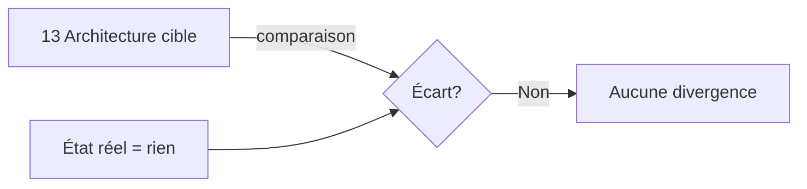

# 01 — Architecture Status

## 1. Statut du registre

| Champ | Valeur |
| --- | --- |
| Nom du registre | Architecture Status |
| Fichier | `docs/runtime/01_ARCHITECTURE_STATUS.md` |
| Version du registre | 1.0 |
| Statut | **ACTIF** |
| Dernière mise à jour | 9 août 2026 — MVP-017 Fermé ; Offline/PWA Livré |
| Responsable documentaire | Projet Tai-Chi-AI-Coach |
| Type | Runtime Register — état réel de l’architecture |
| Référence conception | `docs/13_TECH_ARCHITECTURE.md` (architecture cible / gelée — non recopié ici) |

> Ce registre décrit uniquement ce qui est **effectivement implémenté**.  
> Il ne décrit jamais l’architecture cible.

## 2. État général des couches

Référentiel de lecture des noms de couches : conception `13` (pour comparaison).  
État ci-dessous = **réalité d’implémentation**.

| Couche | État réel | Constat |
| --- | --- | --- |
| Frontend | **En cours** | Socle Next.js + shell + EDS 12A + Hero + bibliothèque + pratique + prefs + onboarding + découverte ; **SW update + cache cœur Livré** (MVP-017) + `/hors-ligne` |
| Backend | **Non commencé** | Aucun service backend |
| API | **Non commencé** | Aucun endpoint exposé |
| Base de données | **Non commencé** | Aucun schéma / instance applicative |
| IA Coach | **Non commencé** | Aucune couche d’abstraction ni fournisseur branché |
| Computer Vision | **Non commencé** | Aucun pipeline CV |
| Virtual Humans | **Non commencé** | Aucun guide / runtime VH |
| Offline | **Livré** (cœur) | SW unique update + precache/runtime ; fallback `/hors-ligne` ; IndexedDB / sync non commencés ; iPhone/Safari manuel → MVP-018 |
| Analytics | **Non commencé** | Aucun pipeline / sink analytics |
| Sécurité | **Non commencé** | Aucun contrôle auth / sécu applicatif déployé |

## 3. Modules

Modules issus de l’architecture validée (`13`) — état d’**implémentation uniquement**.

| Module | État | Responsable | Ticket d’origine | Dernière mise à jour |
| --- | --- | --- | --- | --- |
| Interface utilisateur (PWA) | En cours | Projet | CH-014 | 7 août 2026 — shell + DS + Hero + SW socle App Update ; cache offline absent ; logos SVG manquants (fallback) |
| Couche application / orchestration client | En cours | Projet | MVP-001 | 5 août 2026 — layout / navigation |
| Modules métiers (curriculum, progression, etc.) | En cours | Projet | MVP-008 | 5 août 2026 — curriculum + pratique + progression + préférences + onboarding localStorage ; pas de backend ; **aucune** logique modifiée par MVP-008A |
| Couche d’abstraction IA | Non commencé | — | — | — |
| Backend API (stateless) | Non commencé | — | — | — |
| Persistance (PostgreSQL) | Non commencé | — | — | — |
| Stockage objet | Non commencé | — | — | — |
| Synchronisation | Non commencé | — | — | — |
| Offline / cache PWA | Livré | Projet | MVP-017 | 9 août 2026 — precache ≈ 4,16 Mo / 79 entrées ; CH-021 ; iPhone/Safari → MVP-018 |
| Computer Vision | Non commencé | — | — | — |
| Virtual Humans / Mei | Non commencé | — | MVP-004 | Emplacements assets documentés ; **aucune** UI Mei |
| Analytics (technique / produit) | Non commencé | — | — | — |
| Auth / sécurité applicative | Non commencé | — | — | — |
| Monitoring / journalisation applicative | Non commencé | — | — | — |

## 4. Conformité avec le Design Freeze

| Élément | Statut | Justification |
| --- | --- | --- |
| Architecture cible documentée (`13`) | Conforme (conception) | Baseline figée par `25` ; non remise en cause |
| Architecture réellement déployée | Partielle | Frontend + curriculum + assets + Hero + pratique + prefs + onboarding + découverte + SW update socle ; pas de backend / DB / cache offline |
| Divergence d’implémentation | **Aucune** | Stack Next.js/React/TS/Tailwind alignée `13` ; pas de backend inventé |

## 5. Écarts

Aucun écart connu.

Note factuelle : l’application vit dans le sous-dossier `web/` (repo documentaire à la racine).

## 6. Dette d’architecture

| Synthèse | Valeur |
| --- | --- |
| Dette d’architecture applicative constatée | **Aucune** |

Détail éventuel futur : `12_TECH_DEBT.md` (non créé à ce stade).

## 7. Décisions Runtime (impact architecture)

Aucune.

## 8. Historique

| Date | Événement |
| --- | --- |
| 5 août 2026 | Création initiale — Design Freeze terminé ; architecture validée en conception ; aucun module développé ; aucun écart ; aucun ticket. |
| 5 août 2026 | MVP-001 : socle Frontend (`web/`) — Next.js, React, TS, Tailwind, shadcn/ui, Lucide ; App Shell + routes vides ; Frontend = En cours. |
| 5 août 2026 | MVP-002 : Design System & UI Foundation — boutons, cartes, états, dialogs, toasts, inputs, feedback, layouts ; navigation avec états actifs ; Frontend = En cours. |
| 5 août 2026 | MVP-003 : curriculum local typé + service de lecture + `/bibliotheque` + fiche `/bibliotheque/[sessionId]` ; modules métiers = En cours. |
| 5 août 2026 | MVP-004 : arborescence `public/`, catalogue assets, manifeste, métadonnées, `AppBrand` ; Offline reste Non commencé. |
| 5 août 2026 | MVP-005 : parcours pratique local (intro → étapes → bilan ; pause/reprise) ; PracticeSession en mémoire seule. |
| 5 août 2026 | MVP-008 : module onboarding local (`OnboardingStore` + `/onboarding` + gate) ; orchestration avec préférences. |
| 6 août 2026 | MVP-008A : tokens 12A (`globals.css`) + primitives + écrans MVP ; aucune couche métier / service / store / route ajoutée. |
| 6 août 2026 | MVP-008B Sprint 3 : 15 Hero Light + `HeroBackdrop` + affectation écrans ; Dark `missing` ; CH-010 ; aucune logique métier. |
| 7 août 2026 | MVP-008B Sprint Dark : 5 Masters Dark + 15 exports Dark `final` ; catalogue + tests ; CH-011 ; aucune logique métier. |
| 7 août 2026 | CH-014 — SW socle App Update (`/sw.js`, hook, modale, build id) ; Offline cache reste Non commencé. |
| 9 août 2026 | MVP-017 **ouvert** (cadrage Offline/PWA cache cœur) ; DESIGN DECISION REQUIRED ; aucun code ; SW unique à étendre. |
| 9 août 2026 | MVP-017 **Livré (code)** ; SW étendu (precache/fetch/purge) ; Offline En test ; attente PO. |
| 9 août 2026 | MVP-017 **fermé** (validation PO) ; Offline/PWA **Livré** ; CH-021. |

## 9. Diagrammes

### 9.1 Couches de l’architecture (état réel)

### 9.2 État des modules

### 9.3 Dépendances (référence structurelle — partiellement implémentées)

### 9.4 Progression

### 9.5 Conformité

## 10. Gouvernance

Toute évolution de l’architecture devra :

1. identifier les modules / couches impactés ;  
2. référencer le ticket ;  
3. vérifier la conformité avec `docs/13_TECH_ARCHITECTURE.md` ;  
4. documenter tout écart réel ;  
5. mettre à jour ce registre ;  
6. répercuter la synthèse dans `00_PROJECT_STATUS.md` si l’état global change.

## 11. Règles de mise à jour

Mettre à jour ce registre :

- après chaque ticket modifiant l’architecture ;  
- après chaque nouveau module réellement livré ;  
- après chaque refactoring important validé ;  
- après toute divergence constatée avec `13`.

Ne jamais marquer un module **Implémenté** ou **Validé** sans validation réelle.

## 12. Initialisation — constat

| Fait | Valeur |
| --- | --- |
| Design Freeze | Terminé |
| Architecture (conception) | Validée / gelée (`13`, `25`) |
| Modules développés | Aucun |
| Écarts | Aucun |
| Tickets | Aucun |
| Dette d’architecture | Aucune identifiée |

## 13. Prochaine étape

Créer :

`docs/runtime/02_FEATURE_STATUS.md`

## 14. Références

- `docs/runtime/README.md`  
- `docs/runtime/00_PROJECT_STATUS.md`  
- `docs/13_TECH_ARCHITECTURE.md`  
- `docs/25_DESIGN_FREEZE.md`  

---

## Pied de document

| Champ | Valeur |
| --- | --- |
| Version | 1.0 |
| Statut | ACTIF |
| Prochain document | `docs/runtime/02_FEATURE_STATUS.md` |
| Fin officielle | Oui |

*Fin officielle du document.*
