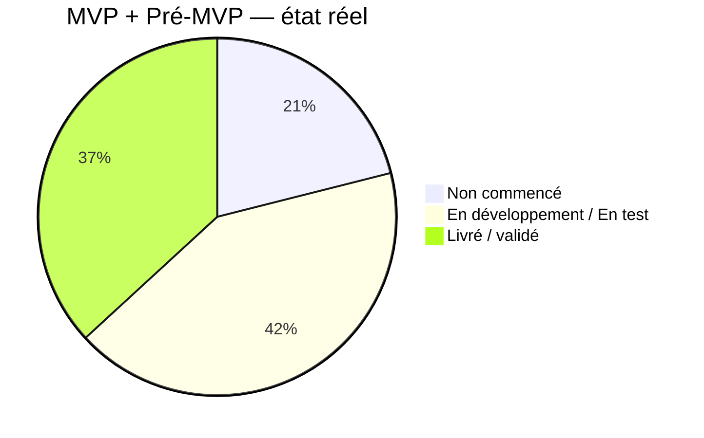
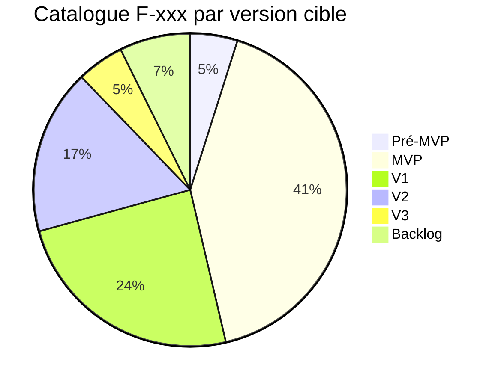
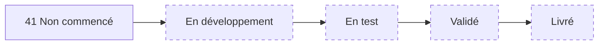
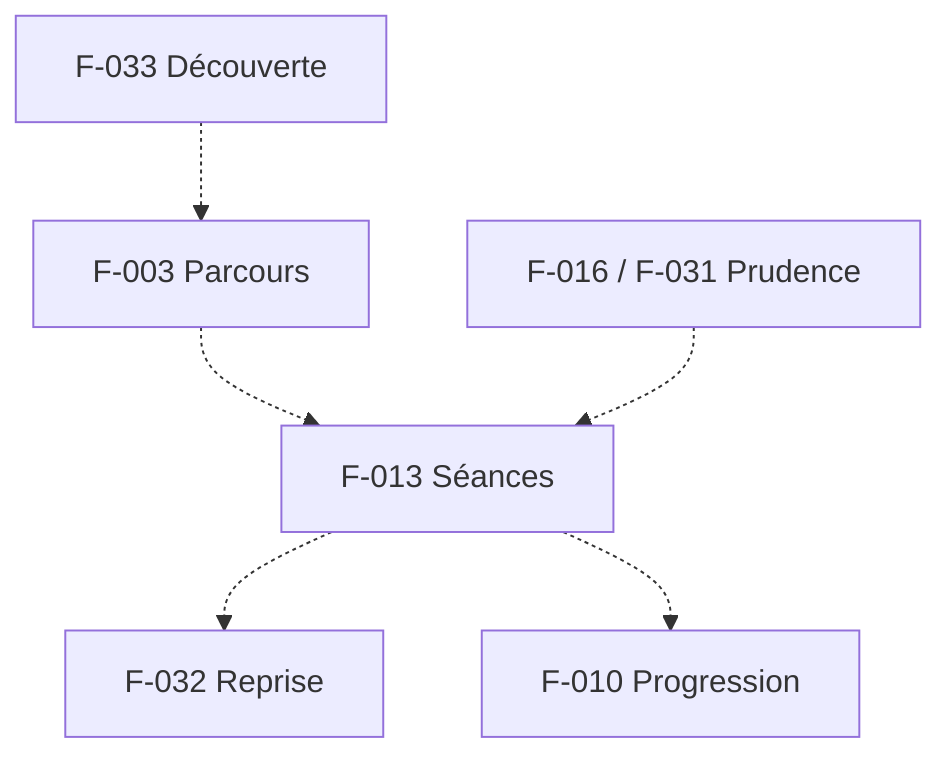
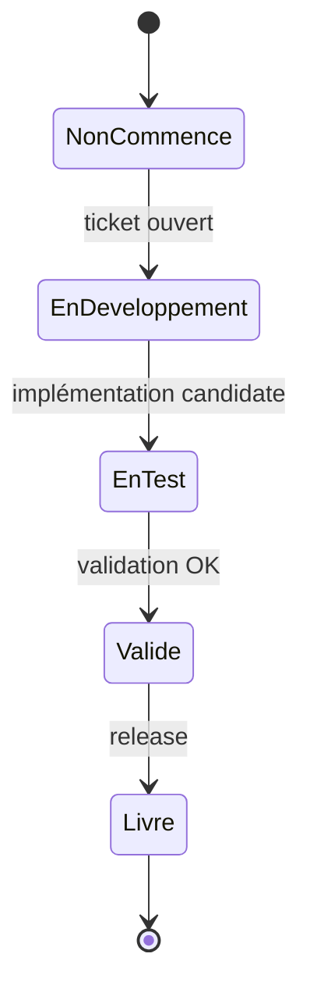

# 02 — Feature Status

## 1. Statut du registre

| Champ | Valeur |
| --- | --- |
| Nom du registre | Feature Status |
| Fichier | `docs/runtime/02_FEATURE_STATUS.md` |
| Version du registre | 1.0 |
| Statut | **ACTIF** |
| Dernière mise à jour | 8 août 2026 — MVP-012 code (F-006 En test ; mapping F-013) |
| Responsable documentaire | Projet Tai-Chi-AI-Coach |
| Type | Runtime Register — état réel des fonctionnalités |
| Référence conception | `docs/05_FEATURES.md` (catalogue figé — intention, non recopié comme livré) |

> Ce registre décrit uniquement l’état **réel** d’implémentation des `F-xxx`.
> Aucune fonctionnalité n’est marquée avancée sans validation réelle.

## 2. Synthèse

| Indicateur | Valeur réelle |
| --- | --- |
| Total des fonctionnalités | **41** (`F-001` … `F-041`) |
| Terminées (Validé / Livré) | **7** (`F-001`, `F-002`, `F-004`, `F-005`, `F-007`, `F-016`, `F-031`) |
| En cours (En développement / En test) | **8** (`F-006`, `F-009`, `F-010`, `F-013`, `F-028`, `F-029`, `F-032`, `F-033`) |
| Restantes (Non commencé) | **26** |

### Répartition par version cible (conception)

| Version cible | Nombre | Statut d’implémentation |
| --- | --- | --- |
| Pré-MVP | 2 | **2 livré** (`F-016`, `F-031`) |
| MVP | 17 | 5 livré (`F-001`, `F-002`, `F-004`, `F-005`, `F-007`) / 8 en cours (`F-006`, `F-009`, `F-010`, `F-013`, `F-028`, `F-029`, `F-032`, `F-033`) / 4 non commencés |
| V1 | 10 | 0 livré / 10 non commencés |
| V2 | 7 | 0 livré / 7 non commencés |
| V3 | 2 | 0 livré / 2 non commencés |
| Backlog | 3 | 0 livré / 3 non commencés |

Versions cibles selon matrice `05` §9. Socle Frontend + Design System + fondation curriculum/séances (MVP-001…003).

## 3. Catalogue — état réel

Statuts autorisés : Non commencé · En développement · En test · Validé · Livré.

| ID | Nom | Version cible | Statut | Ticket | Dernière MAJ | Remarques |
| --- | --- | --- | --- | --- | --- | --- |
| F-001 | Présentation du Tai Chi | MVP | Livré | MVP-010 | 7 août 2026 | Page `/decouverte` ; Hero `mountain` ; non médical ; validé PO |
| F-002 | Découverte des styles | MVP | Livré | MVP-010 | 7 août 2026 | Section légère `/decouverte` ; Yang/Chen/Wu/Sun ; aucun choix obligatoire ; validé PO |
| F-003 | Parcours débutant | MVP | Non commencé | — | — | — |
| F-004 | Bibliothèque des mouvements | MVP | Livré | MVP-011 | 8 août 2026 | `/bibliotheque/mouvements` ; MV-001…003 ; Hero bamboo ; validé PO |
| F-005 | Explication détaillée d’un mouvement | MVP | Livré | MVP-011 | 8 août 2026 | Fiches `/bibliotheque/mouvements/[slug]` ; contenu `08` §27 ; validé PO |
| F-006 | Vidéo pédagogique | MVP | En test | MVP-012 | 8 août 2026 | Infra player + `mediaKeyVideo` ; fallback sans MP4 ; **0** fichier vidéo ; MEDIA REFERENCE MOTION BLOCKED ; attente média |
| F-007 | Images de référence | MVP | Livré | MVP-011 | 8 août 2026 | WebP F-007 768×1280 ; fallback sans média ; validé PO |
| F-008 | Programme quotidien | MVP | Non commencé | — | — | — |
| F-009 | Historique | MVP | En développement | MVP-006 | 6 août 2026 | Historique localStorage ; UI carnet 12A (MVP-008A) ; pas de sync ; pas de stats avancées V1 (F-024) |
| F-010 | Progression | MVP | En développement | MVP-006 | 6 août 2026 | Stats locales sobres (carnet, pas dashboard) ; pas de gamification ; pas de parcours F-003 branché |
| F-011 | Favoris | V1 | Non commencé | — | — | — |
| F-012 | Recherche | V1 | Non commencé | — | — | — |
| F-013 | Séances guidées | MVP | En test | MVP-006 / MVP-012 | 8 août 2026 | Parcours local OK ; **enrichissement mapping** `movementIds` + liens fiche (MVP-012) ; F-013 **pas** Livré global ; pas de player dans PracticePlayer |
| F-014 | Exercices de respiration | MVP | Non commencé | — | — | — |
| F-015 | Relaxation | MVP | Non commencé | — | — | — |
| F-016 | Conseils de sécurité | Pré-MVP | Livré | MVP-009 | 7 août 2026 | Page `/conseils-de-securite` + lien Profil ; Hero `mountain` ; contenu non médical ; validé PO |
| F-017 | Notifications | V1 | Non commencé | — | — | — |
| F-018 | Objectifs personnels | V1 | Non commencé | — | — | — |
| F-019 | Assistant IA | V1 | Non commencé | — | — | — |
| F-020 | Questions / Réponses | V1 | Non commencé | — | — | — |
| F-021 | Analyse caméra | V2 | Non commencé | — | — | — |
| F-022 | Corrections de posture | V2 | Non commencé | — | — | — |
| F-023 | Professeurs virtuels | V2 | Non commencé | — | — | — |
| F-024 | Statistiques | V1 | Non commencé | — | — | — |
| F-025 | Contenus Premium | V2 | Non commencé | — | — | — |
| F-026 | Téléchargement hors ligne | V2 | Non commencé | — | — | — |
| F-027 | Synchronisation multi-appareils | V1 | Non commencé | — | — | — |
| F-028 | Paramètres | MVP | En développement | MVP-007 | 6 août 2026 | Page `/profil` + préférences locales ; UI densifiée 12A (MVP-008A) ; pas d’auth / sync / notifications |
| F-029 | Accessibilité | MVP | En développement | MVP-007 | 6 août 2026 | Préférence « animations réduites » + tokens contraste 12A + `prefers-reduced-motion` ; pas encore tailles de texte avancées |
| F-030 | Export utilisateur | V1 | Non commencé | — | — | — |
| F-031 | Avertissements avant pratique | Pré-MVP | Livré | MVP-009 | 7 août 2026 | Gate pré-pratique `/pratique/...` ; Hero `morning` ; lien F-016 ; validé PO |
| F-032 | Reprise de séance | MVP | En développement | MVP-005 | 5 août 2026 | Pause/reprise **en mémoire de page** uniquement ; pas de reprise après fermeture / refresh |
| F-033 | Première découverte guidée | MVP | En développement | MVP-008 | 5 août 2026 | Onboarding local court (bienvenue, niveau, objectif, durée, confirmation) + « Plus tard » ; pas Mei/caméra ; prudence bienvenue + socle F-016/F-031 (MVP-009) |
| F-034 | Personnalisation avancée | V2 | Non commencé | — | — | — |
| F-035 | Programmes adaptés | V2 | Non commencé | — | — | — |
| F-036 | Moteur de coaching réutilisable | V3 | Non commencé | — | — | — |
| F-037 | Plusieurs disciplines douces | V3 | Non commencé | — | — | — |
| F-038 | Méditation guidée élargie | Backlog | Non commencé | — | — | — |
| F-039 | Compte utilisateur | V1 | Non commencé | — | — | — |
| F-040 | Partenariats écoles / professeurs | Backlog | Non commencé | — | — | — |
| F-041 | Mode hors ligne partiel minimal | Backlog | Non commencé | — | — | — |

## 4. MVP — focus

| Indicateur MVP | Valeur |
| --- | --- |
| Features MVP (+ Pré-MVP héritées) | 19 (`17` MVP + `2` Pré-MVP) |
| Livrées / validées | 4 (`F-001`, `F-002`, `F-016`, `F-031`) |
| En cours | 8 (`F-006`, `F-009`, `F-010`, `F-013`, `F-028`, `F-029`, `F-032`, `F-033`) |
| Non commencées | 7 |

## 5. Historique

| Date | Événement |
| --- | --- |
| 5 août 2026 | Création initiale — 41 fonctionnalités catalogue ; toutes **Non commencé** ; aucun ticket. |
| 5 août 2026 | MVP-001 livré (App Shell) — **aucune** `F-xxx` passée à En développement / Validé / Livré (hors périmètre du ticket). |
| 5 août 2026 | MVP-002 livré (Design System & UI Foundation) — **aucune** `F-xxx` passée à En développement / Validé / Livré (hors périmètre du ticket). |
| 5 août 2026 | MVP-003 : `F-013` → **En développement** (fondation catalogue + fiche) ; démarrage guidé hors périmètre ; `F-004` inchangé. |
| 5 août 2026 | MVP-004 : fondation assets / manifeste — **aucune** `F-xxx` modifiée (hors périmètre métier ; Mei/V2 non activée ; Offline non livré). |
| 5 août 2026 | MVP-005 : `F-013` → **En test** ; `F-032` → **En développement** (pause/reprise locale) ; bilan non persistant. |
| 5 août 2026 | MVP-006 : `F-009` / `F-010` → **En développement** ; historique + stats localStorage ; `F-024` inchangé (V1). |
| 5 août 2026 | MVP-007 : `F-028` / `F-029` → **En développement** ; préférences locales + `/profil` ; pas de sync. |
| 5 août 2026 | MVP-008 : `F-033` → **En développement** ; onboarding local + reprise + skip ; pas Mei/caméra. |
| 6 août 2026 | MVP-008A : **aucune** `F-xxx` créée ni passée Validé/Livré — refonte présentation 12A uniquement (CH-009). |
| 6 août 2026 | MVP-008B Sprint 3 : **aucune** `F-xxx` créée ni modifiée — Hero Light présentation seule (CH-010) ; ticket reste ouvert (Dark). |
| 7 août 2026 | MVP-008B Sprint Dark : **aucune** `F-xxx` créée ni modifiée — Hero Dark présentation seule (CH-011). |
| 7 août 2026 | MVP-008B **fermé** ; roadmap tickets MVP-009→018 officialisée — **aucune** `F-xxx` modifiée (F-016 / F-031 restent Non commencé jusqu’à MVP-009). |
| 7 août 2026 | MVP-009 : `F-016` / `F-031` → **En test** ; conseils consultables + gate pré-pratique ; CH-012 ; clôture Git en attente PO. |
| 7 août 2026 | MVP-009 **fermé** (validation PO) ; `F-016` / `F-031` → **Livré** ; CH-012 clôturé. |
| 7 août 2026 | MVP-010 **ouvert** (cadrage) ; `F-001` / `F-002` restent **Non commencé** (pré-développement documentaire) ; aucune implémentation. |
| 7 août 2026 | MVP-010 code : `F-001` / `F-002` → **En test** ; `/decouverte` ; CH-013 ; clôture Git en attente PO. |
| 7 août 2026 | MVP-010 **fermé** (validation PO) ; `F-001` / `F-002` → **Livré** ; CH-013 clôturé. |
| 7 août 2026 | MVP-011 **ouvert** (cadrage) ; `F-004` / `F-005` / `F-007` restent **Non commencé** (pré-développement documentaire) ; inventaire : 0 mouvement / 0 image F-007 ; aucune implémentation. |
| 7 août 2026 | MVP-011 corpus **MV-001…003** validé PO → `docs/08` §27 ; F-005 doc OK ; F-007 **ASSET BLOCKED** (3 images absentes) ; aucun code. |
| 8 août 2026 | MVP-011 F-007 : 3 WebP réels 768×1280 livrés ; référence Mei tenue documentée ; gate **READY FOR CODE** ; aucun code. |
| 8 août 2026 | MVP-011 code : `F-004` / `F-005` / `F-007` → **En test** ; CH-015 ; attente validation PO ; MVP-012 non ouvert. |
| 8 août 2026 | MVP-011 **fermé** (validation PO) ; `F-004` / `F-005` / `F-007` → **Livré** ; CH-015 clôturé ; MVP-012 non ouvert. |
| 8 août 2026 | MVP-012 **ouvert** (cadrage) ; `F-006` reste **Non commencé** (pré-dev documentaire) ; enrichissement F-013 cadragé ; aucun code. |
| 8 août 2026 | MVP-012 code : `F-006` → **En test** ; enrichissement F-013 mapping livré (pas Livré global) ; **0** MP4 ; MEDIA BLOCKED ; ticket **non fermé** ; MVP-013 non ouvert. |

## 6. Diagrammes

### 6.1 Avancement MVP

### 6.2 Répartition des versions

### 6.3 Progression globale

### 6.4 Dépendances principales (référence catalogue — non implémentées)

### 6.5 Cycle de vie d’une fonctionnalité

## 7. Gouvernance

Toute modification d’une fonctionnalité (démarrage, test, validation, livraison) **doit** mettre à jour ce registre dans le même ticket, puis répercuter la synthèse dans `00_PROJECT_STATUS.md`.

Ne jamais marquer **Validé** ou **Livré** sans preuve réelle.

## 8. Règles de mise à jour

- après chaque ticket touchant un `F-xxx` ;
- après chaque Release impactant le catalogue ;
- après tout abandon / report documenté d’une feature en cours.

## 9. Prochaine étape documentaire

`docs/runtime/03_DATA_STATUS.md` (batch) puis `docs/runtime/04_API_STATUS.md`.

## 10. Références

- `docs/runtime/README.md`
- `docs/05_FEATURES.md`
- `docs/25_DESIGN_FREEZE.md`

---

## Pied de document

| Champ | Valeur |
| --- | --- |
| Version | 1.0 |
| Statut | ACTIF |
| Prochain registre | `03_DATA_STATUS.md` / puis `04_API_STATUS.md` |
| Fin officielle | Oui |

*Fin officielle du document.*
