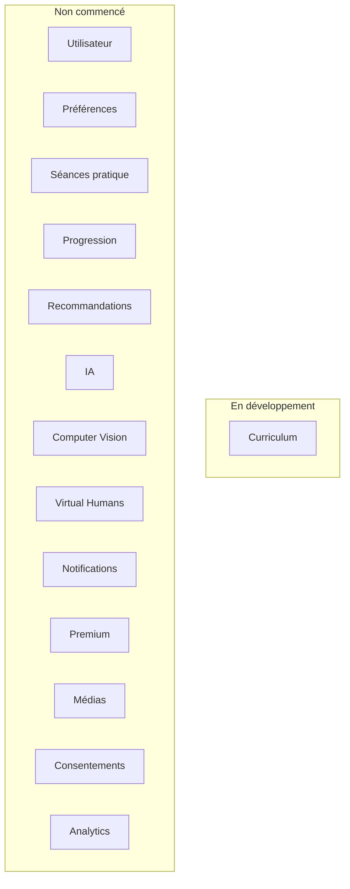
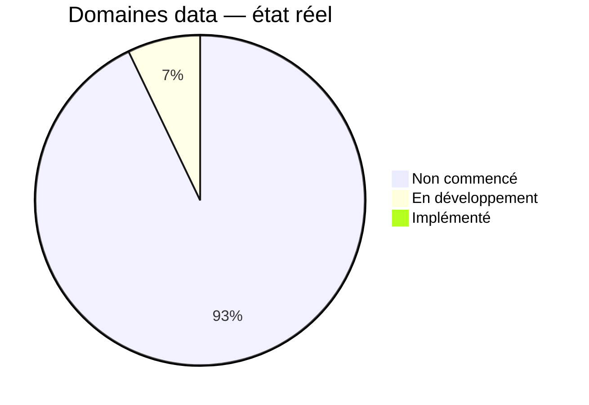
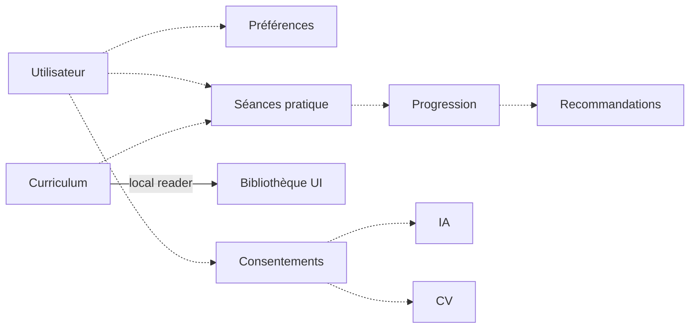
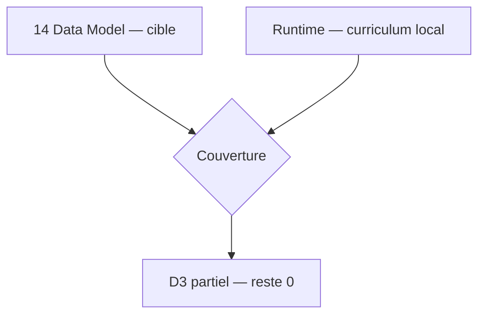
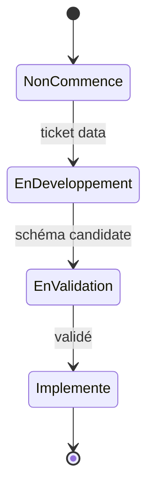

# 03 — Data Status

## 1. Statut du registre

| Champ | Valeur |
| --- | --- |
| Nom du registre | Data Status |
| Fichier | `docs/runtime/03_DATA_STATUS.md` |
| Version du registre | 1.0 |
| Statut | **ACTIF** |
| Dernière mise à jour | 5 août 2026 — MVP-003 |
| Responsable documentaire | Projet Tai-Chi-AI-Coach |
| Type | Runtime Register — état réel du modèle de données |
| Référence conception | `docs/14_DATA_MODEL.md` (modèle cible / gelé — non recopié comme implémenté) |

> Ce registre décrit uniquement ce qui est **effectivement** modélisé / stocké / migré en runtime.

## 2. Synthèse

| Indicateur | Valeur réelle |
| --- | --- |
| Domaines suivis | 14 (périmètre demandé) |
| Implémentés | **0** |
| En validation / développement | **1** (Curriculum — types TS + JSON embarqué) |
| Non commencés | **13** |
| Schéma DB / migrations applicatives | Absents |
| Données métier | Curriculum local embarqué (3 `SessionTemplate` structurels) ; **aucune** donnée utilisateur |

## 3. Domaines — état réel

Statuts autorisés : Non commencé · En développement · En validation · Implémenté.

| Domaine | Alignement conception (`14`) | État réel | Ticket | Dernière MAJ | Remarques |
| --- | --- | --- | --- | --- | --- |
| Utilisateur | D1 Identité | Non commencé | — | — | Aucun profil / compte runtime |
| Préférences | D10 | Non commencé | — | — | — |
| Curriculum | D3 | En développement | MVP-003 | 5 août 2026 | Types + données locales + reader ; `SessionTemplate` / `SessionStep` / phases ; pas SQL |
| Séances | D4 Pratique | Non commencé | — | — | Pas de `PracticeSession` (exécution utilisateur) |
| Progression | D5 | Non commencé | — | — | — |
| Recommandations | D6 | Non commencé | — | — | — |
| IA | D7 IA Coach | Non commencé | — | — | — |
| Computer Vision | D8 | Non commencé | — | — | — |
| Virtual Humans | D9 | Non commencé | — | — | — |
| Notifications | D11 | Non commencé | — | — | — |
| Premium | D12 | Non commencé | — | — | — |
| Médias | D13 | Non commencé | — | — | — |
| Consentements | D14 | Non commencé | — | — | — |
| Analytics | D15 | Non commencé | — | — | Produit = V1 en conception ; rien en runtime |

Domaines `14` non listés dans la table de suivi demandée (Onboarding D2, Export D16, Sync D17) : **également non commencés** — pas de stockage réel.

## 4. Conformité avec `14_DATA_MODEL.md`

| Élément | Statut | Justification |
| --- | --- | --- |
| Modèle de données conception | Conforme (gelé) | Baseline Design Freeze |
| Implémentation réelle | Partielle | Sous-ensemble D3 en TypeScript + fichier local ; pas de persistance distante |
| Divergence | **Aucune** | Séparation `SessionTemplate` / `PracticeSession` respectée (pratique absente) |

## 5. Écarts

Aucun écart connu.

Note : les 3 séances locales sont des **placeholders structurels** (`isStructuralPlaceholder`) dérivés de `08` — pas un catalogue de mouvements inventé.

## 6. Historique

| Date | Événement |
| --- | --- |
| 5 août 2026 | Création initiale — tous domaines **Non commencé** ; aucune donnée métier ; aucune divergence. |
| 5 août 2026 | MVP-003 — Curriculum → **En développement** (types + `local-curriculum` + reader) ; 0 SQL / 0 Supabase. |

## 7. Diagrammes

### 7.1 Domaines de données

### 7.2 Progression

### 7.3 Dépendances (structurelles — partiellement implémentées)

### 7.4 Couverture

### 7.5 Cycle d’évolution

## 8. Gouvernance

Toute évolution du modèle de données (entité, migration, stockage local, sync) **doit** mettre à jour ce registre, référencer le ticket, vérifier la conformité avec `docs/14_DATA_MODEL.md`, et répercuter la synthèse dans `00_PROJECT_STATUS.md` si l’état global change.

## 9. Règles de mise à jour

- après chaque ticket touchant le schéma ou le stockage ;  
- après chaque migration réelle ;  
- après toute divergence constatée avec `14`.

## 10. Prochaine étape

Enrichir le curriculum / démarrer la pratique (`PracticeSession`) selon ticket suivant — sans anticiper hors backlog.

## 11. Références

- `docs/runtime/README.md`  
- `docs/runtime/00_PROJECT_STATUS.md`  
- `docs/14_DATA_MODEL.md`  
- `docs/25_DESIGN_FREEZE.md`  

---

## Pied de document

| Champ | Valeur |
| --- | --- |
| Version | 1.0 |
| Statut | ACTIF |
| Prochain document | `docs/runtime/04_API_STATUS.md` |
| Fin officielle | Oui |

*Fin officielle du document.*
