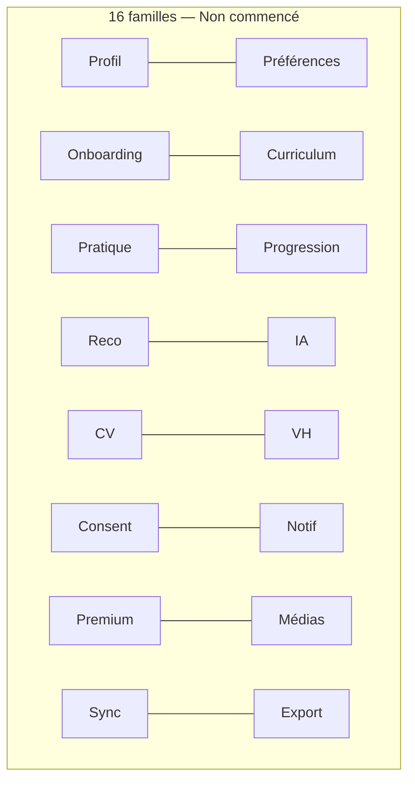
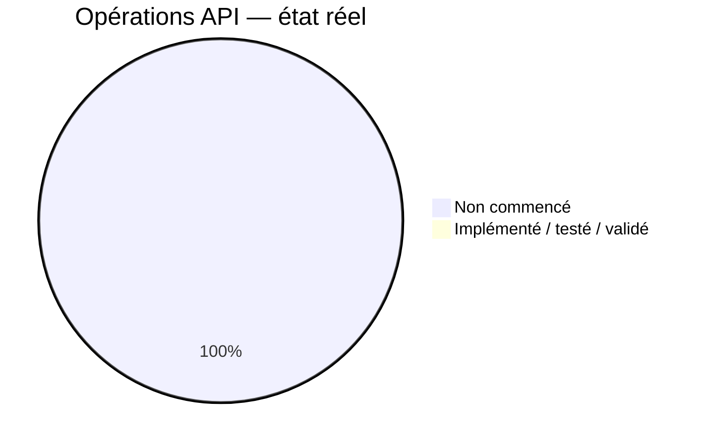
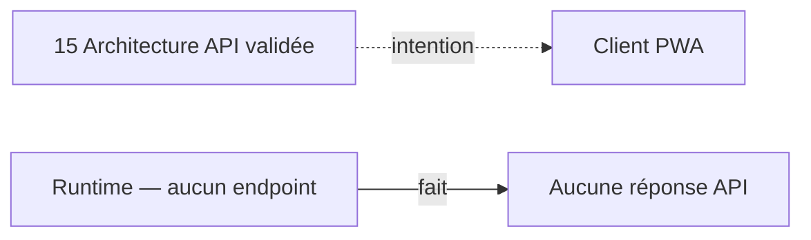
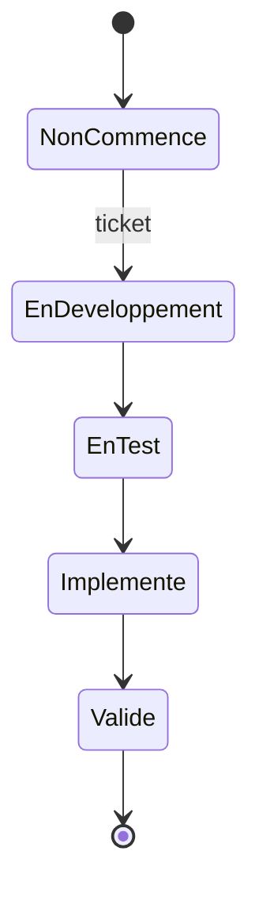
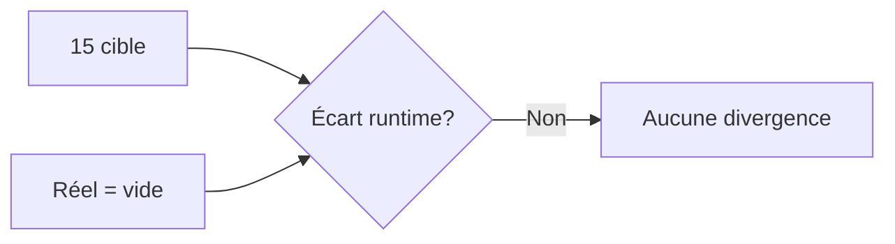

# 04 — API Status

## 1. Statut du registre

| Champ | Valeur |
| --- | --- |
| Nom du registre | API Status |
| Fichier | `docs/runtime/04_API_STATUS.md` |
| Version du registre | 1.0 |
| Statut | **ACTIF** |
| Dernière mise à jour | 5 août 2026 |
| Phase actuelle | Post–Design Freeze — initialisation Runtime |
| Document de conception | `docs/15_API_ARCHITECTURE.md` |
| Type | Runtime Register — état réel des API |

> Ce registre décrit uniquement ce qui est **effectivement implémenté**.  
> Les opérations de `15` restent conceptuelles tant qu’aucun endpoint n’existe.

## 2. État général

| Catégorie | État réel |
| --- | --- |
| API cliente | Non commencé |
| API internes | Non commencé |
| Adapters fournisseurs | Non commencé |
| API administratives futures | Non commencé |
| Contrats de réponse | Non commencé |
| Contrats d’erreur | Non commencé |
| Validation des entrées | Non commencé |
| Pagination | Non commencé |
| Idempotence | Non commencé |
| Concurrence | Non commencé |
| Traitements asynchrones | Non commencé |
| Synchronisation | Non commencé |
| Médias | Non commencé |
| Export et suppression | Non commencé |

**Synthèse :** 0 endpoint · 0 opération implémentée · 0 ticket API.

## 3. Familles d’API (16)

| Famille | Périmètre produit (conception) | Statut réel | Ticket | Ops impl. | Ops testées | Conformité contrat | Dernière MAJ | Remarque |
| --- | --- | --- | --- | --- | --- | --- | --- | --- |
| 10.1 Profil utilisateur | MVP local / V1 compte | Non commencé | — | 0 | 0 | N/A (rien exposé) | — | — |
| 10.2 Préférences | MVP | Non commencé | — | 0 | 0 | N/A | — | — |
| 10.3 Onboarding | MVP | Non commencé | — | 0 | 0 | N/A | — | — |
| 10.4 Curriculum | Pré-MVP / MVP | Non commencé | — | 0 | 0 | N/A | — | — |
| 10.5 Séances de pratique | MVP | Non commencé | — | 0 | 0 | N/A | — | — |
| 10.6 Progression | MVP / Favoris V1 | Non commencé | — | 0 | 0 | N/A | — | — |
| 10.7 Recommandations | MVP / V1 IA | Non commencé | — | 0 | 0 | N/A | — | — |
| 10.8 IA Coach | V1 | Non commencé | — | 0 | 0 | N/A | — | — |
| 10.9 Computer Vision | V2 | Non commencé | — | 0 | 0 | N/A | — | — |
| 10.10 Virtual Humans | V2 | Non commencé | — | 0 | 0 | N/A | — | — |
| 10.11 Consentements | MVP+ | Non commencé | — | 0 | 0 | N/A | — | — |
| 10.12 Notifications | V1 | Non commencé | — | 0 | 0 | N/A | — | — |
| 10.13 Premium / entitlements | Socle MVP / payant V2 | Non commencé | — | 0 | 0 | N/A | — | — |
| 10.14 Médias / téléchargements | MVP méta / V2 packs | Non commencé | — | 0 | 0 | N/A | — | — |
| 10.15 Synchronisation | V1 | Non commencé | — | 0 | 0 | N/A | — | — |
| 10.16 Export et suppression | V1 | Non commencé | — | 0 | 0 | N/A | — | — |

Aucun endpoint réel. Aucune route inventée.

## 4. Opérations conceptuelles (40) — état réel

Toutes les opérations du catalogue `15` § catalogue sont **Non commencé** (0 Implémenté / 0 Testé / 0 Validé).

| # | Opération conceptuelle | Domaine | Version cible | État |
| --- | --- | --- | --- | --- |
| 1 | GetCurrentUserProfile | Profil | MVP/V1 | Non commencé |
| 2 | UpdateUserProfile | Profil | MVP/V1 | Non commencé |
| 3 | GetUserPreferences | Préférences | MVP | Non commencé |
| 4 | UpdateUserPreferences | Préférences | MVP | Non commencé |
| 5 | GetOnboardingState | Onboarding | MVP | Non commencé |
| 6 | CompleteOnboardingStep | Onboarding | MVP | Non commencé |
| 7 | FinalizeOnboarding | Onboarding | MVP | Non commencé |
| 8 | ListCurriculumSessions | Curriculum | MVP | Non commencé |
| 9 | GetSessionDefinition | Curriculum | MVP | Non commencé |
| 10 | ListMovements | Curriculum | MVP | Non commencé |
| 11 | StartPracticeSession | Pratique | MVP | Non commencé |
| 12 | PausePracticeSession | Pratique | MVP | Non commencé |
| 13 | ResumePracticeSession | Pratique | MVP | Non commencé |
| 14 | CompletePracticeStep | Pratique | MVP | Non commencé |
| 15 | CompletePracticeSession | Pratique | MVP | Non commencé |
| 16 | AbandonPracticeSession | Pratique | MVP | Non commencé |
| 17 | ListPracticeHistory | Pratique | MVP | Non commencé |
| 18 | GetUserProgress | Progression | MVP | Non commencé |
| 19 | RebuildProgressFromEvents | Progression | MVP | Non commencé |
| 20 | ListFavorites / MutateFavorite | Progression | V1 | Non commencé |
| 21 | ListRecommendations | Reco | MVP | Non commencé |
| 22 | RespondToRecommendation | Reco | MVP | Non commencé |
| 23 | OpenCoachInteraction | IA | V1 | Non commencé |
| 24 | SendCoachMessage | IA | V1 | Non commencé |
| 25 | GetCoachJobStatus | IA | V1 | Non commencé |
| 26 | StartVisionAnalysis | CV | V2 | Non commencé |
| 27 | StopVisionAnalysis | CV | V2 | Non commencé |
| 28 | GetVisionResults | CV | V2 | Non commencé |
| 29 | ListVirtualGuides | VH | V2 | Non commencé |
| 30 | GetGuideInterventionsForSession | VH | V2 | Non commencé |
| 31 | ListRequiredConsents | Consent | MVP+ | Non commencé |
| 32 | UpdateConsent | Consent | MVP+ | Non commencé |
| 33 | GetNotificationPreferences | Notif | V1 | Non commencé |
| 34 | ListNotifications | Notif | V1 | Non commencé |
| 35 | MarkNotificationRead | Notif | V1 | Non commencé |
| 36 | GetEntitlements | Premium | MVP/V2 | Non commencé |
| 37 | CheckCapability | Premium | MVP/V2 | Non commencé |
| 38 | GetMediaMetadata | Médias | MVP | Non commencé |
| 39 | RequestMediaAccessUrl | Médias | MVP/V2 | Non commencé |
| 40 | SynchronizeClientChanges | Sync | V1 | Non commencé |
| — | RequestDataExport | Export | V1 | Non commencé |
| — | GetDataExportStatus | Export | V1 | Non commencé |
| — | RequestAccountDeletion | Suppression | V1 | Non commencé |

> Note factuelle : le document `15` annonce « 40 opérations conceptuelles » ; le tableau catalogue liste aussi Export/Suppression. Toutes restent **Non commencé** en runtime. Aucune n’est une route HTTP réelle.

## 5. Contrats API

| Élément | État réel |
| --- | --- |
| Enveloppes de réponse | Non commencé — aucun contrat exécutable |
| Collections | Non commencé |
| Erreurs structurées | Non commencé |
| Statuts HTTP | Non commencé |
| Métadonnées | Non commencé |
| Versionnement API | Non commencé |
| Identifiants de corrélation | Non commencé |

## 6. Idempotence et concurrence

| Mécanisme | État réel |
| --- | --- |
| Idempotency keys | Non commencé |
| Contrôle optimiste | Non commencé |
| Version de ressource | Non commencé |
| Gestion des conflits | Non commencé |
| Opérations rejouables | Non commencé |

## 7. Traitements asynchrones

| Élément | État réel |
| --- | --- |
| Jobs | Non commencé |
| Files d’attente | Non commencé |
| Statuts async | Non commencé |
| Polling | Non commencé |
| Streaming | Non commencé |

## 8. Fournisseurs externes

| Domaine | Adapter (conception) | Fournisseur Runtime | Statut | Fallback Runtime | Ticket |
| --- | --- | --- | --- | --- | --- |
| IA | AI Provider Adapter | Non sélectionné | Non commencé | — | — |
| Voix / TTS | TTS Adapter | Non sélectionné | Non commencé | — | — |
| Notifications | Push/Email Adapter | Non sélectionné | Non commencé | — | — |
| Stockage objet | Object Storage Adapter | Non sélectionné | Non commencé | — | — |
| Paiement | Billing Adapter | Non sélectionné | Non commencé | — | — |
| Analytics | Analytics Sink | Non sélectionné | Non commencé | — | — |
| CV | Vision Adapter | Non sélectionné | Non commencé | — | — |

Aucun fournisseur Runtime intégré. Les mentions de conception ne valent pas intégration.

## 9. Conformité

| Élément | Statut |
| --- | --- |
| Conformité actuelle vs `15` | Conforme à l’absence d’implémentation attendue |
| Divergences | **Aucune** |
| Décisions Runtime | **Aucune** |

## 10. Écarts et blocages

| Type | Constat |
| --- | --- |
| Écart API | Aucun |
| Blocage spécifique API | Aucun |
| Contexte | Initialisation Runtime toujours en cours (`04`…`19` incomplets) |

## 11. Dette API

Aucune dette API identifiée (pas de code).

## 12. Diagrammes

### 12.1 Familles API

### 12.2 État d’implémentation

### 12.3 Flux cible versus état réel

### 12.4 Cycle d’une opération API

### 12.5 Conformité

## 13. Gouvernance

Toute implémentation ou modification d’API devra :

1. référencer un ticket ;  
2. identifier la famille concernée ;  
3. vérifier la conformité avec `15` ;  
4. documenter les tests ;  
5. mettre à jour ce registre ;  
6. synchroniser `00_PROJECT_STATUS.md` si l’état global change.

## 14. Historique

| Date | Événement |
| --- | --- |
| 5 août 2026 | Création du registre ; initialisation depuis l’état réel ; absence de code, d’endpoint et d’implémentation API. |

## 15. Références

- `docs/15_API_ARCHITECTURE.md`  
- `docs/runtime/README.md`  
- `docs/runtime/00_PROJECT_STATUS.md`  
- `docs/25_DESIGN_FREEZE.md`  

---

## Pied de document

| Champ | Valeur |
| --- | --- |
| Version | 1.0 |
| Statut | ACTIF |
| Prochain document | `05_SECURITY_STATUS.md` / puis `06_PRIVACY_STATUS.md` |
| Fin officielle | Oui |

*Fin officielle du document.*
