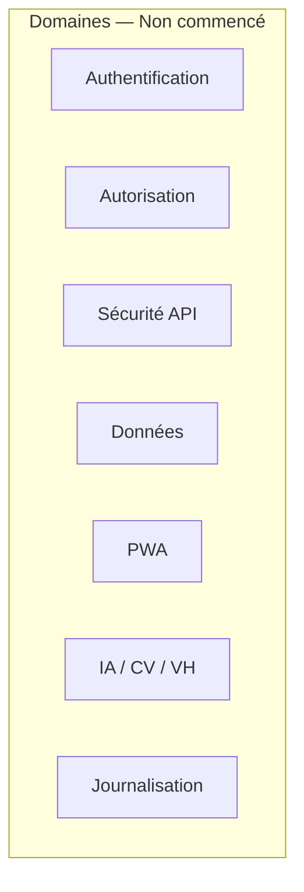
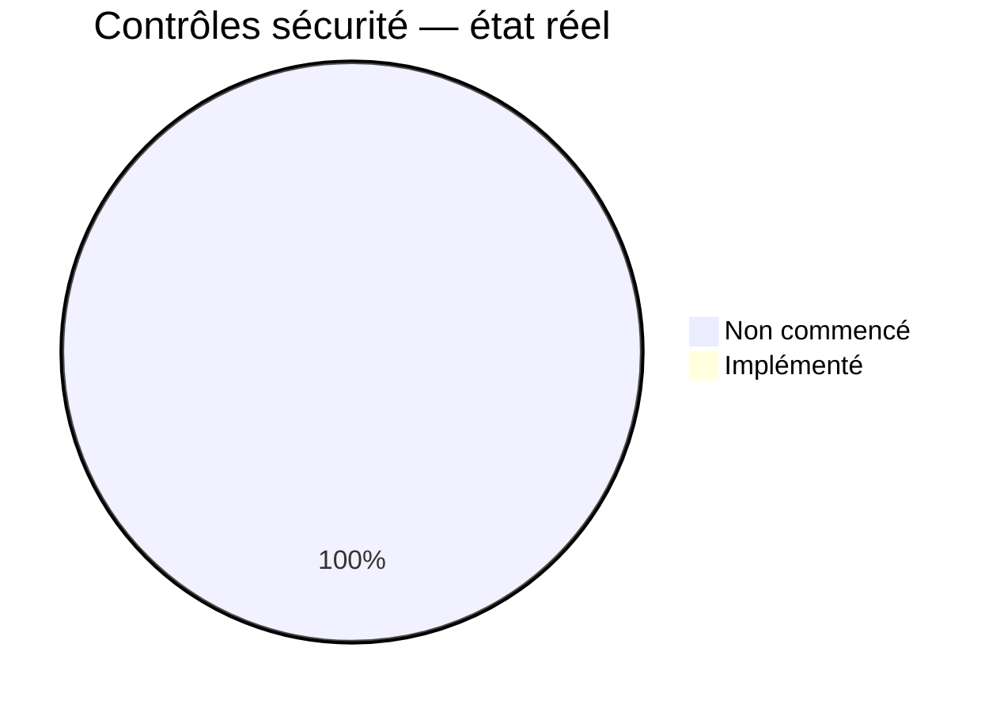
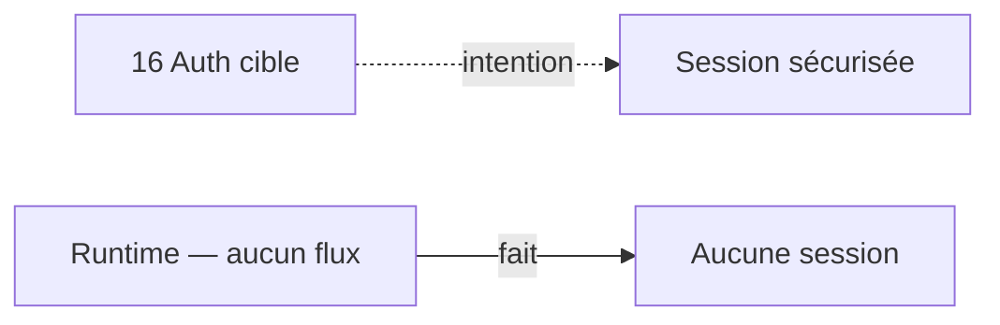
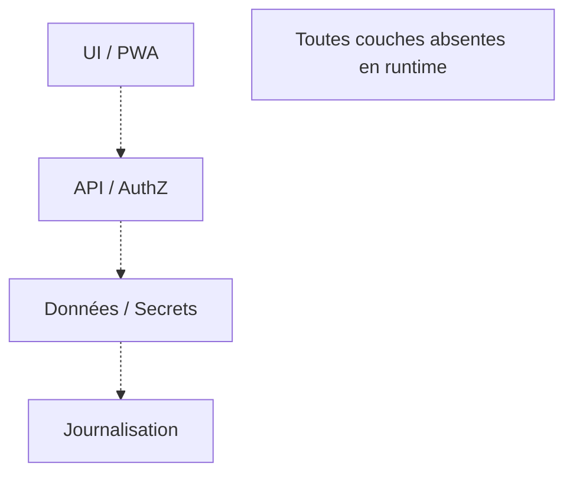
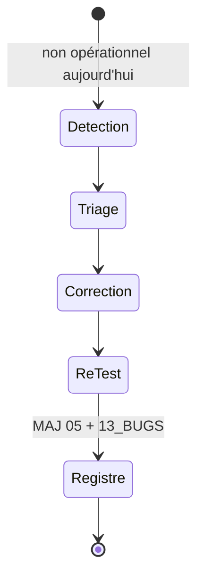

# 05 — Security Status

## 1. Statut du registre

| Champ | Valeur |
| --- | --- |
| Nom du registre | Security Status |
| Fichier | `docs/runtime/05_SECURITY_STATUS.md` |
| Version du registre | 1.0 |
| Statut | **ACTIF** |
| Dernière mise à jour | 5 août 2026 |
| Phase actuelle | Post–Design Freeze — initialisation Runtime |
| Document de référence | `docs/16_AUTH_SECURITY.md` |
| Type | Runtime Register — état réel auth / sécurité |

> Ce registre décrit uniquement les contrôles **réellement implémentés**.  
> Absence d’audit ≠ preuve de sécurité.

## 2. État général

| Domaine | État réel |
| --- | --- |
| Création de compte | Non commencé |
| Connexion | Non commencé |
| Déconnexion | Non commencé |
| Réinitialisation du mot de passe | Non commencé |
| Changement du mot de passe | Non commencé |
| Vérification d’email | Non commencé |
| Gestion des sessions | Non commencé |
| Autorisation | Non commencé |
| Sécurité API | Non commencé |
| Protection des données | Non commencé |
| Sécurité PWA | Non commencé |
| Sécurité IA | Non commencé |
| Sécurité Computer Vision | Non commencé |
| Sécurité Virtual Humans | Non commencé |
| Journalisation de sécurité | Non commencé |
| Protections OWASP | Non commencé |

**Synthèse :** aucun mécanisme d’authentification, d’autorisation ou de sécurité applicative n’est implémenté.

## 3. Authentification

| Élément | État réel |
| --- | --- |
| Fournisseur d’identité | Non sélectionné / Non commencé |
| Création de compte | Non commencé |
| Login | Non commencé |
| Logout | Non commencé |
| Email verification | Non commencé |
| Password reset | Non commencé |
| Session renewal | Non commencé |
| Multi-appareils | Non commencé |
| Déconnexion distante | Non commencé |
| Session applicative | Aucune |

## 4. UX mot de passe (D-113)

Référence conception : `16` + `12` §19.1 · décision D-113.

| Exigence | État réel | Tests |
| --- | --- | --- |
| Icône / bouton œil | Non commencé | — |
| Affichage / masquage | Non commencé | — |
| Accessibilité clavier | Non commencé | — |
| Libellés accessibles | Non commencé | — |
| Compatibilité lecteur d’écran | Non commencé | — |
| Conservation de la valeur saisie | Non commencé | — |
| Tests associés | Non commencé | — |

**Règle D-113 :** **non satisfaite** (aucune UI auth). Ne pas déclarer conforme avant implémentation et test.

## 5. Autorisation

| Élément | État réel |
| --- | --- |
| Isolation des données utilisateur | Non commencé |
| Rôles | Non commencé |
| Permissions | Non commencé |
| Entitlements | Non commencé |
| Administration future | Non commencé |
| Moindre privilège (runtime) | Non commencé |

## 6. Sécurité API

| Contrôle | État réel |
| --- | --- |
| Contrôle d’accès | Non commencé |
| Validation des entrées | Non commencé |
| Rate limiting | Non commencé |
| Protection anti-replay | Non commencé |
| Idempotence sensible | Non commencé |
| Gestion des erreurs (sans fuite) | Non commencé |
| Masquage des détails internes | Non commencé |

## 7. Sécurité des données

| Élément | État réel |
| --- | --- |
| Chiffrement en transit | Non commencé — aucune infra choisie / déployée |
| Chiffrement au repos | Non commencé — aucune garantie inventée |
| Gestion des secrets | Non commencé |
| Stockage local sécurisé | Non commencé |
| Suppression sécurisée | Non commencé |
| Minimisation (runtime) | Non commencé |

## 8. Menaces — matrice de suivi

| Menace | Protection prévue (`16`) | Protection réelle | Test | Statut |
| --- | --- | --- | --- | --- |
| Brute force | Oui (conception) | Non commencé | — | Non commencé |
| Credential stuffing | Oui | Non commencé | — | Non commencé |
| XSS | Oui | Non commencé | — | Non commencé |
| CSRF | Oui | Non commencé | — | Non commencé |
| Injections | Oui | Non commencé | — | Non commencé |
| Clickjacking | Oui | Non commencé | — | Non commencé |
| Replay | Oui | Non commencé | — | Non commencé |
| Vol de session | Oui | Non commencé | — | Non commencé |
| Accès non autorisé | Oui | Non commencé | — | Non commencé |
| Exposition de secrets | Oui | Non commencé | — | Non commencé |

## 9. Sécurité IA, CV et Virtual Humans

### 9.1 IA

| Contrôle | État réel |
| --- | --- |
| Isolation fournisseur | Non commencé |
| Protection des prompts | Non commencé |
| Quotas | Non commencé |
| Logs minimisés | Non commencé |

### 9.2 Computer Vision

| Contrôle | État réel |
| --- | --- |
| Consentement | Non commencé |
| Arrêt immédiat | Non commencé |
| Absence de stockage vidéo brut | Non commencé (rien à stocker) |
| Isolation des traitements | Non commencé |

### 9.3 Virtual Humans

| Contrôle | État réel |
| --- | --- |
| Médias | Non commencé |
| Versions | Non commencé |
| Droits d’accès | Non commencé |
| Séparation des guides | Non commencé |

## 10. Journalisation et audit

| Élément | État réel |
| --- | --- |
| Événements de sécurité | Non commencé |
| Request IDs | Non commencé |
| Accès sensibles | Non commencé |
| Incidents | Non commencé |
| Changements d’autorisation | Non commencé |
| Exclusions de données sensibles | Non commencé |

Aucune journalisation Runtime implémentée.

## 11. Conformité

| Élément | Statut |
| --- | --- |
| Conformité vs `16` | Conforme à l’absence d’implémentation attendue |
| Divergences | **Aucune** |
| Décisions Runtime | **Aucune** |
| Dette sécurité connue | **Aucune** |

## 12. Vulnérabilités et incidents

| Type | Constat |
| --- | --- |
| Vulnérabilités enregistrées | Aucune |
| Incidents | Aucun |
| Audit d’exécution | Aucun réalisé |

Ne pas interpréter l’absence d’incident comme une preuve de sécurité.

## 13. Diagrammes

### 13.1 Domaines de sécurité

### 13.2 État des contrôles

### 13.3 Flux d’authentification cible versus réel

### 13.4 Défense en profondeur (cible non déployée)

### 13.5 Cycle d’une anomalie sécurité

## 14. Gouvernance

Toute évolution auth / sécurité devra :

1. référencer un ticket ;  
2. identifier les contrôles impactés ;  
3. vérifier la conformité avec `16` ;  
4. documenter les tests (dont D-113 si MDP) ;  
5. mettre à jour ce registre ;  
6. synchroniser `00`, `04`, `06` ou `09` si nécessaire.

## 15. Historique

| Date | Événement |
| --- | --- |
| 5 août 2026 | Création du registre ; initialisation depuis l’état réel ; absence de code et d’implémentation sécurité. |

## 16. Références

- `docs/16_AUTH_SECURITY.md`  
- `docs/12_UX_UI.md` §19.1 (D-113)  
- `docs/runtime/README.md`  
- `docs/25_DESIGN_FREEZE.md`  

---

## Pied de document

| Champ | Valeur |
| --- | --- |
| Version | 1.0 |
| Statut | ACTIF |
| Prochain document | `docs/runtime/06_PRIVACY_STATUS.md` |
| Fin officielle | Oui |

*Fin officielle du document.*
