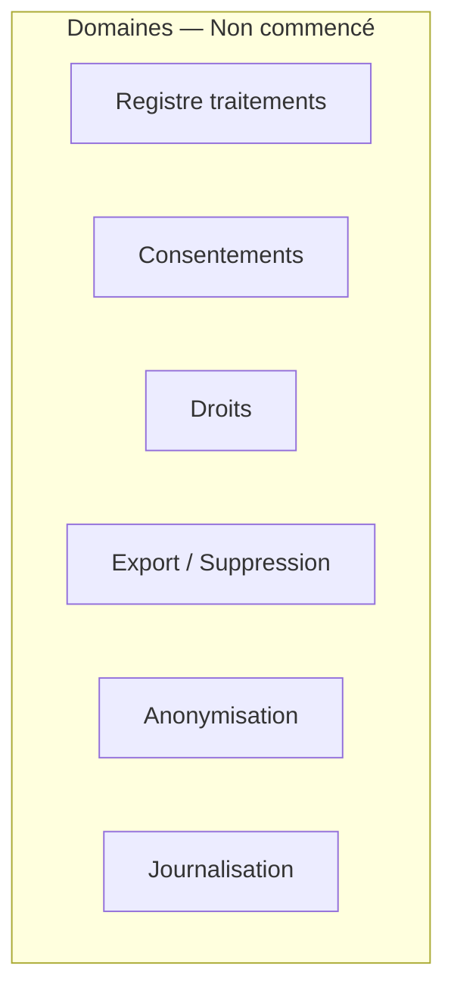
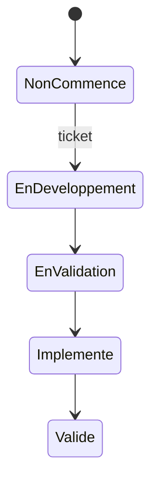
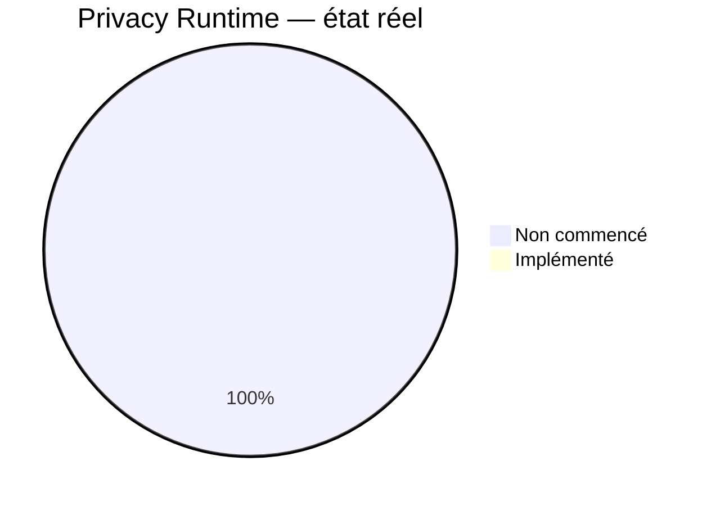
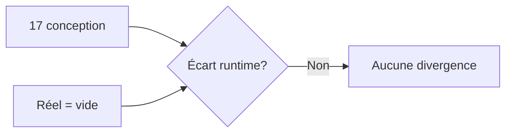

# 06 — Privacy Status

## 1. Statut du registre

| Champ | Valeur |
| --- | --- |
| Nom du registre | Privacy Status |
| Fichier | `docs/runtime/06_PRIVACY_STATUS.md` |
| Version du registre | 1.0 |
| Statut | **ACTIF** |
| Dernière mise à jour | 9 août 2026 — MVP-015 Fermé ; wipe pratique locale Profil |
| Phase actuelle | Développement MVP — données locales (prefs / onboarding / progress / resume) ; pas de compte |
| Document de référence | `docs/17_PRIVACY_RGPD.md` |
| Type | Runtime Register — état réel RGPD / privacy |

> Ce registre suit exclusivement l’état **réel** d’implémentation des exigences RGPD.  
> Il ne décrit jamais la politique prévue.

## 2. État général

| Domaine | État réel |
| --- | --- |
| Registre des traitements | Non commencé |
| Consentements | Non commencé |
| Export utilisateur | Non commencé |
| Suppression | Partiel — wipe pratique locale Profil (MVP-015) ; pas de compte |
| Anonymisation | Non commencé |
| Conservation | Non commencé |
| Journalisation RGPD | Non commencé |
| Gouvernance (runtime) | Non commencé |
| Droits utilisateur | Non commencé |
| Privacy by Design (implémenté) | Non commencé |
| Privacy by Default (implémenté) | Non commencé |

**Synthèse :** pas de compte / export / consentements Runtime. Wipe local MVP-015 : historique + reprise (prefs / onboarding conservés).

## 3. Consentements

| Type / traitement | État réel | Ticket | Remarque |
| --- | --- | --- | --- |
| IA (`ai_coach`) | Non commencé | — | Conception V1 |
| Caméra (`camera`) | Non commencé | — | Conception V2 |
| Computer Vision | Non commencé | — | Conception V2 |
| Analytics | Non commencé | — | Conception V1+ (produit) |
| Notifications | Non commencé | — | Conception V1 |
| Autres traitements | Non commencé | — | — |

Aucun flux de consentement, aucune preuve versionnée, aucun opt-in Runtime.

## 4. Droits utilisateur

| Droit | État réel |
| --- | --- |
| Accès | Non commencé |
| Rectification | Non commencé |
| Suppression | Non commencé |
| Portabilité | Non commencé |
| Limitation | Non commencé |
| Opposition | Non commencé |

## 5. Registre des traitements

| Indicateur | Valeur réelle |
| --- | --- |
| Traitements Runtime enregistrés | **0** |
| Registre opérationnel | Absent |

Le catalogue de traitements de conception (`17`) n’est **pas** un registre Runtime.

## 6. Conformité

| Élément | Statut |
| --- | --- |
| Conformité vs `17` | Conforme à l’absence d’implémentation attendue |
| Divergences | **Aucune** |
| Décisions Runtime | **Aucune** |

## 7. Incidents

| Type | Constat |
| --- | --- |
| Incidents RGPD | Aucun |
| Violations | Aucune |
| Demandes utilisateurs | Aucune |

## 8. Diagrammes

### 8.1 Domaines RGPD

### 8.2 Cycle d’un consentement

### 8.3 État d’implémentation

### 8.4 Gouvernance

### 8.5 Conformité

## 9. Gouvernance

Toute évolution impactant des données personnelles devra :

1. référencer un ticket ;  
2. vérifier la conformité avec `docs/17_PRIVACY_RGPD.md` ;  
3. mettre à jour ce registre ;  
4. synchroniser `00_PROJECT_STATUS.md` / `03` / `05` si nécessaire.

## 10. Historique

| Date | Événement |
| --- | --- |
| 5 août 2026 | Création du registre ; initialisation depuis l’état réel ; aucune implémentation RGPD. |
| 9 août 2026 | MVP-015 **ouvert** — cadrage wipe historique/reprise locaux (PO-E) ; aucune implémentation. |
| 9 août 2026 | MVP-015 **Livré (code)** — Profil « Effacer mes données de pratique » (history + resume). |
| 9 août 2026 | MVP-015 **fermé** (validation PO) — wipe local validé ; prefs / onboarding conservés ; CH-019. |

## 11. Références

- `docs/17_PRIVACY_RGPD.md`
- `docs/runtime/README.md`
- `docs/runtime/05_SECURITY_STATUS.md`
- `docs/tickets/MVP-015_HISTORY_PROGRESS_RESUME.md`
- `docs/25_DESIGN_FREEZE.md`

---

## Pied de document

| Champ | Valeur |
| --- | --- |
| Version | 1.0 |
| Statut | ACTIF |
| Prochain document | `07_OFFLINE_STATUS.md` / puis `08_ANALYTICS_STATUS.md` |
| Fin officielle | Oui |

*Fin officielle du document.*
