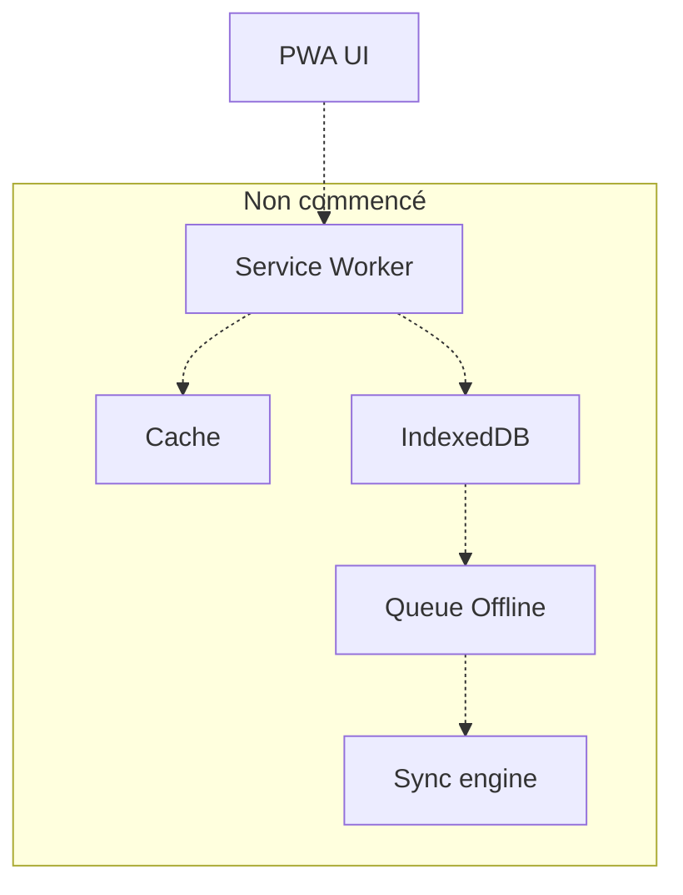
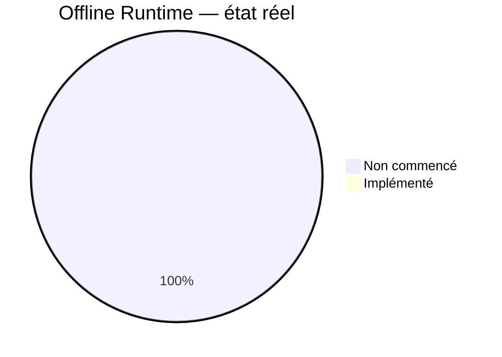
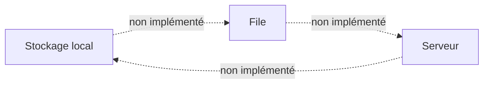
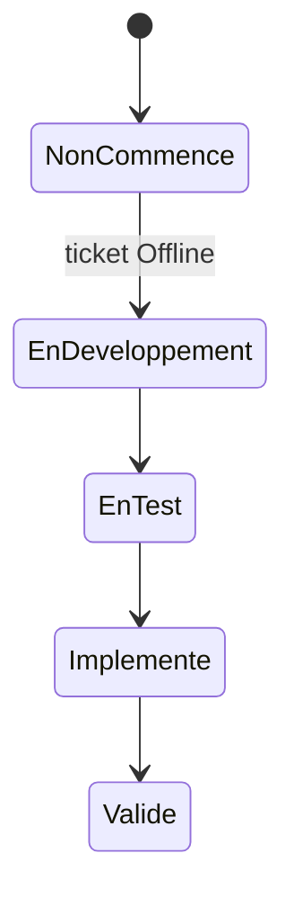

# 07 — Offline Status

## 1. Statut du registre

| Champ | Valeur |
| --- | --- |
| Nom du registre | Offline Status |
| Fichier | `docs/runtime/07_OFFLINE_STATUS.md` |
| Version du registre | 1.0 |
| Statut | **ACTIF** |
| Dernière mise à jour | 5 août 2026 — MVP-004 |
| Phase actuelle | Développement MVP — fondation manifeste uniquement |
| Document de référence | `docs/18_PWA_OFFLINE.md` |
| Type | Runtime Register — état réel Offline First / PWA |
| Décisions conception | D-132 … D-142 (intention — non implémentées) |

> Ce registre décrit l’état **réel** de l’implémentation Offline First.  
> Il ne décrit jamais la stratégie prévue.

## 2. État général

| Domaine | État réel |
| --- | --- |
| Service Worker | Non commencé |
| Cache | Non commencé |
| IndexedDB | Non commencé |
| Synchronisation | Non commencé |
| Conflits | Non commencé |
| Téléchargements | Non commencé |
| File d’attente Offline | Non commencé |
| IA Offline | Non commencé |
| CV Offline | Non commencé |
| Virtual Humans Offline | Non commencé |
| Manifeste Web App | Fondation (MVP-004) — fichier + métadonnées ; **pas** d’installabilité garantie (icônes absentes) |

**Synthèse :** Offline First **non** implémenté. MVP-004 prépare uniquement `manifest.webmanifest` et les emplacements d’icônes. Aucun SW, aucun cache, aucun stockage local applicatif.

## 3. Classification Offline / Hybrid / Online

| Classe | Features Runtime classées | Constat |
| --- | --- | --- |
| Offline | Aucune | — |
| Hybrid | Aucune | — |
| Online | Aucune | — |

Aucune fonctionnalité `F-xxx` n’est classée en Runtime (catalogue conception non tagué runtime ; voir aussi ouverture `18`).

## 4. Synchronisation

| Élément | État réel |
| --- | --- |
| Synchronisation | Non commencé |
| Reprise | Non commencé |
| Conflits | Non commencé |
| Versions | Non commencé |
| Idempotence (sync) | Non commencé |

## 5. Données locales

| Domaine | État réel |
| --- | --- |
| Préférences | Non commencé |
| Progression | Non commencé |
| Curriculum | Embarqué en code (MVP-003) — pas de cache PWA |
| Médias | Non commencé — arborescence `public/` documentée (MVP-004) ; fichiers absents |
| Cache | Non commencé |

## 6. Conformité

| Élément | Statut |
| --- | --- |
| Conformité vs `18` | Conforme : fondation manifeste sans SW (Offline First non anticipé) |
| Divergences | **Aucune** |
| Décisions Runtime | **Aucune** |

## 7. Incidents

| Type | Constat |
| --- | --- |
| Conflits Offline | Aucun |
| Pertes de données | Aucune |
| Erreurs Offline | Aucune |

## 8. Diagrammes

### 8.1 Architecture Offline (état réel)

### 8.2 État d’implémentation

### 8.3 Synchronisation

### 8.4 Cycle de reprise

### 8.5 Classification Offline / Hybrid / Online

## 9. Gouvernance

Toute évolution Offline devra :

1. référencer un ticket ;  
2. classer la feature Offline / Hybrid / Online (D-142) ;  
3. respecter D-132 à D-142 ;  
4. vérifier la conformité avec `docs/18_PWA_OFFLINE.md` ;  
5. mettre à jour ce registre ;  
6. synchroniser `00_PROJECT_STATUS.md`.

## 10. Historique

| Date | Événement |
| --- | --- |
| 5 août 2026 | Création du registre ; initialisation depuis l’état réel ; aucune implémentation Offline. |
| 5 août 2026 | MVP-004 — manifeste PWA + emplacements icônes ; Offline/SW restent Non commencé. |
| 5 août 2026 | MVP-005 — pratique locale en mémoire ; **pas** d’Offline First / SW (état pratique perdu au refresh). |

## 11. Références

- `docs/18_PWA_OFFLINE.md`  
- `docs/runtime/README.md`  
- `docs/runtime/01_ARCHITECTURE_STATUS.md`  
- `docs/25_DESIGN_FREEZE.md`  

---

## Pied de document

| Champ | Valeur |
| --- | --- |
| Version | 1.0 |
| Statut | ACTIF |
| Prochain document | `docs/runtime/08_ANALYTICS_STATUS.md` |
| Fin officielle | Oui |

*Fin officielle du document.*
