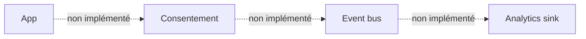
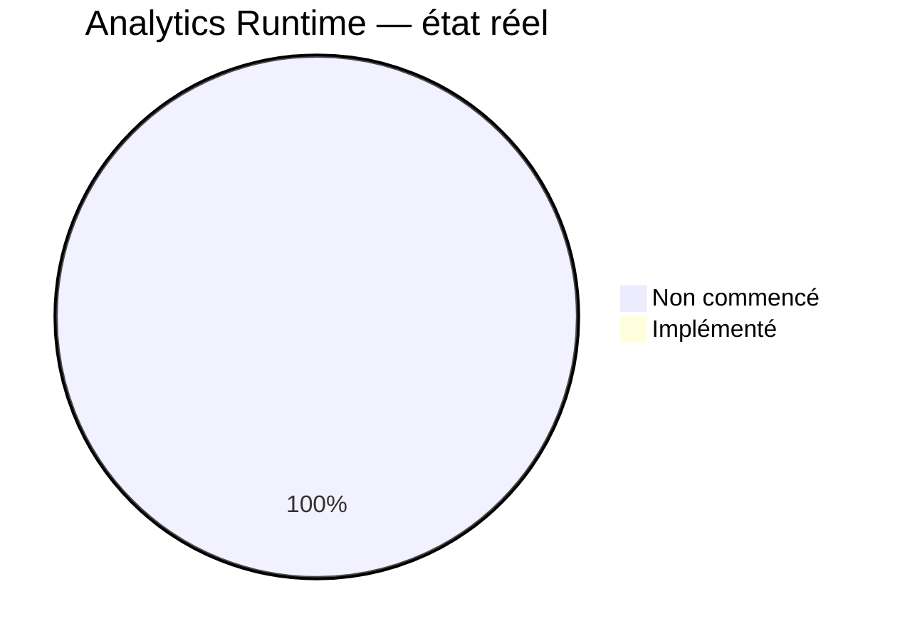
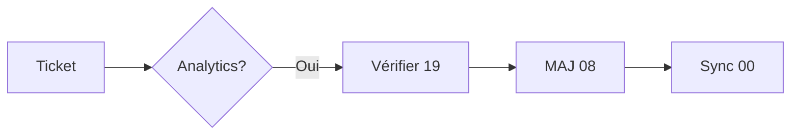
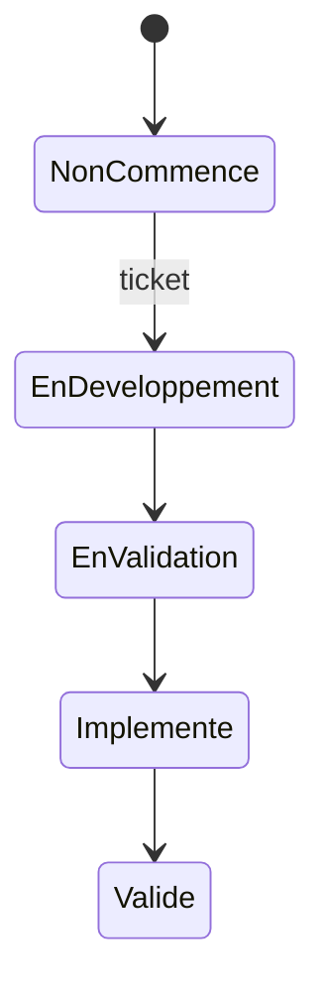
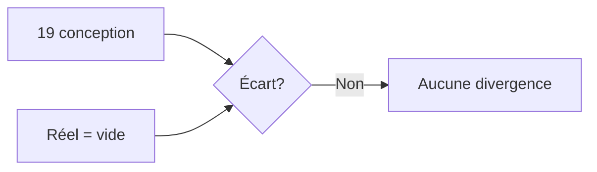

# 08 — Analytics Status

## 1. Statut du registre

| Champ | Valeur |
| --- | --- |
| Nom du registre | Analytics Status |
| Fichier | `docs/runtime/08_ANALYTICS_STATUS.md` |
| Version du registre | 1.0 |
| Statut | **ACTIF** |
| Dernière mise à jour | 5 août 2026 |
| Phase actuelle | Post–Design Freeze — initialisation Runtime |
| Document de référence | `docs/19_ANALYTICS.md` (v1.2 — Produit = V1 ; MVP = technique uniquement) |
| Type | Runtime Register — état réel Analytics |

> Ce registre suit l’état **réel** des Analytics.  
> Il ne décrit jamais les Analytics prévus.

## 2. État général

| Domaine | État réel |
| --- | --- |
| Événements Runtime | Non commencé |
| KPI | Non commencé |
| Dashboards | Non commencé |
| Métriques techniques | Non commencé |
| Métriques produit | Non commencé |
| Qualité des données | Non commencé |
| Consentements Analytics | Non commencé |
| Pseudonymisation | Non commencé |
| Rétention | Non commencé |
| Gouvernance (runtime) | Non commencé |

**Synthèse :** aucun Analytics Runtime. Aucun SDK, sink, pipeline ni événement collecté.

## 3. Événements

| Catégorie | Nombre Runtime | État |
| --- | --- | --- |
| Événements Runtime (tous) | 0 | Non commencé |
| Événements techniques | 0 | Non commencé |
| Événements produit | 0 | Non commencé |

Le catalogue conceptuel de `19` n’est **pas** une collecte réelle.

## 4. KPI

| Indicateur | Valeur réelle |
| --- | --- |
| KPI disponibles | Aucun |
| KPI calculés | Aucun |

## 5. Dashboards

| Dashboard | État |
| --- | --- |
| Produit | Absent |
| Technique | Absent |
| Support | Absent |
| Qualité | Absent |
| Évolution | Absent |

Aucun dashboard Runtime.

## 6. Incidents

| Type | Constat |
| --- | --- |
| Erreurs Analytics | Aucune |
| Incohérences | Aucune |
| Pertes d’événements | Aucune |

## 7. Conformité

| Élément | Statut |
| --- | --- |
| Conformité vs `19` | Conforme à l’absence d’implémentation attendue |
| Divergences | **Aucune** |
| Décisions Runtime | **Aucune** |

Rappel conception (non implémenté) : Analytics Produit = V1 ; MVP = technique / erreurs / supervision uniquement.

## 8. Diagrammes

### 8.1 Architecture Analytics (état réel)

### 8.2 État Runtime

### 8.3 Gouvernance

### 8.4 Évolution

### 8.5 Conformité

## 9. Gouvernance

Toute évolution Analytics devra :

1. référencer un ticket ;  
2. justifier les métriques (D-155) le cas échéant ;  
3. vérifier la conformité avec `19` ;  
4. mettre à jour ce registre ;  
5. synchroniser `00_PROJECT_STATUS.md`.

## 10. Historique

| Date | Événement |
| --- | --- |
| 5 août 2026 | Création du registre ; initialisation ; aucune implémentation Analytics. |

## 11. Références

- `docs/19_ANALYTICS.md`  
- `docs/runtime/06_PRIVACY_STATUS.md`  
- `docs/25_DESIGN_FREEZE.md`  

---

## Pied de document

| Champ | Valeur |
| --- | --- |
| Version | 1.0 |
| Statut | ACTIF |
| Prochain document | `09_TEST_STATUS.md` / puis `10_DEPLOYMENT_STATUS.md` |
| Fin officielle | Oui |

*Fin officielle du document.*
