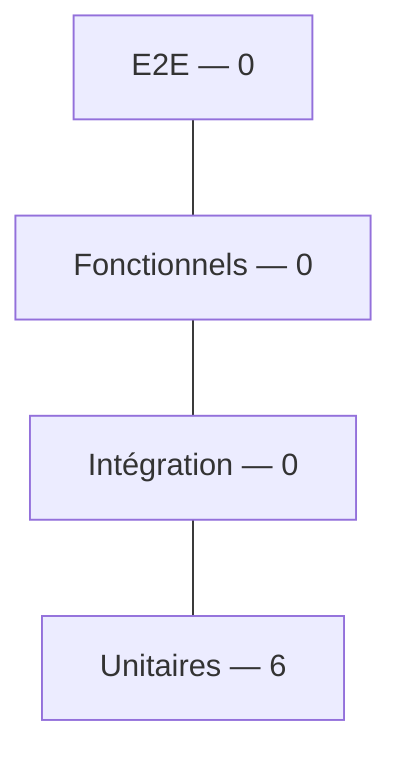
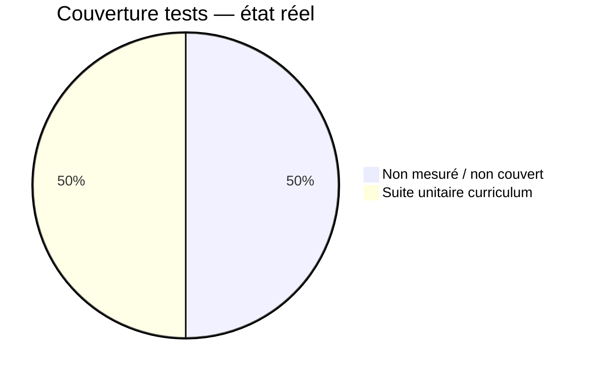
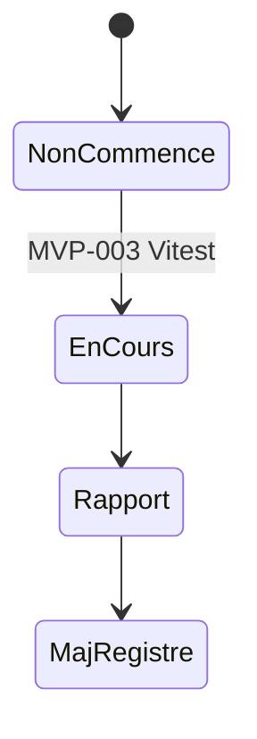
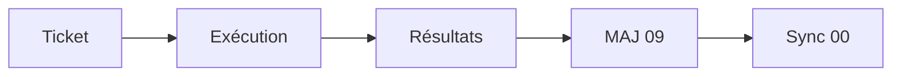
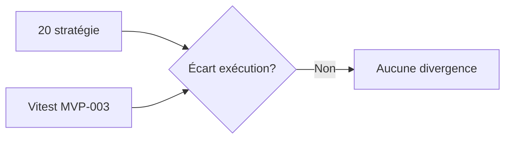

# 09 — Test Status

## 1. Statut du registre

| Champ | Valeur |
| --- | --- |
| Nom du registre | Test Status |
| Fichier | `docs/runtime/09_TEST_STATUS.md` |
| Version du registre | 1.0 |
| Statut | **ACTIF** |
| Dernière mise à jour | 5 août 2026 — MVP-003 |
| Phase actuelle | Développement MVP — premiers tests unitaires |
| Document de référence | `docs/20_TEST_STRATEGY.md` |
| Type | Runtime Register — tests réellement réalisés |

> Ce registre suit exclusivement les tests **réellement** réalisés.  
> La stratégie reste dans `20` — non confondre stratégie et exécution.

## 2. État général

| Domaine | État réel |
| --- | --- |
| Tests unitaires | **En cours** — Vitest ; 6 tests curriculum reader (MVP-003) |
| Intégration | Non commencé |
| Fonctionnels | Non commencé |
| E2E | Non commencé |
| UX | Non commencé (validations manuelles documentées §5) |
| Sécurité | Non commencé |
| RGPD | Non commencé |
| Offline | Non commencé |
| Analytics | Non commencé |
| Performances | Non commencé |

**Synthèse :** infrastructure Vitest légère ajoutée ; première suite unitaire sur le service de lecture curriculum. Pas de campagne produit complète.

## 3. Couverture

| Périmètre | Couverture réelle |
| --- | --- |
| Globale | Non mesurée (pas de seuil produit) |
| Architecture | Non mesurée |
| Features | Partielle — lecture `SessionTemplate` (F-013 fondation) |
| Data | Partielle — curriculum local |
| API | 0 % |
| Sécurité | 0 % |
| RGPD | 0 % |
| Offline | 0 % |
| Analytics | 0 % |
| Déploiement | 0 % |

## 4. Exécutions

| Indicateur | Valeur réelle |
| --- | --- |
| Campagnes exécutées | **1** (locale, MVP-003) |
| Campagnes prévues (runtime planifié) | Aucune campagne Runtime formelle hors ticket |

### 4.1 Campagne MVP-003

| Champ | Valeur |
| --- | --- |
| Date | 5 août 2026 |
| Outil | Vitest (`npm test` dans `web/`) |
| Périmètre | `curriculum-reader` (liste, getById, not_found, filtre, source vide) |
| Résultat | **6 / 6 passed** |
| Build / tsc / eslint | OK (même ticket) |

## 5. Validations manuelles / hors suite

| Contrôle | Résultat | Preuve |
| --- | --- | --- |
| Lien carte → fiche | OK (code + SSG) | `SessionCard` → `/bibliotheque/[sessionId]` ; 3 pages SSG générées |
| Fiche valide sans erreur build | OK | Build Next.js routes `●` pour les 3 IDs |
| Bibliothèque vide | OK (contrat testé) | Source vide → `listSessions() === []` ; UI `EmptyState` si length 0 |
| Identifiant inconnu | OK | `notFound()` + `not-found.tsx` ; test `not_found` |

Pas de tests E2E navigateur exécutés.

## 6. Incidents

| Type | Constat |
| --- | --- |
| Anomalies de test | Aucune |
| Bugs découverts par tests | Aucun |
| Régressions | Aucune |

## 7. Conformité

| Élément | Statut |
| --- | --- |
| Conformité vs `20` | Première tranche unitaire alignée périmètre ticket ; pyramide incomplète |
| Divergences | **Aucune** |
| Décisions Runtime | **Aucune** |

## 8. Diagrammes

### 8.1 Pyramide de tests (état réel)

### 8.2 Couverture

### 8.3 Progression

### 8.4 Workflow

### 8.5 Conformité

## 9. Gouvernance

Toute campagne de test devra :

1. référencer les tickets concernés ;  
2. enregistrer résultats factuels (pass/fail, date) ;  
3. mettre à jour ce registre ;  
4. synchroniser `00_PROJECT_STATUS.md` ;  
5. ouvrir/mettre à jour `13_BUGS.md` si anomalies.

## 10. Historique

| Date | Événement |
| --- | --- |
| 5 août 2026 | Création du registre ; initialisation ; aucune exécution de test. |
| 5 août 2026 | MVP-003 — Vitest ajouté ; 6 tests reader OK ; validations manuelles documentées. |

## 11. Références

- `docs/20_TEST_STRATEGY.md`  
- `docs/runtime/README.md`  
- `docs/25_DESIGN_FREEZE.md`  

---

## Pied de document

| Champ | Valeur |
| --- | --- |
| Version | 1.0 |
| Statut | ACTIF |
| Prochain document | `docs/runtime/10_DEPLOYMENT_STATUS.md` |
| Fin officielle | Oui |

*Fin officielle du document.*
