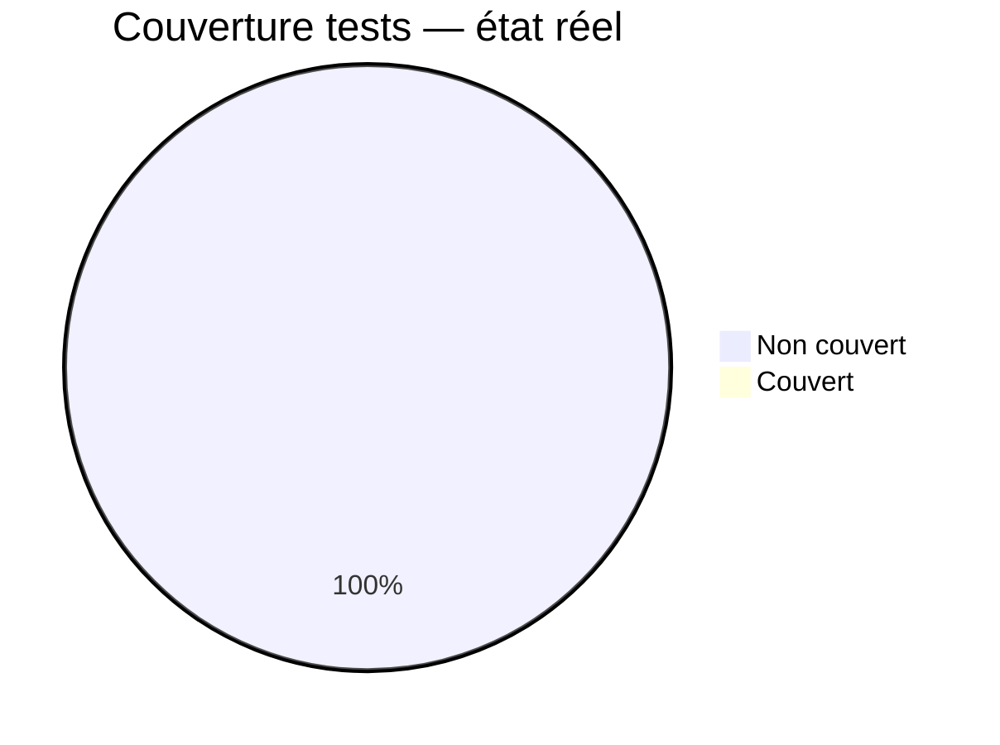
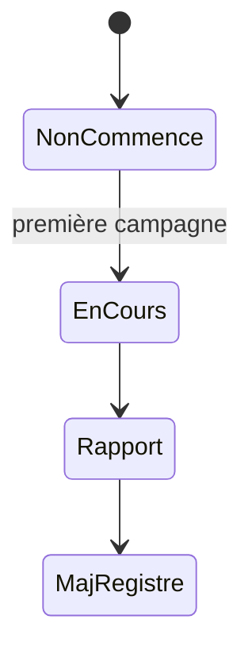
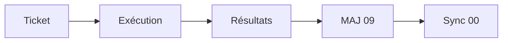
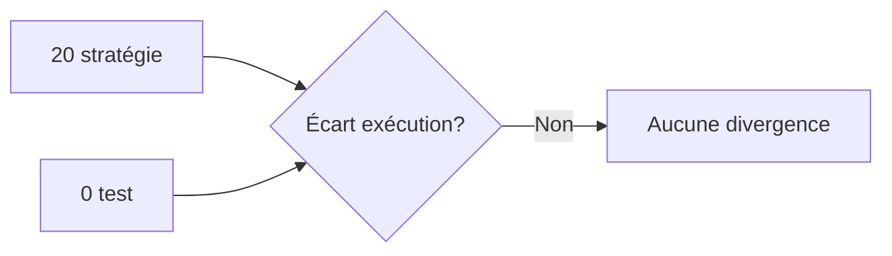

# 09 — Test Status

## 1. Statut du registre

| Champ | Valeur |
| --- | --- |
| Nom du registre | Test Status |
| Fichier | `docs/runtime/09_TEST_STATUS.md` |
| Version du registre | 1.0 |
| Statut | **ACTIF** |
| Dernière mise à jour | 5 août 2026 |
| Phase actuelle | Post–Design Freeze — initialisation Runtime |
| Document de référence | `docs/20_TEST_STRATEGY.md` |
| Type | Runtime Register — tests réellement réalisés |

> Ce registre suit exclusivement les tests **réellement** réalisés.  
> La stratégie reste dans `20` — non confondre stratégie et exécution.

## 2. État général

| Domaine | État réel |
| --- | --- |
| Tests unitaires | Non commencé |
| Intégration | Non commencé |
| Fonctionnels | Non commencé |
| E2E | Non commencé |
| UX | Non commencé |
| Sécurité | Non commencé |
| RGPD | Non commencé |
| Offline | Non commencé |
| Analytics | Non commencé |
| Performances | Non commencé |

**Synthèse :** aucun test exécuté. Aucune suite, aucun rapport, aucune couverture mesurée.

## 3. Couverture

| Périmètre | Couverture réelle |
| --- | --- |
| Globale | **0 %** |
| Architecture | 0 % |
| Features | 0 % |
| Data | 0 % |
| API | 0 % |
| Sécurité | 0 % |
| RGPD | 0 % |
| Offline | 0 % |
| Analytics | 0 % |
| Déploiement | 0 % |

## 4. Exécutions

| Indicateur | Valeur réelle |
| --- | --- |
| Campagnes exécutées | **0** |
| Campagnes prévues (runtime planifié) | Aucune campagne Runtime planifiée avec ticket |

Ne pas confondre stratégie `20` et campagne exécutée.

## 5. Incidents

| Type | Constat |
| --- | --- |
| Anomalies de test | Aucune |
| Bugs découverts par tests | Aucun |
| Régressions | Aucune |

Détail bugs éventuels futurs : `13_BUGS.md` (non créé).

## 6. Conformité

| Élément | Statut |
| --- | --- |
| Conformité vs `20` | Conforme à l’absence d’exécution attendue |
| Divergences | **Aucune** |
| Décisions Runtime | **Aucune** |

## 7. Diagrammes

### 7.1 Pyramide de tests (état réel)

### 7.2 Couverture

### 7.3 Progression

### 7.4 Workflow

### 7.5 Conformité

## 8. Gouvernance

Toute campagne de test devra :

1. référencer les tickets concernés ;  
2. enregistrer résultats factuels (pass/fail, date) ;  
3. mettre à jour ce registre ;  
4. synchroniser `00_PROJECT_STATUS.md` ;  
5. ouvrir/mettre à jour `13_BUGS.md` si anomalies.

## 9. Historique

| Date | Événement |
| --- | --- |
| 5 août 2026 | Création du registre ; initialisation ; aucune exécution de test. |

## 10. Références

- `docs/20_TEST_STRATEGY.md`  
- `docs/runtime/README.md`  
- `docs/25_DESIGN_FREEZE.md`  

---

## Pied de document

| Champ | Valeur |
| --- | --- |
| Version | 1.0 |
| Statut | ACTIF |
| Prochain document | `docs/runtime/10_DEPLOYMENT_STATUS.md` |
| Fin officielle | Oui |

*Fin officielle du document.*
