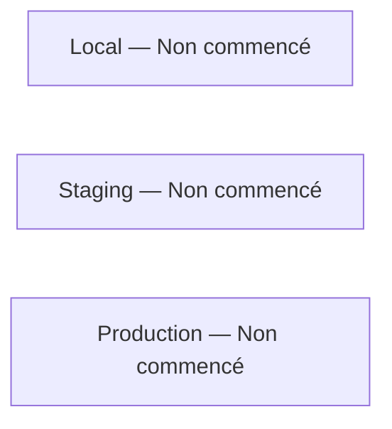
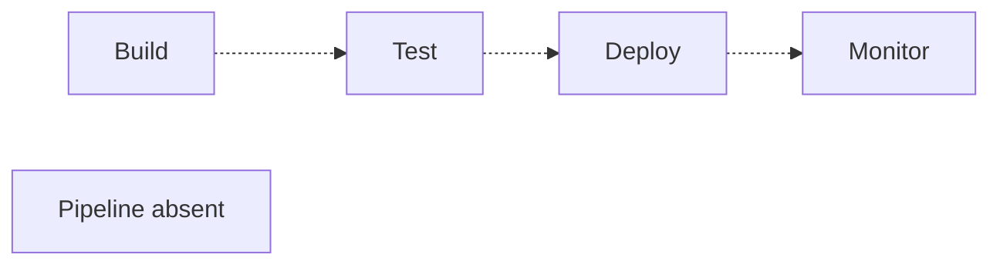
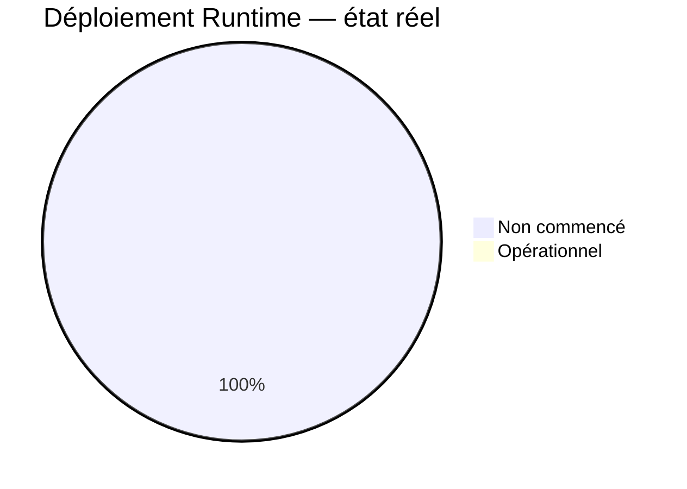
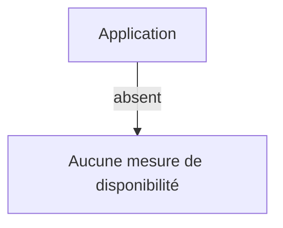
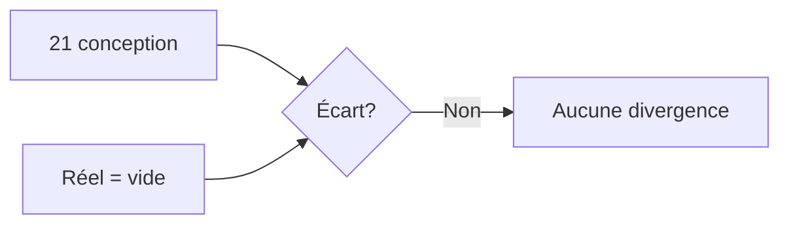

# 10 — Deployment Status

## 1. Statut du registre

| Champ | Valeur |
| --- | --- |
| Nom du registre | Deployment Status |
| Fichier | `docs/runtime/10_DEPLOYMENT_STATUS.md` |
| Version du registre | 1.0 |
| Statut | **ACTIF** |
| Dernière mise à jour | 5 août 2026 |
| Phase actuelle | Post–Design Freeze — initialisation Runtime |
| Document de référence | `docs/21_DEPLOYMENT.md` |
| Type | Runtime Register — état réel du déploiement |

> Ce registre suit exclusivement l’état **réel** du déploiement.  
> Il ne décrit jamais le déploiement prévu.

## 2. État général

| Domaine | État réel |
| --- | --- |
| Environnements | Non commencé |
| Configurations | Non commencé |
| Secrets | Non commencé |
| Sauvegardes | Non commencé |
| Restauration | Non commencé |
| Monitoring | Non commencé |
| Publication PWA | Non commencé |
| Rollback | Non commencé |
| Disponibilité | Non commencé — aucun service déployé |

**Synthèse :** aucun environnement Runtime. Aucun hébergeur choisi ni pipeline opérationnel.

## 3. Environnements

| Environnement | État réel |
| --- | --- |
| Local / développement | Non commencé (pas de projet applicatif) |
| Staging / préprod | Non commencé |
| Production | Non commencé |

## 4. Incidents

| Type | Constat |
| --- | --- |
| Incidents Runtime | Aucun |
| Rollbacks | Aucun |
| Indisponibilités | Aucune |

## 5. Conformité

| Élément | Statut |
| --- | --- |
| Conformité vs `21` | Conforme à l’absence d’implémentation attendue |
| Divergences | **Aucune** |
| Décisions Runtime | **Aucune** |

## 6. Diagrammes

### 6.1 Environnements

### 6.2 Pipeline

### 6.3 État Runtime

### 6.4 Disponibilité

### 6.5 Conformité

## 7. Gouvernance

Toute évolution de déploiement devra :

1. référencer un ticket ;  
2. vérifier la conformité avec `docs/21_DEPLOYMENT.md` ;  
3. mettre à jour ce registre ;  
4. synchroniser `00_PROJECT_STATUS.md` et `19_RELEASE_HISTORY.md` si publication.

## 8. Historique

| Date | Événement |
| --- | --- |
| 5 août 2026 | Création du registre ; initialisation ; aucune implémentation ; aucun environnement Runtime. |

## 9. Références

- `docs/21_DEPLOYMENT.md`  
- `docs/runtime/README.md`  
- `docs/25_DESIGN_FREEZE.md`  

---

## Pied de document

| Champ | Valeur |
| --- | --- |
| Version | 1.0 |
| Statut | ACTIF |
| Prochain document | `11_BACKLOG.md` / puis `12_TECH_DEBT.md` |
| Fin officielle | Oui |

*Fin officielle du document.*
