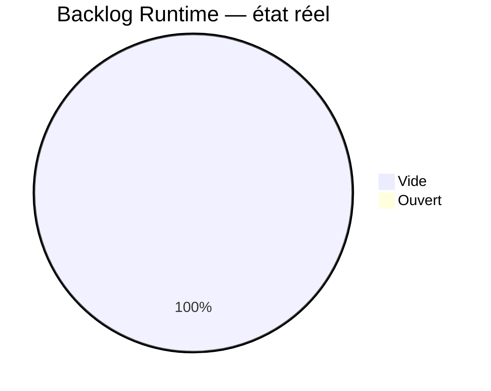
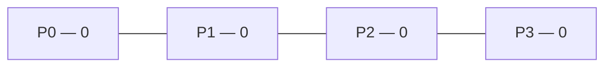
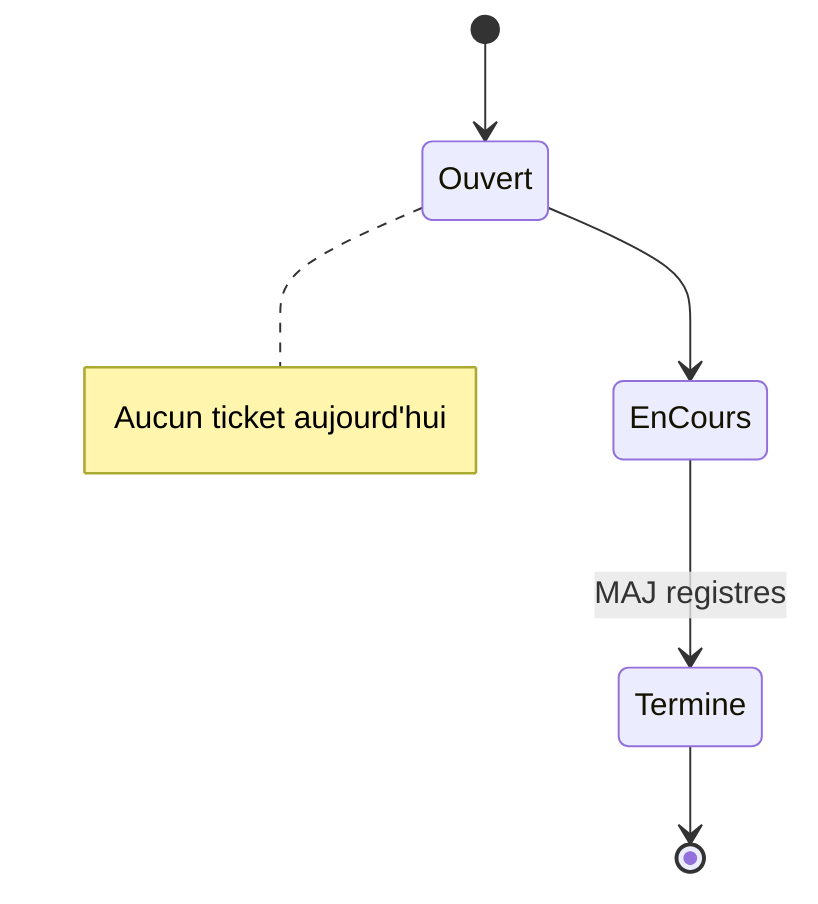
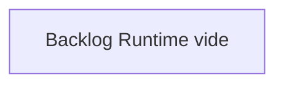
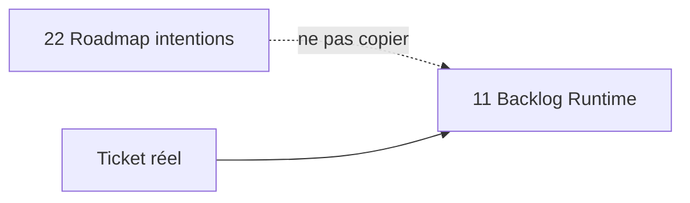

# 11 — Backlog Runtime

## 1. Statut du registre

| Champ | Valeur |
| --- | --- |
| Nom du registre | Backlog Runtime |
| Fichier | `docs/runtime/11_BACKLOG.md` |
| Version du registre | 1.0 |
| Statut | **ACTIF** |
| Dernière mise à jour | 5 août 2026 |
| Phase actuelle | Post–Design Freeze — initialisation Runtime |
| Document de référence (intentions) | `docs/22_ROADMAP.md`, `BACKLOG.md` (racine) |
| Type | Runtime Register — travaux **réellement ouverts** |

> Ce registre ne remplace pas la Roadmap.  
> La Roadmap définit les intentions.  
> Ici : uniquement les travaux Runtime réellement ouverts (tickets).

## 2. État général

| Catégorie | Nombre réel |
| --- | --- |
| Tickets ouverts | **0** |
| Améliorations ouvertes | **0** |
| Reports ouverts | **0** |
| Idées retenues (ticketées) | **0** |
| Priorités Runtime actives | Aucune |

**Synthèse :** backlog Runtime **vide**. Aucun ticket ouvert.

## 3. Tickets ouverts

| ID ticket | Titre | Priorité | Statut | Date ouverture | Remarque |
| --- | --- | --- | --- | --- | --- |
| — | — | — | — | — | Aucun |

## 4. Améliorations / reports

| Type | ID | Description | Ticket | Statut |
| --- | --- | --- | --- | --- |
| — | — | — | — | Aucun élément |

## 5. Règle d’entrée

Un élément n’apparaît ici que s’il est **réellement ouvert** (ticket existant).

Les idées uniquement présentes dans `22_ROADMAP.md` ou `BACKLOG.md` **ne doivent pas** être copiées ici.

## 6. Diagrammes

### 6.1 État du backlog

### 6.2 Priorités

### 6.3 Cycle d’un ticket

### 6.4 Répartition

### 6.5 Évolution

## 7. Gouvernance

1. Ouvrir un ticket avant inscription ici.  
2. Retirer / archiver à la clôture (ne pas laisser d’entrées fantômes).  
3. Synchroniser `00_PROJECT_STATUS.md` (§ Développement) à chaque changement de volume.  
4. Ne jamais importer massivement la Roadmap.

## 8. Historique

| Date | Événement |
| --- | --- |
| 5 août 2026 | Création du registre ; initialisation ; aucune implémentation ; aucun ticket Runtime. |

## 9. Références

- `docs/22_ROADMAP.md`  
- `BACKLOG.md`  
- `docs/runtime/README.md`  
- `docs/25_DESIGN_FREEZE.md`  

---

## Pied de document

| Champ | Valeur |
| --- | --- |
| Version | 1.0 |
| Statut | ACTIF |
| Prochain document | `docs/runtime/12_TECH_DEBT.md` |
| Fin officielle | Oui |

*Fin officielle du document.*
