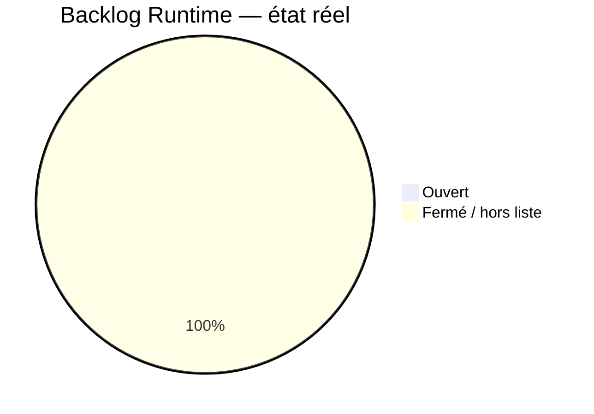
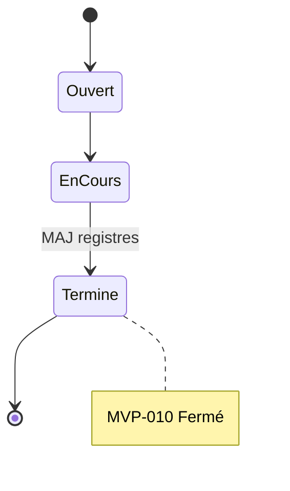

# 11 — Backlog Runtime

## 1. Statut du registre

| Champ | Valeur |
| --- | --- |
| Nom du registre | Backlog Runtime |
| Fichier | `docs/runtime/11_BACKLOG.md` |
| Version du registre | 1.0 |
| Statut | **ACTIF** |
| Dernière mise à jour | 7 août 2026 — MVP-010 fermé |
| Phase actuelle | Développement MVP — prochain = ouverture MVP-011 |
| Document de référence (intentions) | `docs/22_ROADMAP.md`, `docs/tickets/README.md` §20 |
| Type | Runtime Register — travaux **réellement ouverts** |

> Ce registre ne remplace pas la Roadmap.
> La Roadmap définit les intentions `F-xxx`.
> `docs/tickets/README.md` §20 définit la **séquence de tickets**.
> Ici : uniquement les tickets **réellement ouverts** (fichier existant, non fermé).

## 2. État général

| Catégorie | Nombre réel |
| --- | --- |
| Tickets ouverts | **0** |
| Améliorations ouvertes | **0** |
| Reports ouverts | **0** |
| Idées retenues (ticketées) | **0** |
| Priorités Runtime actives | P0 — ouverture MVP-011 |

**Synthèse :** MVP-010 **fermé**. Aucun ticket ouvert. Prochain = **ouvrir MVP-011** (fichier à créer à l’ouverture ; aucun développement démarré).

## 3. Tickets ouverts

| ID ticket | Titre | Priorité | Statut | Date ouverture | Remarque |
| --- | --- | --- | --- | --- | --- |
| — | — | — | — | — | Aucun ticket ouvert |

## 4. Séquence planifiée (non ouverte — pas d’entrée backlog)

Voir `docs/tickets/README.md` §20 : MVP-011 → MVP-018.

Ne pas dupliquer ici les tickets sans fichier.

## 5. Améliorations / reports

| Type | ID | Description | Ticket | Statut |
| --- | --- | --- | --- | --- |
| — | — | — | — | Aucun élément |

## 6. Règle d’entrée

Un élément n’apparaît en §3 que s’il est **réellement ouvert** (fichier ticket existant, statut non Fermé).

Les intentions `22_ROADMAP.md` **ne doivent pas** être copiées en masse.

## 7. Diagrammes

### 7.1 État du backlog

### 7.2 Cycle d’un ticket

## 8. Gouvernance

1. Ouvrir un ticket (fichier) avant inscription §3.
2. Retirer à la clôture.
3. Synchroniser `00_PROJECT_STATUS.md` (§ Développement).
4. Respecter la frontière V1/V2 (pas d’auth/sync/IA/CV/Mei dans MVP-009…018).

## 9. Historique

| Date | Événement |
| --- | --- |
| 5 août 2026 | Création du registre ; initialisation ; aucun ticket Runtime. |
| 7 août 2026 | Formalisation roadmap tickets MVP-009→018 ; MVP-008B fermé ; MVP-009 ouvert (À développer). |
| 7 août 2026 | MVP-009 code livré (F-016 / F-031) ; retiré des tickets ouverts ; prochain = ouverture MVP-010. |
| 7 août 2026 | MVP-009 **fermé** (PO) ; backlog vide ; prochain = ouverture administrative MVP-010. |
| 7 août 2026 | MVP-010 **ouvert** (cadrage F-001 + F-002) ; seul ticket ouvert. |
| 7 août 2026 | MVP-010 code livré (`/decouverte`) ; reste seul ticket ouvert jusqu’à clôture PO. |
| 7 août 2026 | MVP-010 **fermé** (PO) ; backlog vide ; prochain = ouverture MVP-011. |

## 10. Références

- `docs/22_ROADMAP.md` §7.5
- `docs/tickets/README.md` §19–§20
- `docs/tickets/MVP-010_PRESENTATION_AND_STYLES.md`
- `docs/runtime/README.md`
- `docs/25_DESIGN_FREEZE.md`

---

## Pied de document

| Champ | Valeur |
| --- | --- |
| Version | 1.0 |
| Statut | ACTIF |
| Fin officielle | Oui |

*Fin officielle du document.*
