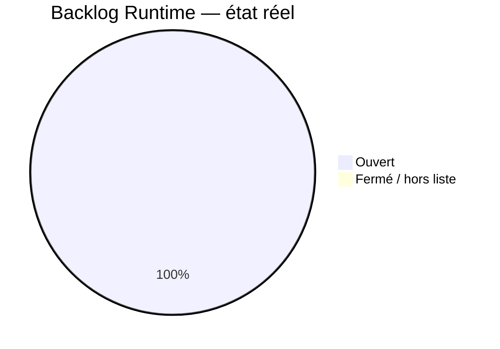
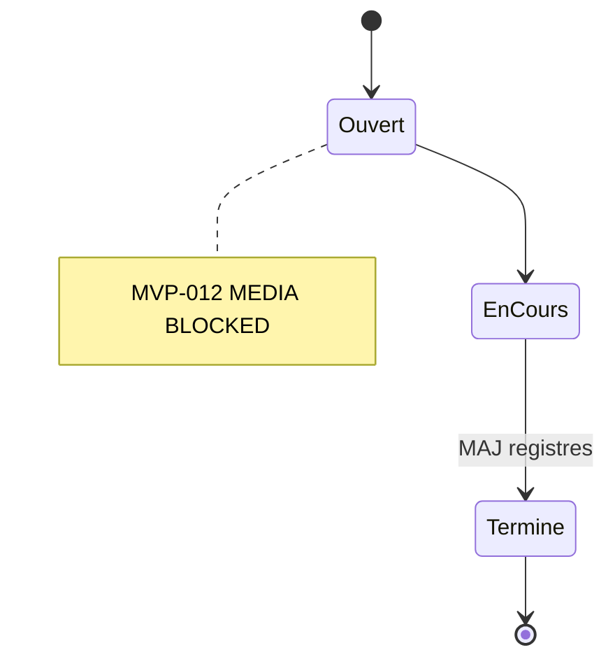

# 11 — Backlog Runtime

## 1. Statut du registre

| Champ | Valeur |
| --- | --- |
| Nom du registre | Backlog Runtime |
| Fichier | `docs/runtime/11_BACKLOG.md` |
| Version du registre | 1.0 |
| Statut | **ACTIF** |
| Dernière mise à jour | 9 août 2026 — MVP-015 Fermé ; MVP-012 MEDIA BLOCKED |
| Phase actuelle | Développement MVP — MVP-012 MEDIA BLOCKED ; MVP-016 planifié non ouvert |
| Document de référence (intentions) | `docs/22_ROADMAP.md`, `docs/tickets/README.md` §20 |
| Type | Runtime Register — travaux **réellement ouverts** |

> Ce registre ne remplace pas la Roadmap.
> La Roadmap définit les intentions `F-xxx`.
> `docs/tickets/README.md` §20 définit la **séquence de tickets**.
> Ici : uniquement les tickets **réellement ouverts** (fichier existant, non fermé).

## 2. État général

| Catégorie | Nombre réel |
| --- | --- |
| Tickets ouverts | **1** (**MVP-012**) |
| Améliorations ouvertes | **0** |
| Reports ouverts | **0** |
| Idées retenues (ticketées) | **0** |
| Priorités Runtime actives | P0 — MVP-012 (MEDIA BLOCKED) ; prochain planifié MVP-016 (non ouvert) |

**Synthèse :** MVP-015 **fermé** (F-009/F-010/F-032/F-013 Livré ; CH-019). MVP-012 **ouvert** (MEDIA BLOCKED ; 0 MP4). MVP-016 / MVP-017 non ouverts. TD-001 Mineure.

## 3. Tickets ouverts

| ID ticket | Titre | Priorité | Statut | Date ouverture | Remarque |
| --- | --- | --- | --- | --- | --- |
| MVP-012 | Vidéos pédagogiques + intégration séances/mouvements (F-006 + enrichissement F-013) | P0 | Livré (code) / MEDIA BLOCKED / REFERENCE MOTION BLOCKED / attente média | 8 août 2026 | Player + mapping ; 0 MP4 ; non fermé |

## 4. Séquence planifiée (non ouverte — pas d’entrée backlog)

Voir `docs/tickets/README.md` §20 : MVP-016 → MVP-018.

Ne pas dupliquer ici les tickets sans fichier.

## 5. Améliorations / reports

| Type | ID | Description | Ticket | Statut |
| --- | --- | --- | --- | --- |
| — | — | — | — | Aucun élément |

## 6. Règle d’entrée

Un élément n’apparaît en §3 que s’il est **réellement ouvert** (fichier ticket existant, statut non Fermé).

Les intentions `22_ROADMAP.md` **ne doivent pas** être copiées en masse.

## 7. Diagrammes

### 7.1 État du backlog

### 7.2 Cycle d’un ticket

## 8. Gouvernance

1. Ouvrir un ticket (fichier) avant inscription §3.
2. Retirer à la clôture.
3. Synchroniser `00_PROJECT_STATUS.md` (§ Développement).
4. Respecter la frontière V1/V2 (pas d’auth/sync/IA/CV/Mei dans MVP-009…018).

## 9. Historique

| Date | Événement |
| --- | --- |
| 5 août 2026 | Création du registre ; initialisation ; aucun ticket Runtime. |
| 8 août 2026 | MVP-012 **ouvert** (MEDIA BLOCKED) ; code livré ; non fermé. |
| 8 août 2026 | MVP-013 **ouvert** puis **fermé** (F-003 Livré). |
| 8 août 2026 | MVP-014 **ouvert** (cadrage F-008 + F-014 + F-015). |
| 8–9 août 2026 | MVP-014 code (F-008/F-015 puis F-014) ; CONTENT BLOCKED levé. |
| 9 août 2026 | MVP-014 **fermé** (validation PO) ; F-008/F-014/F-015 Livré ; CH-018 ; TD-001 notée. |
| 9 août 2026 | MVP-015 **ouvert** (cadrage F-009 + F-010 + F-032 + finalisation F-013) ; DESIGN DECISION REQUIRED ; aucun code ; MVP-012 MEDIA BLOCKED ; MVP-016 non ouvert. |
| 9 août 2026 | MVP-015 **Livré (code)** ; PO-A…G validées ; F-009/F-010/F-032/F-013 En test ; attente PO ; MVP-016 non ouvert. |
| 9 août 2026 | MVP-015 **fermé** (validation PO) ; F-009/F-010/F-032/F-013 Livré ; CH-019 ; retiré du backlog ouvert ; MVP-016 non ouvert. |

## 10. Références

- `docs/22_ROADMAP.md` §7.5
- `docs/tickets/README.md` §19–§20
- `docs/tickets/MVP-012_PEDAGOGICAL_VIDEOS.md`
- `docs/tickets/MVP-014_DAILY_PROGRAM.md`
- `docs/tickets/MVP-015_HISTORY_PROGRESS_RESUME.md`
- `docs/runtime/README.md`
- `docs/25_DESIGN_FREEZE.md`

---

## Pied de document

| Champ | Valeur |
| --- | --- |
| Version | 1.0 |
| Statut | ACTIF |
| Fin officielle | Oui |

*Fin officielle du document.*
