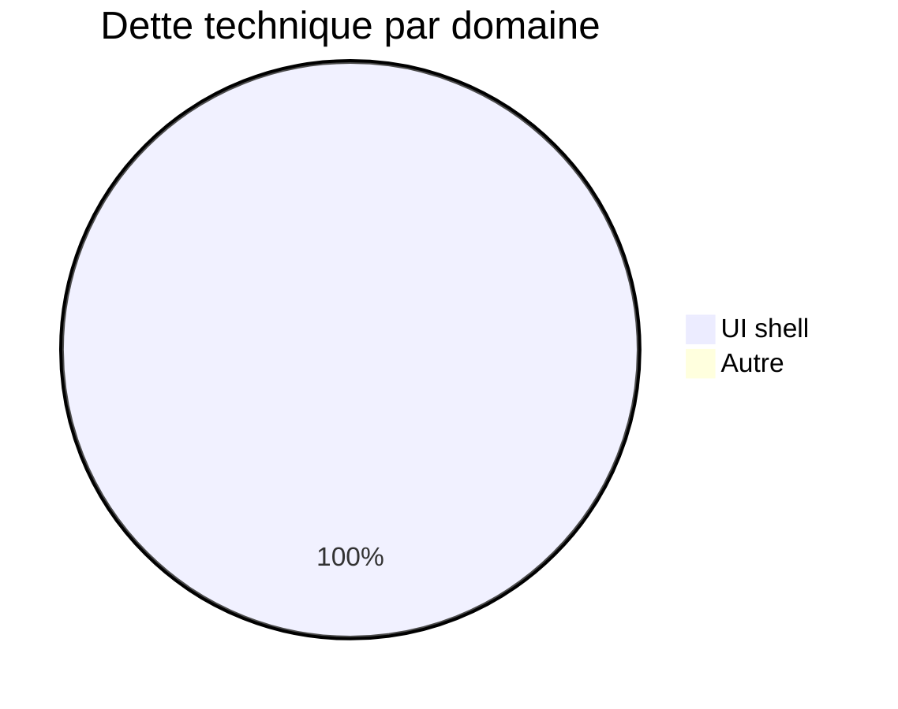
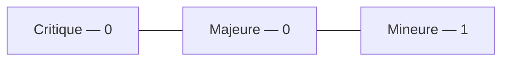
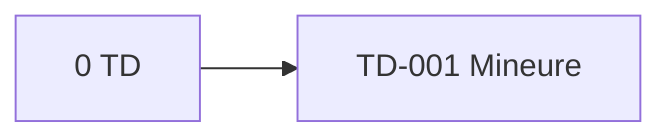
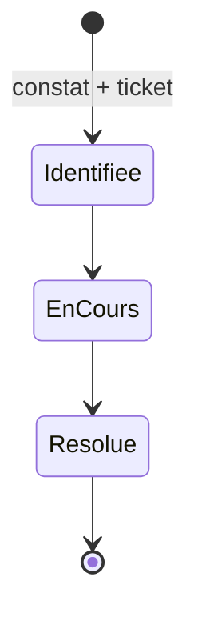
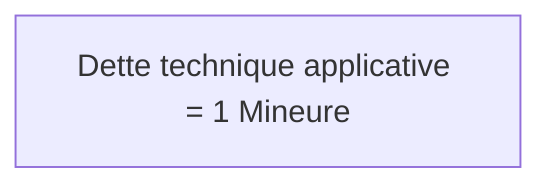

# 12 — Tech Debt

## 1. Statut du registre

| Champ | Valeur |
| --- | --- |
| Nom du registre | Tech Debt |
| Fichier | `docs/runtime/12_TECH_DEBT.md` |
| Version du registre | 1.0 |
| Statut | **ACTIF** |
| Dernière mise à jour | 9 août 2026 — TD-001 (chrome thème Mobile) |
| Phase actuelle | Développement MVP — MVP-012 MEDIA BLOCKED |
| Type | Runtime Register — dette technique **constatée** |

> Uniquement de la dette technique observée.
> Ni idées, ni améliorations, ni évolutions futures.

## 2. État général

| Domaine | Dette identifiée |
| --- | --- |
| Architecture | Aucune dette identifiée |
| Code / UI shell | **1** (TD-001 — Mineure) |
| Performances | Aucune dette identifiée |
| Sécurité | Aucune dette identifiée |
| Offline | Aucune dette identifiée |
| Tests | Aucune dette identifiée |
| Documentation Runtime | Aucune dette technique applicative (écarts doc hors scope TD-xxx — voir `00` R-PS-002) |

**Synthèse :** 1 dette UI shell Mineure (chrome thème Mobile) — non bloquante ; hors correction MVP-014.

## 3. Dette détaillée

Identifiants : `TD-xxx` (non réutilisés).

| ID | Description | Module | Sévérité | Ticket | Statut | Date |
| --- | --- | --- | --- | --- | --- | --- |
| TD-001 | Sur Mobile, le chrome flottant de bascule thème peut chevaucher légèrement le contenu long (constaté sur `/respiration` ; transversal shell, non spécifique F-014) | App Shell / thème | Mineure | MVP-014 (constat) | Ouverte — non corrigée dans MVP-014 | 9 août 2026 |

## 4. Gouvernance

1. Une dette n’est créée que si elle est **réellement constatée**.
2. Toute entrée `TD-xxx` doit référencer un ticket.
3. Sévérité : Critique / Majeure / Mineure.
4. Clôture uniquement après correction validée + MAJ registre.
5. Synchroniser `00_PROJECT_STATUS.md` si le volume impacte l’état global.

## 5. Diagrammes

### 5.1 Répartition

### 5.2 Sévérité

### 5.3 Évolution

### 5.4 Cycle de vie

### 5.5 État global

## 6. Historique

| Date | Événement |
| --- | --- |
| 5 août 2026 | Création du registre ; initialisation ; aucune dette ; aucun bug associé. |
| 9 août 2026 | TD-001 — chevauchement chrome thème Mobile (constat clôture MVP-014 ; non corrigé dans le ticket). |

## 7. Références

- `docs/runtime/README.md`
- `docs/runtime/00_PROJECT_STATUS.md`
- `docs/tickets/MVP-014_DAILY_PROGRAM.md`
- `docs/25_DESIGN_FREEZE.md`

---

## Pied de document

| Champ | Valeur |
| --- | --- |
| Version | 1.0 |
| Statut | ACTIF |
| Prochain document | `13_BUGS.md` / puis `14_DECISIONS_RUNTIME.md` |
| Fin officielle | Oui |

*Fin officielle du document.*
