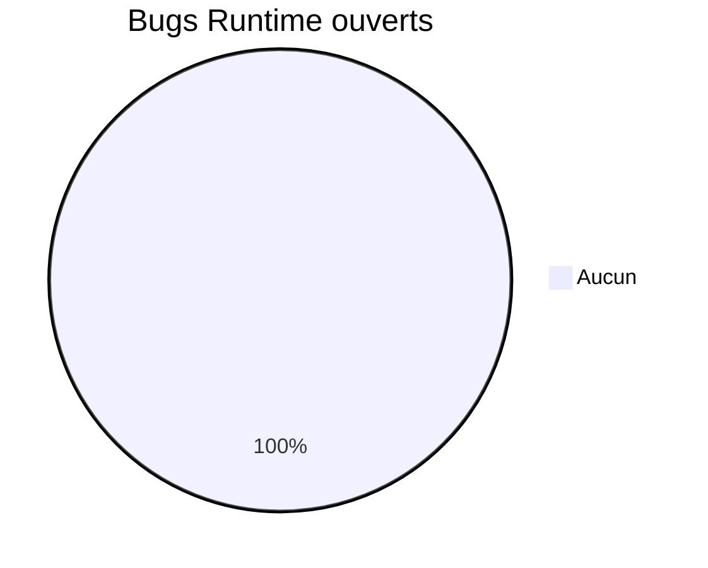
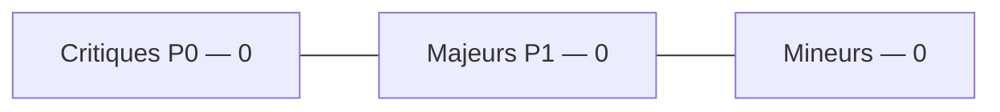
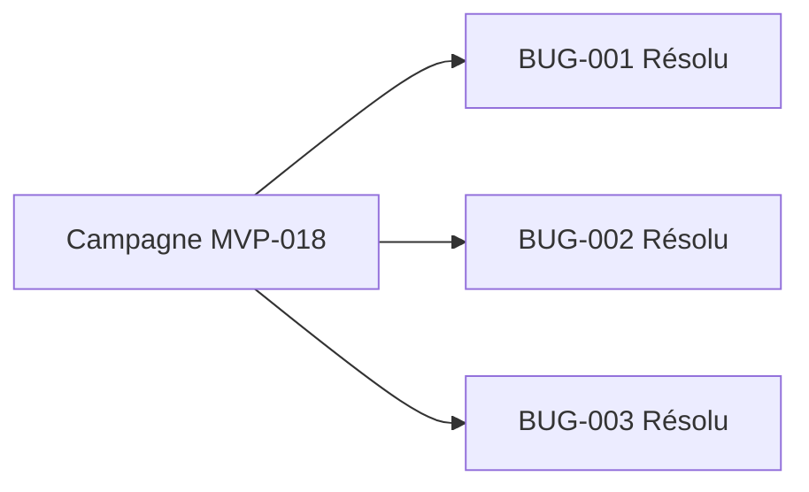
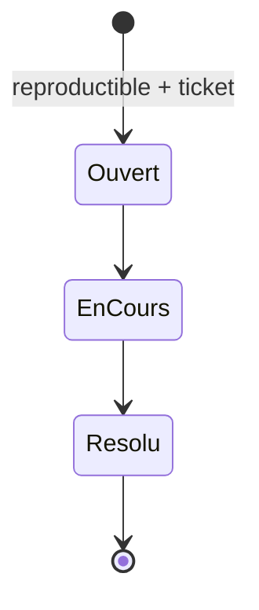
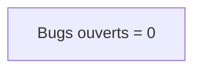

# 13 — Bugs

## 1. Statut du registre

| Champ | Valeur |
| --- | --- |
| Nom du registre | Bugs |
| Fichier | `docs/runtime/13_BUGS.md` |
| Version du registre | 1.0 |
| Statut | **ACTIF** |
| Dernière mise à jour | 9 août 2026 — Fix round MVP-018 BUG-001/002/003 |
| Phase actuelle | MVP-018 FINAL QA — P1/P3 corrigés et revalidés |
| Type | Runtime Register — bugs **réellement identifiés** |

> Aucun bug théorique.
> Un bug n’est enregistré que s’il est reproductible.
> Sévérité campagne : P0/P1/P2/P3 (alignée Critique/Majeur/Mineur ci-dessous).

## 2. État général

| Catégorie | Nombre |
| --- | --- |
| Critiques / P0 (ouverts) | **0** |
| Majeurs / P1 (ouverts) | **0** |
| Mineurs / P2–P3 (ouverts) | **0** |
| Ouverts (total) | **0** |
| Corrigés / résolus | **3** (BUG-001, BUG-002, BUG-003) |

**Synthèse :** fix round MVP-018 — BUG-001/002/003 **résolus** et revalidés ; aucun P0/P1/P2/P3 ouvert.

## 3. Registre des bugs

Identifiants : `BUG-xxx` (jamais réutilisés ; un bug corrigé reste avec statut `résolu`).

| Bug ID | Description | Sévérité | Module | Ticket | Statut | Date |
| --- | --- | --- | --- | --- | --- | --- |
| BUG-001 | Textes techniques / placeholder curriculum visibles utilisateur final | P1 / Majeur | Contenu / curriculum | MVP-018 | **Résolu** | 9 août 2026 |
| BUG-002 | SW `networkFirstNavigate` : HTTP 404 → fallback `/hors-ligne` | P1 / Majeur | PWA / SW | MVP-018 | **Résolu** | 9 août 2026 |
| BUG-003 | Touch target skip-link &lt; 44px (Accueil mobile) | P3 / Mineur | UI a11y | MVP-018 | **Résolu** | 9 août 2026 |

### BUG-001 — détail

| Champ | Contenu |
| --- | --- |
| Gate | GATE 8 |
| Root cause | Textes éditoriaux de structure MVP-003 encore présents dans `local-curriculum.ts` (jargon « placeholder », « ticket », « hors périmètre », « Design Freeze », IDs F-xxx) |
| Correction | Remplacement par contenus pédagogiques alignés `docs/08` §12/§27 (MV-001…003) ; version curriculum **0.3.1** ; test de non-régression |
| Preuve | Vitest BUG-001 ; build prod ; pages séances sans chaînes interdites ; fallback vidéo officiel conservé |
| Statut | **Résolu** |

### BUG-002 — détail

| Champ | Contenu |
| --- | --- |
| Gate | GATE 6 / 3 |
| Root cause | `networkFirstNavigate` ne renvoyait la Response que si `response.ok` — un 404 tombait dans le fallback `/hors-ligne` |
| Correction | Toute Response HTTP reçue est renvoyée telle quelle ; cache seulement si ok ; fallback offline **uniquement** après throw / absence de réponse ; module testable `network-first-navigate.ts` + 7 tests |
| Preuve | Vitest 7/7 ; prod + SW : `/pratique/…inconnue`, mouvements/séances inconnues → **404** + « introuvable », pas `/hors-ligne` |
| Statut | **Résolu** |

### BUG-003 — détail

| Champ | Contenu |
| --- | --- |
| Gate | GATE 4 |
| Root cause | `.skip-to-content` sans `min-height`/`min-width` ≥ 44px |
| Correction | `min-height` / `min-width` 2.75rem + `inline-flex` dans `globals.css` (visuel inchangé hors focus) |
| Preuve | Mesure Playwright focus skip : h≈48.8 ≥ 44 |
| Statut | **Résolu** |

## 4. Gouvernance

Chaque bug doit :

1. être **reproductible** ;
2. référencer un ticket ;
3. indiquer la sévérité ;
4. documenter le statut (Ouvert / En cours / Résolu / Won’t fix documenté) ;
5. entraîner la MAJ de `09_TEST_STATUS.md` / `00` si pertinent.

## 5. Diagrammes

### 5.1 Répartition

### 5.2 Sévérité

### 5.3 Évolution

### 5.4 Cycle de correction

### 5.5 État global

## 6. Historique

| Date | Événement |
| --- | --- |
| 5 août 2026 | Création du registre ; initialisation ; aucune dette liée ; aucun bug. |
| 9 août 2026 | Campagne MVP-018 GATES 1→8 : BUG-001, BUG-002 (P1), BUG-003 (P3) ouverts ; aucun correctif. |
| 9 août 2026 | Fix round : BUG-001/002/003 corrigés + revalidés → **Résolu** ; 0 bug ouvert. |

## 7. Références

- `docs/runtime/09_TEST_STATUS.md`
- `docs/runtime/README.md`
- `docs/20_TEST_STRATEGY.md`
- `docs/25_DESIGN_FREEZE.md`
- `docs/tickets/MVP-018_RELEASE_READINESS.md`

---

## Pied de document

| Champ | Valeur |
| --- | --- |
| Version | 1.0 |
| Statut | ACTIF |
| Prochain document | `docs/runtime/14_DECISIONS_RUNTIME.md` |
| Fin officielle | Oui |

*Fin officielle du document.*
