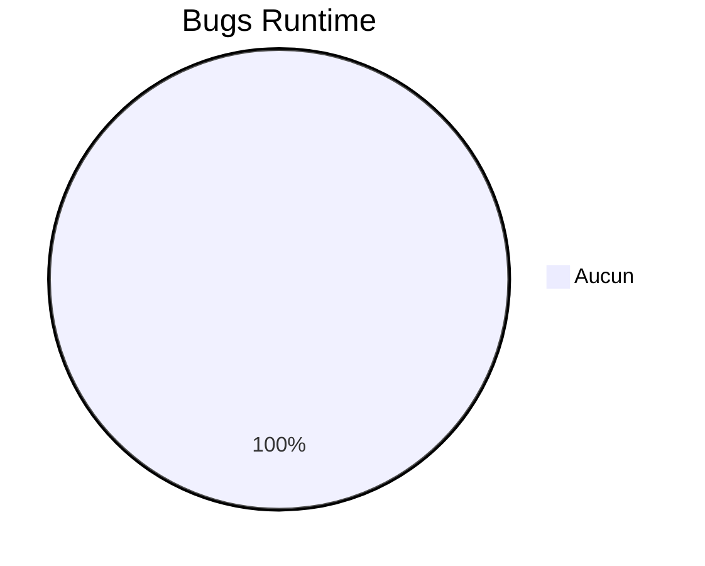
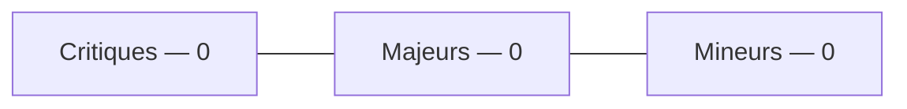
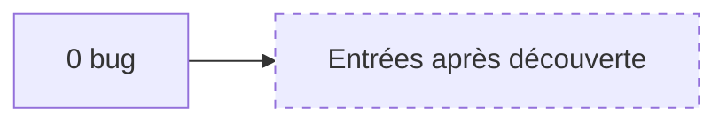
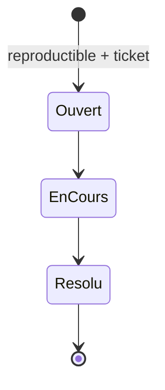
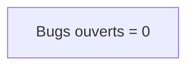

# 13 — Bugs

## 1. Statut du registre

| Champ | Valeur |
| --- | --- |
| Nom du registre | Bugs |
| Fichier | `docs/runtime/13_BUGS.md` |
| Version du registre | 1.0 |
| Statut | **ACTIF** |
| Dernière mise à jour | 5 août 2026 |
| Phase actuelle | Post–Design Freeze — initialisation Runtime |
| Type | Runtime Register — bugs **réellement identifiés** |

> Aucun bug théorique.  
> Un bug n’est enregistré que s’il est reproductible.

## 2. État général

| Catégorie | Nombre |
| --- | --- |
| Critiques (ouverts) | **0** |
| Majeurs (ouverts) | **0** |
| Mineurs (ouverts) | **0** |
| Ouverts (total) | **0** |
| Corrigés | **0** |

**Synthèse :** aucun bug découvert. Aucun code → aucune anomalie runtime constatée.

## 3. Registre des bugs

Identifiants : `BUG-xxx` (jamais réutilisés ; un bug corrigé reste avec statut `résolu`).

| Bug ID | Description | Sévérité | Module | Ticket | Statut | Date |
| --- | --- | --- | --- | --- | --- | --- |
| — | — | — | — | — | — | Aucune entrée |

## 4. Gouvernance

Chaque bug doit :

1. être **reproductible** ;  
2. référencer un ticket ;  
3. indiquer la sévérité (Critique / Majeur / Mineur) ;  
4. documenter le statut (Ouvert / En cours / Résolu / Won’t fix documenté) ;  
5. entraîner la MAJ de `09_TEST_STATUS.md` / `00` si pertinent.

## 5. Diagrammes

### 5.1 Répartition

### 5.2 Sévérité

### 5.3 Évolution

### 5.4 Cycle de correction

### 5.5 État global

## 6. Historique

| Date | Événement |
| --- | --- |
| 5 août 2026 | Création du registre ; initialisation ; aucune dette liée ; aucun bug. |

## 7. Références

- `docs/runtime/09_TEST_STATUS.md`  
- `docs/runtime/README.md`  
- `docs/20_TEST_STRATEGY.md`  
- `docs/25_DESIGN_FREEZE.md`  

---

## Pied de document

| Champ | Valeur |
| --- | --- |
| Version | 1.0 |
| Statut | ACTIF |
| Prochain document | `docs/runtime/14_DECISIONS_RUNTIME.md` |
| Fin officielle | Oui |

*Fin officielle du document.*
