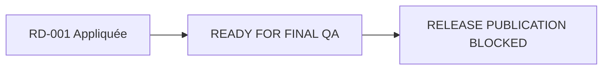
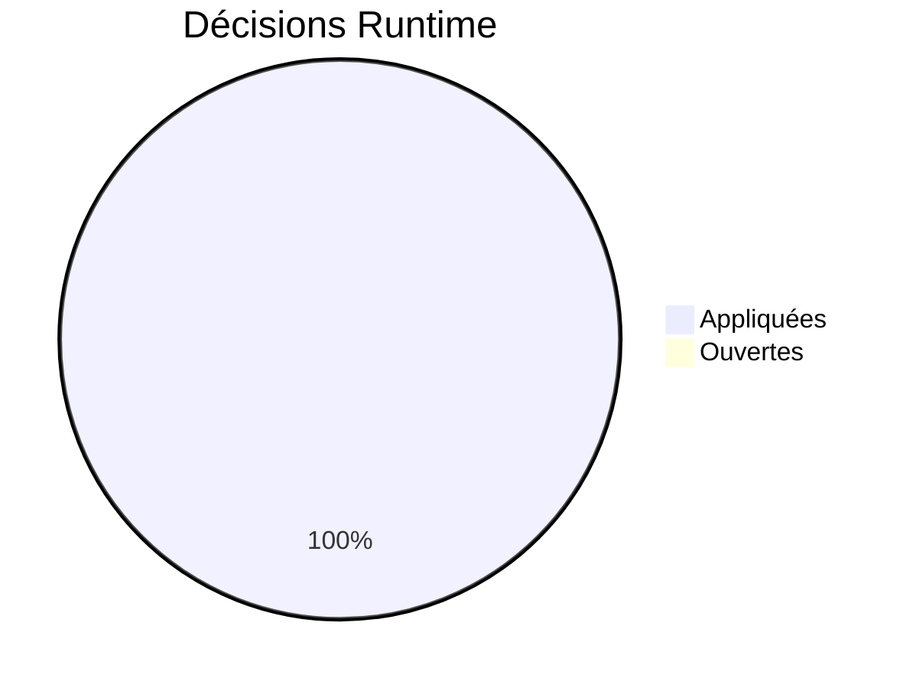
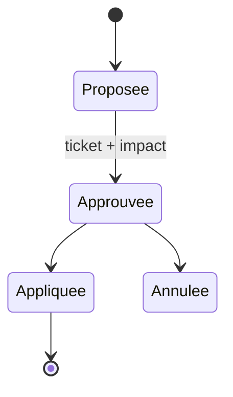
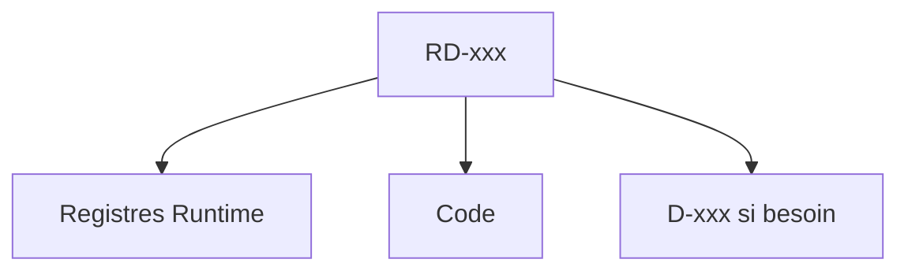

# 14 — Decisions Runtime

## 1. Statut du registre

| Champ | Valeur |
| --- | --- |
| Nom du registre | Decisions Runtime |
| Fichier | `docs/runtime/14_DECISIONS_RUNTIME.md` |
| Version du registre | 1.0 |
| Statut | **ACTIF** |
| Dernière mise à jour | 9 août 2026 — RD-001 PO-R1→R7 (MVP-018 release) |
| Phase actuelle | Développement MVP — READY FOR FINAL QA ; RELEASE PUBLICATION BLOCKED |
| Type | Runtime Register — décisions **après** Design Freeze |
| Ne remplace pas | `DECISIONS.md` (conception, `D-xxx`) |

> Uniquement les décisions d’exécution post-Freeze.  
> Les décisions de conception restent dans `DECISIONS.md`.

## 2. État général

| Indicateur | Valeur |
| --- | --- |
| Nombre de décisions Runtime | **1** (`RD-001`) |
| Décisions ouvertes | **0** |
| Décisions appliquées | **1** |
| Décisions annulées | **0** |

## 3. Registre des décisions

Identifiants : `RD-xxx` (Runtime Decision).

| Runtime Decision ID | Titre | Justification | Ticket | Impact | Statut | Date |
| --- | --- | --- | --- | --- | --- | --- |
| RD-001 | Release readiness PO-R1→R7 | Décisions PO officielles publiabilité MVP | MVP-018 | GATE 9 PASS (PO iPhone) ; GATE 10 non waivable ; 3 MP4 min ; BLOCKED BY GATE 10 ONLY | **Appliquée** | 9 août 2026 |

### RD-001 — détail PO-R1→R7

| ID | Décision | Choix |
| --- | --- | --- |
| PO-R1 | F-006 obligatoire pour MVP publiable publiquement | **Oui** — P0 / critique inchangé |
| PO-R2 | Waiver `deferred media` / F-007+F-005 = release publique | **Non** — fallback = dev/tests seulement ; F-006 non Livré sans vidéos |
| PO-R3 | Minimum média GATE 10 | **3** MP4 validés (MV-001, MV-002, MV-003) ; 1 qualité/mouvement |
| PO-R4 | Fidélité pipeline Mei + QC | Mouvement douteux = **REJET** ; MVP-012 reste MEDIA BLOCKED / REFERENCE MOTION BLOCKED |
| PO-R5 | iPhone/Safari réel | **Obligatoire** — pas de waiver ; GATE 9 **PASS** (test PO 9 août 2026) |
| PO-R6 | Staging HTTPS/Vercel | Inclus recette finale — https://tai-chi-ai-coach.vercel.app |
| PO-R7 | Go / No-Go immédiat | **Aucun Go** tant que GATE 10 non satisfait |

Référence ticket : `docs/tickets/MVP-018_RELEASE_READINESS.md` §5.
MVP-012 : statut **non modifié** (ouvert / MEDIA BLOCKED / REFERENCE MOTION BLOCKED).

## 4. Gouvernance

Une décision Runtime n’est enregistrée que si :

1. elle est **approuvée** ;  
2. elle référence un **ticket** ;  
3. son **impact** est documenté (registres concernés) ;  
4. elle ne contourne pas la baseline conception sans Impact Analysis post-Freeze.

Lien éventuel vers une `D-xxx` de conception si l’arbitrage l’implique — sans dupliquer `DECISIONS.md`.

## 5. Diagrammes

### 5.1 Évolution

### 5.2 Statut

### 5.3 Répartition

### 5.4 Cycle de vie

### 5.5 Impacts

## 6. Historique

| Date | Événement |
| --- | --- |
| 5 août 2026 | Création du registre ; initialisation ; aucune décision Runtime ; aucun risque associé. |
| 9 août 2026 | **RD-001** — PO-R1→R7 (MVP-018) ; READY FOR FINAL QA ; RELEASE PUBLICATION BLOCKED ; MVP-012 statut inchangé. |

## 7. Références

- `DECISIONS.md`
- `docs/25_DESIGN_FREEZE.md`
- `docs/runtime/README.md`
- `docs/tickets/MVP-018_RELEASE_READINESS.md`

---

## Pied de document

| Champ | Valeur |
| --- | --- |
| Version | 1.0 |
| Statut | ACTIF |
| Prochain document | `15_RISKS.md` / puis `16_KNOWN_LIMITATIONS.md` |
| Fin officielle | Oui |

*Fin officielle du document.*
