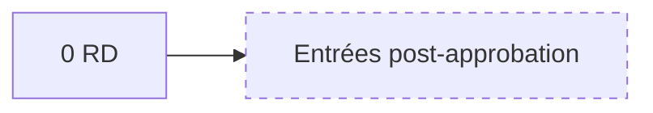
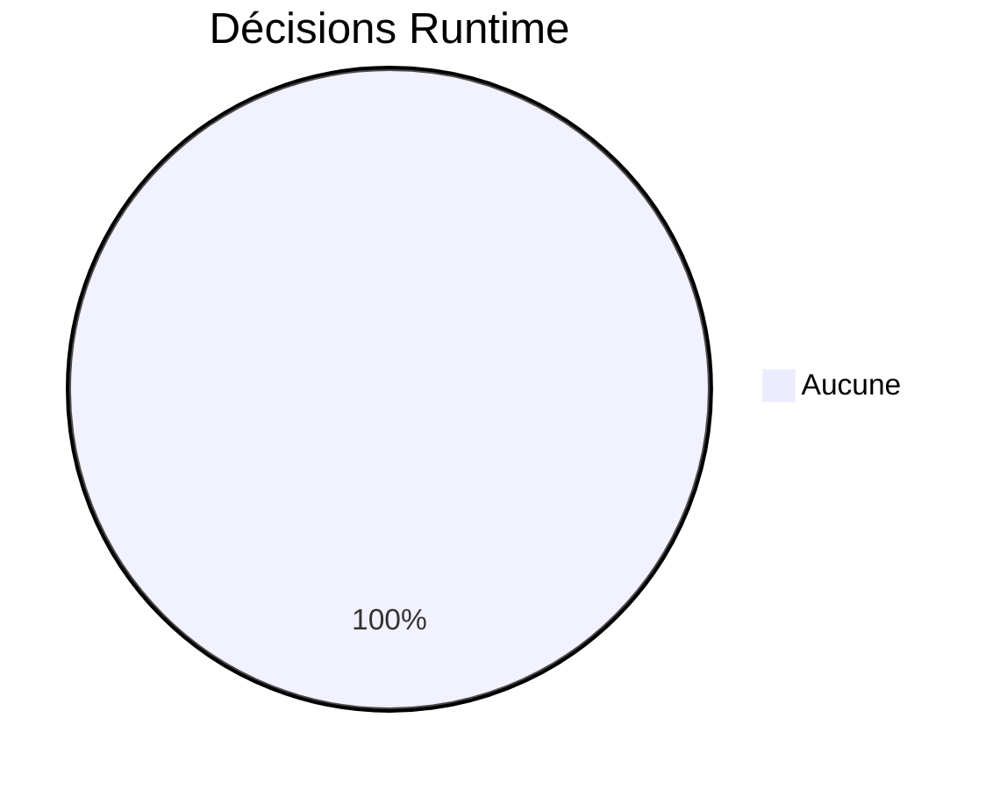
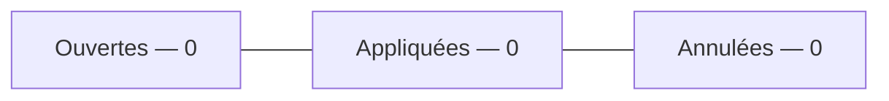
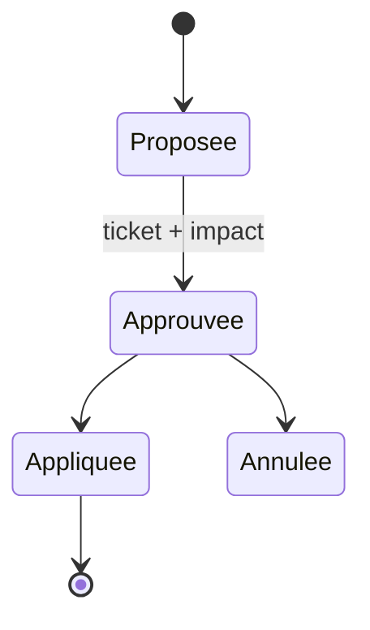
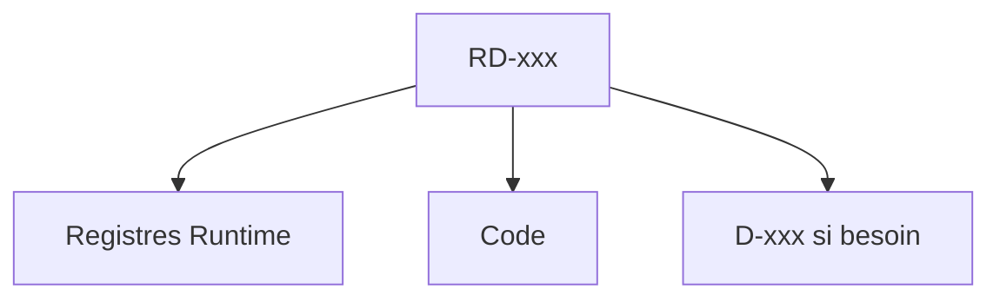

# 14 — Decisions Runtime

## 1. Statut du registre

| Champ | Valeur |
| --- | --- |
| Nom du registre | Decisions Runtime |
| Fichier | `docs/runtime/14_DECISIONS_RUNTIME.md` |
| Version du registre | 1.0 |
| Statut | **ACTIF** |
| Dernière mise à jour | 5 août 2026 |
| Phase actuelle | Post–Design Freeze — initialisation Runtime |
| Type | Runtime Register — décisions **après** Design Freeze |
| Ne remplace pas | `DECISIONS.md` (conception, `D-xxx`) |

> Uniquement les décisions d’exécution post-Freeze.  
> Les décisions de conception restent dans `DECISIONS.md`.

## 2. État général

| Indicateur | Valeur |
| --- | --- |
| Nombre de décisions Runtime | **0** |
| Décisions ouvertes | **0** |
| Décisions appliquées | **0** |
| Décisions annulées | **0** |

## 3. Registre des décisions

Identifiants : `RD-xxx` (Runtime Decision).

| Runtime Decision ID | Titre | Justification | Ticket | Impact | Statut | Date |
| --- | --- | --- | --- | --- | --- | --- |
| — | — | — | — | — | — | Aucune décision |

## 4. Gouvernance

Une décision Runtime n’est enregistrée que si :

1. elle est **approuvée** ;  
2. elle référence un **ticket** ;  
3. son **impact** est documenté (registres concernés) ;  
4. elle ne contourne pas la baseline conception sans Impact Analysis post-Freeze.

Lien éventuel vers une `D-xxx` de conception si l’arbitrage l’implique — sans dupliquer `DECISIONS.md`.

## 5. Diagrammes

### 5.1 Évolution

### 5.2 Statut

### 5.3 Répartition

### 5.4 Cycle de vie

### 5.5 Impacts

## 6. Historique

| Date | Événement |
| --- | --- |
| 5 août 2026 | Création du registre ; initialisation ; aucune décision Runtime ; aucun risque associé. |

## 7. Références

- `DECISIONS.md`  
- `docs/25_DESIGN_FREEZE.md`  
- `docs/runtime/README.md`  

---

## Pied de document

| Champ | Valeur |
| --- | --- |
| Version | 1.0 |
| Statut | ACTIF |
| Prochain document | `15_RISKS.md` / puis `16_KNOWN_LIMITATIONS.md` |
| Fin officielle | Oui |

*Fin officielle du document.*
