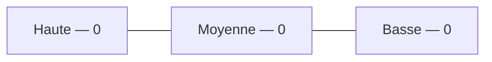
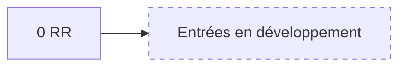
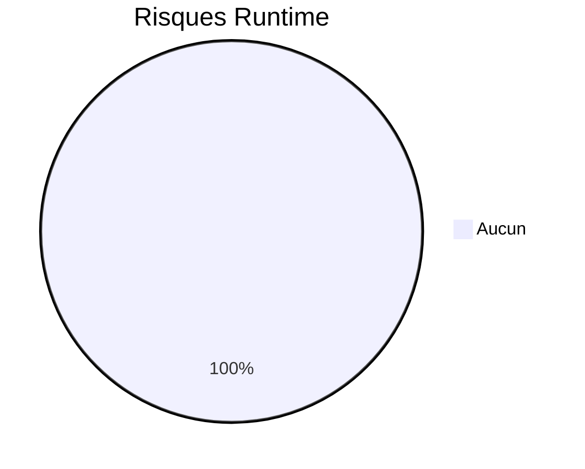
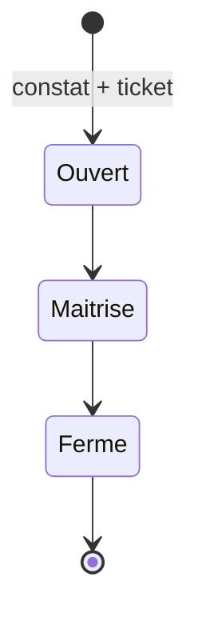
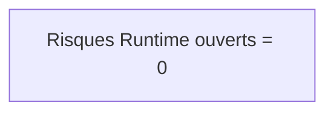

# 15 — Risks

## 1. Statut du registre

| Champ | Valeur |
| --- | --- |
| Nom du registre | Risks |
| Fichier | `docs/runtime/15_RISKS.md` |
| Version du registre | 1.0 |
| Statut | **ACTIF** |
| Dernière mise à jour | 5 août 2026 |
| Phase actuelle | Post–Design Freeze — initialisation Runtime |
| Type | Runtime Register — risques **identifiés en développement** |
| Ne remplace pas | `RISKS.md` (conception / projet) |

> Ne pas recopier les risques théoriques de conception.  
> Uniquement les risques observés ou identifiés pendant le développement.

## 2. État général

| Indicateur | Valeur |
| --- | --- |
| Risques ouverts | **0** |
| Risques maîtrisés | **0** |
| Risques fermés | **0** |

**Synthèse :** aucun risque Runtime enregistré. Le développement applicatif n’a pas commencé.

> Les constats de pilotage (ex. initialisation Runtime incomplète) restent dans `00_PROJECT_STATUS` (blocages) tant qu’ils ne sont pas formalisés ici avec ticket + plan d’action.

## 3. Registre des risques

Identifiants : `RR-xxx` (Runtime Risk).

| Risk ID | Description | Probabilité | Impact | Criticité | Plan d’action | Ticket | Statut | Date |
| --- | --- | --- | --- | --- | --- | --- | --- | --- |
| — | — | — | — | — | — | — | — | Aucune entrée |

## 4. Gouvernance

Un risque Runtime n’est enregistré que s’il est observé ou identifié pendant le développement.

Chaque risque doit :

1. référencer un ticket ;  
2. avoir un plan d’action ;  
3. être réévalué régulièrement ;  
4. synchroniser `00_PROJECT_STATUS.md` si criticité globale.

## 5. Diagrammes

### 5.1 Criticité

### 5.2 Évolution

### 5.3 Répartition

### 5.4 Traitement

### 5.5 État global

## 6. Historique

| Date | Événement |
| --- | --- |
| 5 août 2026 | Création du registre ; initialisation ; aucune décision Runtime liée ; aucun risque Runtime. |

## 7. Références

- `RISKS.md`  
- `docs/runtime/00_PROJECT_STATUS.md`  
- `docs/25_DESIGN_FREEZE.md`  

---

## Pied de document

| Champ | Valeur |
| --- | --- |
| Version | 1.0 |
| Statut | ACTIF |
| Prochain document | `docs/runtime/16_KNOWN_LIMITATIONS.md` |
| Fin officielle | Oui |

*Fin officielle du document.*
