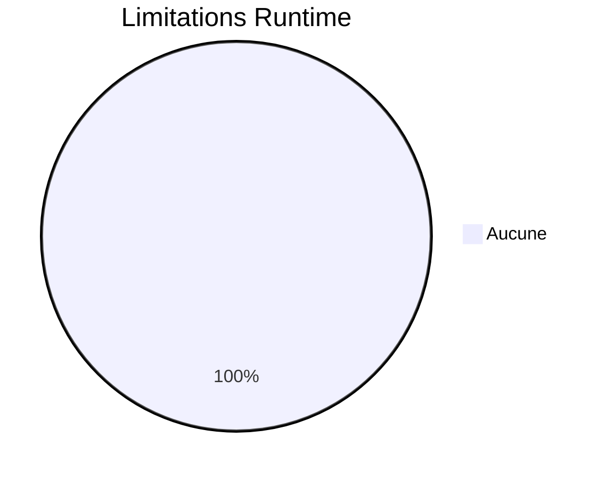
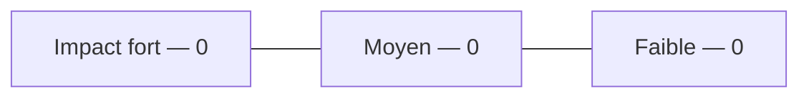
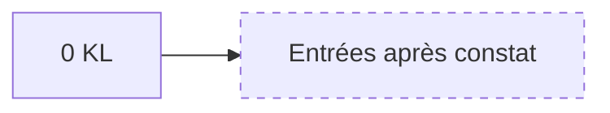
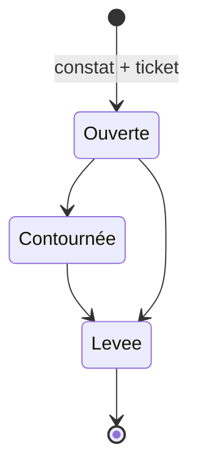
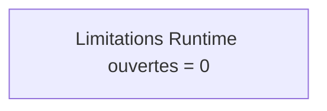

# 16 — Known Limitations

## 1. Statut du registre

| Champ | Valeur |
| --- | --- |
| Nom du registre | Known Limitations |
| Fichier | `docs/runtime/16_KNOWN_LIMITATIONS.md` |
| Version du registre | 1.0 |
| Statut | **ACTIF** |
| Dernière mise à jour | 5 août 2026 |
| Phase actuelle | Post–Design Freeze — initialisation Runtime |
| Type | Runtime Register — limitations **observées** |

> Uniquement les limitations constatées en développement ou exploitation.  
> Ne jamais recopier les limites théoriques de conception.

## 2. État général

| Indicateur | Valeur |
| --- | --- |
| Limitations ouvertes | **0** |
| Limitations contournées | **0** |
| Limitations levées | **0** |

## 3. Registre des limitations

Identifiants : `KL-xxx`.

| Limitation ID | Description | Module | Impact | Contournement | Ticket | Statut | Date |
| --- | --- | --- | --- | --- | --- | --- | --- |
| — | — | — | — | — | — | — | Aucune entrée |

## 4. Gouvernance

Une limitation n’est enregistrée que si :

1. elle est **réellement constatée** ;  
2. elle est **reproductible** ;  
3. son **impact** est identifié ;  
4. un **ticket** existe ou est créé ;  
5. `00_PROJECT_STATUS.md` est synchronisé si impact global.

## 5. Diagrammes

### 5.1 Répartition

### 5.2 Impacts

### 5.3 Évolution

### 5.4 Cycle de vie

### 5.5 État global

## 6. Historique

| Date | Événement |
| --- | --- |
| 5 août 2026 | Création du registre ; initialisation ; aucune limitation ; aucun changement Runtime associé. |

## 7. Références

- `docs/runtime/README.md`  
- `docs/25_DESIGN_FREEZE.md`  

---

## Pied de document

| Champ | Valeur |
| --- | --- |
| Version | 1.0 |
| Statut | ACTIF |
| Prochain document | `17_CHANGE_HISTORY.md` / puis `18_METRICS.md` |
| Fin officielle | Oui |

*Fin officielle du document.*
