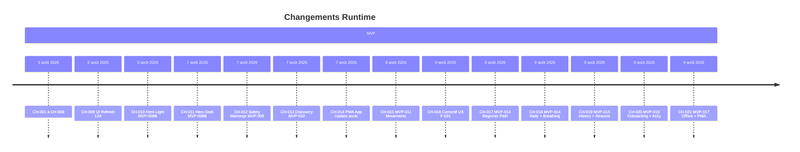

# 17 — Change History

## 1. Statut du registre

| Champ | Valeur |
| --- | --- |
| Nom du registre | Change History |
| Fichier | `docs/runtime/17_CHANGE_HISTORY.md` |
| Version du registre | 1.0 |
| Statut | **ACTIF** |
| Dernière mise à jour | 9 août 2026 — CH-021 (MVP-017 Offline/PWA) |
| Phase actuelle | Développement MVP — MVP-012 ouvert / MEDIA BLOCKED |
| Type | Runtime Register — changements Runtime **appliqués** |
| Ne remplace pas | `CHANGELOG.md` |

## 2. État général

| Indicateur | Valeur |
| --- | --- |
| Changements enregistrés | **21** |
| Changements majeurs | **20** |
| Changements mineurs | **1** |

## 3. Registre des changements

| Change ID | Description | Ticket | Registre(s) impacté(s) | Décision Runtime | Date | Statut |
| --- | --- | --- | --- | --- | --- | --- |
| CH-001 | App Shell + routes vides | MVP-001 | `00`, `01`, `02`, `17` | — | 5 août 2026 | Appliqué |
| CH-002 | Design System & UI Foundation | MVP-002 | `00`, `01`, `02`, `17` | — | 5 août 2026 | Appliqué |
| CH-003 | Curriculum local + bibliothèque / fiches | MVP-003 | `00`, `01`, `02`, `03`, `09`, `17` | — | 5 août 2026 | Appliqué |
| CH-004 | Fondation assets / manifeste PWA / AppBrand | MVP-004 | `00`, `01`, `02`, `07`, `09`, `17` | — | 5 août 2026 | Appliqué |
| CH-005 | Parcours pratique local | MVP-005 | `00`, `01`, `02`, `03`, `07`, `09`, `17` | — | 5 août 2026 | Appliqué |
| CH-006 | Progression / historique local (localStorage) + page `/progression` | MVP-006 | `00`, `02`, `03`, `07`, `09`, `17` | — | 5 août 2026 | Appliqué |
| CH-007 | Préférences utilisateur locales + page `/profil` (thème / pratique / a11y) | MVP-007 | `00`, `02`, `03`, `09`, `17` | — | 5 août 2026 | Appliqué |
| CH-008 | Onboarding local `/onboarding` (F-033) + gate + intégration préférences | MVP-008 | `00`, `01`, `02`, `03`, `07`, `09`, `17` | — | 5 août 2026 | Appliqué |
| CH-009 | Refonte UI Experience Design System (12A) — présentation seule | MVP-008A | `00`, `01`, `02`, `09`, `17` | — | 6 août 2026 | Appliqué |
| CH-010 | Hero Light responsive (15 exports) + intégration écrans — présentation seule | MVP-008B | `00`, `01`, `02`, `09`, `17` | — | 6 août 2026 | Appliqué |
| CH-011 | Hero Dark responsive (5 Masters + 15 exports) + catalogue final — présentation seule | MVP-008B | `00`, `01`, `02`, `09`, `17` | — | 7 août 2026 | Appliqué |
| CH-012 | Conseils de sécurité (F-016) + avertissements pré-pratique (F-031) ; Hero pratique `morning` | MVP-009 | `00`, `02`, `09`, `11`, `17` | — | 7 août 2026 | Appliqué — MVP-009 fermé |
| CH-013 | Présentation Tai Chi (F-001) + découverte styles (F-002) — page `/decouverte` | MVP-010 | `00`, `02`, `09`, `11`, `17` | — | 7 août 2026 | Appliqué — MVP-010 fermé |
| CH-014 | Socle PWA App Update — SW minimal, build id auto, modale contrôlée, différé `/pratique` | Socle (`docs/26`) | `00`, `01`, `07`, `09`, `17` | — | 7 août 2026 | Appliqué — commit `79b0a4e` |
| CH-015 | Bibliothèque mouvements + fiches + images (F-004 / F-005 / F-007) — `/bibliotheque/mouvements` | MVP-011 | `00`, `02`, `03`, `09`, `11`, `17` | — | 8 août 2026 | Appliqué — MVP-011 fermé — commit `e8eebff` |
| CH-016 | Correctif UX F-031 — rappel pré-pratique court ; F-016 inchangé ; MVP-009 reste fermé | Correctif (indépendant MVP-012) | `09`, `17` | — | 8 août 2026 | Appliqué |
| CH-017 | Parcours débutant structuré (F-003) — `/parcours/debutant` ; Hero morning ; accès Accueil / Découverte / Séances | MVP-013 | `00`, `02`, `03`, `09`, `11`, `17` | — | 8 août 2026 | Appliqué — MVP-013 fermé — commit `c3b4a98` |
| CH-018 | Programme quotidien (F-008) + Respiration calme (F-014) + retour au calme (F-015) — `/respiration` ; Accueil | MVP-014 | `00`, `02`, `03`, `09`, `11`, `12`, `17` | — | 9 août 2026 | Appliqué — MVP-014 fermé — commit `d0574f9` |
| CH-019 | Historique (F-009) + progression (F-010) + reprise persistante (F-032) + finalisation F-013 lifecycle ; wipe pratique locale ; badge jour | MVP-015 | `00`, `02`, `03`, `06`, `09`, `11`, `17` | — | 9 août 2026 | Appliqué — MVP-015 fermé — commit `4c72602` |
| CH-020 | Onboarding final (F-033) + paramètres (F-028) + accessibilité (F-029) ; skip link ; TD-001 ; utilitaire `.z-dropdown` | MVP-016 | `00`, `02`, `09`, `11`, `12`, `17` | — | 9 août 2026 | Appliqué — MVP-016 fermé — commit `f61e139` |
| CH-021 | Offline / PWA cache cœur — SW unique étendu ; precache + runtime ; `/hors-ligne` ; vidéos Network Only ; App Update préservé | MVP-017 | `00`, `01`, `07`, `09`, `11`, `17` | — | 9 août 2026 | Appliqué — MVP-017 fermé |

## 4. Gouvernance

Un changement Runtime n’est enregistré que s’il est effectivement réalisé, lié à un ticket et synchronisé avec `00_PROJECT_STATUS.md`.

## 5. Diagrammes

## 6. Historique

| Date | Événement |
| --- | --- |
| 5 août 2026 | CH-001 … CH-007 enregistrés. |
| 5 août 2026 | CH-008 — MVP-008 onboarding local enregistré. |
| 6 août 2026 | CH-009 — MVP-008A refonte UI 12A enregistré. |
| 6 août 2026 | CH-010 — MVP-008B Sprint 3 Hero Light exports + intégration ; ticket reste ouvert (Dark manquant). |
| 7 août 2026 | CH-011 — MVP-008B Sprint Dark : Masters Dark + 15 exports + catalogue `final`. |
| 7 août 2026 | MVP-008B **fermé** (commit `50bf954`) ; formalisation roadmap tickets MVP-009→018 (documentaire — pas de nouveau CH code). |
| 7 août 2026 | CH-012 — MVP-009 F-016 / F-031 (code local ; commit PO en attente). |
| 7 août 2026 | CH-012 clôturé — MVP-009 **fermé** (validation PO) ; F-016 / F-031 Livré. |
| 7 août 2026 | CH-013 — MVP-010 `/decouverte` F-001 / F-002 (code local ; commit PO en attente). |
| 7 août 2026 | CH-013 clôturé — MVP-010 **fermé** (validation PO) ; F-001 / F-002 Livré. |
| 7 août 2026 | CH-014 — SW socle App Update (`docs/26_PWA_APP_UPDATE.md`) ; MVP-017 non ouvert. |
| 8 août 2026 | CH-015 — MVP-011 F-004/F-005/F-007 (`e8eebff`) ; MVP-011 **fermé** ; MVP-012 non ouvert. |
| 8 août 2026 | CH-016 — correctif UX F-031 (rappel court) ; F-016 intact ; MVP-009 reste **fermé** ; MVP-012 inchangé. |
| 8 août 2026 | CH-017 — MVP-013 F-003 (`c3b4a98`) ; MVP-013 **fermé** (validation PO) ; MVP-012 reste MEDIA BLOCKED ; MVP-014 non ouvert. |
| 9 août 2026 | CH-018 — MVP-014 F-008/F-014/F-015 (`d0574f9`) ; MVP-014 **fermé** (validation PO) ; TD-001 notée ; MVP-012 MEDIA BLOCKED ; MVP-015 non ouvert. |
| 9 août 2026 | CH-019 — MVP-015 F-009/F-010/F-032/F-013 (`4c72602`) ; MVP-015 **fermé** (validation PO) ; MVP-012 MEDIA BLOCKED ; MVP-016 non ouvert. |
| 9 août 2026 | CH-020 — MVP-016 F-033/F-028/F-029 (`f61e139`) ; MVP-016 **fermé** (validation PO) ; TD-001 fermée ; MVP-012 MEDIA BLOCKED ; MVP-017 non ouvert. |
| 9 août 2026 | CH-021 — MVP-017 Offline/PWA cache cœur ; MVP-017 **fermé** (validation PO) ; Offline Livré ; iPhone/Safari → MVP-018 ; MVP-012 MEDIA BLOCKED ; MVP-018 non ouvert. |

---

## Pied de document

| Champ | Valeur |
| --- | --- |
| Version | 1.0 |
| Statut | ACTIF |
| Fin officielle | Oui |

*Fin officielle du document.*
