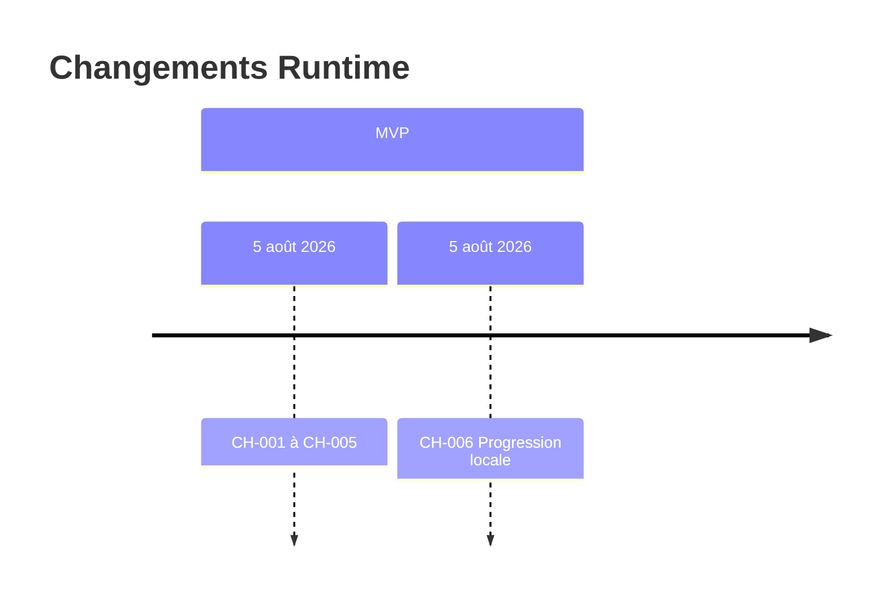

# 17 — Change History

## 1. Statut du registre

| Champ | Valeur |
| --- | --- |
| Nom du registre | Change History |
| Fichier | `docs/runtime/17_CHANGE_HISTORY.md` |
| Version du registre | 1.0 |
| Statut | **ACTIF** |
| Dernière mise à jour | 5 août 2026 — CH-006 MVP-006 |
| Phase actuelle | Développement MVP — progression locale |
| Type | Runtime Register — changements Runtime **appliqués** |
| Ne remplace pas | `CHANGELOG.md` |

## 2. État général

| Indicateur | Valeur |
| --- | --- |
| Changements enregistrés | **6** |
| Changements majeurs | **6** |
| Changements mineurs | **0** |

## 3. Registre des changements

| Change ID | Description | Ticket | Registre(s) impacté(s) | Décision Runtime | Date | Statut |
| --- | --- | --- | --- | --- | --- | --- |
| CH-001 | App Shell + routes vides | MVP-001 | `00`, `01`, `02`, `17` | — | 5 août 2026 | Appliqué |
| CH-002 | Design System & UI Foundation | MVP-002 | `00`, `01`, `02`, `17` | — | 5 août 2026 | Appliqué |
| CH-003 | Curriculum local + bibliothèque / fiches | MVP-003 | `00`, `01`, `02`, `03`, `09`, `17` | — | 5 août 2026 | Appliqué |
| CH-004 | Fondation assets / manifeste PWA / AppBrand | MVP-004 | `00`, `01`, `02`, `07`, `09`, `17` | — | 5 août 2026 | Appliqué |
| CH-005 | Parcours pratique local | MVP-005 | `00`, `01`, `02`, `03`, `07`, `09`, `17` | — | 5 août 2026 | Appliqué |
| CH-006 | Progression / historique local (localStorage) + page `/progression` | MVP-006 | `00`, `02`, `03`, `07`, `09`, `17` | — | 5 août 2026 | Appliqué |

## 4. Gouvernance

Un changement Runtime n’est enregistré que s’il est effectivement réalisé, lié à un ticket et synchronisé avec `00_PROJECT_STATUS.md`.

## 5. Diagrammes

## 6. Historique

| Date | Événement |
| --- | --- |
| 5 août 2026 | CH-001 … CH-005 enregistrés. |
| 5 août 2026 | CH-006 — MVP-006 progression / historique local enregistré. |

---

## Pied de document

| Champ | Valeur |
| --- | --- |
| Version | 1.0 |
| Statut | ACTIF |
| Fin officielle | Oui |

*Fin officielle du document.*
