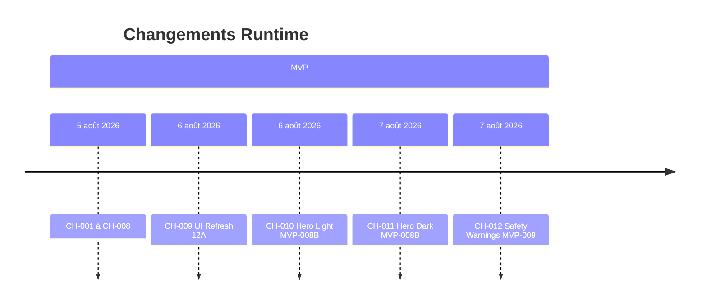

# 17 — Change History

## 1. Statut du registre

| Champ | Valeur |
| --- | --- |
| Nom du registre | Change History |
| Fichier | `docs/runtime/17_CHANGE_HISTORY.md` |
| Version du registre | 1.0 |
| Statut | **ACTIF** |
| Dernière mise à jour | 7 août 2026 — CH-012 MVP-009 fermé |
| Phase actuelle | Développement MVP — prudence Pré-MVP Livré |
| Type | Runtime Register — changements Runtime **appliqués** |
| Ne remplace pas | `CHANGELOG.md` |

## 2. État général

| Indicateur | Valeur |
| --- | --- |
| Changements enregistrés | **12** |
| Changements majeurs | **12** |
| Changements mineurs | **0** |

## 3. Registre des changements

| Change ID | Description | Ticket | Registre(s) impacté(s) | Décision Runtime | Date | Statut |
| --- | --- | --- | --- | --- | --- | --- |
| CH-001 | App Shell + routes vides | MVP-001 | `00`, `01`, `02`, `17` | — | 5 août 2026 | Appliqué |
| CH-002 | Design System & UI Foundation | MVP-002 | `00`, `01`, `02`, `17` | — | 5 août 2026 | Appliqué |
| CH-003 | Curriculum local + bibliothèque / fiches | MVP-003 | `00`, `01`, `02`, `03`, `09`, `17` | — | 5 août 2026 | Appliqué |
| CH-004 | Fondation assets / manifeste PWA / AppBrand | MVP-004 | `00`, `01`, `02`, `07`, `09`, `17` | — | 5 août 2026 | Appliqué |
| CH-005 | Parcours pratique local | MVP-005 | `00`, `01`, `02`, `03`, `07`, `09`, `17` | — | 5 août 2026 | Appliqué |
| CH-006 | Progression / historique local (localStorage) + page `/progression` | MVP-006 | `00`, `02`, `03`, `07`, `09`, `17` | — | 5 août 2026 | Appliqué |
| CH-007 | Préférences utilisateur locales + page `/profil` (thème / pratique / a11y) | MVP-007 | `00`, `02`, `03`, `09`, `17` | — | 5 août 2026 | Appliqué |
| CH-008 | Onboarding local `/onboarding` (F-033) + gate + intégration préférences | MVP-008 | `00`, `01`, `02`, `03`, `07`, `09`, `17` | — | 5 août 2026 | Appliqué |
| CH-009 | Refonte UI Experience Design System (12A) — présentation seule | MVP-008A | `00`, `01`, `02`, `09`, `17` | — | 6 août 2026 | Appliqué |
| CH-010 | Hero Light responsive (15 exports) + intégration écrans — présentation seule | MVP-008B | `00`, `01`, `02`, `09`, `17` | — | 6 août 2026 | Appliqué |
| CH-011 | Hero Dark responsive (5 Masters + 15 exports) + catalogue final — présentation seule | MVP-008B | `00`, `01`, `02`, `09`, `17` | — | 7 août 2026 | Appliqué |
| CH-012 | Conseils de sécurité (F-016) + avertissements pré-pratique (F-031) ; Hero pratique `morning` | MVP-009 | `00`, `02`, `09`, `11`, `17` | — | 7 août 2026 | Appliqué — MVP-009 fermé |

## 4. Gouvernance

Un changement Runtime n’est enregistré que s’il est effectivement réalisé, lié à un ticket et synchronisé avec `00_PROJECT_STATUS.md`.

## 5. Diagrammes

## 6. Historique

| Date | Événement |
| --- | --- |
| 5 août 2026 | CH-001 … CH-007 enregistrés. |
| 5 août 2026 | CH-008 — MVP-008 onboarding local enregistré. |
| 6 août 2026 | CH-009 — MVP-008A refonte UI 12A enregistré. |
| 6 août 2026 | CH-010 — MVP-008B Sprint 3 Hero Light exports + intégration ; ticket reste ouvert (Dark manquant). |
| 7 août 2026 | CH-011 — MVP-008B Sprint Dark : Masters Dark + 15 exports + catalogue `final`. |
| 7 août 2026 | MVP-008B **fermé** (commit `50bf954`) ; formalisation roadmap tickets MVP-009→018 (documentaire — pas de nouveau CH code). |
| 7 août 2026 | CH-012 — MVP-009 F-016 / F-031 (code local ; commit PO en attente). |
| 7 août 2026 | CH-012 clôturé — MVP-009 **fermé** (validation PO) ; F-016 / F-031 Livré. |

---

## Pied de document

| Champ | Valeur |
| --- | --- |
| Version | 1.0 |
| Statut | ACTIF |
| Fin officielle | Oui |

*Fin officielle du document.*
