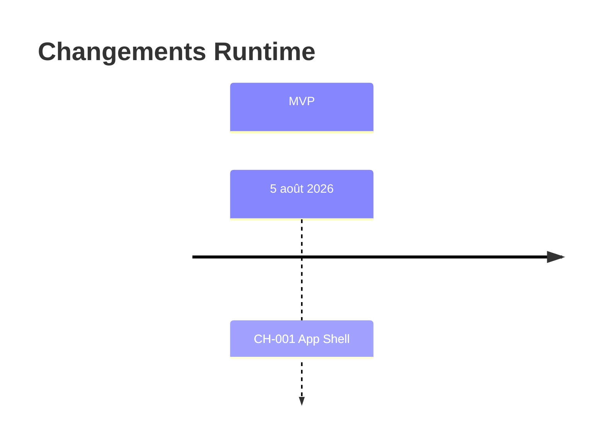
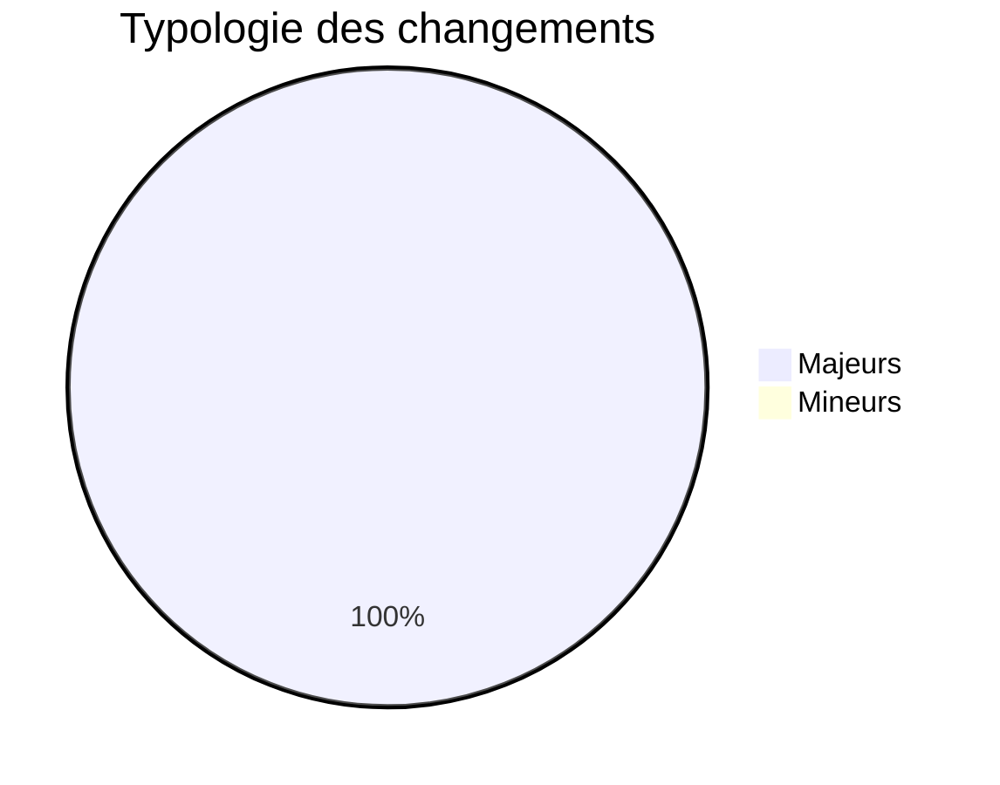
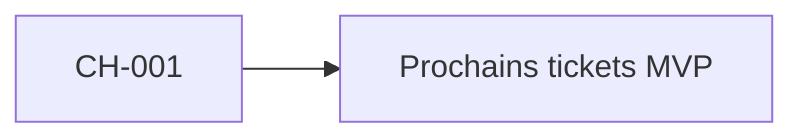
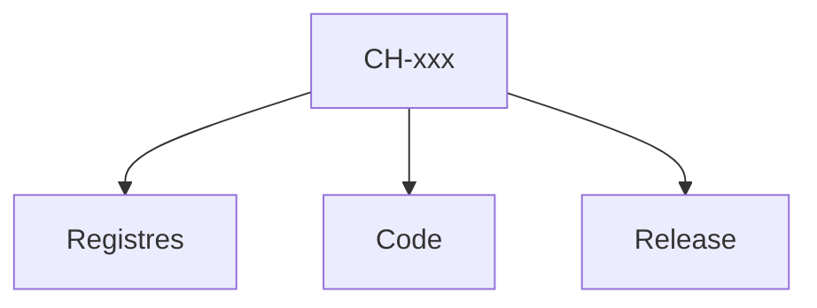
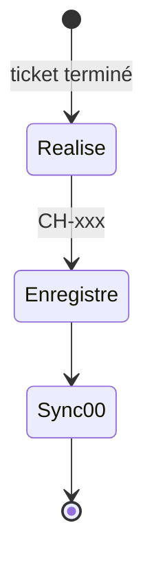

# 17 — Change History

## 1. Statut du registre

| Champ | Valeur |
| --- | --- |
| Nom du registre | Change History |
| Fichier | `docs/runtime/17_CHANGE_HISTORY.md` |
| Version du registre | 1.0 |
| Statut | **ACTIF** |
| Dernière mise à jour | 5 août 2026 — CH-001 MVP-001 |
| Phase actuelle | Développement MVP — socle Frontend |
| Type | Runtime Register — changements Runtime **appliqués** |
| Ne remplace pas | `CHANGELOG.md` (historique documentaire) |

> Suit les changements Runtime réellement appliqués après le Design Freeze.  
> `CHANGELOG.md` reste l’historique documentaire.

## 2. État général

| Indicateur | Valeur |
| --- | --- |
| Changements enregistrés | **1** |
| Changements majeurs | **1** |
| Changements mineurs | **0** |

**Synthèse :** premier changement Runtime applicatif (socle Frontend).

## 3. Registre des changements

Identifiants : `CH-xxx`.

| Change ID | Description | Ticket | Registre(s) impacté(s) | Décision Runtime | Date | Statut |
| --- | --- | --- | --- | --- | --- | --- |
| CH-001 | Initialisation projet `web/` + App Shell + routes vides | MVP-001 | `00`, `01`, `02`, `17` | — | 5 août 2026 | Appliqué |

## 4. Gouvernance

Un changement Runtime n’est enregistré que s’il est :

1. **effectivement réalisé** ;  
2. lié à un **ticket** ;  
3. lié aux **registres modifiés** ;  
4. synchronisé avec `00_PROJECT_STATUS.md` ;  
5. lié à une `RD-xxx` si décision Runtime.

## 5. Diagrammes

### 5.1 Chronologie

### 5.2 Typologie

### 5.3 Évolution

### 5.4 Impacts

### 5.5 Cycle de changement

## 6. Historique

| Date | Événement |
| --- | --- |
| 5 août 2026 | Création du registre ; initialisation ; aucune limitation liée ; aucun changement Runtime `CH-xxx`. |
| 5 août 2026 | CH-001 — MVP-001 App Shell enregistré. |

## 7. Références

- `CHANGELOG.md`  
- `docs/runtime/14_DECISIONS_RUNTIME.md`  
- `docs/25_DESIGN_FREEZE.md`  

---

## Pied de document

| Champ | Valeur |
| --- | --- |
| Version | 1.0 |
| Statut | ACTIF |
| Prochain document | `docs/runtime/18_METRICS.md` |
| Fin officielle | Oui |

*Fin officielle du document.*
