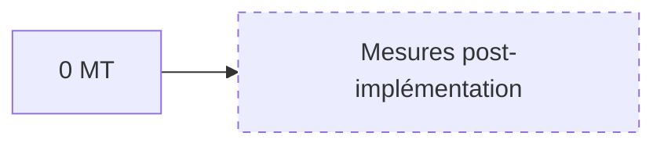
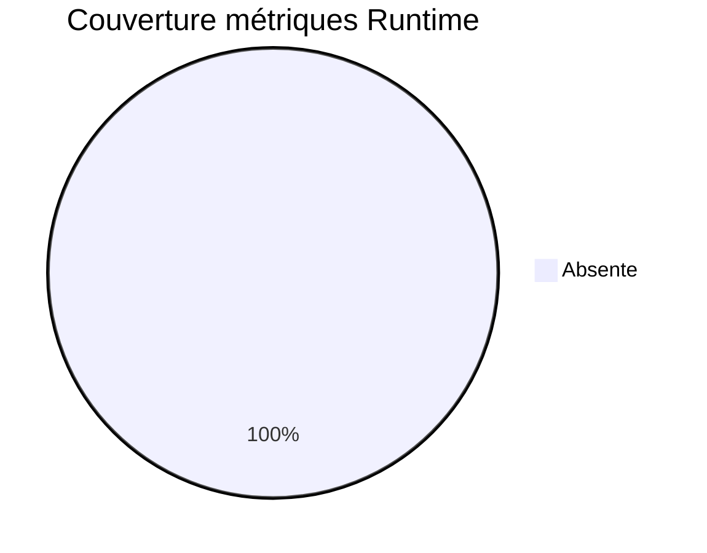
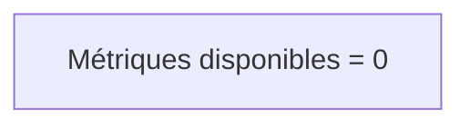
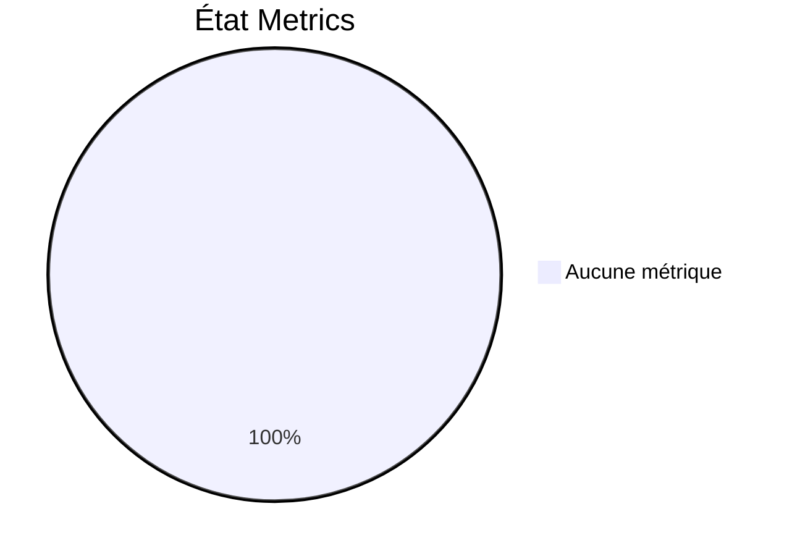

# 18 — Metrics

## 1. Statut du registre

| Champ | Valeur |
| --- | --- |
| Nom du registre | Metrics |
| Fichier | `docs/runtime/18_METRICS.md` |
| Version du registre | 1.0 |
| Statut | **ACTIF** |
| Dernière mise à jour | 5 août 2026 |
| Phase actuelle | Post–Design Freeze — infrastructure Runtime complète |
| Document de référence (KPI théoriques) | `docs/19_ANALYTICS.md` |
| Type | Runtime Register — métriques **observées** |

> Suit uniquement les métriques réellement observées.  
> Les KPI théoriques restent dans `19_ANALYTICS.md`.

## 2. État général

| Indicateur | Valeur |
| --- | --- |
| Métriques disponibles | **0** |
| KPI calculés | **0** |
| Indicateurs qualité | **0** |
| Indicateurs techniques | **0** |
| Indicateurs produit | **0** |

**Synthèse :** aucune métrique Runtime. Aucune donnée mesurée.

## 3. Registre des métriques

Identifiants : `MT-xxx`.

| Metric ID | Nom | Catégorie | Source | Fréquence | Valeur actuelle | Dernière MAJ |
| --- | --- | --- | --- | --- | --- | --- |
| — | — | — | — | — | — | Aucune métrique |

## 4. Gouvernance

Une métrique Runtime n’est enregistrée que si :

1. une **implémentation** existe ;  
2. une **donnée réelle** est disponible ;  
3. sa **source** est identifiée ;  
4. elle est justifiée le cas échéant (D-155 / `19`).

Synchroniser `00_PROJECT_STATUS.md` et `08_ANALYTICS_STATUS.md` si pertinent.

## 5. Diagrammes

### 5.1 Catégories

### 5.2 Évolution

### 5.3 Couverture

### 5.4 Disponibilité

### 5.5 État global

## 6. Historique

| Date | Événement |
| --- | --- |
| 5 août 2026 | Création du registre ; initialisation ; aucune métrique ; aucune Release associée. |

## 7. Références

- `docs/19_ANALYTICS.md`  
- `docs/runtime/08_ANALYTICS_STATUS.md`  
- `docs/20_TEST_STRATEGY.md`  

---

## Pied de document

| Champ | Valeur |
| --- | --- |
| Version | 1.0 |
| Statut | ACTIF |
| Prochain jalon | Premier ticket MVP |
| Fin officielle | Oui |

*Fin officielle du document.*
