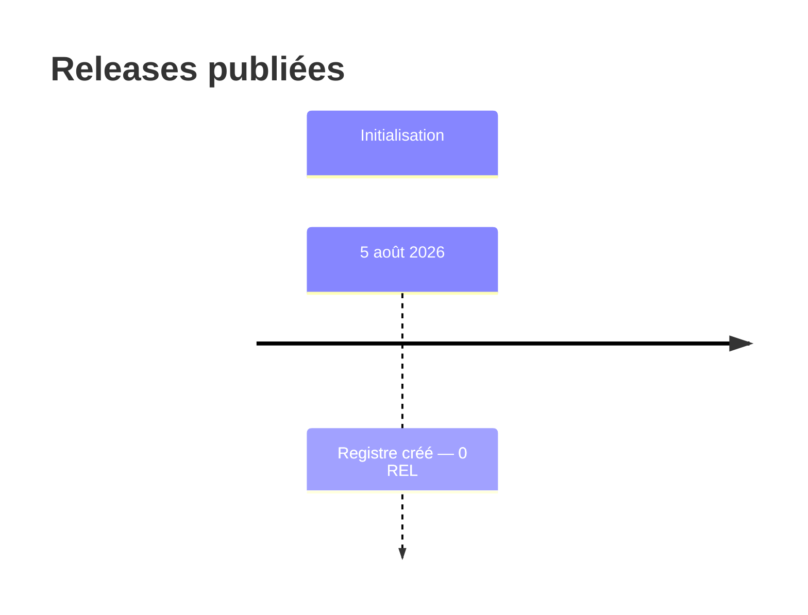
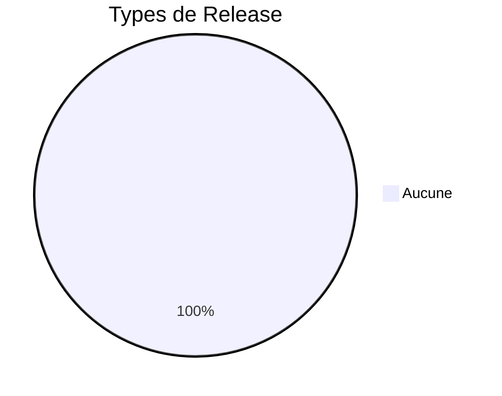
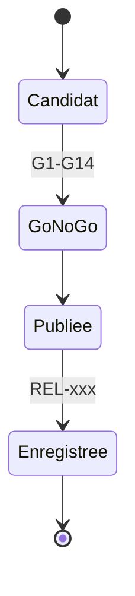

# 19 — Release History

## 1. Statut du registre

| Champ | Valeur |
| --- | --- |
| Nom du registre | Release History |
| Fichier | `docs/runtime/19_RELEASE_HISTORY.md` |
| Version du registre | 1.0 |
| Statut | **ACTIF** |
| Dernière mise à jour | 5 août 2026 |
| Phase actuelle | Post–Design Freeze — infrastructure Runtime complète |
| Document de référence (stratégie) | `docs/23_RELEASE_PLAN.md` |
| Type | Runtime Register — Releases **publiées** |

> Suit exclusivement les Releases réellement publiées.  
> La stratégie reste dans `23_RELEASE_PLAN.md`.

## 2. État général

| Indicateur | Valeur |
| --- | --- |
| Releases publiées | **0** |
| Hotfix | **0** |
| Patch | **0** |
| Minor | **0** |
| Major | **0** |

**Synthèse :** aucune Release publiée. Aucune version produit livrée.

## 3. Historique des Releases

Identifiants : `REL-xxx`.

| Release ID | Version | Type | Date | Contenu | Ticket(s) | Statut |
| --- | --- | --- | --- | --- | --- | --- |
| — | — | — | — | — | — | Aucune Release |

## 4. Gouvernance

Une Release n’est enregistrée que si :

1. elle est **réellement publiée** ;  
2. le **Go / No-Go** est validé (`23`) ;  
3. les **Release Notes** existent ;  
4. elle est référencée dans le projet ;  
5. `00_PROJECT_STATUS.md`, `10_DEPLOYMENT_STATUS.md` et `17_CHANGE_HISTORY.md` sont synchronisés.

## 5. Diagrammes

### 5.1 Chronologie

### 5.2 Typologie

### 5.3 Évolution des versions

### 5.4 Cycle d’une Release

### 5.5 État global

## 6. Historique

| Date | Événement |
| --- | --- |
| 5 août 2026 | Création du registre ; initialisation ; aucune métrique liée ; aucune Release. |

## 7. Références

- `docs/23_RELEASE_PLAN.md`  
- `docs/21_DEPLOYMENT.md`  
- `docs/runtime/10_DEPLOYMENT_STATUS.md`  
- `docs/25_DESIGN_FREEZE.md`  

---

## Pied de document

| Champ | Valeur |
| --- | --- |
| Version | 1.0 |
| Statut | ACTIF |
| Prochain jalon | Premier ticket MVP |
| Fin officielle | Oui |

*Fin officielle du document.*
