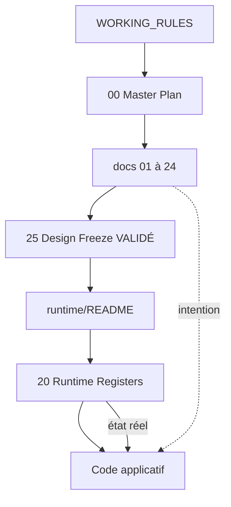
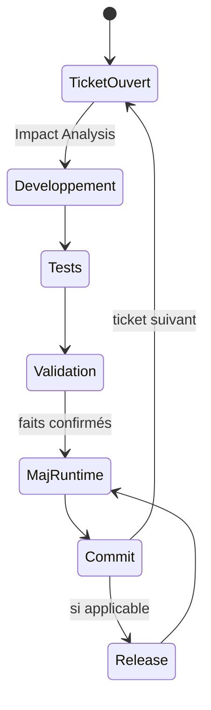
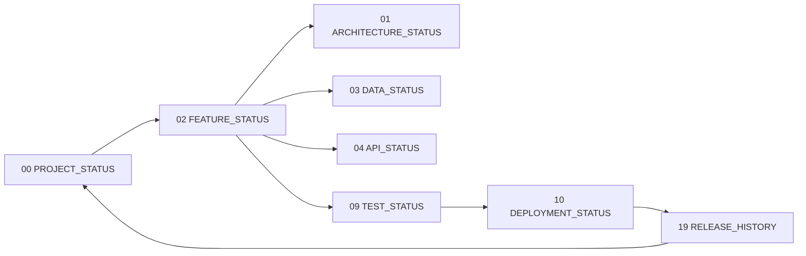
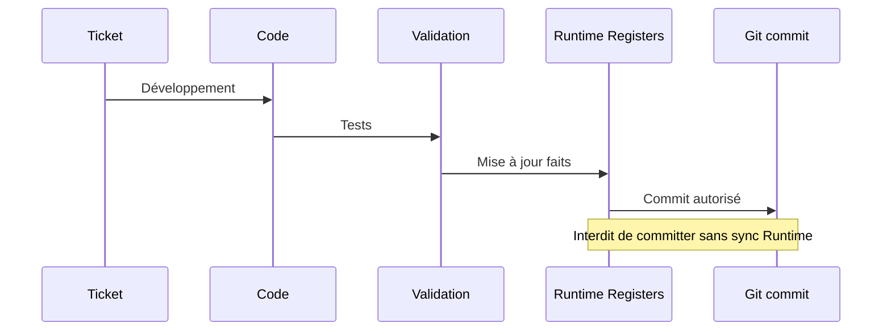
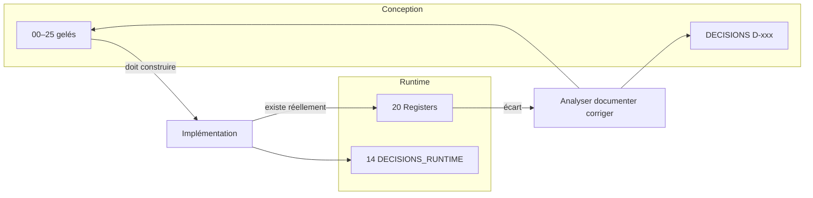

# Runtime Registers — Guide officiel

## 1. Statut

| Champ | Valeur |
| --- | --- |
| Nom du document | Runtime Registers — README |
| Emplacement | `docs/runtime/README.md` |
| Version | 1.0 |
| Statut | VALIDÉ |
| Dernière mise à jour | 5 août 2026 |
| Auteur | Projet Tai-Chi-AI-Coach |
| Documents dépendants | `docs/25_DESIGN_FREEZE.md`, `docs/24_DEVELOPER_HANDOVER.md`, `docs/98_DEVELOPMENT_DOCUMENTATION_STANDARD.md`, `docs/99_DOCUMENTATION_STANDARD.md`, `DECISIONS.md`, `CHANGELOG.md` |
| Documents utilisant celui-ci | Tous les registres `docs/runtime/00` … `19`, tickets, releases, maintenance |
| Décisions concernées | D-021, D-022, D-215 (séquence Runtime avant code) |
| Autorise le code | Après initialisation des 20 registres Runtime |

> **VALIDÉ**
>
> Porte d’entrée officielle de la documentation Runtime de Tai-Chi AI Coach.
> Ne remplace aucun document de conception (`docs/00` … `docs/25`).
> Les Runtime Registers décrivent uniquement l’**état réel** du projet après le Design Freeze.

## 2. Qu’est-ce qu’un Runtime Register ?

Un Runtime Register est un document vivant qui décrit :

- l’**état réel** du projet ;
- **jamais** l’état prévu ;
- **jamais** une intention ;
- **jamais** une idée.

Il reflète uniquement ce qui est **effectivement développé**, **validé**, **mesuré** ou **constaté**.

Un registre vide ou « non commencé » est une information valide : il signifie qu’aucun fait runtime n’existe encore dans ce domaine.

## 3. Différence avec la documentation de conception

| | Conception (`docs/00`–`25`) | Runtime (`docs/runtime/`) |
| --- | --- | --- |
| Question | Que doit-on construire ? | Qu’existe-t-il réellement ? |
| Nature | Intention, règles, périmètre gelé | Faits, écarts, état d’exécution |
| Moment | Avant / gelé au Design Freeze | Pendant développement et maintenance |
| Autorité | Source de vérité de conception | Source de vérité d’exécution |

Les deux ne doivent **jamais** être confondus.

- La conception ne s’invente pas dans les registres.
- Le code ne s’invente pas hors conception sans Impact Analysis.
- Un écart conception ↔ réalité doit être **analysé, documenté, corrigé** — jamais ignoré.

## 4. Les 20 Runtime Registers

Point d’entrée : le présent `README.md`.

Les **20 registres** officiels :

| Fichier | Rôle |
| --- | --- |
| `00_PROJECT_STATUS.md` | Tableau de bord global : phase, version, blocages, prochaine priorité réelle. |
| `01_ARCHITECTURE_STATUS.md` | Architecture réellement en place ; écarts vs `13`–`15` / `18`. |
| `02_FEATURE_STATUS.md` | Fonctionnalités réellement livrées, liées aux `F-xxx` ; statut d’implémentation. |
| `03_DATA_STATUS.md` | Modèle de données / stockage réellement utilisés ; migrations constatées. |
| `04_API_STATUS.md` | Contrats / endpoints réellement exposés ; versions API effectives. |
| `05_SECURITY_STATUS.md` | Contrôles sécurité réellement actifs ; écarts vs `16`. |
| `06_PRIVACY_STATUS.md` | Traitements RGPD / consentements réellement opérationnels ; écarts vs `17`. |
| `07_OFFLINE_STATUS.md` | Capacités Offline / PWA réellement livrées ; classes Offline/Hybrid/Online constatées. |
| `08_ANALYTICS_STATUS.md` | Métriques / pipelines Analytics réellement actifs (MVP technique vs Produit V1). |
| `09_TEST_STATUS.md` | Suites de tests réellement présentes ; couverture et zones non couvertes. |
| `10_DEPLOYMENT_STATUS.md` | Environnements, pipelines, déploiements réellement configurés / effectués. |
| `11_BACKLOG.md` | Travaux runtime planifiés avec ticket ; pas d’idées libres. |
| `12_TECH_DEBT.md` | Dette technique constatée (`TD-xxx`), jamais spéculative. |
| `13_BUGS.md` | Bugs connus (`BUG-xxx`) avec statut ; IDs non réutilisés. |
| `14_DECISIONS_RUNTIME.md` | Décisions d’exécution (choix d’implémentation) ; distinctes de `DECISIONS.md` conception. |
| `15_RISKS.md` | Risques runtime / ops constatés ou actifs pendant l’exécution. |
| `16_KNOWN_LIMITATIONS.md` | Limites réellement acceptées du système livré. |
| `17_CHANGE_HISTORY.md` | Historique des changements runtime significatifs (liés tickets / commits). |
| `18_METRICS.md` | Mesures réelles (perf, qualité, usage technique) — faits uniquement. |
| `19_RELEASE_HISTORY.md` | Historique des releases réellement publiées. |

Ordre de lecture recommandé au démarrage d’une session :

1. `README.md` (présent document)  
2. `00_PROJECT_STATUS.md`  
3. Registres du domaine touché par le ticket  
4. Conception concernée (`00`–`25`) si besoin d’intention  

## 5. Règles de mise à jour

Chaque registre concerné doit être mis à jour :

- **après** chaque ticket terminé ;
- **après** chaque correction importante ;
- **après** chaque décision Runtime ;
- **après** chaque Release.

**Jamais avant** que le fait soit réel (code validé, correction prouvée, release publiée, décision prise).

Règle d’or :

> Aucun développement n’est considéré comme terminé tant que le Runtime Register concerné n’a pas été mis à jour.

Le commit est interdit tant que les registres impactés ne sont pas synchronisés (`98`).

## 6. Source de vérité

| Domaine | Source |
| --- | --- |
| Conception (quoi / pourquoi / règles) | `docs/00` … `docs/25` + `DECISIONS.md` (`D-xxx`) |
| Exécution (quoi existe) | `docs/runtime/*` |
| Historique projet | `CHANGELOG.md` + registres `17` / `19` |

En cas d’écart conception ↔ runtime :

1. **Analyser** (Impact Analysis) ;  
2. **Documenter** l’écart dans le(s) registre(s) ;  
3. **Corriger** (code et/ou docs) selon gouvernance post-Freeze ;  
4. **Jamais ignorer**.

## 7. Gouvernance Runtime

Toute modification runtime doit préciser :

| Élément | Obligatoire |
| --- | --- |
| Ticket concerné | Oui |
| Registre(s) concerné(s) | Oui |
| Décision Runtime concernée | Si applicable (`14_DECISIONS_RUNTIME.md`) |
| Impact sur le projet | Oui (domaine, risques, écarts) |

Les décisions structurantes de **conception** restent dans `DECISIONS.md` (`D-xxx`) via le processus post-Freeze.  
Les décisions d’**exécution** (choix techniques locaux, arbitrages d’implémentation) vivent dans `14_DECISIONS_RUNTIME.md`, avec renvoi vers `D-xxx` si elles impactent la baseline.

## 8. Analyse d’impact

Toute évolution commence par :

1. lecture des Runtime Registers concernés ;  
2. lecture des docs de conception impactés (`00`–`25`) si besoin ;  
3. analyse des impacts (UX, Architecture, Data, API, Sécurité, RGPD, Offline, Analytics, Tests, Déploiement, Roadmap, Release) ;  
4. développement / tests / validation ;  
5. **mise à jour documentaire runtime** avant clôture du ticket.

## 9. Interdictions

Un Runtime Register ne doit **jamais** contenir :

- des idées ;  
- des fonctionnalités futures non livrées ;  
- des spéculations ;  
- des TODO sans ticket ;  
- des décisions de conception (réservées à `00`–`25` / `DECISIONS.md`) ;  
- des secrets, tokens, mots de passe, clés API ;  
- du code applicatif.

Le backlog produit stratégique reste `BACKLOG.md` / Roadmap (`22`).  
Le registre `11_BACKLOG.md` ne liste que des items **runtime** liés à des tickets.

## 10. Cycle de vie

```text
Ticket
  → Développement
    → Tests
      → Validation
        → Mise à jour Runtime
          → Commit
            → Release (le cas échéant)
              → Mise à jour 19_RELEASE_HISTORY (+ registres impactés)
```

Sans mise à jour Runtime : le ticket **n’est pas terminé**.

## 11. Interactions avec les tickets

| Moment du ticket | Action Runtime |
| --- | --- |
| Ouverture | Lire `00` + registres du domaine |
| Pendant | Noter écarts constatés (pas d’intention future) |
| Fin (Definition of Done) | Mettre à jour tous les registres impactés |
| Release | Mettre à jour `10`, `17`, `18`, `19` selon faits |

Un ticket qui livre une feature `F-xxx` met à jour au minimum `02_FEATURE_STATUS.md` et, selon les faits, Data / API / Security / Offline / Tests / etc.

## 12. Diagrammes

### 12.1 Architecture documentaire



### 12.2 Cycle Runtime



### 12.3 Interactions entre registres



### 12.4 Workflow de mise à jour



### 12.5 Relation Conception → Runtime



## 13. Gouvernance — Definition of Done Runtime

Un travail n’est **terminé** que si :

1. le code / la correction / la release est validé(e) ;  
2. **tous** les registres Runtime concernés sont à jour ;  
3. les écarts éventuels sont documentés ;  
4. le ticket référence les registres modifiés.

## 14. État initial de la phase Runtime

| Élément | État |
| --- | --- |
| Design Freeze | Déclaré (`25` VALIDÉ) |
| Conception `00`–`25` | Baseline figée |
| `docs/runtime/README.md` | **VALIDÉ** (présent document) |
| Registres `00`–`19` | À créer / initialiser (vides ou minimaux) |
| Code applicatif | Absent — autorisé après initialisation des 20 registres |

## 15. Prochaine étape

Créer :

`docs/runtime/00_PROJECT_STATUS.md`

Ce registre sera le **tableau de bord principal** du projet.

Puis initialiser les registres `01` … `19` (structure minimale, faits uniquement — « non commencé » est un fait valide).

Ensuite seulement : premier ticket d’implémentation MVP (`24`, D-215).

## 16. Références

- `docs/25_DESIGN_FREEZE.md`  
- `docs/24_DEVELOPER_HANDOVER.md`  
- `docs/98_DEVELOPMENT_DOCUMENTATION_STANDARD.md`  
- `docs/99_DOCUMENTATION_STANDARD.md`  
- `DECISIONS.md`  
- `CHANGELOG.md`  

---

## Pied de document

| Champ | Valeur |
| --- | --- |
| Version | 1.0 |
| Statut | VALIDÉ |
| Prochain document | `docs/runtime/00_PROJECT_STATUS.md` |
| Fin officielle | Oui |

*Fin officielle du document.*
